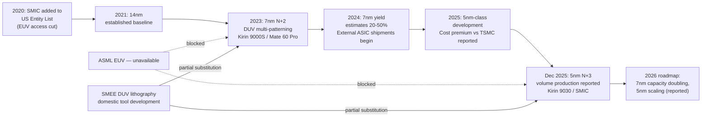

## China's semiconductor self sufficiency drive and SMIC

### Overview and Strategic Context

China's semiconductor self-sufficiency drive is a state-directed industrial policy aimed at reducing dependence on foreign chip design tools, manufacturing equipment, materials, and finished semiconductors, in direct response to escalating U.S.-led export controls beginning in 2018–2022. Semiconductor Manufacturing International Corporation (SMIC), founded in 2000, functions as the drive's central manufacturing pillar — effectively China's designated national-champion foundry for advanced logic, analogous to TSMC's role for the rest of the world but operating under severe equipment constraints.

**Key Points**

- The policy predates the current export-control era: the "Big Fund" (National IC Industry Investment Fund) was established in 2014, and the Made in China 2025 initiative (2015) set an explicit target of 70% self-sufficiency by 2025.
- SMIC was added to the U.S. Entity List in December 2020, cutting off its access to ASML's extreme ultraviolet (EUV) lithography systems and constraining access to advanced deep ultraviolet (DUV) tools and related servicing.
- SMIC's core technical achievement has been reaching 7nm-class and 5nm-class nodes using multi-patterned DUV lithography rather than EUV — a path TSMC itself used in early 7nm production, but one that imposes substantially higher cost and lower yield at scale.

### Self-Sufficiency: What the Numbers Actually Mean

**Self-sufficiency figures vary widely by source and methodology, and no single number should be treated as authoritative.** Reported figures differ depending on whether they measure production **volume**, production **value**, **equipment** localization, or the full **design-to-materials stack**, and different trackers (Goldman Sachs, TrendForce, Grokipedia, Chinese state media, industry newsletters) use inconsistent baselines and time windows. The following table lays out the range of figures found in reporting through early 2026, without endorsing any single one as definitive:

| Metric | Reported Figure | Source / Period | Basis |
| --- | --- | --- | --- |
| Chip self-sufficiency (volume) | ~70% | Goldman Sachs, mid-2025 | Production volume, up from 38% in Jan 2010 |
| Semiconductor self-sufficiency (value, broad stack) | ~35% | Industry estimate, 2025 | Design-to-fabrication-to-materials value basis |
| Domestic production capacity self-sufficiency | 28% (Q4 2025), up from 16% (2024) | Aggregator citing SCMP, Jan 2026 | Capacity basis |
| Overall localization (chips + high-end equipment) | 30–35% | Grokipedia synthesis, Jan 2026 | Falls short of 70% Made in China 2025 target |
| Equipment self-sufficiency | 35% (Jan 2026) | Domestic lithography advances (SMEE) cited | Equipment-specific |
| Broader stack self-sufficiency (design to materials) | ~50% (heading into 2025) | TrendForce estimate | Full-stack basis |

**[Unverified]** The 70%-by-volume figure and the 28–35% figures cannot both describe the same underlying reality without a methodological explanation (volume vs. value vs. capacity), and available reporting does not fully reconcile them. Readers should treat any single self-sufficiency percentage as directional rather than precise, and should check the measurement basis (volume, value, capacity, or full supply-chain stack) before using it comparatively.

**What is well-documented:** China's share of global mature-node (>28nm) manufacturing capacity rose from 19% in 2015 to 33% in 2023, and China's semiconductor firms grew from 6.4% to 8.6% of global market revenue between 2020 and 2024 — driven predominantly by mature-node fabrication and assembly rather than leading-edge logic. **Made in China 2025's original 70%-by-2025 target is widely assessed as missed.**

### SMIC Technical Trajectory

**Node progression (approximate, by public reporting):**

1. **2021 and earlier** — SMIC's most advanced established mass-production node was 14nm (FinFET).
2. **2023** — SMIC achieves a 7nm-class process (internally "N+2") using DUV lithography with multi-patterning; TechInsights teardown analysis of the Huawei Mate 60 Pro's Kirin 9000S chip confirmed features consistent with 7nm, achieved without EUV tools.
3. **2024** — Yield estimates for SMIC 7nm circulate in the 20–50% range depending on source and date, reflecting the inherent difficulty of multi-patterned DUV at this node; SMIC's 7nm ASICs begin shipping to external customers, and industry analysis (SemiAnalysis) notes most existing 14nm FinFET-compatible equipment can be reused for the 7nm process.
4. **Early-to-mid 2025** — Reports (Financial Times, February 2025; Kiwoom Securities data, March 2025) indicate SMIC is developing a 5nm-class process, with reported cost premiums of up to 50% over TSMC's equivalent node and yield estimates as low as ~33% in some reporting.
5. **May 2025** — Huawei and SMIC reportedly jointly develop a 5nm-class multi-patterning process used in Huawei's Kirin X90-class wafers, described as relying on chiplet design plus advanced packaging (JCET 4nm-class packaging) rather than pure transistor-density scaling to achieve performance gains.
6. **December 2025** — SMIC reportedly achieves volume production of a 5nm-class node designated "N+3," described in trade press as China's most advanced node produced entirely without EUV, confirmed via TechInsights teardown analysis of a Huawei Kirin 9030-class SoC.
7. **2026 roadmap (reported)** — Plans reportedly include doubling 7nm capacity and scaling 5nm-class output for Huawei and Alibaba AI processors; independent verification of exact yield and volume figures for this period remains limited, and figures should be treated with caution given the source-quality issues discussed below.

**Technical mechanism — why DUV-only advanced nodes are possible but costly:**

EUV lithography patterns fine features in relatively few exposure steps (commonly cited around 9 steps at 7nm). Without EUV, a fab must use DUV combined with multi-patterning techniques — Self-Aligned Quadruple Patterning (SAQP) and reportedly more aggressive variants — requiring many more exposure/etch cycles (some reporting cites roughly 30+ steps) to achieve comparable feature resolution. This materially increases:

- **Cycle time** (more process steps per wafer)
- **Defect accumulation risk** (more steps = more opportunities for yield-limiting defects)
- **Cost per wafer** (more tool-hours, more masks, more materials)
- **Yield ceiling** (multi-patterning alignment tolerances compound)

$$\text{Effective cost per good die} \approx \frac{\text{Cost per wafer} \times \text{Process step multiplier}}{\text{Yield} \times \text{Dies per wafer}}$$

This is why SMIC's DUV-based 7nm/5nm output is broadly assessed as commercially viable only under conditions of state subsidy and a protected domestic captive market (principally Huawei and other Chinese AI/electronics firms), not as a competitive export product against TSMC or Samsung equivalents.

### Diagram — SMIC Process Evolution Under Export Constraints (svg_diagram)

### The Broader Domestic Supply Chain

Self-sufficiency is not just a SMIC/foundry story — China has pursued parallel domestic capability across the stack:

- **Memory** — ChangXin Memory Technologies (CXMT) for DRAM/HBM development, Yangtze Memory Technologies Corp (YMTC) for NAND flash.
- **Design (fabless)** — HiSilicon (Huawei's chip design arm), Cambricon Technologies (AI accelerators).
- **Equipment** — Shanghai Micro Electronics Equipment (SMEE) for lithography (DUV, with EUV prototypes reportedly in development but not yet in volume production), Naura and AMEC for etching/deposition/inspection tools. Domestic equipment makers reportedly captured roughly 25% of the Chinese semiconductor equipment market by 2025, up from about 15% in 2023, with a stated ambition of 70% equipment localization by 2027.
- **Mature-node/legacy foundry** — Hua Hong Semiconductor, alongside SMIC, for mature and specialty nodes; China's mature-node capacity share has grown substantially and is projected by some trackers to give China the largest total semiconductor manufacturing capacity worldwide by 2025 (concentrated below 28nm).
- **Funding mechanism** — the state-directed "Big Fund" (National IC Industry Investment Fund, established 2014) plus provincial and private capital; cumulative subsidy figures cited in various reports range widely (from tens of billions to reported cumulative totals around $150 billion since 2020), reflecting different accounting scopes rather than a single audited figure. [Unverified: exact cumulative subsidy totals are not independently confirmed across sources and should be treated as approximate.]
- **Talent** — reports of accelerated recruitment of semiconductor engineers from Taiwan, South Korea, and the U.S. into Chinese state-backed firms, incentivized by compensation and equity packages; precise, verified headcount figures are not consistently corroborated across independent sources. [Unverified]

### Huawei as the Primary Demand Anchor

Huawei's HiSilicon design arm functions as SMIC's most strategically important customer, effectively absorbing the output of China's most advanced available process nodes:

- Kirin 9000S (Mate 60 Pro, 2023) — first public evidence of SMIC 7nm-class production at scale.
- Kirin 9020 (Mate 70 series) — reported to use 7nm-class lithography.
- Kirin 9030 / Kirin X90-class chips (2025) — associated with SMIC's 5nm-class development.
- **Ascend AI accelerator line** (910B, 910C, and the reported 950 family targeted for Q1 2026) — positioned as China's domestic alternative to Nvidia data-center GPUs, with production volume targets reportedly in the hundreds of thousands to low millions of units annually. Given HBM and advanced packaging constraints, Ascend chips reportedly rely heavily on chiplet architectures and advanced packaging (e.g., JCET) to compensate for transistor-density disadvantages relative to EUV-fabricated competitors.

This creates a tightly coupled national-champion pairing: Huawei's chip-design demand justifies SMIC's continued high-cost DUV scaling investment, while SMIC's domestic capacity gives Huawei a sanctions-resistant (though yield- and cost-constrained) supply source.

### Constraints and Structural Limits

**Key Points**

- **EUV remains the hard ceiling.** Most technical analyses agree SMIC is unlikely to progress meaningfully below the 5nm-class node using DUV-only multi-patterning, since the step-count and yield penalties become commercially and physically prohibitive at finer geometries.
- **Yield gap versus global leaders persists.** Even optimistic industry figures place SMIC yields at leading nodes well below TSMC's typical yields (TSMC often cited above 90% at comparable maturity; SMIC figures cited anywhere from ~20% to ~65% depending on source, node, and date), meaning per-chip costs remain structurally higher.
- **Foreign customer base is minimal.** SMIC's advanced-node business is reported to be overwhelmingly domestic, with foreign customer share at the most advanced nodes described as negligible — a reflection both of export-control risk for foreign buyers and of SMIC's cost/yield disadvantage versus TSMC/Samsung for commercial (non-strategic) use cases.
- **Equipment servicing and spare-parts risk.** Even where China has accumulated DUV tools, ongoing maintenance, software updates, and spare parts from ASML and Japanese suppliers remain constrained by export controls, creating a long-run sustainment risk for installed capacity. [Inference: this is a widely discussed structural risk in export-control analysis generally, though specific current SMIC fleet-maintenance data was not available in the sources reviewed.]
- **Metric inconsistency undermines external assessment.** As shown above, wildly different self-sufficiency percentages circulate simultaneously, driven by differing methodologies (volume vs. value vs. capacity) and, in some cases, by lower-quality aggregator sources reproducing figures without clear sourcing chains. This makes external verification of China's actual progress difficult and means official Chinese-linked figures and Western analyst figures should be triangulated rather than taken individually at face value.

**A note on source quality:** Some circulating 2025–2026 reporting on this topic (including specific percentage figures and "breakthrough" framing) appears in aggregator/intelligence-newsletter formats without clear primary sourcing or with internally inconsistent citations. Figures attributed to such sources in this document are flagged **[Unverified]** and should be cross-checked against primary trackers (TechInsights teardown reports, Goldman Sachs/TrendForce industry analysis, BIS releases, and company disclosures) before use in downstream analysis.

### Illustrative Example — Reading a Self-Sufficiency Claim Critically

When encountering a headline like *"China's chip self-sufficiency reached 28%,"* apply this checklist before using the figure:

1. **Basis** — Is this volume, value, capacity, or full-stack (design+fab+materials+equipment)? These produce very different numbers for the same underlying reality.
2. **Scope** — Does it cover all semiconductors, or only a subset (e.g., "advanced logic," "chips used in electronics")?
3. **Baseline year** — Self-sufficiency trajectories are often presented against different starting points (2010, 2015, 2020, 2023), which changes the apparent growth rate.
4. **Source chain** — Is this a primary industry tracker (Goldman, TrendForce, SIA), a teardown lab (TechInsights), an official Chinese government/state-media figure, or a secondary aggregator repackaging unclear sources?
5. **Consistency check** — Does the figure roughly reconcile with adjacent, better-sourced figures (e.g., mature-node capacity share, SMIC yield estimates) or does it appear as an outlier?

### Related Topics

- SMEE and the domestic Chinese EUV prototype program
- Multi-patterning lithography techniques (SAQP/SAOP) and their yield/cost tradeoffs
- Huawei Ascend AI accelerator roadmap and chiplet/packaging strategy
- The Entity List and Foreign Direct Product Rule as applied to SMIC
- CXMT and China's HBM/DRAM self-sufficiency trajectory
- China's "Big Fund" (National IC Industry Investment Fund) structure and financing rounds
- Advanced packaging (JCET) as a substitute for transistor-density scaling
- TechInsights teardown methodology and its role in verifying node claims
- Mature-node ("legacy chip") capacity expansion and global oversupply concerns
- Talent flows and engineering recruitment in the China-Taiwan-Korea semiconductor triangle