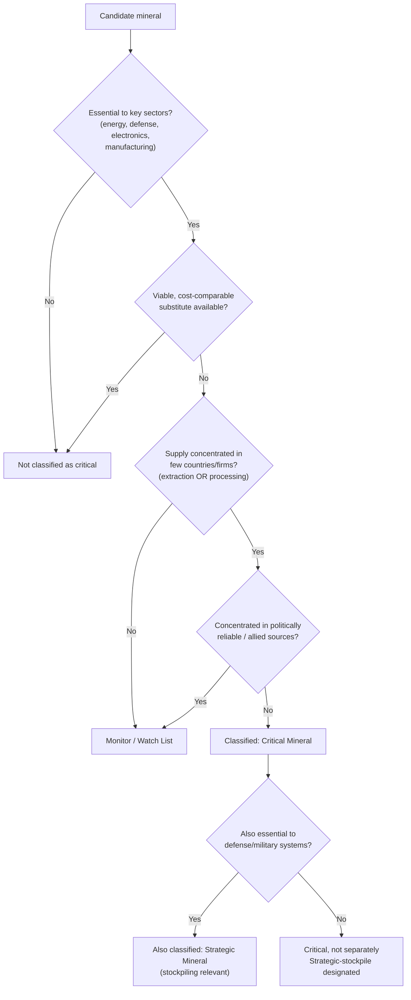

## Defining critical and strategic minerals

### Conceptual Foundations

"Critical minerals" and "strategic minerals" are policy classifications, not geological or chemical categories. A mineral becomes "critical" not because of an intrinsic physical property but because of a relationship between **economic importance** and **supply risk** — the same element can be critical for one country and not another depending on that country's industrial base, import dependence, and available substitutes.

**Key Points**

- There is no single, universally adopted international definition; each government or body (U.S., EU, Japan, Australia, China) maintains its own list, methodology, and update cycle.
- Classification is dynamic: minerals move on and off lists as technology, demand, and geopolitics shift (e.g., lithium's rise with EV/battery demand; gallium and germanium's elevation after 2023 Chinese export controls).
- "Critical" and "strategic" are often used interchangeably in casual discussion but carry distinct technical meanings in most formal frameworks (defined below).

### Critical vs. Strategic — The Core Distinction

Most formal frameworks separate these along two axes: **economic/supply-chain importance** versus **military/national-security importance**.

| Dimension | Critical Mineral | Strategic Mineral |
| --- | --- | --- |
| Primary driver | Economic vulnerability — essential to broad economic activity (manufacturing, energy, electronics) combined with high supply-disruption risk | National-security vulnerability — essential to defense production, weapons systems, or military readiness |
| Typical defining body | Economic/geological/trade agencies (e.g., USGS, Department of the Interior) | Defense and stockpiling agencies (e.g., Department of Defense, National Defense Stockpile) |
| Legal basis (U.S. example) | Energy Act of 2020 defines "critical mineral" as non-fuel, non-water mineral essential to economic or national security with a supply chain vulnerable to disruption, and lacking reliable, substitutable, sufficient domestic production | Historically rooted in stockpiling statutes (Strategic and Critical Materials Stock Piling Act, originally 1939) focused on wartime material readiness |
| Overlap | Substantial — many minerals (e.g., rare earth elements, cobalt) appear on both categories' lists | Substantial — same overlap, viewed from the defense-supply angle |
| Scope breadth | Broader — covers civilian economy, clean energy, electronics, manufacturing | Narrower — focused on defense-relevant materials and stockpile targets |

**In practice**, most policy documents and public discussion — including nearly all recent U.S., EU, and allied-country legislation — use "critical minerals" as the umbrella term, with "strategic" reserved for the subset tied specifically to defense stockpiling or military supply-chain resilience. The terms are frequently blended in political rhetoric even where the underlying legal definitions differ.

### The Two-Axis Formal Criteria

Virtually every national methodology, despite differing mineral lists, converges on assessing two independent axes and then classifying minerals by where they fall on both:

$$\text{Criticality} = f(\text{Economic Importance}, \text{Supply Risk})$$

**Axis 1 — Economic/Strategic Importance**

- Breadth of downstream use (how many industrial sectors depend on it)
- Absence of viable substitutes at comparable cost/performance
- Centrality to designated priority sectors (defense, clean energy, semiconductors, advanced manufacturing)

**Axis 2 — Supply Risk**

- Geographic concentration of production (a small number of countries controlling most global output)
- Geographic concentration of processing/refining (often more concentrated than raw extraction)
- Political stability and trade-policy reliability of dominant producing/processing countries
- Byproduct status (many critical minerals, e.g., gallium, germanium, are extracted as byproducts of other mining/refining operations, making supply inelastic to price signals alone)
- Recyclability and existing stockpile levels

This two-axis approach is commonly visualized as a quadrant matrix (used in various forms by USGS, the EU, and private-sector risk consultancies):

### Diagram — Criticality Assessment Matrix (svg_diagram)

<svg xmlns="http://www.w3.org/2000/svg" viewBox="0 0 600 460" font-family="sans-serif">
<text x="300" y="24" text-anchor="middle" font-size="16" font-weight="bold">Criticality Assessment Matrix (svg_diagram)</text>

<line x1="80" y1="400" x2="80" y2="60" stroke="#333" stroke-width="2" />
<line x1="80" y1="400" x2="540" y2="400" stroke="#333" stroke-width="2" />

<text x="40" y="230" text-anchor="middle" font-size="13" transform="rotate(-90 40 230)">Economic Importance →</text>

<text x="310" y="430" text-anchor="middle" font-size="13">Supply Risk →</text>

<line x1="310" y1="60" x2="310" y2="400" stroke="#999" stroke-dasharray="4 4" />
<line x1="80" y1="230" x2="540" y2="230" stroke="#999" stroke-dasharray="4 4" />

<rect x="90" y="70" width="210" height="150" fill="#e8f4ea" stroke="none" />
<text x="195" y="100" text-anchor="middle" font-size="12" font-weight="bold">Watch List</text>
<text x="195" y="118" text-anchor="middle" font-size="10">High importance,</text>
<text x="195" y="132" text-anchor="middle" font-size="10">low current risk</text>
<rect x="320" y="70" width="210" height="150" fill="#fbe3e3" stroke="none" />
<text x="425" y="100" text-anchor="middle" font-size="12" font-weight="bold">Critical / Strategic</text>
<text x="425" y="118" text-anchor="middle" font-size="10">High importance,</text>
<text x="425" y="132" text-anchor="middle" font-size="10">high supply risk</text>
<text x="425" y="150" text-anchor="middle" font-size="10" font-style="italic">e.g. REEs, cobalt,</text>
<text x="425" y="164" text-anchor="middle" font-size="10" font-style="italic">gallium, germanium</text>
<rect x="90" y="230" width="210" height="150" fill="#f0f0f0" stroke="none" />
<text x="195" y="260" text-anchor="middle" font-size="12" font-weight="bold">Low Priority</text>
<text x="195" y="278" text-anchor="middle" font-size="10">Low importance,</text>
<text x="195" y="292" text-anchor="middle" font-size="10">low supply risk</text>
<rect x="320" y="230" width="210" height="150" fill="#fef3d6" stroke="none" />
<text x="425" y="260" text-anchor="middle" font-size="12" font-weight="bold">Diversification Target</text>
<text x="425" y="278" text-anchor="middle" font-size="10">Low importance,</text>
<text x="425" y="292" text-anchor="middle" font-size="10">high supply risk</text>
<rect x="80" y="60" width="460" height="340" fill="none" stroke="#333" stroke-width="1" />
</svg>

### National Classification Frameworks

**United States**

- Legal definition anchored in the **Energy Act of 2020**: a non-fuel, non-water mineral or mineral material essential to the economic or national security of the U.S., with a supply chain vulnerable to disruption, and that serves an essential function in manufacturing a product whose absence would have significant economic or national-security consequences.
- The **U.S. Geological Survey (USGS)** publishes and periodically updates the official Critical Minerals List (most recent major update cycle reflected additions such as certain rare earths, and adjustments reflecting battery-metal and semiconductor-input dependencies).
- The **Department of Defense** separately maintains stockpile-oriented strategic-materials designations under the National Defense Stockpile program, historically rooted in the Strategic and Critical Materials Stock Piling Act (1939, subsequently amended).

**European Union**

- The EU distinguishes **"Critical Raw Materials" (CRMs)** from the narrower subset of **"Strategic Raw Materials" (SRMs)** under the **Critical Raw Materials Act (CRMA)**, which entered into force in 2024.
- SRMs are those judged essential to the EU's green transition, digital transition, and defense/aerospace applications, and are subject to binding domestic-capacity benchmarks (extraction, processing, recycling targets) and import-diversification requirements (no single third country to supply more than a defined share of EU consumption by a target year).
- CRMs is the broader list assessed on the standard economic-importance/supply-risk matrix but without the same binding capacity targets as SRMs.

**Other Frameworks**

- **Japan** maintains critical-mineral stockpiling policy administered through JOGMEC (Japan Organization for Metals and Energy Security), historically focused on rare earths given Japan's experience with China's 2010 rare-earth export restrictions.
- **Australia** publishes a Critical Minerals List (and a Strategic Materials List subset) through Geoscience Australia/Department of Industry, emphasizing minerals where Australia has extraction potential relevant to allied supply-chain diversification.
- **China** does not publish a directly equivalent "critical minerals list" in the same transparent format, but exercises control through export-licensing regimes (e.g., the 2023 gallium/germanium controls, the 2024 antimony controls, and rare-earth export licensing) that function as a de facto strategic-materials policy from the supply side rather than the demand side.

### Commonly Cited Mineral Categories

While exact lists vary by country and year, the following categories recur across nearly all major frameworks:

- **Rare earth elements (REEs)** — 17 elements (15 lanthanides plus scandium and yttrium), subdivided into "light" REEs (e.g., neodymium, praseodymium — magnets) and "heavy" REEs (e.g., dysprosium, terbium — high-temperature magnet performance), critical for permanent magnets in EVs, wind turbines, and defense systems.
- **Battery metals** — lithium, cobalt, nickel, manganese, graphite — central to lithium-ion battery cathodes/anodes.
- **Semiconductor-adjacent minerals** — gallium, germanium, high-purity quartz — inputs to compound semiconductors, fiber optics, and lithography-adjacent materials.
- **Platinum group metals (PGMs)** — platinum, palladium, rhodium — catalytic converters, hydrogen fuel cells, electronics.
- **Titanium and specialty alloys inputs** — aerospace and defense structural applications.
- **Antimony, tungsten, tin** — flame retardants, hard-metal tooling, electronics soldering, with significant defense applications (munitions, armor-piercing rounds for tungsten/antimony alloys).

**Example**

Neodymium is a useful illustration of how the two-axis framework produces a "critical" classification:

- *Economic importance*: essential for high-strength permanent magnets (NdFeB) used in EV motors, wind turbine generators, and precision-guided munitions; no cost-comparable substitute exists at scale for many of these applications.
- *Supply risk*: mining is moderately concentrated, but **separation and refining** — converting mixed rare-earth ore into individual high-purity oxides — is heavily concentrated in China, which historically has processed the large majority of global rare-earth separation regardless of where the ore is mined.
- *Result*: neodymium (and REEs generally) sits firmly in the "Critical/Strategic" quadrant on nearly every national list.

### Why Processing Concentration Often Matters More Than Mining Concentration

A recurring technical nuance in criticality analysis: **extraction concentration and processing/refining concentration are frequently different, and the refining bottleneck is usually the more binding constraint.**

- A mineral may be mined in multiple countries but refined to usable purity in only one or two, because refining requires specialized, capital-intensive, often environmentally sensitive infrastructure that took decades to build and is not quickly replicable.
- This means diversifying *mine* supply alone does not resolve criticality if the refined-output bottleneck remains unchanged — a common analytical error in simplified "who has the reserves" framing of these issues.
- Policy responses increasingly target midstream (processing/refining) capacity specifically, not just upstream (extraction) capacity, which is why frameworks like the EU's CRMA set separate benchmarks for extraction, processing, and recycling rather than a single combined target.

### Diagram — Critical Mineral Classification Decision Flow (svg_diagram)

### Methodological Caveats

- **List volatility**: mineral lists are revised periodically (the U.S. USGS list, EU CRM/SRM lists, and others are reviewed on multi-year cycles), so any specific list should be treated as a snapshot rather than a permanent classification. [Inference: given the pace of recent geopolitical shifts around critical minerals, further list revisions in the near term are plausible, though specific future additions cannot be confirmed in advance.]
- **National self-interest shapes lists**: a country's own extraction/processing capacity influences which minerals it labels "critical," since minerals a country already produces abundantly domestically are less likely to appear on that country's own risk list even if they are globally significant elsewhere.
- **"Critical" does not mean "rare" geologically**: many critical minerals (e.g., lithium, rare earths despite the name) are not scarce in absolute crustal abundance; criticality stems from concentrated extraction/processing infrastructure and economic viability at scale, not geological rarity. Rare earth elements are, despite the name, relatively abundant in the Earth's crust — the "rare" in the name reflects the historical difficulty of finding them in economically concentrated deposits and separating individual elements, not true scarcity.
- **Byproduct economics create inelastic supply**: minerals like gallium and germanium are typically recovered as byproducts of other primary metal refining (e.g., aluminum, zinc), meaning higher prices do not straightforwardly incentivize proportionally higher output, since production is capped by the primary metal's own production volume.

### Related Topics

- USGS Critical Minerals List: methodology and update history
- EU Critical Raw Materials Act (CRMA): benchmarks and implementation timeline
- Rare earth separation and refining technology (solvent extraction cascades)
- China's export licensing regime for gallium, germanium, antimony, and rare earths
- National Defense Stockpile (U.S.) history and current composition
- Byproduct metal economics and supply inelasticity
- Mining-to-refining value chain mapping and midstream bottleneck analysis
- Allied "friend-shoring" and critical-mineral supply-chain diversification initiatives
- Recycling and urban mining as a supply-risk mitigation strategy
- Japan's post-2010 rare-earth stockpiling policy as a historical case study