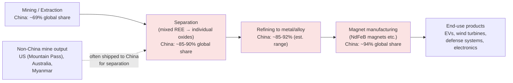

## China's dominance in rare earth processing and refining

<syllabot_broad_topic/>

### Scale of Dominance

China's dominance in rare earths is a **processing-stage** dominance more than a **mining-stage** one, and the gap between the two is the central fact of this topic. China accounted for 69.2% of global rare earth output (mining) in 2025, while global rare-earth-oxide (REO) production rose only modestly (2.6% year-on-year) to roughly 390,000 tonnes. But China's dominance **extends beyond mining, with the country processing nearly 90% of global rare earths**, meaning the value chain is far more concentrated downstream than upstream.

**Reported processing-share figures vary by source and year**, reflecting different scopes (all REEs vs. heavy REEs specifically) and different dates. The following figures were found across recent reporting and should be read as a range rather than a single precise number:

| Metric | Figure | Source basis |
| --- | --- | --- |
| Global rare earth mining share (China, 2025) | 69.2% | Mining Technology / industry production data |
| Global rare earth processing/separation share | ~90% | International Energy Agency (IEA), 2025, cited across multiple academic and trade sources |
| Heavy rare earth element processing share | ~99% | Industry analysis (Discovery Alert), late 2025 |
| Rare earth magnet manufacturing share | ~94% | IEA, 2025, cited in Michigan Journal of Economics |
| Processing share change 2023→2025 | Reported to have declined from over 90% (2023) to approximately 85% (2025) | Mapshock briefing, mid-2026 — flagged as a narrow, execution-dependent shift |
| Projected refining share, 2030 | 76% (with 51% of production) | International Energy Agency, cited in Global Finance Magazine |
| Projected refining share, 2040 | ~75% | Systematic review (Eng journal), 2026 |
| Global rare-earth patent filings (2014–2024) | 81% of 22,040 global patent families | EPO DOCDB-based patent landscape report, 2026 |

**[Unverified]** Individual figures above (e.g., "92% refining / 94% magnet output" from one industry source vs. "90% processing / 94% magnets" from IEA-sourced academic citation vs. a reported decline to 85%) are not fully reconciled across sources and may reflect different measurement windows, scopes (all-REE vs. heavy-REE), or methodological choices. The consistent, well-corroborated finding across essentially all sources is that **China's share of processing and refining is substantially higher than its share of mining** — commonly described as roughly a 20–30 percentage-point gap, sometimes characterized as a "multiplier effect" where processing dominance runs meaningfully ahead of raw extraction dominance.

### Why Processing Concentration Exceeds Mining Concentration

**Key Points**

- Rare earth ore, once mined, must undergo chemical separation to isolate individual elements from mixed lanthanide compounds — a technically demanding, capital-intensive, and environmentally sensitive process.
- China's competitive advantage compounds **downstream** through separation, refining, and magnet manufacturing rather than at the extraction stage — new mines outside China solve only part of the supply-chain problem, since ore still typically needs to be shipped to Chinese facilities for separation.
- The economic value (and margin capture) is concentrated in processing rather than raw ore: refined rare-earth products command substantially higher prices than raw concentrates, so processing captures a disproportionate share of the supply chain's total value.

**Structural sources of China's processing moat**, as identified across industry analysis:

- **Technical know-how** in proprietary solvent-extraction separation cascades refined over decades
- **Scale economies** in specialized separation and refining equipment manufacturing
- **Control of intermediate chemical input supply chains** needed for separation processes
- **Regulatory and environmental compliance systems** optimized for China's specific cost and geographic structure — historically enabled by comparatively fewer labor and environmental regulatory burdens than Western alternatives
- **Vertical integration** across mining, separation, refining, and magnet manufacturing, rather than fragmented single-stage capacity

### Historical Development Timeline

1. **1980s–1990s** — Initial state investment in rare earth processing infrastructure begins.
2. **2000s–2010s** — Rapid capacity expansion and workforce/technical development programs.
3. **2010s–2020s** — Supply chain integration deepens; China reportedly used periods of rising foreign competition to acquire foreign rare-earth assets, then undercut prices during oversupply periods, making continued foreign production unprofitable and prompting asset sales back into Chinese hands — a pattern cited as a key driver of China's near-monopoly status.
4. **December 2023** — China implements technology export controls specifically targeting rare-earth processing know-how and equipment, treating separation/refining technical knowledge itself as a strategic asset to protect, not just the physical minerals.
5. **2024–2025** — Further restrictions on knowledge transfer and equipment exports.
6. **2025 (two waves)** — China introduces two waves of export controls covering rare-earth elements and related products/technologies; the second wave was later suspended for one year.
7. **January 2026** — China restricts exports of dysprosium, terbium, and gallium specifically to Japan, read by Japanese officials as a response to statements by Japan's Prime Minister linking Japan's national security posture to Taiwan-related contingencies — illustrating rare-earth export policy functioning as a geopolitical deterrent instrument rather than purely an industrial-policy tool.
8. **2026** — China introduces automated, real-time export control monitoring and penalty enforcement within its rare-earth industry.

### Diagram — Rare Earth Value Chain and China's Concentration by Stage (svg_diagram)

### The Separation Bottleneck — Technical Detail

Rare earth ore extracted from a mine is a mixed concentrate of multiple lanthanide elements plus other compounds; it is not usable in this form for magnet or electronics manufacturing. **Separation** — the process of isolating individual high-purity rare-earth oxides from this mixed concentrate — is the specific bottleneck stage where China's dominance is most acute (reported at approximately 90% of global capacity, and as high as ~99% specifically for **heavy rare earth elements**, which are chemically more difficult to separate than light REEs due to closer chemical similarity between adjacent lanthanides).

This distinction between **light** and **heavy** rare earths matters technically:

- **Light REEs** (e.g., neodymium, praseodymium, lanthanum, cerium) are comparatively easier to separate and represent the bulk of tonnage demand (magnets, catalysts).
- **Heavy REEs** (e.g., dysprosium, terbium, yttrium) are chemically more similar to their neighbors on the periodic table, requiring more separation stages (more solvent-extraction cycles) to achieve high purity — and China's dominance in heavy-REE separation specifically is reported as even more extreme than its overall REE processing dominance, since few non-Chinese facilities have ever operated at commercial scale for heavy-REE separation.

### Non-China Producer and Processor Landscape

**United States**

- The U.S. reinforced its position as the world's second-largest rare earths producer in 2025, with mine output reaching 51,000 tonnes, supported by federal initiatives under the Defense Production Act (DPA) that mobilized funding and long-term offtake arrangements to expand the Mountain Pass mine (California) and build domestic separation capacity.
- Despite rapid gains in **mining**, the U.S. remains at an early stage in developing commercial-scale **refining** capability, leaving a gap short of end-to-end supply-chain independence — reinforcing the mining-vs-processing distinction central to this topic.
- In July 2025, MP Materials (operator of Mountain Pass) signed a public-private partnership agreement with the Department of Defense under the DPA, including a $150 million loan and $400 million in equity, plus a price-support mechanism: a 10-year price floor of $110/kg for neodymium-praseodymium, under which the Pentagon pays MP the difference if market prices fall below the floor, and MP returns 30% of any upside above the floor back to the Pentagon.
- In July 2026, the Pentagon made a $25 million equity investment in ReElement Technologies, part of a broader pattern of direct federal equity stakes in domestic processing capacity rather than relying solely on loans or tariffs.

**Australia**

- Australia produced 29,000 tonnes in 2025 (third-largest global producer) and is increasingly focusing on downstream processing and magnet supply chains through government-backed critical minerals programs and partnerships with the U.S. and Japan.
- Lynas Rare Earths (Australia-based, with Malaysian processing operations) represents one of the only significant non-China processing hubs currently operating at meaningful scale; a July 2026 Malaysian parliamentary hearing on Lynas's $96 million Pentagon supply deal reportedly signals this processing hub is becoming politically contested within Malaysia, adding a new fragility point to the primary non-China processing alternative.

**Myanmar**

- Contributed 22,000 tonnes in 2025, rebounding from earlier disruptions caused by armed conflict and logistical issues — illustrating that even non-China mine supply carries its own distinct geopolitical/instability risk separate from the China-processing-concentration issue.

**Japan**

- Not a major rare-earth producer, but a strategically significant downstream consumer and, since its experience with China's 2010 rare-earth export restrictions, a long-standing driver of stockpiling and diversification policy (administered via JOGMEC).
- Japan's March 2026 critical minerals action plan with the United States and a June 2026 G7 stockpiling proposal have been characterized by Japanese media coverage as diplomatic instruments responding to the January 2026 China export restrictions, rather than purely industrial policy.

### Assessed Gap Between Diversification Ambition and Delivered Capacity

The International Energy Agency's Global Critical Minerals Outlook 2026 provides one of the more sobering quantitative assessments available: **even if all announced non-China refining projects deliver on schedule, planned refining capacity would cover only two-thirds of expected mine output by 2035, and downstream magnet production would cover just one-third.** This framing — that new mines "solve only part of the problem" — is echoed by other 2026 analysis noting the core issue is not geological scarcity but an **industrialization gap**: China's advantage compounds specifically at the separation, refining, and magnet-manufacturing stages, and building competitive non-Chinese capacity at each of those stages requires years of qualification, capital investment, and trained workforce development that mine expansion alone does not address.

### Constraints on Western Diversification

**Key Points**

- **Project execution risk**: reported declines in China's processing share (e.g., from over 90% in 2023 to roughly 85% in 2025, per one analysis) are characterized as "meaningful but narrow," with continuation dependent entirely on project execution that has no track record at scale — meaning announced Western/allied processing projects are not guaranteed to deliver on stated timelines or capacity targets.
- **Technology export controls compound the gap**: China's December 2023 and subsequent restrictions on rare-earth processing technology and equipment exports make it harder for non-Chinese facilities to access the specific separation know-how China itself spent decades developing, effectively protecting the moat from the technology-transfer side as well as the finished-product side.
- **Price-support mechanisms as a policy response**: the MP Materials price-floor arrangement illustrates a structural problem — China's historic ability to flood the market with lower-cost output (enabled by its scale, integration, and looser regulatory cost structure) can undercut the economics of new non-Chinese capacity unless governments provide price guarantees, since private capital alone may not bear the price-volatility risk of competing against an entrenched, vertically integrated incumbent.
- **Geopolitical weaponization risk**: the January 2026 restrictions specifically targeting Japan (dysprosium, terbium, gallium) illustrate that rare-earth export policy is used as a targeted diplomatic-pressure instrument tied to specific political statements, not solely a broad economic-security measure — meaning downstream industries in allied countries face country-specific as well as sector-wide exposure.

### Related Topics

- Defining critical and strategic minerals (classification frameworks)
- Solvent-extraction separation cascade technology and scale-up challenges
- Light vs. heavy rare earth elements: chemistry and separation difficulty
- MP Materials / Mountain Pass and U.S. Defense Production Act mineral investments
- Lynas Rare Earths and Malaysia's role as a non-China processing hub
- China's 2023–2026 rare-earth export control timeline and technology restrictions
- Japan's post-2010 rare-earth stockpiling policy and JOGMEC
- G7 critical minerals stockpiling proposals (2026)
- Rare-earth recycling and "urban mining" as a supply diversification strategy
- Neodymium-iron-boron (NdFeB) magnet supply chain and EV/wind-turbine demand