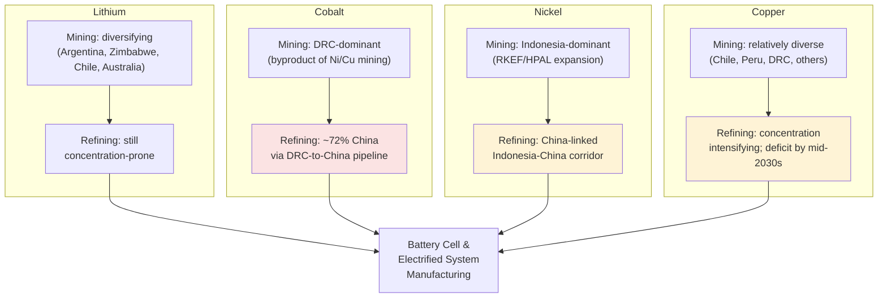

## Lithium, cobalt, nickel, and copper in the battery supply chain

<syllabot_broad_topic/>

### Overview

Lithium, cobalt, nickel, and copper are the four metals most commonly discussed as the mineral backbone of the lithium-ion battery supply chain and the broader electrification of energy and transport. Each plays a structurally different chemical role, has a distinct geographic production/processing footprint, and carries a distinct supply-risk profile — meaning "battery metals" should not be treated as a single undifferentiated risk category.

**Key Points**

- Demand for lithium rose by nearly 30% in 2024, substantially exceeding the roughly 10% annual growth rate seen through the 2010s; nickel, cobalt, and graphite demand grew 6–8% in 2024, driven largely by EVs, battery storage, renewables, and grid networks.
- For battery metals overall (lithium, nickel, cobalt, graphite), the energy sector accounted for 85% of total demand growth over this period.
- The recurring structural theme across all four metals: **mining is more geographically diverse than refining/processing**, and refining concentration is the primary strategic vulnerability, not raw ore scarcity.

### The Four Metals — Roles and Chemistry

| Metal | Primary battery role | Byproduct status | 2025–2026 market condition |
| --- | --- | --- | --- |
| Lithium | Charge-carrying ion in the electrolyte/cathode-anode cycling ("rocking chair" mechanism) | Primary-mined (brine and hard-rock) | High volatility; sharp 2025–2026 price surge after price crash |
| Cobalt | Cathode stabilizer (historically NMC/NCA chemistries), improves thermal stability and cycle life | Secondary byproduct of nickel and copper mining | Supply disruption-driven price rises; DRC export quota issues |
| Nickel | Cathode energy-density driver (higher-nickel NMC/NCA chemistries) | Primary-mined, but cobalt is its byproduct | Oversupply from Indonesia depressing prices |
| Copper | Current collectors (anode/cathode foils), wiring, motor windings — not part of the electrochemical cell itself but essential to the broader electrified system | Primary-mined; also a cobalt carrier metal | Structural deficit anticipated by mid-2030s |

### Lithium

**Supply characteristics**

- Lithium is a notable exception to the broader mining-concentration trend: a major portion of recent supply growth has come from **emerging producers like Argentina and Zimbabwe**, alongside established sources, giving lithium **mining** more diversification momentum than most other battery metals — some diversification is visible and expected to continue for lithium, graphite, and rare earths specifically.
- Despite mining diversification, refining/processing remains concentrated; this is consistent with the general pattern where the average share of the top refining country across key minerals (excluding rare earths) rose to 72% in 2025, up from 70% in 2023.

**Recent price dynamics (2025–2026)**

- Lithium prices stabilized in a roughly $13,000–$17,000/tonne range through 2025–2026 after an earlier price crash.
- Prices then surged sharply from mid-December 2025, driven by a combination of Chinese supply concerns and stronger 2026 demand expectations. The rally accelerated after China announced a reduction in VAT export rebates on lithium-ion batteries effective April 1, 2026, prompting producers to front-load production and exports in early 2026, compounded by downstream restocking ahead of the Chinese Lunar New Year.
- Lithium carbonate prices in China jumped 78.3% in just over a month, reaching their highest level since late 2023, before easing slightly.
- Regulatory uncertainty added supply tightness: local authorities in Yichun (a major Chinese lithium-mining region) planned to cancel several lithium-related mining permits, and the prolonged suspension of CATL's Jianxiawo mine raised questions about the pace of supply recovery. [Inference: the interaction between Chinese domestic regulatory tightening and export-rebate policy suggests lithium price volatility in this period was substantially China-driven on both the supply and export-incentive sides, though the precise weighting between these two factors is not quantified in available reporting.]

### Cobalt

**Supply characteristics — the byproduct structure is central to understanding cobalt risk**

- Unlike lithium, cobalt is extracted almost entirely as a **secondary/byproduct** of other primary mining operations — chiefly nickel mining and, to a lesser degree, copper mining — meaning cobalt supply does not respond independently to cobalt-specific price signals in the way a primary-mined commodity would.
- In laterite nickel ores, typical composition is roughly 1.3–2.5% Ni and 0.05–0.15% Co; in sulfide ores, roughly 1.5–3% Ni and 0.05–0.10% Co. Because the value of nickel is approximately 10 times higher than cobalt per unit, cobalt is economically treated as the byproduct in nickel-mining operations. A consequence: if nickel demand were to drop, cobalt production from that supply chain would be expected to fall correspondingly, largely independent of cobalt's own demand trajectory.
- Cobalt produced as a byproduct of copper mining follows a separate, only loosely correlated dynamic tied to copper production trends rather than nickel trends — meaning cobalt supply is effectively split across two only weakly related byproduct pipelines (nickel-linked and copper-linked).

**Geographic and corporate concentration**

- The Democratic Republic of the Congo (DRC) is the dominant source of raw cobalt; China almost exclusively imports this raw material, with cobalt imports from the DRC to China valued at roughly $3 billion in 2024.
- Chinese facilities control approximately 72% of global cobalt refining capacity, processing DRC-sourced raw material into refined products — another instance of the mining-diversification-vs-refining-concentration pattern seen across most battery metals.
- Cobalt has been characterized as having the **most concentrated mining-plus-processing footprint of any critical mineral** in some 2026 industry analysis, combining DRC extraction concentration with Chinese refining concentration in a single tightly coupled pipeline.

**2025–2026 supply disruptions**

- Cobalt prices rose in January 2026, driven mainly by continued supply disruptions in the DRC; regulatory crackdowns on artisanal mining temporarily halted processing and delayed shipments.
- The DRC government extended 2025 export quotas until March 2026 to ease bottlenecks, though exports remained irregular, with supply expected to stay tight until shipments normalized.
- Demand-side note: cobalt demand has proven more diversified and resilient to price increases than lithium — while cobalt use in EV batteries is declining (especially in China, reflecting a shift toward lower-cobalt or cobalt-free chemistries like LFP), the metal continues to benefit from strong aircraft deliveries, high defense spending, and steady demand from consumer electronics and superalloys, alongside indirect support from China's expanding EV partnerships and global supply-chain investments.

### Nickel

**Supply characteristics**

- Nickel mining has become substantially concentrated around Indonesia in recent years, connected via a small number of vertically integrated, largely China-based multinational corporations to alloy and refining plants in China — a structure often described as the **China–Indonesia production corridor**, which has reshaped the global primary nickel supply chain.
- This corridor increases production efficiency but concentrates refining, precursor processing, and mining within a small number of vertically integrated companies and countries, which industry analysis characterizes as making the entire supply chain **structurally fragile** despite its apparent efficiency.
- Geographic concentration for nickel (along with copper and cobalt) is expected to **intensify**, not diminish, going forward — the IEA notes this is a notable divergence from lithium, graphite, and rare earths, where some mining diversification is visible.

**Market conditions and the "bifurcated" nickel market**

- Indonesian nickel expansion, driven by heavy investment in RKEF (rotary kiln-electric furnace) and HPAL (high-pressure acid leach) processing technologies to feed EV battery demand, has produced **oversupply**, depressing nickel prices.
- This expansion has come with documented environmental costs: reliance on dedicated "captive coal" coal-fired power plants for nickel processing (raising the carbon footprint of Indonesian nickel specifically) and deforestation concerns in nickel-rich provinces such as Sulawesi and Maluku.
- A resulting structural bifurcation has emerged between lower-cost, higher-carbon-footprint ("dirty") Indonesian nickel and higher-cost, lower-carbon ("clean") nickel from other sources — a distinction increasingly relevant to battery makers and automakers facing carbon-accounting and ESG-linked sourcing requirements in Western markets.

### Copper

**Supply characteristics**

- Copper is frequently described as the "surprise" critical mineral in energy-transition discussions — often overlooked relative to lithium, cobalt, and nickel despite arguably facing the most severe long-term supply-demand gap.
- Unlike the battery-cell chemistry metals, copper's role in batteries and the broader electrified system is structural/electrical (current collectors, wiring, motor windings, grid infrastructure) rather than electrochemical, but demand growth is nonetheless substantial: the rapid expansion of grid investment in China has been the single largest contributor to copper demand growth over the past two years.
- Geographic concentration is expected to intensify for copper (alongside nickel and cobalt), reversing some of the diversification trend seen in other minerals.
- Gaps between projected demand and anticipated supply have **narrowed** for copper and lithium specifically in the most recent IEA outlook, a comparatively more favorable trajectory than cobalt, which faces new risks from policy shifts in major producing countries (e.g., DRC export-quota policy).
- A structural deficit is anticipated by the mid-2030s under current supply/demand trajectories, with recycling identified as an increasingly essential mitigant — approximately 30% of copper supply currently comes from recycled sources, a share expected to need to grow.

### Diagram — Battery Metal Supply Chain Structure Comparison (svg_diagram)

### Cross-Cutting Trends and Policy Responses

**Key Points**

- **The mining-diversification / refining-concentration split is the master pattern** across all four metals — echoing the same dynamic documented for rare earths: adding mine capacity outside dominant producers does not by itself resolve strategic vulnerability if refining remains concentrated, since ore/concentrate from diversified mines is often still shipped to the same limited set of refining hubs.
- **China's refining role varies by metal but is present across nearly all four**: heavily dominant for cobalt refining (~72%) and structurally central to nickel via the Indonesia-China corridor, with lithium refining also concentration-prone despite mining diversification; copper refining concentration is described as intensifying.
- **Byproduct economics create supply inelasticity for cobalt** in particular — since cobalt is not typically the primary economic driver of the mines that produce it, cobalt supply responds more to nickel and copper market conditions than to cobalt-specific price signals, complicating simple price-based forecasting.
- **Battery chemistry shifts materially affect future mineral demand mix** — the ongoing shift toward LFP (lithium iron phosphate, cobalt-free and nickel-free) chemistries versus NMC/NCA (nickel-cobalt-based) chemistries, and emerging sodium-ion technology, can substantially change relative demand for cobalt and nickel specifically, even as overall battery demand grows. [Inference: given documented declining cobalt use in Chinese EV batteries alongside LFP adoption trends, continued chemistry shifts are likely to keep reducing cobalt's *relative* share of battery-metal demand even if absolute battery production keeps growing, though the pace of this shift is not precisely quantified in the sources reviewed.]

**Policy responses (illustrative, U.S./North America focus)**

- Uneven investment has emerged across battery-relevant materials: lithium has attracted the most investment thus far among North American efforts.
- Battery and minerals recycling is identified as a potential way to supplement refining capacity for high-value materials like copper and cobalt, as/if that recycling market matures.
- Extremely slow buildout of new mining capacity means continued U.S. dependence on foreign sources for many raw materials is expected, with Canadian projects anticipated to supplement U.S. capacity specifically in nickel, cobalt, and graphite.
- North American industry has tended toward synthetic (rather than natural) graphite production, and North American refineries are assessed as likely to struggle to meet demand without reliance on "friend-shoring" (sourcing refined materials from allied countries rather than solely domestic capacity).

### Illustrative Example — Tracing a DRC Cobalt Shipment

1. Artisanal or industrial mining operations in the DRC extract cobalt-bearing ore, typically as a byproduct of copper or nickel mining activity in the DRC's copper belt.
2. Raw cobalt material is exported almost exclusively to China rather than being refined domestically in the DRC or shipped to alternative refining hubs, reflecting the near-total concentration of large-scale cobalt refining capacity in China.
3. Chinese facilities, controlling roughly 72% of global refining capacity, process the raw material into refined cobalt products (cobalt sulfate, cobalt oxide, or metal, depending on end use).
4. Refined cobalt is then incorporated into cathode precursor materials for NMC/NCA battery chemistries, predominantly manufactured within China's own battery supply chain, or exported as a refined input to battery makers elsewhere.
5. A disruption at any single point in this pipeline — DRC export-quota policy, artisanal-mining regulatory crackdowns, or Chinese refining-capacity constraints — propagates through the entire chain with limited redundancy, since there is no comparable-scale alternative refining pathway currently operating outside China.

### Related Topics

- Defining critical and strategic minerals (classification frameworks)
- China's dominance in rare earth processing and refining (parallel processing-concentration case)
- LFP vs. NMC/NCA battery chemistry tradeoffs and mineral-demand implications
- DRC cobalt mining: artisanal mining regulation and export-quota policy
- Indonesia's RKEF/HPAL nickel processing buildout and environmental impact
- Battery and critical-mineral recycling ("urban mining") as supply mitigation
- Friend-shoring and allied mineral supply-chain partnerships (U.S., Canada, Australia)
- Copper structural deficit projections and grid-investment demand drivers
- Sodium-ion battery technology as a cobalt/lithium demand mitigant
- EU and U.S. critical minerals strategy implementation (CRMA, Inflation Reduction Act successors)