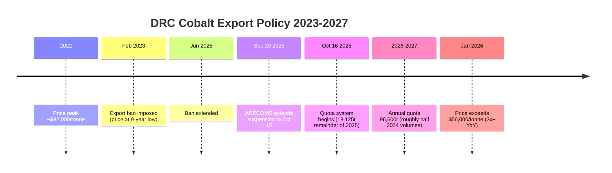

## The Democratic Republic of Congo and cobalt mining risk

### Why the DRC Matters

The Democratic Republic of the Congo (DRC) accounts for approximately 70–80% of global mined cobalt production, making it by a wide margin the single most important country in the cobalt supply chain and, by extension, a critical node in global battery, defense, aerospace, and electronics manufacturing. This concentration makes DRC-specific political, regulatory, security, and labor-practice risks disproportionately consequential to global cobalt-dependent industries — a degree of single-country dependency exceeded among major critical minerals only by comparably extreme cases like DRC cobalt itself or China's rare-earth processing dominance.

**Key Points**

- DRC cobalt risk operates across four largely independent risk categories: **export policy volatility**, **armed conflict exposure**, **artisanal/small-scale mining (ASM) labor practices**, and **downstream processing concentration in China** — each with distinct triggers and distinct mitigation approaches.
- Because cobalt is chemically a byproduct of nickel and copper mining, DRC cobalt supply cannot be understood in isolation from DRC copper mining economics, which drives much of the country's large-scale mining investment.
- Nearly all DRC-mined cobalt is exported as raw or semi-refined material (cobalt hydroxide) to China for refining, meaning DRC risk and Chinese refining-concentration risk are structurally linked rather than separate vulnerabilities.

### Export Policy Timeline — The 2023–2027 Quota Cycle

This is the most consequential recent development in DRC cobalt risk and illustrates how a single government's policy decisions can move global commodity prices by multiples.

1. **February 2023** — The DRC imposes a cobalt export ban after prices fell to a nine-year low, aiming to manage oversupply and stabilize the market. This followed a period where global production surges from Indonesia and China's CMOC Group operations in the DRC had driven cobalt prices down sharply from a 2022 peak of roughly $82,000/tonne toward approximately $20,000/tonne by February 2025.
2. **June 2025** — The export ban is extended.
3. **20 September 2025** — The DRC's Authority for the Regulation and Control of Strategic Mineral Substances (ARECOMS) issues Decision n°004/ARECOMS/2025, extending the suspension of cobalt exports until 15 October 2025. The suspension applies to **all** cobalt production — industrial, semi-industrial, small-scale, and artisanal.
4. **16 October 2025** — A quota-based export system replaces the outright ban. The regime permits exports of up to 18,125 tonnes for the remainder of 2025, followed by annual quotas of 96,600 tonnes for both 2026 and 2027 (roughly half of 2024 export volumes), including a 9,600-tonne discretionary strategic quota. Quota allocations are determined based on historical exports.
5. **Industry reaction split** — The quota system received support from Glencore (Swiss miner) but faced opposition from CMOC Group (China-based), which in May 2025 had requested the DRC lift the ban ahead of its scheduled June 2025 expiry.
6. **Late 2025–early 2026** — Initial quota-based shipments were expected to reach China (the primary destination) by end of Q1 2026; CMOC's individual 2026 export quota was set at 31,200 tonnes, against company production guidance of 100,000–120,000 tonnes for 2026, following a 2025 production record of 117,549 tonnes.
7. **January 2026** — Cobalt spot prices exceed $56,000/tonne, more than doubling from the prior year, reflecting the combined effect of the multi-month export embargo and resulting inventory depletion.
8. **Continued tightness through 2026** — Delayed Q1 2026 shipments under the new quota system created feedstock tightness in Asian and European markets even after the quota regime nominally reopened exports; analysts anticipated a supply deficit on the order of roughly 10,700 tonnes for 2026 despite the new export volumes.

**Price trajectory summary:**

$$\text{2022 peak (~\$82{,}000/t)} \rightarrow \text{Feb 2025 trough (~\$20{,}000/t)} \rightarrow \text{Jan 2026 (~\$56{,}000/t, >2\times \text{YoY}})$$

### Diagram — DRC Cobalt Export Policy Timeline (svg_diagram)

### Armed Conflict and Security Risk

The DRC government has explicitly linked its export-control policy to the security situation in eastern Congo: the shift toward a quota system was described as addressing rising conflict in eastern Congo, where the government asserts that illegal (unregulated) mining contributes to violence involving M23 rebel forces. This ties cobalt export governance directly to conflict-financing concerns, situating cobalt alongside historically similar "conflict mineral" dynamics documented for tin, tantalum, tungsten, and gold in the DRC's eastern provinces.

**Key Points**

- Quota implementation introduces new enforcement risks distinct from the conflict itself: corruption in quota distribution and smuggling across porous borders — particularly through Rwanda and Zambia — are identified as material risks to the integrity of the new system.
- For U.S. and EU policymakers, the quota regime is assessed as complicating supply-security strategy, reinforcing the perceived urgency of direct government-to-government partnerships with Kinshasa rather than relying solely on market mechanisms.
- [Inference: the geographic overlap between conflict-affected eastern DRC provinces and cobalt/copper mining activity in Lualaba and Haut Katanga provinces creates potential — though not confirmed in the reviewed sources as a direct, documented link — for eastern-conflict dynamics to intersect with formal cobalt supply chains via smuggling routes, given the explicitly noted risk of cross-border leakage through Rwanda and Zambia.]

### Artisanal and Small-Scale Mining (ASM)

**Key Points**

- The DRC's large-scale unregulated artisanal mining sector plays a significant role in cobalt production and was explicitly named as a target of the government's shift toward tighter export control, with the October 2025 suspension applying to industrial, semi-industrial, small-scale, and artisanal output alike.
- As of an April–June 2025 survey (BGR, Germany's geological data agency, presented at the Cobalt Institute's Cobalt Congress in Madrid, May 2025), 90 ASM copper-cobalt sites were documented in Lualaba and Haut Katanga provinces — the core of the DRC's copper-cobalt belt.
- A notable formalization effort: Entreprise Générale du Cobalt (EGC) received a quota allocation under the October 2025 system and, by H1 2026, had grown to become the fifth-largest cobalt hydroxide exporter, handling approximately 2,820 tonnes of **traceable** artisanal cobalt in H1 2026 (roughly 1,410 tonnes per quarter), more than doubling from the initial 1,000-tonne volume announced in November 2025. This is presented by industry sources as evidence that responsible, traceable artisanal cobalt can be integrated into formal supply chains at meaningful volume.

**Reputational and legal risk**

- In 2019, a lawsuit was filed in U.S. courts against major automotive and technology companies alleging they aided and abetted the exploitation of child miners in the DRC's cobalt supply chain.
- Perceived reputational risk associated with sourcing artisanal DRC cobalt has been assessed as a potential drag on the DRC's comparative advantage as a cobalt supplier from 2025 onward; anecdotal and off-the-record industry interviews suggest these lawsuits produced a "chill" across the automotive and technology sectors, with many companies pursuing either cobalt-free battery chemistries or "DRC-free" / "ASM-free" sourcing strategies specifically to avoid child-labor risk exposure.
- This creates a structural tension: large-scale mining companies, traders, and processors face increasing pressure to supply cobalt verified free of artisanal-mining input, even as formalization efforts like EGC attempt to demonstrate that properly governed artisanal supply can meet due-diligence standards.

### Transparency and Traceability Gaps

- The new quota system requires exporters to document provenance and compliance, but as of the most recent reporting reviewed, buyers still face uncertainty over how quotas are enforced in practice and whether artisanal-sourced cobalt can be reliably excluded from, or verifiably included in, formal export volumes.
- ARECOMS officials signaled interest in publishing periodic quota summaries and engaging independent auditors, but as of November 2025, no such disclosures had appeared — indicating a gap between stated transparency intentions and delivered verification infrastructure.
- New human-rights documentation published 22 July 2026 named several major Chinese-backed mineral-project operators — including Zijin Mining, Zhejiang Huayou Cobalt, and Tsingshan Group — among a group of 10 Chinese firms accounting for nearly two-thirds of all documented abuse allegations against Chinese-backed mineral projects worldwide since 2021. [Unverified: this figure describes documented *allegations* against a named set of firms globally, not verified findings specific to DRC cobalt operations alone; the scope (global, not DRC-specific) should be noted when using this statistic.]

### China's Structural Role in the DRC Cobalt Pipeline

The DRC-to-China pipeline is not incidental — it is the dominant structural feature of global cobalt supply chain risk:

- China almost exclusively imports raw cobalt material from the DRC (cobalt imports from DRC to China were valued at roughly $3 billion in 2024).
- Chinese facilities control approximately 72% of global cobalt refining capacity, meaning DRC-mined cobalt is processed into usable battery-grade and industrial materials predominantly in China regardless of the mine operator's nationality.
- CMOC Group (China-based) is among the DRC's largest cobalt producers and was a central party in the 2025 export-ban dispute, illustrating that Chinese corporate interests are directly embedded in DRC mining operations, not solely in downstream refining.
- This means DRC political/regulatory risk and Chinese refining-concentration risk compound rather than diversify each other — a disruption at either the DRC mining/export stage or the Chinese refining stage affects the same overall supply chain, with limited redundancy at either end.

### Diagram — DRC Cobalt Risk Category Map (svg_diagram)

<svg xmlns="http://www.w3.org/2000/svg" viewBox="0 0 640 420" font-family="sans-serif">
<text x="320" y="26" text-anchor="middle" font-size="16" font-weight="bold">DRC Cobalt Risk Category Map (svg_diagram)</text>
<circle cx="320" cy="220" r="70" fill="#4a7c9b" opacity="0.85" />
<text x="320" y="216" text-anchor="middle" font-size="12" fill="white" font-weight="bold">DRC Cobalt</text>
<text x="320" y="232" text-anchor="middle" font-size="11" fill="white">~70-80% global supply</text>
<circle cx="160" cy="120" r="90" fill="#c0392b" opacity="0.35" />
<text x="160" y="105" text-anchor="middle" font-size="12" font-weight="bold">Export Policy</text>
<text x="160" y="122" text-anchor="middle" font-size="10">Bans, quotas,</text>
<text x="160" y="136" text-anchor="middle" font-size="10">ARECOMS decisions</text>
<circle cx="480" cy="120" r="90" fill="#8e44ad" opacity="0.35" />
<text x="480" y="105" text-anchor="middle" font-size="12" font-weight="bold">Armed Conflict</text>
<text x="480" y="122" text-anchor="middle" font-size="10">M23, eastern DRC,</text>
<text x="480" y="136" text-anchor="middle" font-size="10">smuggling routes</text>
<circle cx="160" cy="330" r="90" fill="#d68910" opacity="0.35" />
<text x="160" y="315" text-anchor="middle" font-size="12" font-weight="bold">ASM &amp; Labor</text>
<text x="160" y="332" text-anchor="middle" font-size="10">Child labor risk,</text>
<text x="160" y="346" text-anchor="middle" font-size="10">traceability gaps</text>
<circle cx="480" cy="330" r="90" fill="#1e8449" opacity="0.35" />
<text x="480" y="315" text-anchor="middle" font-size="12" font-weight="bold">China Refining</text>
<text x="480" y="332" text-anchor="middle" font-size="10">~72% of global</text>
<text x="480" y="346" text-anchor="middle" font-size="10">cobalt refining capacity</text>
</svg>

### Market Structure and Supply Outlook

- Global cobalt supply in 2026 is projected at approximately 230,000–240,000 metric tonnes of mined production.
- Indonesia is emerging as a significant secondary cobalt source via nickel-byproduct output, representing a partial (though currently minor relative to DRC scale) diversification vector.
- Recycling and secondary supply are gaining traction as additional diversification mechanisms, though these remain a smaller share of total supply relative to primary DRC mining.
- Demand resilience: cobalt demand growth is supported by lithium cobalt oxide (LCO) battery applications and emerging defense/aerospace uses, providing demand-side support even as EV-battery cobalt intensity declines in some chemistries (notably the shift toward LFP in China).
- Copper-related risk compounds the picture: the DRC's Kamoa-Kakula copper mine (operated by Ivanhoe Mines) delivered 388,838 tonnes in 2025, below a projected 520,000 tonnes, and copper supply risk from this and other incidents — combined with strong AI- and renewable-energy-driven demand — has supported elevated copper prices (up over 40% in 2025) alongside cobalt's more-than-doubling. Since cobalt is partly a copper-mining byproduct, DRC copper-sector performance and cobalt-sector performance are linked, not independent variables. Notably, the DRC did **not** restrict copper exports during the 2025 cobalt export ban, illustrating that DRC mineral policy has so far been applied selectively by commodity rather than as a blanket resource-nationalism posture.

### Illustrative Example — Tracing Risk Through a Single Supply Disruption

1. ARECOMS extends the cobalt export suspension in September 2025, citing both price-stabilization goals and eastern-DRC conflict-financing concerns tied to illegal mining.
2. Major producers Glencore and China-based CMOC Group both face force majeure conditions on existing supply contracts during the ban period.
3. Chinese refiners, dependent on DRC raw material for roughly 72% of global refining throughput, experience tightening feedstock supply, pushing global cobalt prices from roughly $20,000/tonne (February 2025) past $56,000/tonne (January 2026).
4. When the quota system opens in October 2025, initial shipments are delayed into Q1 2026, meaning the nominal policy "reopening" does not immediately translate into market relief — feedstock tightness in Asian and European markets persists even after the ban technically ends.
5. Downstream battery and electronics manufacturers outside China face a double exposure: DRC-origin supply risk at the mining/export stage, and Chinese refining-concentration risk at the processing stage, with no comparable-scale alternative pathway available to route around either bottleneck in the short term.

### Related Topics

- Lithium, cobalt, nickel, and copper in the battery supply chain (parent topic — byproduct economics)
- China's dominance in rare earth processing and refining (parallel refining-concentration case)
- Conflict minerals frameworks (Dodd-Frank Section 1502, EU Conflict Minerals Regulation) and their applicability to cobalt
- CMOC Group and Glencore: corporate structure and DRC market share
- ARECOMS regulatory authority and DRC mining-sector governance reform
- Indonesia's emerging role as a secondary cobalt supplier via nickel byproduct
- LFP and other cobalt-free battery chemistries as demand-side risk mitigation
- Eastern DRC conflict dynamics (M23) and cross-border mineral smuggling via Rwanda/Zambia
- Cobalt recycling and secondary supply chain development
- Kamoa-Kakula copper mine and DRC's dual copper-cobalt resource-policy dynamics