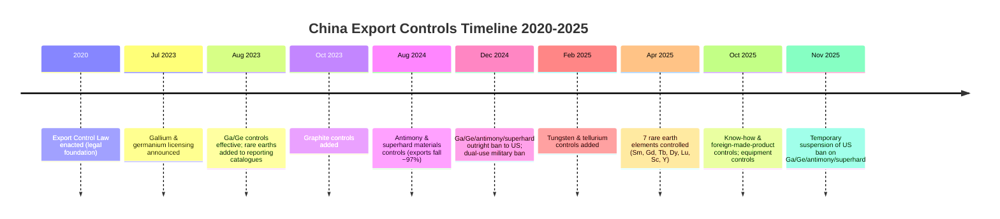
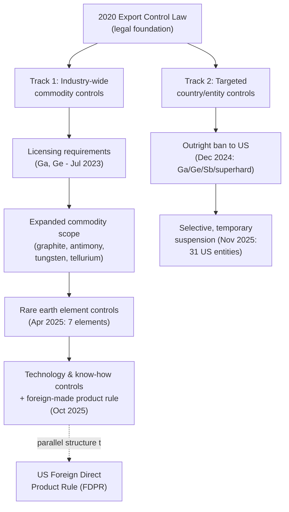

## China's export controls on rare earths, gallium, and germanium

### Legal Foundation

China's export control regime for critical minerals rests on the **2020 Export Control Law**, which provides the systematic legal basis for managing exports of strategic assets, dual-use items, and related technologies. From this foundation, China has built what analysts describe as an **evolving two-track strategy**: industry-wide controls applied broadly to strategic commodities (such as graphite and rare earths), combined with targeted restrictions aimed at specific foreign firms or countries for stated national-security reasons.

**Key Points**

- The regime has evolved from viewing critical minerals primarily as economic commodities toward treating them as strategic national assets with dual economic and security significance — a shift reflected in the regulatory architecture built between 2020 and 2025.
- Controls operate as **dynamic policy levers rather than absolute barriers**: Beijing has repeatedly paired escalation (new bans, license requirements) with selective de-escalation (license approvals, temporary suspensions of bans), giving the regime flexibility as a diplomatic instrument rather than a fixed wall.
- Two analytically distinct "waves" of controls are identified by trade analysts: the **2023–2024 wave** (gallium, germanium, graphite, antimony), assessed as primarily a response to U.S. technology restrictions on semiconductors and advanced computing; and the **2025 wave** (rare earth elements, expanded technology controls), assessed as primarily a tool within the broader U.S.-China trade and tariff conflict, and possibly also aimed in part at influencing EU trade policy (e.g., EV tariff decisions).

### Chronological Timeline

**2020** — China promulgates the Export Control Law, establishing the legal groundwork for systematic export controls on strategic materials and technologies.

**3 July 2023** — China's Ministry of Commerce announces new export controls on gallium and germanium, effective 1 August 2023, requiring special export licenses and establishing documentation requirements for these dual-use items.

**August 2023** — Licensing requirements take effect for gallium and germanium; rare earths are also added to export reporting catalogues around this period, and restrictions on rare-earth processing technology exports are introduced. Data comparison illustrates the immediate market effect: in July 2023 (pre-control), China exported 7,965 kg of germanium and 6,876 kg of gallium; by October 2023, exports had collapsed to 590 kg of germanium and 227 kg of gallium.

**October 2023** — Export controls expand to graphite.

**15 August 2024** — Export limits are imposed on antimony (used in ammunition, infrared sensors, and flame retardants) and superhard materials. Chinese antimony exports subsequently fell by approximately 97%, and global antimony trioxide prices roughly doubled — cited as a demonstration of the precision of export licensing as a pressure tool.

**3 December 2024** — China issues a directive prohibiting, **in principle**, exports of gallium, germanium, antimony, and superhard materials to the United States specifically — escalating prior licensing requirements into an outright prohibition targeted at one country. The same date, China prohibits exports of dual-use items to U.S. military end-users or for military purposes, citing national security concerns, and implements stricter end-user/end-use review for graphite exports to the U.S.

**31 December 2024** — China publishes its 2025 export licensing goods catalogue, adding 21 tariff lines at the 10-digit HS code level to licensing requirements, spanning HS chapters 27, 28, 29, 38, 72, and 87.

**February 2025** — Export controls extend to tungsten and tellurium.

**April 2025** — China imposes export controls on seven rare earth elements and related items: samarium, gadolinium, terbium, dysprosium, lutetium, scandium, and yttrium — the first wave specifically targeting medium-to-heavy rare earths, distinct from the earlier gallium/germanium/antimony controls.

**9 October 2025** — China announces a significant expansion of rare earth export controls, extending rules beyond physical goods to govern **technological know-how** and even **foreign-made products that use Chinese-origin inputs** — a substantial jurisdictional broadening analogous in structure to the U.S. Foreign Direct Product Rule. Related October 2025 measures also cover superhard materials, medium/heavy rare-earth-related items, rare-earth processing equipment, and lithium-battery/artificial-graphite negative-electrode materials.

**5 November 2025** — China's Ministry of Commerce announces a temporary easing of dual-use export restrictions on 31 U.S. entities, suspending the export prohibition on gallium, germanium, antimony, and superhard materials to the U.S. Analysts note the practical impact of the original December 2024 ban was debated, since no direct exports of the controlled materials from China to the U.S. had occurred since the original August 2023 licensing controls took effect — suggesting the ban's function may have been more signaling/leverage-oriented than physically restrictive in the U.S.-specific case, given trade had already been constrained by the earlier licensing regime.

### Diagram — China Critical Mineral Export Control Timeline (svg_diagram)

### Mineral-by-Mineral Profile

**Gallium**

- China's role: dominant global producer (widely cited figures place China's share at the large majority of global gallium supply, extracted predominantly as a byproduct of bauxite/alumina and zinc processing).
- Application: indispensable for high-frequency and high-power semiconductor devices (compound semiconductors such as GaN and GaAs), used in radar, 5G infrastructure, LEDs, and advanced defense electronics, with few viable substitutes at comparable performance.
- Market impact: average monthly exports of unwrought gallium were 66% lower in the post-control period (January 2024–October 2025) compared to the pre-restriction period (January 2022–June 2023), with apparent further tightening through 2025 including several months of zero or near-zero exports. European gallium prices rose by 365% following the controls.

**Germanium**

- China's role: accounts for approximately 60% of global germanium production; the U.S. is 100% reliant on imported germanium, with China as its third-largest supplier (reflecting indirect trade flows despite direct restrictions).
- Application: critical for advanced optics, fiber-optic telecommunications infrastructure, infrared systems, and high-efficiency solar cells used in aerospace and energy applications.
- Market impact: wrought germanium exports fell by 60% with prices rising approximately 400% following the escalating controls.

**Antimony**

- Application: ammunition, infrared sensors, flame retardants.
- Market impact: exports fell by approximately 97% following the August 2024 controls, with global antimony trioxide prices roughly doubling; prices were later cited as up 437% in some 2025-2026 reporting, reflecting continued or compounding tightness.

**Graphite**

- China's role: produces approximately 75% of world graphite production.
- Application: critical for lithium-ion battery anode material (natural and processed graphite).
- Market impact: graphite shipments slowed in early 2024 as exporters awaited license processing under the October 2023 controls.

**Rare Earth Elements (April and October 2025 controls)**

- Specific elements controlled in April 2025: samarium, gadolinium, terbium, dysprosium, lutetium, scandium, and yttrium — notably weighted toward medium-to-heavy rare earths, which (as established in the parallel processing-dominance topic) are the elements where China's separation/refining dominance is most extreme.
- The October 2025 expansion is qualitatively different from prior mineral-specific controls: it extends restriction scope to **technology and know-how** (extraction, separation, and magnet-manufacturing processes) and to **foreign-made products incorporating Chinese-origin rare-earth inputs**, functioning similarly in structure to the U.S. Foreign Direct Product Rule but applied by China to protect its own supply-chain leverage rather than to restrict a rival's access to U.S. technology.

### Diagram — Export Control Mechanism Structure (svg_diagram)

### Strategic Objectives Beyond Direct Retaliation

Analysis of the controls identifies multiple, potentially overlapping strategic objectives beyond simple tit-for-tat retaliation against U.S. semiconductor export controls:

**Key Points**

- **Reinforcing dominance in global mineral supply chains** — controls reinforce China's structural position as the indispensable node in these supply chains, independent of any specific retaliatory trigger.
- **Promoting domestic value-added production** — by constraining raw/semi-processed material exports, China keeps input prices comparatively lower domestically while raising them abroad, incentivizing downstream manufacturing (e.g., magnets, semiconductors, batteries) to locate or remain within China rather than importing Chinese-origin raw materials for foreign processing.
- **Constraining Western defense capabilities** — several controlled materials (antimony, gallium, and rare earths) have direct defense applications (munitions, radar, precision-guided systems, infrared sensors), giving the controls a security dimension beyond pure trade leverage.
- **Trade and diplomatic leverage** — particularly for the 2025 wave, controls are assessed as functioning as a tool within the broader U.S.-China trade/tariff conflict and potentially as leverage aimed at shaping EU trade-policy decisions (e.g., EV tariffs), extending the controls' strategic use beyond the U.S. relationship alone.
- **Information-gathering on chokepoints** — some analysis frames the controls as also serving to help China map and test where its supply-chain leverage is most effective, informing future policy calibration.

### Effectiveness and Circumvention

**Key Points**

- Controls function with graduated severity — a mix of reporting requirements, licensing requirements, and outright bans — allowing Beijing to escalate or de-escalate pressure without needing new legislation for each step, since the underlying 2020 Export Control Law provides broad authority.
- **Circumvention channels exist but are imperfect**: importers facing restrictions have reportedly drawn on existing inventories, rerouted shipments through intermediaries, or sought alternative (non-Chinese) suppliers; some buyers reportedly shifted purchases through intermediary countries following the December 2024 ban.
- Despite circumvention efforts, **disruptions have been real and measurable**: USGS reporting confirms the 2024 antimony announcement was followed by a near-doubling of global prices, and multiple minerals show sustained export-volume declines and price spikes well after initial control announcements, indicating imperfect substitution rather than seamless market adaptation.
- **Escalation and de-escalation are used tactically**: the pattern of announcing severe restrictions (e.g., the December 2024 outright U.S. ban) followed months later by partial suspension (November 2025, 31 entities) illustrates the controls functioning as a negotiating instrument tied to the broader state of bilateral relations, rather than a fixed, permanent policy position. Analysts assess that the main determinant of future Chinese export-control trajectory in the short-to-medium term is the state of U.S.-China relations generally, rather than the specific mineral-supply situation alone.

### Downstream Response — Investment and Diversification Pressure

The controls have catalyzed direct government investment responses in affected countries:

- The U.S. Department of Defense, through its Economic Defense Unit, announced a $750 million investment (August 2025) to secure mixed rare-earth carbonates (MREC) from Serra Verde, illustrating direct government intervention to secure non-Chinese rare-earth feedstock in response to supply-chain pressure.
- Rare-earth refiners, recyclers, and magnet makers outside China have reported ongoing uncertainty over access to technology, equipment, and feedstock specifically because of the expected scope of China's export controls — illustrating that the *anticipation* of further controls, not just controls already in force, shapes downstream investment and sourcing decisions.

### Illustrative Example — Reading the Two-Wave Framework

When assessing any individual Chinese mineral export control announcement, apply the two-wave lens to interpret likely intent:

1. **Is the controlled mineral primarily semiconductor/advanced-computing relevant** (gallium, germanium, graphite)? If so, and if the timing correlates with a preceding U.S. semiconductor-related restriction, the control is more likely functioning within the **2023–2024-style retaliatory pattern** tied specifically to the chip-war dynamic.
2. **Is the controlled mineral primarily tied to rare earths, broader trade categories, or explicitly extended to technology/know-how and foreign-made products?** If so, and if the timing correlates with broader tariff or trade-negotiation developments, the control more closely resembles the **2025-style pattern**, functioning as general trade-conflict leverage rather than a narrowly targeted semiconductor-specific response.
3. **Check for a subsequent partial suspension or entity-specific carve-out** — a common short-term response pattern (as with the November 2025 suspension for 31 U.S. entities) that signals the control is being used as a negotiating lever tied to the broader relationship rather than a fixed, non-negotiable restriction.

### Related Topics

- Defining critical and strategic minerals (classification frameworks)
- China's dominance in rare earth processing and refining (structural basis for control leverage)
- U.S. Foreign Direct Product Rule and its structural parallel to China's October 2025 know-how controls
- U.S. Department of Defense critical-minerals investment programs (MP Materials, Serra Verde, ReElement)
- Antimony, tungsten, and tellurium supply chains and defense applications
- Chinese Export Control Law (2020) legal architecture
- EU trade policy and EV tariffs as a potential target of Chinese mineral leverage
- Gallium nitride (GaN) and compound semiconductor applications
- Global Trade Alert and Swedish National China Centre methodology for tracking export-control market impacts
- Allied stockpiling and diversification responses (G7 critical minerals proposals)