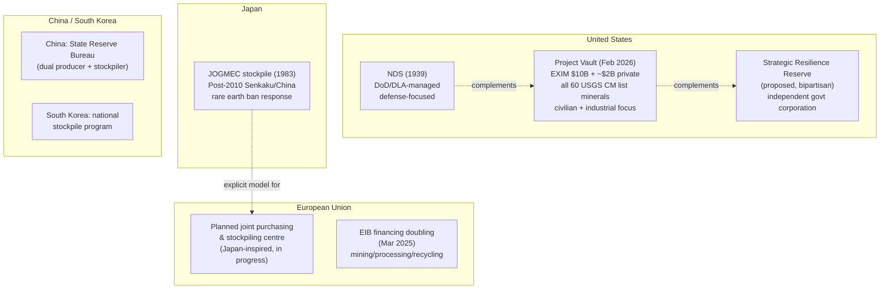

## National stockpiling strategies and strategic reserves

### Conceptual Overview

Stockpiling is a supply-security policy tool distinct from mining diversification or refining-capacity investment: rather than changing *where* a mineral is produced, it changes *how much buffer* exists between a supply disruption and its impact on downstream industry. Stockpiling strategies vary substantially by country in scope (defense-only vs. civilian-industry-inclusive), funding mechanism (direct government purchase vs. public-private partnership), and governing institution.

**Key Points**

- The U.S., Japan, South Korea, and China maintain mineral stockpiles; the European Union is currently in the process of establishing one, explicitly citing the Japanese model as inspiration.
- Stockpiling is increasingly paired with — rather than substituted for — mining and processing investment, reflecting a recognition that new capacity takes years to come online while stockpiles can be built comparatively faster as a bridging measure.
- A significant institutional shift is underway in the U.S. and allied countries: moving from purely defense-oriented stockpiles toward stockpiles explicitly designed to serve **civilian industrial and economic security**, not just military readiness — a change with direct bearing on the critical-vs-strategic mineral distinction covered elsewhere in this chapter.

### United States — National Defense Stockpile (NDS)

**Legal and institutional basis**

- Statutorily created in 1939 under the Strategic and Critical Materials Stock Piling Act, the NDS is the federal government's original mechanism to acquire and maintain stocks of "strategic and critical materials."
- Purpose: foster development of domestic sources of these materials and prevent dependence on foreign sources during national emergencies.
- Managed as a Department of Defense subagency function (Defense Logistics Agency, DLA), which has been investing in advanced data analytics to improve demand forecasting, scenario analysis, and risk mitigation for its critical-minerals acquisition activities.

**Recent expansion proposals and initiatives (2025–2026)**

- **Congressional proposals**: bipartisan proposals for a **Strategic Resilience Reserve (SRR)** for critical minerals have been introduced in both houses of Congress, proposing an independent government corporation to manage purchase and storage of the reserve — a structural departure from the DoD-subagency model of the original NDS.
- **Project Vault** (announced 2 February 2026 by the Trump administration): a public-private initiative to stockpile key critical minerals for American companies, explicitly designed to protect against supply-chain disruptions. Structurally compared to the Strategic Petroleum Reserve model, but for critical minerals rather than oil.
  - Backed by the U.S. Export-Import Bank (EXIM) with a **$10 billion** commitment — described as the largest commitment in EXIM's history — plus approximately $2 billion in private capital, per some reporting.
  - Covers **all 60 minerals** on the USGS 2025 Critical Minerals List.
  - Initial focus minerals reported to include rare earth elements, aluminum, antimony, copper, germanium, silver, and zirconium.
  - Funding mechanism: EXIM provides long-term loans, complemented by private capital, to procure and store minerals; manufacturers pay a **commitment fee** to secure access to the reserve, which offsets stockpiling costs — a self-sustaining financing structure distinct from the NDS's direct-appropriation model.
  - Framed explicitly as a market-signaling mechanism: by becoming a large, creditworthy buyer of allied (non-Chinese) production, the U.S. aims to reward and incentivize non-Chinese supply development.
- **Separate $12 billion initiative**: the Trump administration also announced a distinct $12 billion critical minerals stockpile initiative accessible to private industry, with initial financing from both private institutional investors and the U.S. government. [Unverified: the precise relationship between this $12 billion initiative and the $10 billion Project Vault EXIM commitment — whether overlapping, sequential, or entirely separate programs — is not fully clarified across the sources reviewed.]

**Policy trajectory**

- Federal stockpiling efforts are expected to further accelerate through 2026 and beyond, with the current administration treating stockpiling as one of its core sustained policy tools and actively calling on partner countries to adopt similar approaches.
- A presidential directive has called for development of a common application system across federal agencies for critical-minerals-related programs, aimed at improving interagency coordination.
- Policy analysis (Council on Foreign Relations) recommends the U.S. pursue a combined strategy: expand and modernize the NDS, establish the proposed Strategic Resilience Reserve for commercial mineral needs, expand private-sector collaboration through Project Vault, and explore plurilateral agreements to scale trusted supply sources — reflecting an assessed need for multiple complementary mechanisms rather than a single stockpile structure.

### Japan — The Model Others Are Emulating

**Key Points**

- Japan's critical mineral stockpiling project was formalized in **1983** as a cooperative system, making it one of the longest-running national mineral stockpiling programs among major economies.
- Japan recognized its mineral vulnerability earlier than most other countries through the **2010 Senkaku Islands dispute with China**, which led to an abrupt Chinese export ban on rare earth elements — a formative event that has shaped Japanese stockpiling and diversification policy for over a decade and is frequently cited as the template case for rare-earth weaponization risk.
- Japan's stockpiling approach is administered in coordination with JOGMEC (Japan Organization for Metals and Energy Security) and has become influential enough that the **European Commission has explicitly cited it as the inspiration** for the EU's own planned joint purchasing and strategic stockpiling centre for critical raw materials (per EC Industry Commissioner Stéphane Séjourné).

### European Union — Building Toward a Stockpile

- The EU does not yet operate a mature, centralized strategic mineral stockpile comparable to the U.S. NDS or Japan's system, but is actively in the process of establishing one.
- The European Commission has announced intent to create a **joint purchasing and strategic stockpiling centre** for critical raw materials, modeled on Japan's approach.
- Complementary financing mechanism: in March 2025, the European Investment Bank (EIB) pledged to **double its financing** for critical raw materials projects — rather than pursuing direct government ownership of stockpiled material (the U.S./Japan model), Brussels has so far leaned more heavily on **channeling investment capital into mining, processing, and recycling projects** via the EIB, reflecting a somewhat different institutional philosophy (enabling private/allied capacity vs. direct government stockpile ownership) even as the stockpiling-centre concept develops in parallel.

### China and South Korea

- China maintains its own mineral stockpiles, administered through mechanisms including the **State Reserve Bureau**, though China's stockpiling operates within a broader context where China is simultaneously the dominant global producer/processor and net exporter-under-license of many of these same materials — a structurally different position from import-dependent stockpiling countries.
- South Korea maintains a mineral stockpile program as well, though detailed 2025–2026 programmatic specifics were not covered in the sources reviewed for this entry. [Inference: given South Korea's identified exposure to Chinese rare-earth and critical-material export licensing (noted in the allied-coordination topic in this course), South Korean stockpiling policy plausibly parallels Japan's risk-driven rationale, though this connection is not explicitly confirmed in the sources reviewed here.]

### Diagram — National Stockpiling Architecture Comparison (svg_diagram)

### International Coordination and Plurilateral Frameworks

Stockpiling is increasingly pursued in tandem with bilateral and plurilateral supply-chain agreements rather than as a purely unilateral national policy:

- **U.S.-Japan Critical Minerals Action Plan** (announced 19 March 2026): seeks to develop a plurilateral trade initiative in strategic minerals, supported by border-adjusted price floors; the two countries agreed to work toward co-developing methods for mining, processing, **and stockpiling** critical minerals jointly.
- **EU-Japan-U.S. trilateral commitment**: the parties committed to finalize, within 30 days of the announcement, a memorandum of understanding to identify and support projects in mining, refining, processing, and recycling of strategic minerals.
- **Critical Minerals Ministerial (4–5 February 2026)**: produced bilateral critical minerals agreements with 11 countries and launched the **Forum on Resource Geostrategic Engagement (FORGE)**. Japan signed enhanced cooperation pacts with the U.S. focused specifically on rare earth elements, lithium, cobalt, nickel, and graphite.
- **U.S.-Japan framework details** (per Columbia University CGEP analysis): the agreement covers joint project financing, stockpiling, investment guarantees, and establishment of a **bilateral Rapid Response Group** to address supply-chain disruptions — described as a first-time move by the two allies from rhetorical commitment to a genuine common framework, though analysts note results will depend heavily on implementation.
- **India's parallel efforts**: in August 2025, India and Japan signed a memorandum of cooperation on critical minerals providing for exchange of information on respective stockpiling efforts; in March 2026, India and Canada issued a joint statement with Canada committing to support India's stockpiling initiative — illustrating stockpiling cooperation extending beyond the core U.S.-Japan-EU axis.
- **Trump administration trade-policy directive**: in January 2026, a presidential proclamation instructed cabinet members to pursue trade agreement negotiations specifically aimed at protecting national security by ensuring adequate critical-minerals supply and mitigating vulnerabilities as quickly as possible — providing the policy mandate underlying the subsequent February 2026 ministerial agreements.

### Risks and Operational Challenges of Stockpiling

**Key Points**

- **Physical/chemical degradation risk**: stockpiled minerals may be vulnerable to degradation, contamination, or hazardous leakage depending on the specific mineral's chemical properties, form (raw ore, refined oxide, metal, or compound), and storage duration — requiring constant monitoring rather than passive storage.
- **Security risk**: stockpile facilities and their associated inventory-management systems may be targets of physical attacks or cyberattacks, including on Supervisory Control and Data Acquisition (SCADA) systems used to monitor and manage stockpile inventories.
- **Cost and opportunity-cost tradeoffs**: stockpiling ties up capital in stored material rather than productive investment, and commitment-fee or loan-repayment structures (as in Project Vault) shift some of this cost onto participating manufacturers rather than solely the government, which is itself a design choice affecting the reserve's accessibility and pricing effects on the broader market. [Inference: this cost-shifting design likely reflects a policy judgment that program self-sustainability improves political durability across administrations, though this rationale is not explicitly stated in the sources reviewed.]
- **Effectiveness depends on scope match**: a stockpile calibrated for defense-emergency use (small volumes, narrow mineral list, slow release procedures) is not automatically well-suited to buffering civilian industrial supply shocks (which may require faster release, larger volumes, and broader mineral coverage) — the shift toward Project Vault-style civilian-inclusive stockpiling reflects an explicit response to this scope mismatch in the legacy NDS model.

### Illustrative Example — Comparing Stockpile Purposes

| Program | Primary purpose | Release trigger | Scope |
| --- | --- | --- | --- |
| U.S. NDS (1939) | Military/defense readiness in national emergency | Formal national-emergency determination | Narrower, defense-relevant materials list |
| Project Vault (2026) | Civilian industrial/economic security | Commercial access via commitment fee | All 60 USGS-listed critical minerals |
| Japan JOGMEC stockpile (1983) | Broad economic security post-2010 shock | Policy-determined, informed by decades of experience | Primarily rare earths and related materials |
| EU planned centre | Joint EU-wide purchasing power and buffer | Not yet operational — under design | Modeled on Japan; scope still developing |

### Related Topics

- Defining critical and strategic minerals (classification underlying stockpile scope decisions)
- China's export controls on rare earths, gallium, and germanium (the triggering risk stockpiles aim to buffer)
- Japan's 2010 Senkaku Islands rare-earth export ban as the formative stockpiling case study
- U.S. Export-Import Bank financing mechanisms for critical minerals
- The Forum on Resource Geostrategic Engagement (FORGE) and multilateral coordination bodies
- USGS 2025 Critical Minerals List (60-mineral scope underlying Project Vault)
- Border-adjusted price floors as a complementary market-support mechanism (see also MP Materials price-floor arrangement)
- Direct lithium extraction (DLE) technical cooperation under the US-Japan framework
- G7 critical minerals stockpiling proposals
- Strategic Petroleum Reserve as an institutional analogy for mineral stockpile design