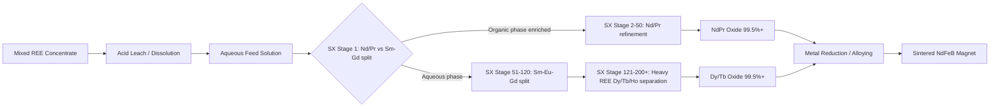

## Mining, Midstream Processing, and the Refining Bottleneck

### Overview: Where the Chokepoint Actually Sits

Critical minerals supply chains run through four broad stages: **exploration/mining** (extracting ore), **beneficiation** (concentrating ore into a marketable concentrate), **midstream processing/refining** (chemical separation into individual high-purity elements or compounds), and **downstream manufacturing** (alloys, magnets, cathodes, components). Popular discourse conflates "mining dominance" with the actual chokepoint, but the technical and geopolitical literature is consistent: geology is relatively distributed, while separation chemistry is not. The West's challenge isn't mining — it's separation and refining, with China controlling roughly 90% of global rare earth refining. The greatest bottleneck in rare earth elements processing lies in the difficulty of separating and refining elements that are typically found together in the same ore, since adjacent lanthanides exhibit nearly identical chemical behaviors. [rareearthexchanges](https://rareearthexchanges.com/news/the-midstream-trap-why-rare-earth-separation-is-the-hardest-problem-the-west-hasnt-solved/)[discoveryalert](https://discoveryalert.com.au/rare-earth-elements-processing-capacity-2026-development/)

---

### Stage 1: Mining and Beneficiation

**What happens here:**

- Ore extraction (open-pit or underground) from carbonatite, ion-adsorption clay, monazite/xenotime placer, or brine/laterite deposits (for lithium, nickel, cobalt).
- Crushing, grinding, and physical/chemical beneficiation (flotation, magnetic/gravity separation, leaching) to produce a **concentrate** — e.g., mixed rare earth carbonate/oxide at 40–70% total rare earth oxide (TREO), or spodumene concentrate at ~6% Li₂O.

**Why this stage is comparatively less bottlenecked:**

- Rare earth and critical mineral deposits are geographically dispersed — Australia, Brazil, Vietnam, the United States, Canada, Greenland, Africa, and elsewhere all hold economically relevant reserves.
- Capital intensity and permitting timelines (typically 7–15 years for a new mine in OECD jurisdictions) are real constraints, but they are not chemistry-limited the way midstream is.

**Key Points**

- Mining produces a *concentrate*, not a usable industrial input. A mine cannot ship battery-grade lithium hydroxide or 99.5%-pure neodymium oxide directly.
- China accounted for 69.5% of 2025 mine production — high, but structurally lower than its midstream share, illustrating that mining concentration is a policy/investment artifact more than a geological necessity. [rareearthexchanges](https://rareearthexchanges.com/news/china-rare-earth-refining-dominance/)
- Co-production complexity: many critical minerals are byproducts of other metals (e.g., cobalt from copper/nickel mining, gallium/germanium from bauxite/zinc refining), which decouples supply response from price signals for the "main" metal.

---

### Stage 2: Midstream Processing (Separation and Refining)

This is the structural chokepoint. It converts a mixed concentrate into individually separated, high-purity elements or compounds suitable for magnet, battery, or semiconductor manufacturing.

**Core technical challenge — solvent extraction cascades:**

Rare earths (the lanthanide series, plus yttrium and scandium) share near-identical ionic radii and +3 oxidation states, making them chemically similar and extremely difficult to separate by conventional means. Separation requires hundreds of extraction stages and deep expertise that China has mastered over decades while Western nations offshored this "messy" process. [rareearthexchanges](https://rareearthexchanges.com/news/rare-earth-refining-bottleneck-why-china-leads-and-the-u-s-lags/)

The dominant industrial method is **liquid-liquid solvent extraction (SX)**:

1. Dissolve the concentrate in acid (typically HCl or H₂SO₄) to form an aqueous feed solution of mixed rare earth chlorides/sulfates.
2. Contact the aqueous phase with an organic extractant (commonly **P507 / HEHEHP**, or **D2EHPA**) dissolved in kerosene.
3. Because adjacent lanthanides have marginally different partition coefficients between the aqueous and organic phases, repeated countercurrent mixer-settler stages progressively enrich one element in one phase.
4. This cascade is repeated across **hundreds of stages** (sometimes 100–200+ mixer-settlers per separation train) to achieve >99.5% purity for a single element such as dysprosium or terbium.
5. Downstream: reduction to metal (calciothermic or electrolytic reduction, e.g., molten salt electrolysis for Nd metal) and alloying.

$$\text{REE}^{3+}_{(aq)} + 3\overline{\text{HA}}_{(org)} \rightleftharpoons \overline{\text{REA}_3}_{(org)} + 3\text{H}^+_{(aq)}$$

Because separation factors between adjacent lanthanides (e.g., Nd/Pr, or the heavy REEs Dy/Tb/Ho) are close to 1, achieving commercial purity requires enormous stage counts, tight process control, and continuous optimization — this is the "messy," capital- and labor-intensive expertise China has accumulated since the 1980s.

**Key Points**

- China controls roughly 50–70% of global D2EHPA production and 70–90% of P507-type extractant production — meaning even a non-Chinese separation plant is often dependent on Chinese-made reagents, a second-order chokepoint. [rareearthexchanges](https://rareearthexchanges.com/news/rare-earth-separation-is-the-real-chokepoint/)
- Processing *equipment* itself — mixer-settlers, precision instrumentation — is also concentrated in China, a bottleneck within the bottleneck. [mapshock](https://www.mapshock.com/briefings/china-rare-earth-processing-dominance-western-supply-chain)
- Heavy rare earths (Dy, Tb, Ho, Er, Yb, Lu) are far harder to separate than light rare earths (La, Ce, Nd, Pr) due to smaller ionic radius differences, requiring more stages. China controls roughly 98% of heavy rare earth separation specifically. [rareearthexchanges](https://rareearthexchanges.com/news/the-midstream-trap-why-rare-earth-separation-is-the-hardest-problem-the-west-hasnt-solved/)
- Alternative separation chemistries under active development (ionic liquids, membrane solvent extraction, bio-adsorption/biosorption using engineered microbes, and continuous chromatographic separation) aim to cut stage counts, solvent volumes, and energy use, but remain pre-commercial or early-commercial scale as of 2026.

---

### The Refining Bottleneck: Scale and Concentration Data

| Metric | China's Share | Source Context |
| --- | --- | --- |
| Global rare earth processing/refining capacity (2024) | >90% | S&P Global, Jan 2026 |
| Global refined REE output (2024) | ~92% | PRISMA literature review |
| Rare earth processing share (2025, per IEA) | 85%, down from over 90% in 2023 | IEA 2026 Outlook |
| High-strength magnet production | ~90% / 94% (2024) | Multiple |
| Heavy rare earth separation | ~99% | Industry estimate |
| Top 3 refining countries (China, Indonesia, DRC), all critical minerals | ~86% of global refining capacity (2024), up from 82% in 2020 | IEA 2025 Global Critical Minerals Outlook |
| Projected China refining share by 2040 (rare earths) | ~75% | PRISMA literature review |

**Why concentration is *increasing* in some metrics, not decreasing:** The top-three-country refining share rose from 82% in 2020 to 86% in 2024, even as diversification efforts intensified — new demand growth (EVs, wind, defense, AI-hardware-adjacent magnetics) is outpacing the rate at which non-Chinese midstream capacity comes online. [discoveryalert](https://discoveryalert.com.au/rare-earth-elements-processing-capacity-2026-development/)

---

### The Capacity Gap: Announced vs. Dependable Supply

A critical analytical distinction in 2026 industry coverage is between **announced/nameplate capacity** and **dependable, spec-compliant, at-scale output**.

- The IEA confirmed that even if all announced projects outside China deliver on schedule, planned refining capacity would cover only two-thirds of expected mine output by 2035, and downstream magnet production would cover just one-third. [mapshock](https://www.mapshock.com/briefings/china-rare-earth-processing-dominance-western-supply-chain)
- A plant being built does not guarantee nameplate output, spec-compliant oxide, or finished magnets — the full value chain remains the critical challenge. [rareearthexchanges](https://rareearthexchanges.com/news/western-rare-earth-separation-independence/)
- [Inference] This gap implies that even successful Western mine diversification could leave concentrate stranded without a buyer, or force continued reliance on Chinese tolling/refining services, unless midstream investment scales proportionally.
- The West faces a severe workforce gap, with only dozens of experts in rare earth separation compared to China's large trained cohort, constraining how fast new plants can be staffed and ramped even when capital is available. [rareearthexchanges](https://rareearthexchanges.com/news/breaking-chinas-stranglehold-on-rare-earth-refining/)

---

### Western and Allied Midstream Buildout (Illustrative Landscape, 2026)

| Company/Facility | Location | Segment | Status Notes |
| --- | --- | --- | --- |
| Lynas Rare Earths | Australia / Malaysia | Light + some heavy REE separation | Only major non-China separator; heavy REE capacity limited, with Japan holding priority access |
| MP Materials | USA (Mountain Pass) | Mining + growing separation/magnet capacity | Vertically integrating toward magnets |
| Carester (Caremag) | France | Heavy REE concentrates | 2026 target of ~5,000 t/year concentrates |
| Neo Performance Materials | Estonia | Heavy REE separation | Small but operational |
| Iluka Resources | Australia | Mineral sands / REE refinery | Ramping refinery capacity |
| Energy Fuels | USA | Monazite processing | Diversifying uranium byproduct stream into REE |
| Solvay | France | Separation (legacy La Rochelle site) | Established European capability |
| Shin-Etsu Chemical | Vietnam | Separation facility | Japanese-invested regional midstream footprint |
| ReElement Technologies | USA | Chromatographic separation | Pivoted from an $80 million Pentagon loan structure to a $25 million equity stake, signaling execution at lower scale than announced |

**Timeline reality:** Most Western separation projects target 2026–2028 commissioning, with full ramp to stable production requiring an additional 2–4 years, meaning the majority reach real scale around 2030; heavy REE scaling takes even longer. [rareearthexchanges](https://rareearthexchanges.com/news/the-midstream-trap-why-rare-earth-separation-is-the-hardest-problem-the-west-hasnt-solved/)

---

### Process Flow Diagram (svg_diagram)

<svg xmlns="http://www.w3.org/2000/svg" viewBox="0 0 900 460">
<rect width="900" height="460" fill="#ffffff" />
<text x="450" y="28" font-size="18" font-weight="bold" text-anchor="middle" fill="#1a1a1a">Critical Minerals Value Chain: Mining to Magnet (svg_diagram)</text>
<rect x="20" y="70" width="160" height="80" rx="8" fill="#e8f0fe" stroke="#4472c4" stroke-width="2" />
<text x="100" y="100" font-size="13" text-anchor="middle" font-weight="bold">Mining</text>
<text x="100" y="118" font-size="11" text-anchor="middle">Ore extraction</text>
<text x="100" y="134" font-size="11" text-anchor="middle">Beneficiation</text>
<rect x="220" y="70" width="160" height="80" rx="8" fill="#fff2cc" stroke="#d6a000" stroke-width="2" />
<text x="300" y="100" font-size="13" text-anchor="middle" font-weight="bold">Concentrate</text>
<text x="300" y="118" font-size="11" text-anchor="middle">40-70% TREO</text>
<text x="300" y="134" font-size="11" text-anchor="middle">or 6% Li2O etc.</text>
<rect x="420" y="60" width="220" height="100" rx="8" fill="#fce4e4" stroke="#c0392b" stroke-width="3" />
<text x="530" y="85" font-size="13" text-anchor="middle" font-weight="bold" fill="#c0392b">MIDSTREAM BOTTLENECK</text>
<text x="530" y="103" font-size="11" text-anchor="middle">Solvent extraction cascade</text>
<text x="530" y="119" font-size="11" text-anchor="middle">100-200+ SX stages</text>
<text x="530" y="135" font-size="11" text-anchor="middle">China: ~90% capacity</text>
<rect x="680" y="70" width="180" height="80" rx="8" fill="#e2f0d9" stroke="#548235" stroke-width="2" />
<text x="770" y="100" font-size="13" text-anchor="middle" font-weight="bold">Refined Oxide/Metal</text>
<text x="770" y="118" font-size="11" text-anchor="middle">99.5%+ purity</text>
<text x="770" y="134" font-size="11" text-anchor="middle">single element</text>
<line x1="180" y1="110" x2="215" y2="110" stroke="#333" stroke-width="2" marker-end="url(#arrow)" />
<line x1="380" y1="110" x2="415" y2="110" stroke="#333" stroke-width="2" marker-end="url(#arrow)" />
<line x1="640" y1="110" x2="675" y2="110" stroke="#333" stroke-width="2" marker-end="url(#arrow)" />
<rect x="420" y="200" width="220" height="140" rx="8" fill="#fdf2f2" stroke="#c0392b" stroke-width="1.5" stroke-dasharray="4,3" />
<text x="530" y="222" font-size="12" text-anchor="middle" font-weight="bold">Why It's Hard</text>
<text x="530" y="242" font-size="10.5" text-anchor="middle">Lanthanides share near-identical</text>
<text x="530" y="257" font-size="10.5" text-anchor="middle">ionic radii &amp; +3 oxidation state</text>
<text x="530" y="277" font-size="10.5" text-anchor="middle">Separation factor per stage ~1.0-1.5</text>
<text x="530" y="297" font-size="10.5" text-anchor="middle">Requires countercurrent cascades</text>
<text x="530" y="317" font-size="10.5" text-anchor="middle">of mixer-settlers, tight control</text>
<line x1="530" y1="160" x2="530" y2="196" stroke="#c0392b" stroke-width="1.5" marker-end="url(#arrow2)" />
<rect x="20" y="380" width="860" height="60" rx="8" fill="#f2f2f2" stroke="#888" stroke-width="1" />
<text x="450" y="404" font-size="11.5" text-anchor="middle" font-weight="bold">Second-order chokepoints: extractant chemicals (P507/D2EHPA), separation equipment,</text>
<text x="450" y="422" font-size="11.5" text-anchor="middle" font-weight="bold">and trained metallurgical/process-engineering labor — all also concentrated in China</text>
</svg>

---

### Geopolitical Dynamics Layered on the Technical Bottleneck

- **Export controls as leverage:** China has used licensing requirements and targeted restrictions (including measures affecting Japan) as trade-policy tools. Chinese trade measures targeting Japan present another bottleneck for buyers looking to diversify away from China, since Japan represents the next-largest processing nation after China. [azomining](https://www.azomining.com/Article.aspx?ArticleID=1940)
- **Demand-absorption risk:** China is expanding recycling and circular-economy systems, tightening export controls, and prioritizing domestic consumption — at some point China may consume most of its own capacity, leaving the West with no immediate fallback, especially for heavy rare earths. [rareearthexchanges](https://rareearthexchanges.com/news/the-midstream-trap-why-rare-earth-separation-is-the-hardest-problem-the-west-hasnt-solved/)
- **State-backed diplomacy:** In March 2026, the United States signed a letter of intent with Australia's Lynas Rare Earths for a supply agreement, reflecting a broader pattern of allied government-to-company offtake and investment agreements intended to de-risk midstream projects that private capital alone would not finance at required speed. [azomining](https://www.azomining.com/Article.aspx?ArticleID=1940)
- **Magnet gap as the deepest chokepoint:** The IEA's 2026 Outlook identifies the magnet-production gap — not the refining gap — as where China's leverage is most durable and least addressed by current Western investment, since magnet manufacturing (sintering, pressing, coating rare-earth permanent magnets) has received comparatively less Western capital than raw separation. [mapshock](https://www.mapshock.com/briefings/china-rare-earth-processing-dominance-western-supply-chain)

---

### Illustrative Rare Earth Separation Cascade (Simplified)

---

### Practical Example: Neodymium-Praseodymium (NdPr) Separation Economics

- Input: bastnäsite or monazite concentrate at ~60% TREO, of which NdPr may represent 20-25%.
- After leaching and initial cracking, the mixed chloride/sulfate solution enters an SX train targeting NdPr separation from Ce/La (lights) and Sm-Gd (mediums).
- Because Nd and Pr have very close separation factors relative to each other, commercial NdPr oxide is often sold as a **combined NdPr oxide** (didymium) rather than split further, since additional stages to separate Nd from Pr individually add cost disproportionate to the value gained for most magnet applications.
- [Inference] This is a practical illustration of how separation-stage economics — not just chemistry — determine what "purity SKU" reaches the market, and why heavy REE products (which require full individual-element separation for magnet dopants) command a larger cost and capability premium than light REE products.

---

### Environmental and Regulatory Dimension

- REE processing can generate hazardous and radioactive waste (notably thorium and uranium co-occurring in monazite), complicating the clean-energy narrative for the EVs and wind turbines that rare earth magnets enable. [rareearthexchanges](https://rareearthexchanges.com/news/china-rare-earth-refining-dominance/)
- Western permitting regimes for tailings management, radioactive waste disposal, and wastewater treatment add years to midstream project timelines relative to historical Chinese buildout speed — a structural, not merely financial, source of the capacity lag. [Inference]

---

**Related Topics**

- Rare earth magnet manufacturing gap and NdFeB/SmCo supply chains
- Ionic liquid and bio-adsorption separation technologies as alternatives to solvent extraction
- China's export licensing regime and critical mineral trade weaponization
- Lithium and cobalt midstream refining concentration (compare/contrast with rare earths)
- Allied "friend-shoring" and offtake agreement structures (Lynas-US, Quad critical minerals initiatives)
- Recycling and urban mining as a midstream capacity supplement
- Byproduct metal supply chains (gallium, germanium, antimony) and co-dependency on base-metal refining
- Strategic stockpiling policy (US NDS, EU Critical Raw Materials Act reserves)