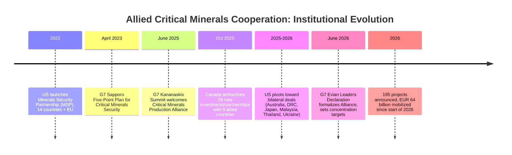

## Allied Minerals Partnerships and Co-Investment Frameworks

### Overview: From Multilateral Alliances to Bilateral Deals

Allied minerals partnerships are institutional and financial mechanisms through which democratic, market-economy governments coordinate investment, offtake agreements, and standards to build critical mineral and rare earth supply chains outside Chinese-dominated mining, midstream, and magnet production. This chapter area has evolved rapidly since 2022, shifting from a narrow forecasting/coordination mandate under the G7 to instruments that now mobilize tens of billions of euros in actual project financing, equity stakes, and offtake commitments. The most consequential development in critical minerals today is arguably not geological but geopolitical: the emergence of an international alliance architecture dedicated to securing critical mineral supply chains, sometimes described informally as a "critical minerals NATO."

**Key Points**

- Two parallel tracks coexist: **multilateral frameworks** (G7-anchored, consensus-based) and **bilateral agreements** (primarily US-led, faster but narrower in scope).
- The core policy tool is *concentration-risk reduction*, not self-sufficiency — targets are framed as reducing dependency below a percentage threshold, not eliminating it.
- Financing mechanisms increasingly combine public capital (export credit, equity stakes, offtake guarantees) with private investment to bridge the "bankability gap" that has historically stalled non-Chinese midstream projects.

---

### Timeline of Institutional Evolution

---

### Track 1: The Minerals Security Partnership (MSP)

Launched by the United States in 2022 to accelerate the development of diverse critical minerals supply chains in cooperation with industry and allied governments, the MSP brought together 14 countries and the European Union. It aligned with the "friend-shoring" strategy of diversifying supply chains by relocating key manufacturing capacity away from China and toward allied economies.

**Assessment:** Despite high-level backing, IEA data indicates that China's market share in critical mineral processing continued to increase in the years following the MSP's launch — a widely cited critique that the framework produced coordination and visibility but insufficient capital mobilization to actually shift midstream concentration. [Inference] This performance gap is a key reason later frameworks (the G7 Critical Minerals Production Alliance, bilateral US deals) have placed heavier emphasis on binding financial commitments rather than coordination alone.

---

### Track 2: G7 Critical Minerals Production Alliance

**Origins and Structure:**

In June 2025 at the G7 Leaders' Summit in Kananaskis, Alberta, G7 partners welcomed the Critical Minerals Production Alliance, a Canada-led initiative that works with trusted international partners to foster secure, resilient critical minerals supply chains and to counter market concentration and manipulation. The Alliance is represented by Envoys from each G7 country (e.g., Canada's Isabella Chan of Natural Resources Canada; the US's David Copley, Special Assistant to the President for Global Supply Chain; Japan's Hiroyuki Hatada of METI; France's Benjamin Gallezot, Interministerial Delegate for Critical Minerals), who work to accelerate project development, strengthen global supply chains, and advance sustainable resource development by leveraging sovereign tools and fostering high-standard partnerships.

**Formalization at Evian (June 2026):**

At the G7 Leaders' Summit in Evian, France on June 17, 2026, G7 members consented to strengthen and deepen the Critical Minerals Production Alliance, establishing a formal framework for cooperation among G7 members and like-minded non-G7 partners (termed "G7+"). The declaration deliberately avoided naming China explicitly, instead referencing concerns about non-market policies, economic coercion, arbitrary export restrictions, and retaliatory measures on critical minerals and dual-use items.

**Concentration-Reduction Policy Targets (Evian Declaration):**

| Policy Target | Detail |
| --- | --- |
| Single-supplier concentration cap | Reduce dependency on a single supplier outside G7/partner countries for rare earths and permanent magnets to under 60% by 2030 |
| Longer-term concentration goal | Reduce further over time, with an ambition to reach 50% as soon as practicable |
| Initial pilot minerals | Lithium and nickel |
| Annual expansion rate | Five additional minerals added to scope per year |
| Special priority category | Rare earths |

**Key Points**

- The 60%-by-2030 target is notable for what it is *not*: not a zero-dependency goal, and not China-specific by name — reflecting a pragmatic acknowledgment that full decoupling is not achievable within the stated timeframe.
- Leaders welcomed progress through 195 projects announced since the beginning of 2026 that have reached EUR 64 billion of investment, including equity participation and offtake agreements, in critical minerals value chains from G7 and partner countries, alongside a joint plan for developing industrial capacities for rare earth and permanent magnets.
- On financing, the G7 recognized that developing industrial capacity — including processing and recycling — necessary for diversification requires mobilization of both public and private capital, including equity investments, and improved traceability and transparency regarding the origin of critical minerals, starting with pilot programs.

---

### First-Round Project Financing Examples (G7 Critical Minerals Production Alliance)

Illustrative of how the Alliance translates policy into transactions — combining export credit, offtake, and multilateral co-financing:

| Project | Location | Financing Mechanism |
| --- | --- | --- |
| Vianode Synthetic Graphite Plant | St. Thomas, Ontario, Canada | Letters of interest for financing up to US$500 million (Canada, Germany); offtake agreement with GM (US); export credit support up to US$300 million |
| Northern Graphite | Quebec, Canada | Offtake/toll processing agreement with Alkeemia (Italy); pilot plant and technology support for purification in Canada, France, and Italy |
| Nouveau Monde Graphite | Canada | Offtake arrangement directly with the Government of Canada |
| Rio Tinto (scandium) | Canada | Offtake arrangement directly with the Government of Canada |

The Government of Canada, as part of the G7 Critical Minerals Action Plan (CMAP), also highlighted up to $20.2 million in support of projects developed in collaboration with international partners to advance innovation in critical minerals research and development, and signaled intent to leverage the Defence Production Act to stockpile strategic minerals.

**Example — Anatomy of a G7-Backed Deal:**

The Vianode project illustrates the typical co-investment structure: (1) bilateral government letters of interest providing capital certainty, (2) a private offtake agreement (GM) that guarantees a buyer and revenue stream, and (3) export credit agency support that de-risks debt financing — a layered public-private model designed specifically to solve the "bankability gap" that has historically prevented Western midstream projects from reaching final investment decision despite strong policy rhetoric.

---

### Track 3: US Bilateral Agreements (Post-2025 Pivot)

A distinct and faster-moving track emerged as the second Trump administration reshaped US critical minerals diplomacy: the US has moved quickly to conclude bilateral critical minerals partnership agreements with partners including Australia, the Democratic Republic of the Congo, Japan, Malaysia, Thailand, and Ukraine. This bilateral approach represents a departure from Biden-era efforts to build multilateral alliances of like-minded states through initiatives such as the Minerals Security Partnership anchored in the G7.

**Key Points**

- Bilateral deals can move faster than consensus-based multilateral frameworks, since they require agreement between only two governments rather than coordination across the full G7+ membership.
- [Inference] The trade-off is scale and standardization: bilateral deals may better serve specific, urgent supply needs (e.g., a defense-critical mineral from a single partner) but do not by themselves build the broader, interoperable standards and traceability architecture that a multilateral framework like the G7 Alliance is designed to establish.
- Example: the March 2026 US-Japan Memorandum of Cooperation establishing a joint working group on deep sea mineral resource development (see the deep sea mining topic) is itself a bilateral instrument operating in parallel with, not as part of, the G7 Alliance structure.

---

### Track 4: Emerging Multilateral Initiatives Beyond the G7

A newer initiative, the Forum on Resource Geostrategic Engagement, represents continued efforts at multilateralism in the critical minerals sector alongside the established G7 architecture, reflecting an ongoing pattern of institutional proliferation as different governments and blocs experiment with coordination models. [Unverified] Specific structural details of this forum's mandate and membership were not fully available in current search results and should be verified against primary sourcing before being treated as settled.

---

### Structural Diagram: Co-Investment Architecture (svg_diagram)

<svg xmlns="http://www.w3.org/2000/svg" viewBox="0 0 900 460">
<rect width="900" height="460" fill="#ffffff" />
<text x="450" y="28" font-size="17" font-weight="bold" text-anchor="middle" fill="#1a1a1a">Allied Minerals Co-Investment Architecture (svg_diagram)</text>
<rect x="30" y="60" width="250" height="90" rx="8" fill="#e8f0fe" stroke="#4472c4" stroke-width="2" />
<text x="155" y="85" font-size="13" text-anchor="middle" font-weight="bold">Multilateral Track</text>
<text x="155" y="103" font-size="10.5" text-anchor="middle">G7 Critical Minerals</text>
<text x="155" y="118" font-size="10.5" text-anchor="middle">Production Alliance (2025-26)</text>
<text x="155" y="133" font-size="10.5" text-anchor="middle">Successor to MSP (2022)</text>
<rect x="325" y="60" width="250" height="90" rx="8" fill="#fff2cc" stroke="#d6a000" stroke-width="2" />
<text x="450" y="85" font-size="13" text-anchor="middle" font-weight="bold">Bilateral Track</text>
<text x="450" y="103" font-size="10.5" text-anchor="middle">US deals: Australia, DRC,</text>
<text x="450" y="118" font-size="10.5" text-anchor="middle">Japan, Malaysia, Thailand,</text>
<text x="450" y="133" font-size="10.5" text-anchor="middle">Ukraine (2025-26 pivot)</text>
<rect x="620" y="60" width="250" height="90" rx="8" fill="#e2f0d9" stroke="#548235" stroke-width="2" />
<text x="745" y="85" font-size="13" text-anchor="middle" font-weight="bold">National Instruments</text>
<text x="745" y="103" font-size="10.5" text-anchor="middle">Defence Production Act</text>
<text x="745" y="118" font-size="10.5" text-anchor="middle">stockpiling, export credit</text>
<text x="745" y="133" font-size="10.5" text-anchor="middle">agencies, sovereign equity</text>
<line x1="155" y1="150" x2="155" y2="190" stroke="#333" stroke-width="1.5" marker-end="url(#arrowB)" />
<line x1="450" y1="150" x2="450" y2="190" stroke="#333" stroke-width="1.5" marker-end="url(#arrowB)" />
<line x1="745" y1="150" x2="745" y2="190" stroke="#333" stroke-width="1.5" marker-end="url(#arrowB)" />
<rect x="130" y="195" width="640" height="80" rx="8" fill="#fdebd0" stroke="#e67e22" stroke-width="2" />
<text x="450" y="220" font-size="13" text-anchor="middle" font-weight="bold">Blended Financing Mechanisms</text>
<text x="450" y="240" font-size="10.5" text-anchor="middle">Government letters of interest + export credit support</text>
<text x="450" y="257" font-size="10.5" text-anchor="middle">+ private offtake agreements (e.g., automaker, OEM buyers)</text>
<line x1="450" y1="275" x2="450" y2="315" stroke="#333" stroke-width="1.5" marker-end="url(#arrowB)" />
<rect x="130" y="320" width="640" height="80" rx="8" fill="#fce4e4" stroke="#c0392b" stroke-width="2" />
<text x="450" y="345" font-size="13" text-anchor="middle" font-weight="bold">Target Outcome: Concentration Reduction</text>
<text x="450" y="365" font-size="10.5" text-anchor="middle">Single-supplier dependency for rare earths/magnets:</text>
<text x="450" y="382" font-size="10.5" text-anchor="middle">under 60% by 2030, ambition of 50% longer-term</text>
<rect x="130" y="415" width="640" height="35" rx="6" fill="#f2f2f2" stroke="#888" stroke-width="1" />
<text x="450" y="437" font-size="10.5" text-anchor="middle">2026 baseline: 195 projects announced, EUR 64B mobilized since start of year</text>
</svg>

---

### Standards and Traceability: The Non-Financial Pillar

Beyond capital mobilization, allied frameworks emphasize market-standards infrastructure as a complementary tool to co-investment. As part of the G7 Critical Minerals Action Plan (CMAP), Canada released the Roadmap to Promote Standards-Based Markets for Critical Minerals as a direct followup to the G7 Kananaskis Leaders' Summit.

**Key Points**

- Standards-based markets aim to create a price and quality premium for minerals produced under transparent, traceable, ESG-compliant conditions — a mechanism intended to make allied-sourced minerals commercially competitive against lower-cost, less-transparent alternatives, rather than relying solely on subsidy.
- [Inference] This pairs functionally with the "dependable vs. announced supply" distinction discussed in the midstream refining bottleneck: standards and traceability infrastructure help downstream buyers (automakers, defense primes) verify that offtake commitments correspond to real, spec-compliant, non-Chinese-origin material — addressing a due-diligence gap that pure financing announcements do not solve on their own.

---

### Critical Assessment: Historical Pattern and Capital-Timeline Gap

A clear-eyed assessment of prior initiatives reveals a consistent pattern: ambitious announcements followed by financing gaps and slower-than-promised delivery, as seen with the MSP's limited measurable impact on Chinese processing share despite years of operation. The capital and timeline gap between industrial reality and political urgency is a dimension that summit communiqués tend to understate — the scale of capital required to meaningfully shift midstream concentration (hundreds of billions of dollars across mining, refining, and magnet manufacturing globally) dwarfs the currently announced figures, even at EUR 64 billion mobilized in a single year.

**Key Points**

- [Inference] Given the multi-year commissioning and ramp timelines documented in the midstream processing bottleneck topic (most Western separation projects reaching 2026–2028 commissioning, full ramp by 2030+), the G7's 2030 concentration target of under 60% appears achievable only if a substantial share of the 195 announced 2026 projects convert from "announced" to "operating at spec-compliant scale" within the next several years — the same announced-vs-dependable capacity gap that characterizes midstream refining more broadly.
- The shift in G7 institutional language — from the narrow, technocratic 2023 Sapporo Five-Point Plan to the more assertive 2026 Evian Declaration explicitly targeting "economic coercion" and "arbitrary export restrictions" — reflects an escalating political framing of the issue, even as the underlying financing and construction challenges remain fundamentally industrial and multi-year in nature.

---

**Next Steps**

- Track G7 Critical Minerals Production Alliance project pipeline conversion rates (announced vs. financially closed vs. operating)
- Compare bilateral (US) vs. multilateral (G7) deal structures for speed, scale, and standards alignment
- Examine the Roadmap to Promote Standards-Based Markets for Critical Minerals as a traceability and price-premium mechanism
- Assess Defence Production Act stockpiling authority as a complementary national-level tool to multilateral co-investment
- Investigate the Forum on Resource Geostrategic Engagement as an emerging institutional track
- Analyze how allied partnership frameworks interact with the refining bottleneck and recycling/urban mining diversification levers covered elsewhere in this chapter