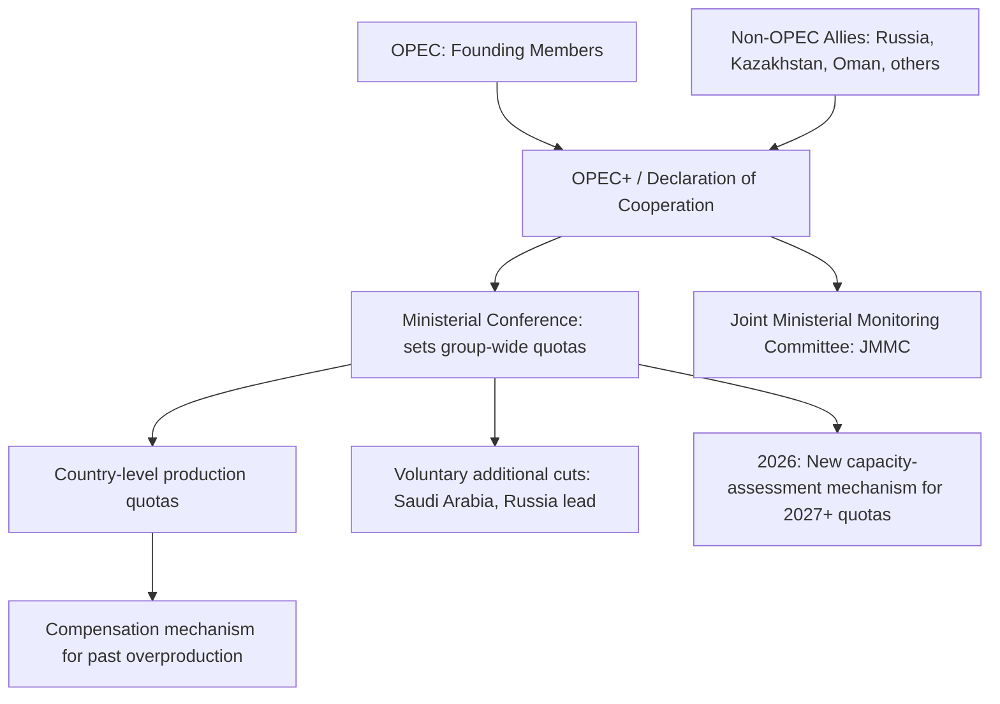

## Oil Markets and the Role of OPEC+

### Overview: OPEC+ as a Market-Management Institution

OPEC+ is the extended coalition of the Organization of the Petroleum Exporting Countries (OPEC) plus a group of non-OPEC oil-exporting allies, most notably Russia, Kazakhstan, and Oman, formalized through the **Declaration of Cooperation (DoC)**. Since 2016, this expanded grouping has functioned as the world's most consequential swing-producer bloc, coordinating output quotas to manage global oil prices and market balance. Unlike traditional commodity markets governed primarily by decentralized supply-and-demand signals, the oil market operates under a hybrid structure where a coordinated group controlling a substantial share of global spare production capacity can deliberately withhold or release barrels, making OPEC+ policy meetings a recurring, market-moving geopolitical event.

**Key Points**

- OPEC+ policy operates through two intertwined levers: **production quotas** (how much each member is allowed to produce) and **voluntary cuts** (additional, often unilateral reductions layered on top of quotas by specific members, chiefly Saudi Arabia and Russia).
- **Spare capacity** — production that can be brought online quickly and sustained — is the single most important strategic variable, since it determines how much cushion exists against supply shocks and how much leverage the bloc retains over prices.
- 2026 has been characterized by a completed unwinding of 2023-era voluntary cuts, a new capacity-assessment mechanism for setting future quotas, and a historically large spare capacity buffer.

---

### Institutional Structure

**Key Points**

- OPEC's core membership includes major Middle Eastern and African producers; OPEC+ extends this with Russia and other non-OPEC exporters who voluntarily align production policy without formal OPEC membership.
- Decisions are made at Ministerial Conferences, with the Joint Ministerial Monitoring Committee (JMMC) reviewing compliance and market conditions between full meetings.
- A **compensation mechanism** requires members who have overproduced relative to their quota in prior periods to make additional cuts later, intended to preserve overall group discipline — though compliance has historically been uneven.

---

### 2026 Policy Trajectory: From Cut-Unwinding to Steady State

**The 2023 Voluntary Cuts and Their Unwinding:**

Beginning in late 2025, OPEC+ initiated a phased unwinding of the voluntary production cuts originally announced in 2023, though the pace was described as slower than originally planned, with output increments paused for January through March 2026 due to seasonal demand weakness.

By August 2026, OPEC+ approved a further 188,000-bpd production quota increase for September, completing the planned unwinding of the voluntary output cuts introduced in 2023, agreed by seven producers led by Saudi Arabia and Russia — while leaving room for additional supply once Middle East oil flows normalize, despite continued supply disruptions linked to the conflict involving Iran and shipping constraints in the Persian Gulf and Red Sea.

**Holding Steady Through Year-End 2026:**

OPEC+ countries agreed to maintain group-wide oil output quotas for 2026 at a late-November 2025 meeting, while the group still maintained about 3.24 million barrels per day of output cuts in place, representing about 3% of global demand, unaltered by that meeting.

**New Capacity-Assessment Mechanism:**

A structurally significant 2026 development: OPEC said the group had approved a mechanism to assess members' maximum production capacity, to be used for setting output quotas from 2027 onward. [Inference] This mechanism addresses a longstanding internal tension within OPEC+ — that quotas have historically been negotiated politically rather than tied to verified technical production capability, which has generated recurring disputes (particularly involving the UAE and other members seeking quota increases proportional to their actual capacity growth). A capacity-based framework could reduce future negotiation friction, though its credibility depends on how rigorously "maximum capacity" is verified and audited.

**Quota Baseline (2026):**

The official quotas for 2026 total 39.725 million barrels per day according to the Declaration of Cooperation. However, this headline figure does not account for voluntary additional cuts by individual countries or compensation measures for previous overproduction; once these are factored in, actual quotas are likely to average closer to roughly 38.1 million barrels per day. In particular, voluntary cuts by Saudi Arabia and Russia together amounting to roughly 0.75 million barrels per day, along with compensation measures to be implemented, further push the effective total below the headline figure.

---

### Spare Capacity: Definition and Strategic Significance

**Technical Definition:**

Spare capacity refers to the volume of production that key producers can bring online within thirty days and sustain for ninety days — a buffer of deliverable barrels sitting behind the agreed production ceiling, waiting for either a policy decision or a supply shock to unlock them. This "30-day, 90-day test" is the standard technical benchmark used across market analysts and agencies.

**Measurement Divergence Across Agencies:**

Different institutions apply different rigor to spare capacity estimates, creating a meaningful spread in reported figures:

- The **EIA** (US Energy Information Administration) figure functions as the market's canonical headline number.
- The **IEA** (International Energy Agency), publishing in its monthly Oil Market Report, tends to report lower figures — often roughly half a million barrels below EIA — because it demands evidence of recent test rates at the claimed capacity within the prior twelve months, a stricter verification standard.
- The **OPEC Secretariat's** internal figure functions more as a political data point, informing how Saudi Arabia and other members think about their own strategic optionality, applying tighter sustainability criteria on certain specific fields.

**2026 Spare Capacity Levels:**

| Producer | Estimated Spare Capacity (April 2026) |
| --- | --- |
| Saudi Arabia | ~3.0 million bpd (range cited: 2-3 million) |
| UAE | ~1.0 million bpd |
| Kuwait | ~0.4 million bpd |
| Iraq | ~0.3 million bpd (operationally constrained) |
| **Total OPEC+** | **>5 million bpd** |

All three major reporting bodies (EIA, IEA, OPEC Secretariat) agreed as of April 2026 that global effective spare capacity stood above 5 million barrels per day, a consensus that has anchored the prevailing price regime, with oil prices holding above $85 since the second half of 2025 despite periodic Red Sea flare-ups, fresh rounds of Iran-related sanctions noise, and continued geopolitical tension in the eastern Mediterranean.

**Key Points**

- Saudi Arabia holds the largest and most strategically significant spare capacity buffer, functioning as the bloc's "anchor" producer and de facto swing producer of last resort.
- Spare capacity is described as a "moving target": the planned OPEC+ policy path can mechanically reduce the buffer over time, since the current plan implied roughly 2.0 million barrels of previously-cut production returning to the market over the eighteen months through Q3 2027, which by definition would take about 2 million barrels per day off the spare capacity total as those barrels shift from "spare" to "produced."
- Many OPEC+ members remain unable to raise output to their allotted quotas because of technical and operational constraints — meaning nominal quota levels can overstate actual deliverable supply, a distinction directly analogous to the "announced vs. dependable capacity" gap discussed in critical minerals refining.

---

### Non-OPEC Supply as a Counterweight

Regardless of whether OPEC+ expands production further, production volumes are expected to rise in 2026 primarily from non-OPEC producers such as the US, Brazil, and Guyana, which should keep the global oil market well-supplied overall. [Inference] This dynamic constrains OPEC+'s effective pricing power relative to earlier eras of oil market history: because a substantial and growing share of incremental global supply now originates outside the coalition's control (particularly US shale, which responds relatively quickly to price signals), OPEC+ production decisions influence but no longer single-handedly determine global price levels — a structural shift often described as OPEC+ "managing" rather than "setting" the market.

---

### Strategic and Geopolitical Dimensions

**Market Share vs. Price Balance:**

Saudi Arabia's spare capacity posture in 2026 reflects a high-stakes balance between cuts and market share — maintaining a large buffer preserves pricing leverage and crisis-response credibility, but foregoing production also means foregoing revenue and ceding market share to non-OPEC producers who continue expanding output regardless of OPEC+ policy.

**Compensation and Compliance Discipline:**

Members who have historically overproduced relative to quota — including Saudi Arabia, Russia, Iraq, the United Arab Emirates, Kuwait, Kazakhstan, and Oman — have periodically presented revised compensation plans, reflecting ongoing internal negotiation over how strictly quota discipline is enforced across a coalition with divergent national fiscal needs and production economics.

**Supply Risk Geography:**

2026 production decisions have occurred against a backdrop of continued supply disruption risk linked to the conflict involving Iran and shipping constraints in the Persian Gulf and Red Sea — meaning OPEC+ policy is set not only with reference to demand forecasts but as a hedge against potential involuntary supply disruption from geopolitically exposed member and transit states.

**Key Points**

- [Inference] The combination of a large deliberate spare-capacity buffer and elevated geopolitical risk in the Persian Gulf/Red Sea corridor suggests OPEC+ policy in 2026 is being calibrated partly as insurance: sufficient held-back capacity to absorb a disruption (e.g., an Iran-related supply shock or a Strait of Hormuz disruption scenario) without triggering a severe price spike, while still allowing gradual output normalization when conditions permit.
- The interplay between OPEC+ coordinated supply management and non-OPEC organic growth (US shale, Brazil, Guyana) represents the defining structural feature of the 2020s oil market: a partially-administered price floor/ceiling mechanism operating alongside a genuinely competitive, price-responsive supply segment outside the coalition's control.

---

### Practical Example: Interpreting an OPEC+ Meeting Outcome

When OPEC+ announces it will "hold quotas steady," three things should be checked before drawing conclusions about market direction:

1. **Headline quota vs. effective quota** — subtract voluntary cuts and compensation obligations, since the headline Declaration of Cooperation figure (e.g., 39.725 million bpd for 2026) typically overstates effective supply by roughly 1.5 million bpd once voluntary and compensatory adjustments are applied.
2. **Compliance capacity** — check whether members holding unused quota can actually produce to that level, since operational constraints (e.g., Iraq's limited spare capacity) mean nominal quota changes do not always translate to real barrels.
3. **Spare capacity direction** — determine whether the policy path implies spare capacity growing or shrinking over the following 12-18 months, since this shapes market expectations about the bloc's crisis-response cushion independent of the immediate quota level.

---

**Related Topics**

- US shale production economics and its role as a non-OPEC price-response mechanism
- Strait of Hormuz and Red Sea chokepoint risk to global oil shipping
- Iran sanctions regimes and their effect on global spare capacity calculations
- Saudi Arabia's fiscal break-even oil price and Vision 2030 economic diversification
- Russia's oil export patterns under sanctions and the G7 price cap mechanism
- LNG and natural gas geopolitics as a parallel energy security domain
- Strategic Petroleum Reserve (SPR) policy as a demand-side buffer against OPEC+ supply decisions