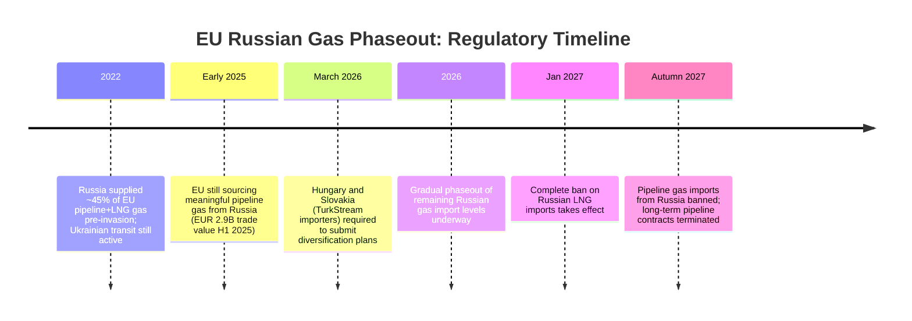

## Natural Gas, LNG, and Pipeline Politics

### Overview: The Structural Shift from Pipeline to LNG

Natural gas geopolitics has undergone the most significant structural transformation of any energy commodity since 2022, driven primarily by Europe's forced decoupling from Russian pipeline gas following Russia's invasion of Ukraine. The EU's natural gas supply, heavily dependent on imports, has undergone significant change in both the structure of countries of origin and the supply routes themselves. This chapter area distinguishes between two structurally different transport modes — fixed pipeline infrastructure and flexible, ship-transported liquefied natural gas (LNG) — because each carries different geopolitical properties: pipelines create durable bilateral dependency and chokepoint leverage, while LNG creates a more liquid, substitutable, globally-tradeable market, though not one free of its own concentration risks.

**Key Points**

- Norway and the United States have replaced Russia as the EU's most important natural gas suppliers, with LNG becoming much more important at the expense of previously dominant pipeline supply.
- Pipeline gas and LNG are not simply interchangeable substitutes — pipeline infrastructure is capital-intensive, fixed, and creates long-duration bilateral dependency, while LNG offers cargo-by-cargo flexibility but competes on a global spot market against Asian buyers.
- The EU's diversification away from Russia risks trading one dependency for another, narrower one, since replacing a single dominant supplier with a smaller group of alternative suppliers does not eliminate concentration risk, only redistributes it.

---

### Pipeline Gas: Fixed Infrastructure and Chokepoint Politics

**Structural Properties of Pipelines:**

Pipeline gas requires enormous upfront infrastructure investment (compressor stations, cross-border interconnectors, transit agreements) that ties supplier and buyer together for decades. This structural rigidity is precisely what gives pipeline gas its geopolitical character — cutting off a pipeline is costly and disruptive for both parties, which is why pipeline relationships historically served as instruments of durable political alignment as much as commercial exchange.

**Russian Pipeline Gas: Historical Dominance and Collapse:**

Before 2022, Russia supplied around 45 percent of the EU bloc's combined pipeline gas and LNG imports. Since large parts of pipeline imports from Russia have been lost, LNG imports from non-European countries have become the main source of EU supply, alongside continued deliveries from Norway.

**Remaining Pipeline Corridors (2026):**

With the Ukrainian transit route closed, **TurkStream** remains the only active pipeline corridor delivering Russian gas to Europe. The interconnection point **Strandzha 1** between Türkiye and Bulgaria is treated as a sensitive entry point under EU Regulation 2026/261, reflecting regulatory concern that Russian gas may enter the EU market disguised under the name of third countries — some transit pipelines connecting Russia with the EU run through third countries without direct entry points between Russia and the Union, creating traceability and enforcement challenges.

**Emerging Alternative Pipeline Routes:**

- The EU is eyeing increased gas supplies from Central Asia and may contribute guarantees to allow construction of a **Trans-Caspian Pipeline**, representing a potential new non-Russian pipeline corridor.
- **Azerbaijan** has been considered as a diversification source, but the EU debate has been shaped by concerns that diversification should not result in substituting one authoritarian supplier with another; Azerbaijani exporters are required to provide documentary evidence that gas delivered to the EU originates from specific domestic fields, with EU authorities able to mandate audits of transmission routes to verify the absence of Russian-origin molecules within the supply chain.

---

### LNG: The Flexible, Globally-Competitive Alternative

**Why Europe Shifted to LNG:**

In the wake of the war in Ukraine, European buyers increasingly moved to the LNG spot market, driven by the need for flexibility amid geopolitical uncertainty — a marked contrast to Russia's traditional long-term, fixed pipeline contract model. This shift toward spot-market flexibility has also structurally weakened Russia's long-term energy leverage over Europe, accelerating broader strategic decoupling between the two.

**LNG Supply Chain (Standard Architecture):**

1. **Liquefaction:** Natural gas is cooled to approximately -162°C at export terminals, reducing its volume roughly 600-fold for efficient maritime transport.
2. **Maritime transport:** Specialized LNG carriers (cryogenic tankers) move cargo globally, with route flexibility being the key strategic advantage over pipelines — a cargo can be redirected mid-voyage toward whichever market offers the best price.
3. **Regasification:** Import terminals convert LNG back to gaseous form for injection into domestic pipeline networks.

**Global Competition for Cargoes:**

Europe, and Germany in particular, are in direct competition with Asian buyers, especially Japan, South Korea, and China (collectively the JKC region), for the same global pool of LNG cargoes — meaning European energy security is partly a function of Asian demand levels and price competitiveness, not solely a European policy variable.

**US Dominance as Europe's LNG Supplier:**

The U.S. share of EU LNG imports has grown sharply as Russia's share declined, accounting for 57 percent of the EU's LNG imports in the most recent full year measured. The United States does not compete on price stability — Henry Hub-linked contracts carry higher standalone volatility than oil-indexed alternatives — but rather on geopolitical alignment; the EU is willing to accept the volatility premium inherent to U.S. supply because of the value proposition of secure alignment with a trusted partner.

**Norway as Baseline Pipeline Supplier:**

Norway now supplies about 30 percent of EU gas, functioning as the bloc's key baseline pipeline supplier and the most geopolitically stable major source in the post-2022 landscape.

---

### EU Regulatory Phaseout of Russian Gas (2026-2027 Timeline)

**Key Regulatory Features:**

- To completely eliminate EU reliance on Russian gas (both piped and LNG), European policymakers passed a provisional agreement phasing out Russian LNG imports by 2026 and terminating long-term pipeline contracts by 2027, converting the REPowerEU political pledge into binding law.
- The EU legislation establishing this phaseout is permanent, unlike other sanctions packages, which require unanimous member-state renewal every six months — a structural design intended to remove the phaseout from recurring political renegotiation risk.
- EU countries still importing significant amounts of Russian gas via TurkStream — namely **Hungary** and **Slovakia** — were required to submit diversification plans by March 2026 under the new regulation, reflecting continued internal EU political divergence on the speed and completeness of decoupling from Russia.
- [Inference] France's continued receipt of Russian LNG under pre-war contracts through TotalEnergies and Yamal LNG illustrates that even amid EU-wide phaseout commitments, individual member-state commercial contracts can persist until their scheduled binding deadlines, meaning "EU policy" and "member-state practice" do not move in perfect lockstep during a multi-year transition.

---

### Russia's Strategic Pivot: The Eastern Reorientation

As LNG reshapes global energy markets, it is also enabling Russia to reorient its exports toward Asia, deepen ties with partners like China and India, and assert continued presence in global energy geopolitics. Russia is leveraging its LNG sector to turn geographic and political constraints into strategic assets, reshaping global energy flows, undermining sanctions, and challenging U.S. strategic influence across the Indo-Pacific.

**Key Points**

- The development of Russia's alternative export infrastructure — including expanded pipeline capacity to Asia and increased use of shadow shipping networks for LNG — could reduce Russia's long-term vulnerability to European sanctions by diversifying its own customer base away from dependency on the EU market it is being excluded from.
- Geopolitical uncertainty associated with Russian gas exports could swing the range of those exports by an estimated 150 billion cubic meters (bcm) per year, with the trajectory determined primarily by choices made in China and the US, as well as Turkey and EU countries — reflecting how deeply contingent Russia's export volumes remain on decisions made by counterparties rather than by Russia unilaterally.
- Although no binding commitments were agreed regarding contract duration, volumes, timeframe, or pricing in certain China-Russia gas discussions, such agreements have sent strong geopolitical signals to LNG exporters — particularly the United States — that China could eventually pivot toward greater reliance on Russian pipeline gas, which would materially affect the global LNG supply-demand balance.
- Expected global LNG oversupply in coming years could either increase or be eliminated depending on how these Russian export volume uncertainties resolve, illustrating that LNG market fundamentals are themselves geopolitically contingent, not purely technical supply-demand calculations.

---

### The New Vulnerability: Trading One Dependency for Another

A central analytical thread across 2026 policy literature is that diversification away from Russia does not eliminate concentration risk — it relocates it. The EU risks replacing dependence on Russia with a different form of reliance on a narrower group of external suppliers, since achieving full diversification has proven more difficult than simply substituting away from a single dominant supplier.

**New Vulnerabilities Introduced by Diversification:**

- **US policy exposure:** Reliance on U.S. LNG increases Europe's exposure to transatlantic political dynamics, including U.S. domestic energy policy decisions and export controls — a dependency on American *policy stability* replacing dependency on Russian *supply stability*.
- **Regional instability exposure:** Greater dependence on suppliers in politically unstable regions, such as Africa and Latin America, could expose the EU to disruptions stemming from regional conflicts or domestic unrest.
- **Qatar's contract-model mismatch:** Qatar was considered a strong potential alternative supplier, though its traditional reliance on long-term contracts made it less compatible with Europe's shifting preference for flexible, spot-market-oriented supply — illustrating that supplier diversification is constrained not just by volume availability but by contractual-structure compatibility with buyer preferences.
- [Inference] The core strategic lesson embedded in this literature is that energy security in a multipolar, fragmenting global order is not a one-time diversification achievement but an ongoing balancing exercise: both price relationships and geopolitical alignment shift over time, and the value of any single supplier can change far faster than long-term contracts can be renegotiated — meaning periodic reassessment of supplier concentration, not a fixed diversified end-state, is the realistic long-term posture.

---

### Practical Example: Reading an LNG Cargo Flow Signal

When European natural gas prices spike relative to Asian LNG prices (a widening of the Europe-Asia price spread), cargoes contracted flexibly on the spot market are commercially incentivized to divert toward Europe rather than their originally intended Asian destination, since LNG carriers can be rerouted mid-voyage. This price-arbitrage mechanism is a key reason LNG functions as a genuinely global, substitutable market in a way pipeline gas cannot: a spot LNG cargo's destination is a live commercial decision, while a pipeline's destination is fixed by the physical infrastructure route. [Inference] This is precisely why Europe's 2022-era pivot toward spot LNG purchasing, rather than long-term contracting, was strategically significant — it purchased flexibility to compete for redirected global cargoes during supply stress, at the cost of greater price volatility exposure during periods of tight global supply (such as competition with Asian buyers during winter demand peaks).

---

**Related Topics**

- Strait of Hormuz and other maritime chokepoints relevant to LNG shipping routes
- US shale gas production and Henry Hub pricing dynamics as LNG feedstock economics
- China-Russia Power of Siberia pipeline expansion and its effect on global LNG oversupply projections
- Sanctions enforcement mechanisms and "shadow fleet" shipping networks for restricted LNG/oil cargoes
- REPowerEU policy framework and broader EU energy security legislation
- Qatar's long-term LNG contract model versus spot-market-oriented Western buyers
- Northern Sea Route development as a Russian Arctic LNG export corridor