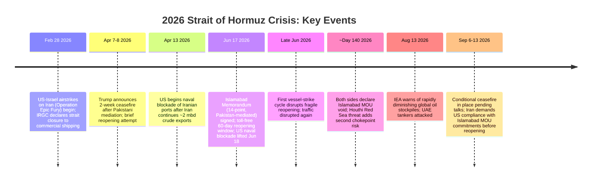

## The Strait of Hormuz and Global Oil Transit Risk

### Overview: The World's Most Critical Energy Chokepoint

The Strait of Hormuz, the only entrance to the Persian Gulf, has long been understood as the world's most important energy shipping chokepoint. Roughly a fifth of the world's oil and a significant share of global LNG passes through the strait, which is only about 33 kilometers wide at its narrowest point. Since February 2026, the strait has moved from a theoretical chokepoint risk discussed in energy security literature to an active, ongoing crisis — the most severe real-world test of maritime chokepoint vulnerability in modern oil market history. As of mid-September 2026, the crisis remains unresolved, with transit still severely constrained more than six months after the initial closure.

**Key Points**

- Under normal conditions, approximately 20 million barrels of oil per day — nearly 20 percent of global oil consumption and more than 25 percent of seaborne oil trade — transit the strait, according to the US Energy Information Administration.
- Despite the United States being the largest oil producer in the world, it remains exposed to the same price shocks as other countries, because oil is a globally traded and largely fungible commodity — chokepoint disruption is a *global* market event, not a regionally contained one.
- The crisis exposes deep structural vulnerabilities in the global energy system, particularly overreliance on narrow maritime chokepoints, with economic consequences extending beyond energy markets into inflation, global trade, and economic growth.

---

### Timeline of the 2026 Strait of Hormuz Crisis

---

### How the Closure Occurred

After the United States and Israel began attacking Iran on February 28, 2026, Iran retaliated by using drones, ballistic missiles, and small attack boats to threaten and attack vessels attempting to transit the strait. An Iranian military spokesperson asserted that the Strait of Hormuz "remains under the full management and control of Iran," and Iranian forces reported striking vessels transiting the strait while warning that no oil, gas, or chemical fertilizer would be exported from the region while the US continued its attacks.

**The Insurance Mechanism of De Facto Closure:**

As a result of the threat environment, insurance became unavailable or prohibitively expensive for vessels transiting the strait, and seafarers became unwilling to make the journey — meaning the strait was effectively closed through market and risk mechanisms even without a formal physical blockade of the channel itself. As of a September 2026 status check, war-risk insurance was running at roughly 40 times normal levels, and four of the world's largest container carriers reported in their own advisories that they had stopped using the strait entirely.

**Key Points**

- This is a critical technical distinction for chokepoint risk analysis: a strait can be rendered non-functional for commercial purposes through *economic* mechanisms (insurance cost, crew willingness) well before or independent of a literal physical blockade — meaning "closure" in practice is often a market-risk phenomenon layered on top of military threat, not a simple binary of mined-versus-clear.
- Iran continued its own crude oil exports of about 2 million barrels per day even during the early closure period, until the United States began a naval blockade of Iranian ports on April 13, 2026 — illustrating that the crisis involved dual, overlapping blockade dynamics (Iran restricting general transit; the US restricting Iran-specific transit) rather than a single unidirectional closure.
- A small number of vessels paid a "toll" to the Islamic Revolutionary Guard Corps (IRGC) in exchange for safe passage during periods of peak restriction — demonstrating that even a heavily disrupted chokepoint rarely achieves complete traffic elimination, but instead shifts toward a controlled, rent-extracting passage regime.

---

### The Islamabad Memorandum and the Fragile Reopening Cycle

**Initial Ceasefire Framework:**

Following Pakistani mediation, Trump agreed to suspend bombing of Iran for two weeks in early April 2026, conditioned on Iran agreeing to the "complete, immediate, and safe opening" of the Strait of Hormuz. This initial framework proved unstable and gave way to a more formal agreement two months later.

**The Islamabad Memorandum of Understanding (June 17, 2026):**

The US and Iran signed a Pakistani-mediated 14-point memorandum after weeks of backchannel diplomacy. The agreement mandated a temporary ceasefire, the reopening of the Strait of Hormuz, and at least 60 days of direct negotiations between the two countries. Under the deal's terms, the US lifted its naval blockade on June 18, 2026, and traffic began rebounding — approximately 20 tankers transited on June 19, the most since early June — but volumes remained only roughly 5-10% of normal while mines were cleared, and Iran was to clear mines and technical obstacles within 30 days, with future administration of the strait to be negotiated separately with Oman.

**Breakdown and Renewed Disruption:**

The fragile reopening did not hold. A first vessel-strike cycle in late June disrupted the toll-free window, and by approximately day 140 of the crisis, both sides had declared the Islamabad MOU void — Iran's deputy foreign minister stated Tehran had "no commitments" under it, while the Trump administration characterized it as "a test they failed." This breakdown introduced a second escalation cycle, described by monitoring sources as "harder" than the first, with the US itself changing the rules of the waterway through a reimposed blockade.

**September 2026 Status:**

As of September 13, 2026, Iranian Foreign Minister Abbas Araghchi stated that the US must adhere to its "commitments under the Islamabad Memorandum of Understanding" before Tehran would allow reopening of the strait to commercial shipping. A conditional ceasefire remains in place pending the conclusion of talks, but shipping levels through the strait remain very low, and the US has separately announced a counter-blockade on ships seeking to use Iranian ports. Defensive UK and other multilateral initiatives to help reopen the strait to vessels are under discussion but not yet operational.

**Key Points**

- [Inference] The repeated pattern of ceasefire-then-breakdown across April, June, and the subsequent months suggests the underlying military and political conditions for a durable reopening had not been resolved as of mid-September 2026 — each agreement addressed the immediate crisis trigger without resolving the deeper US-Iran dispute (including separate nuclear negotiations referenced alongside the Islamabad framework), making the strait's status a downstream indicator of broader diplomatic progress rather than an independently resolvable shipping issue.
- Verification gaps compound the uncertainty: a presidential claim that all mines had been cleared from international waters was not independently verified by CENTCOM or international mine-clearing authorities, illustrating that even authoritative-sounding public statements about the strait's physical safety require independent confirmation before being treated as operationally reliable by shippers and insurers.

---

### Global Market and Supply Chain Impact

**Oil Price and Stockpile Effects:**

The war in Iran has caused the largest disruption in the history of the oil market, with Iranian threats to shipping bringing tanker transits far below usual levels. By August 2026, the International Energy Agency warned that global oil stockpiles were diminishing at a rapid clip, making reopening of the strait increasingly urgent even as Brent crude prices fluctuated (trading around $87 a barrel in mid-August 2026 despite the ongoing disruption, reflecting a complex mix of demand destruction, stockpile drawdown, and partial rerouting effects on realized prices).

**Compound Chokepoint Risk — the Red Sea Dimension:**

A renewed Houthi threat to close the Red Sea introduced a critical second-order risk: if the Cape of Good Hope route — the primary alternative to the Suez Canal — were also disrupted alongside Hormuz, global shipping would face simultaneous closure of both major energy transit corridors. Multiple major container carriers (Maersk, MSC, CMA CGM, Hapag-Lloyd) suspended transits through both chokepoints during periods of peak risk, with most major carriers routing via the Cape of Good Hope as the Red Sea/Bab el-Mandeb route also became compromised by resumed Houthi attacks.

**Limited Alternative Routing Capacity:**

A significant portion of Gulf spare capacity cannot reach global markets if the Strait of Hormuz remains inaccessible. Saudi Arabia's East-West Pipeline (capacity: 7 million barrels per day) and the UAE's Fujairah pipeline offer partial bypass alternatives, but terminal infrastructure at Jeddah limits throughput — these routes could sustain a portion of displaced volume but would not offset a full strait closure.

**Regional and Product-Specific Impacts:**

- Fuel shortages and rationing emerged in parts of Asia east of the Gulf, which rely heavily on oil supplied through the strait, alongside a sharp increase in global oil market prices.
- Jet fuel supply tightening in Europe was flagged as a specific vulnerability, with analysts noting the jet-fuel crack spread can remain elevated for weeks once a genuine supply shortage emerges, based on precedent from prior periods of tightness.
- Gasoline markets were assessed as relatively better insulated, since global gasoline supply is more distributed and the arbitrage network more flexible, though Asian refinery turnaround season adds marginal vulnerability.
- India and China were identified as facing the most acute Asian supply risks across crude, LPG, and LNG, given their geographic proximity to and heavy dependence on Gulf-sourced energy.

**Key Points**

- No adequate offset exists from OPEC spare capacity, strategic reserves, or alternative routing combined in a tail-risk scenario of sustained full strait closure with full Gulf infrastructure targeting — meaning the crisis has tested, and partially exceeded, the theoretical buffer capacity (discussed in the OPEC+ topic) that global oil markets had been assumed to hold in reserve for exactly this kind of shock.
- The interaction between the OPEC+ spare capacity buffer (over 5 million bpd as of April 2026, per the oil markets topic) and the Hormuz crisis illustrates a critical limitation of that buffer: spare capacity held by Gulf producers is only useful to the extent it can physically reach global markets, and a Hormuz closure directly constrains the export pathway for much of that same spare capacity, effectively neutralizing a large share of the buffer's real-world deployability. [Inference]

---

### Structural and Geopolitical Consequences

**Governance Outcomes:**

The crisis produced new governance structures, including the formation of a "Persian Gulf Strait Authority" and reference to an "Islamabad Memorandum" as an ongoing diplomatic framework — reflecting how sustained chokepoint crises can generate lasting institutional change in regional maritime governance, not merely temporary military and diplomatic responses.

**Human and Economic Toll:**

The broader 2026 Iran war left substantial damage, including thousands of deaths in Iran and Lebanon, dozens of deaths in Israel and Gulf Arab states, and significant displacement across the region. Within the strait crisis specifically, casualties included dozens of seafarers killed or injured and disruption to commercial shipping crews navigating an active conflict zone.

**Diplomatic Complexity:**

Iran has maintained it is not negotiating directly with Washington, characterizing its talks as being with Oman over a temporary framework for safe passage — reflecting Tehran's preference to route de-escalation through a trusted regional intermediary rather than direct bilateral engagement with the US, even while the Islamabad Memorandum (mediated by Pakistan) remains the primary reference framework both sides invoke when assigning blame for its breakdown.

**Key Points**

- [Inference] The Strait of Hormuz crisis represents a live case study directly relevant to broader supply chain geopolitics: it demonstrates that theoretical chokepoint risk — long discussed in energy security literature as a low-probability, high-impact scenario — can materialize and persist for an extended duration (six-plus months as of this writing) without full resolution, challenging assumptions that such disruptions would be brief due to overwhelming economic incentives for all parties to reach a quick settlement.
- The crisis also demonstrates the limits of bilateral mediated ceasefires in chokepoint disputes: the repeated breakdown of the Islamabad framework suggests that agreements addressing the *symptom* (strait access) without resolving the underlying *cause* (broader US-Iran conflict and associated nuclear negotiations) are vulnerable to renewed disruption whenever the broader relationship deteriorates — a pattern with implications for how policymakers structure future chokepoint-specific diplomatic interventions.

---

**Related Topics**

- OPEC+ spare capacity and its practical deployability during chokepoint disruptions
- Red Sea/Bab el-Mandeb Houthi threat and compound multi-chokepoint risk scenarios
- Saudi Arabia's East-West Pipeline and UAE's Fujairah pipeline as bypass infrastructure
- War-risk maritime insurance markets and their role in de facto chokepoint closure
- US-Iran nuclear negotiations and their linkage to regional shipping security
- Strategic Petroleum Reserve drawdown policy during acute supply shocks
- Asian energy security exposure (India, China) to Gulf-origin crude, LPG, and LNG disruption
- Historical precedent: Strait of Hormuz tensions during the Iran-Iraq War "Tanker War" era