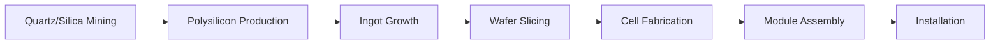
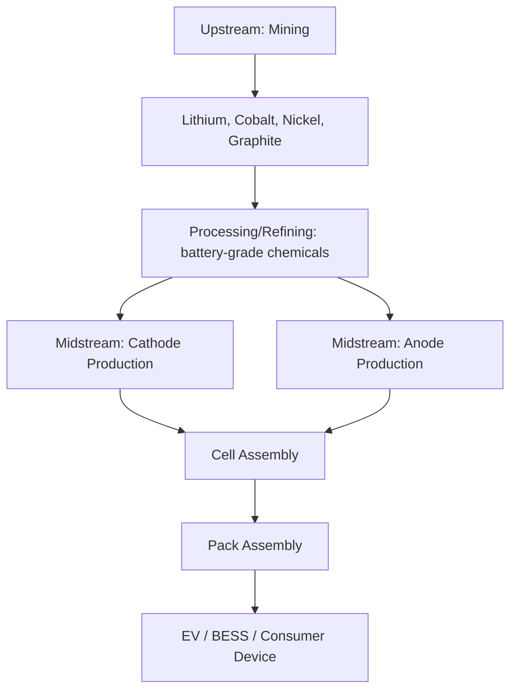

## The Renewable Energy Supply Chain: Solar Panels, Wind Turbines, and Batteries

### Overview: A Different Concentration Pattern Than Fossil Fuels

The renewable energy supply chain presents a geopolitical structure distinct from oil and gas: rather than concentration around geographically fixed resource deposits or transit chokepoints, renewable technology supply chains are concentrated around **manufacturing capacity and materials processing**, overwhelmingly located in China across all three major technology categories — solar photovoltaics, wind turbines, and batteries. China owns the vast majority of the world's solar panel supply chain, controlling at least 75% of every single key stage of solar photovoltaic panel manufacturing and processing, and this pattern of near-total midstream/manufacturing dominance repeats with variation across wind components and battery materials.

**Key Points**

- Unlike oil (geographically fixed reserves) or rare earths (a refining-specific bottleneck), renewable energy technology concentration spans the *entire* manufacturing chain — from raw material processing through component fabrication to final assembly — making it structurally harder to diversify through any single intervention point.
- China's dominance was built through sustained state investment: China poured approximately $130 billion into its solar industry in a single recent year, and pumped in more than $230 billion of battery subsidies and tax breaks between 2009-2023 to make lithium iron phosphate (LFP) chemistry the dominant global battery configuration.
- The three technology chains (solar, wind, batteries) share China's raw-material and midstream processing dominance but differ in the degree of downstream/assembly diversification achieved elsewhere.

---

### Solar Photovoltaic Supply Chain

**Chain Structure:**

**2026 Capacity Concentration by Stage:**

| Stage | China Capacity | Global Capacity ex-China | China Share |
| --- | --- | --- | --- |
| Polysilicon production | ~2.6 Mt/year | ~0.6 Mt/year | ~80% |
| Wafer production | ~950 GW/year | ~50 GW/year | ~95% |
| Cell production | ~850 GW/year | ~150 GW/year | ~85% |
| Module assembly | ~1,100 GW/year | more diversified | ~80% |

China will hold more than 80% of poly, wafer, cell, and module manufacturing capacity through 2026, driven by high margins for polysilicon, continuous technology upgrades, and sustained policy support — a combination expected to keep widening the technology and cost gap with competitors rather than narrowing it.

**Pricing Disparity:**

The dominance translates directly into a durable cost advantage: Chinese polysilicon costs roughly $7-9/kg in 2026 versus $11-15/kg for non-Chinese polysilicon, and Chinese Tier 1 modules (FOB China) run around $0.092/W compared to $0.130-0.180/W for non-Chinese Tier 1 modules. A module produced in China has historically been priced at roughly half that of its European counterpart and 65% less than the U.S.-made equivalent.

**Where Diversification Has Occurred:**

Module assembly is more geographically diversified than upstream stages, but almost all inputs to that assembly are still manufactured in China. Non-China cell capacity remains comparatively small — roughly 3.2 GW in the US and 26 GW in India per recent official data — heavily shaped by policy-driven demand such as FEOC (Foreign Entity of Concern) compliance requirements for IRA-eligible US projects and cybersecurity certification requirements for hybrid inverters in EU markets.

**Key Points**

- [Inference] It can take three to five years to build new polysilicon manufacturing capacity from scratch, meaning near-term Western solar diversification is structurally capped regardless of policy ambition, similar to the multi-year commissioning timelines documented in critical minerals refining.
- Southeast Asia (Vietnam, Malaysia, Thailand) holds meaningful cell and module capacity, historically used partly as a tariff-mitigation manufacturing location for Chinese-owned firms — a pattern raising its own trade-policy scrutiny around origin rules.
- Major Chinese solar players include LONGi Green Energy (~120 GW capacity, ~18% global share) and JinkoSolar (~110 GW, ~16% share), reflecting that dominance is distributed across several large vertically-integrated firms rather than a single monopolist.

---

### Wind Turbine Supply Chain

**Component Concentration (2026):**

| Component | China Share of Global Production |
| --- | --- |
| Wind turbine nacelles | ~60% |
| Wind blades | ~55% |

**Key Points**

- Wind shows meaningfully lower Chinese concentration than solar or batteries, reflecting a more geographically distributed manufacturing base historically anchored by European (Vestas, Siemens Gamesa) and American (GE) original equipment manufacturers alongside Chinese firms (Goldwind, Envision).
- [Inference] Despite lower final-assembly concentration, wind turbines still depend heavily on rare earth permanent magnets (particularly neodymium-iron-boron magnets) for the generators inside turbine nacelles — meaning wind's true chokepoint exposure runs through the rare earth midstream refining bottleneck covered elsewhere in this course, even though nacelle/blade assembly itself is comparatively diversified.
- China is also the leading producer and processor of the rare earth minerals essential for the magnets that power turbine generators — linking the wind supply chain directly back to the critical minerals refining chokepoint rather than functioning as an independently diversifiable technology chain.

---

### Battery Supply Chain: Three-Stage Structure

The lithium battery supply chain has three basic stages: **(1) upstream** — extraction and refining of lithium and other critical minerals; **(2) midstream** — assembly of battery components such as cathodes and anodes; and **(3) downstream** — assembly of batteries into a finished product (cells, packs, and the end device).

**Upstream Concentration:**

Australia and Chile are the leading providers of raw lithium concentrate, producing roughly 51% and 26% of global output respectively — meaning raw extraction is comparatively distributed. However, China exercises suffocating control over the upstream segment by (1) securing raw material resources through acquisitions of foreign mining concessions and offtake agreements, and (2) being the dominant at-scale processor of battery-grade lithium chemicals, even when the raw ore originates elsewhere. Approximately 60% of global lithium chemicals (lithium carbonate and lithium hydroxide) are processed in China, including Australian spodumene shipped to China specifically for conversion — the same "raw material distributed, refining concentrated" pattern documented for rare earths.

**Processing/Refining Concentration by Material:**

| Material | China Processing/Refining Share |
| --- | --- |
| Lithium chemicals | ~60-80% |
| Cobalt | ~70% |
| Nickel sulphate (battery-grade) | dominant share |
| Synthetic graphite (anode material) | ~90% |

**Midstream (Cathode/Anode) Concentration:**

China produces more than 70% of global cathode capacity and roughly 85-90% of global anode and electrolyte production — the midstream is where supply disruption risk is most acute, since cathode and anode active materials feed directly into cell manufacturing regardless of where final cell assembly occurs.

**Cell Manufacturing Concentration:**

China produces roughly three-quarters of all lithium-ion battery cells globally and hosts around 75% of battery cell manufacturing capacity. Even non-Chinese cell manufacturers — LG Energy Solution, Samsung SDI, SK On, and Panasonic — source the majority of their cathode and anode active materials from Chinese processors, meaning geographic diversification of *final cell assembly* does not by itself achieve supply chain independence if the upstream materials feeding those non-Chinese factories remain Chinese-sourced.

**Chemistry-Specific Dominance:**

China's dominance in LFP (lithium iron phosphate) cathode chemistry production exceeds 98%, reflecting how sustained subsidy-driven investment made LFP the dominant global battery configuration while competitors in the US, Japan, Germany, and South Korea focused on alternative chemistries (like NMC — nickel manganese cobalt) that are theoretically more energy-dense but did not achieve the same cost-driven market dominance.

**Key Points**

- NMC-based lithium-ion batteries, where South Korea, Europe, and Japan hold substantial output, represent the primary near-term viable target for mitigating Chinese supply chain vulnerability and building alternative-chemistry sovereignty, precisely because China's dominance is comparatively less extreme (though still substantial) in NMC relative to its near-total LFP control.
- China possesses roughly 49% of the intellectual property for lithium-ion battery cell production — an IP concentration dimension distinct from, and compounding, its manufacturing capacity concentration.
- Out of the world's top ten lithium-ion battery manufacturers, six are Chinese companies, with CATL alone commanding over 36% of the global EV battery market as of 2026 and projecting production capacity to exceed 680 GWh annually.

**Example — CATL's Vertical Integration Model:**

CATL's 2026 supply chain strategy illustrates the geopolitical risk-mitigation logic increasingly used by dominant Chinese players themselves: the company is pursuing strategic partnerships in Indonesia and Bolivia specifically to reduce geopolitical concentration risk in its own upstream sourcing, even though China still supplies roughly 80% of its processed lithium. [Inference] This suggests that even the dominant incumbent recognizes single-country upstream concentration as a vulnerability worth hedging against — a dynamic that mirrors, in miniature, the diversification logic Western policymakers are pursuing at a national level.

---

### Cross-Technology Synthesis: China's 2026 Renewable Manufacturing Position

| Component | China Share of Global Production |
| --- | --- |
| Polysilicon | ~80% |
| Solar wafers | ~95% |
| Solar cells | ~85% |
| Solar modules | ~80% |
| Wind turbine nacelles | ~60% |
| Wind blades | ~55% |
| Lithium battery cells | ~70-75% |
| LFP cathode chemistry | ~98% |
| Synthetic graphite (anodes) | ~90% |

China's cumulative installed renewable capacity itself crossed 1,400 GW by Q1 2026 (solar 750 GW, wind 500 GW, hydro 425 GW, plus over 80 GW of operational battery energy storage systems), meaning China is simultaneously the dominant *manufacturer* for global export and the largest *domestic deployer* of these same technologies — a dual role that reinforces manufacturing scale advantages through sustained domestic demand even independent of export markets.

---

### Diagram: Renewable Supply Chain Concentration Pattern (svg_diagram)

<svg xmlns="http://www.w3.org/2000/svg" viewBox="0 0 900 400">
<rect width="900" height="400" fill="#ffffff" />
<text x="450" y="26" font-size="16" font-weight="bold" text-anchor="middle" fill="#1a1a1a">China Share Across Renewable Technology Chains, 2026 (svg_diagram)</text>

<text x="30" y="60" font-size="11" font-weight="bold">Solar</text>

<rect x="120" y="48" width="550" height="18" fill="`#e8f0fe`" stroke="`#4472c4`" />

<rect x="120" y="48" width="440" height="18" fill="`#4472c4`" />

<text x="680" y="62" font-size="11">~80-95%</text>

<text x="30" y="95" font-size="11" font-weight="bold">Wind (nacelle)</text>

<rect x="120" y="83" width="550" height="18" fill="`#e8f0fe`" stroke="`#4472c4`" />

<rect x="120" y="83" width="330" height="18" fill="`#548235`" />

<text x="680" y="97" font-size="11">~60%</text>

<text x="30" y="130" font-size="11" font-weight="bold">Battery cells</text>

<rect x="120" y="118" width="550" height="18" fill="`#e8f0fe`" stroke="`#4472c4`" />

<rect x="120" y="118" width="415" height="18" fill="`#d6a000`" />

<text x="680" y="132" font-size="11">~70-75%</text>

<text x="30" y="165" font-size="11" font-weight="bold">LFP cathode</text>

<rect x="120" y="153" width="550" height="18" fill="`#e8f0fe`" stroke="`#4472c4`" />

<rect x="120" y="153" width="540" height="18" fill="`#c0392b`" />

<text x="680" y="167" font-size="11">~98%</text>

<text x="30" y="200" font-size="11" font-weight="bold">Synthetic graphite</text>

<rect x="120" y="188" width="550" height="18" fill="`#e8f0fe`" stroke="`#4472c4`" />

<rect x="120" y="188" width="495" height="18" fill="`#e67e22`" />

<text x="680" y="202" font-size="11">~90%</text>

<rect x="30" y="240" width="820" height="130" rx="8" fill="#f2f2f2" stroke="#888" />
<text x="450" y="265" font-size="12" font-weight="bold" text-anchor="middle">Common Structural Pattern</text>
<text x="450" y="288" font-size="10.5" text-anchor="middle">Raw material extraction: comparatively distributed (Australia, Chile lithium; global solar-grade quartz)</text>
<text x="450" y="306" font-size="10.5" text-anchor="middle">Processing/refining + midstream materials: heavily China-concentrated</text>
<text x="450" y="324" font-size="10.5" text-anchor="middle">Final assembly: partially diversified, but inputs still largely China-sourced</text>
<text x="450" y="345" font-size="10.5" text-anchor="middle" font-style="italic">Same structural pattern as rare earth mining vs. refining bottleneck</text>
</svg>

---

### Strategic Implications for Supply Chain Diversification

**The Inputs-vs-Assembly Distinction:**

A recurring theme across all three technology chains: building non-Chinese *final assembly* capacity (a US solar module plant, a European battery gigafactory) does not by itself achieve supply chain independence if the upstream and midstream materials feeding that facility remain Chinese-sourced. Even non-Chinese cell manufacturers source the majority of their cathode and anode active materials from Chinese processors — meaning geographic diversification must extend through the full chain, not stop at the most visible, headline-friendly final-assembly stage. [Inference]

**Chemistry and Technology Choice as a Diversification Lever:**

Unlike rare earths (where chemistry is fixed by the periodic table), batteries offer a technology-choice diversification path unavailable in mineral refining: NMC and emerging chemistries (sodium-ion, solid-state) represent genuine alternative technical pathways where China's dominance, while still substantial, is less totalizing than in LFP — making chemistry diversification a complementary strategy alongside geographic supply chain diversification.

**Policy Response Patterns:**

Policy tools mirror those seen in critical minerals more broadly (see the allied minerals partnerships topic): FEOC (Foreign Entity of Concern) compliance requirements for US tax-credit eligibility, EU cybersecurity certification requirements for grid-connected renewable hardware, and continued government initiatives for developing local manufacturing in overseas markets — though these initiatives have not yet been sufficient to prevent continued widening of China's cost and technology gap with competitors as of 2026 forecasts.

---

**Related Topics**

- FEOC (Foreign Entity of Concern) rules and their effect on IRA tax-credit-eligible renewable supply chains
- Sodium-ion and solid-state battery technology as chemistry-level diversification pathways
- Grid-scale battery energy storage systems (BESS) supply chain, distinct from EV batteries
- European and American gigafactory buildout and their upstream material sourcing dependencies
- Rare earth permanent magnets in wind turbine generators (cross-reference: midstream refining bottleneck)
- Polysilicon production energy intensity and its interaction with regional electricity/carbon policy
- CATL, BYD, and other dominant Chinese battery manufacturers' overseas vertical-integration strategies