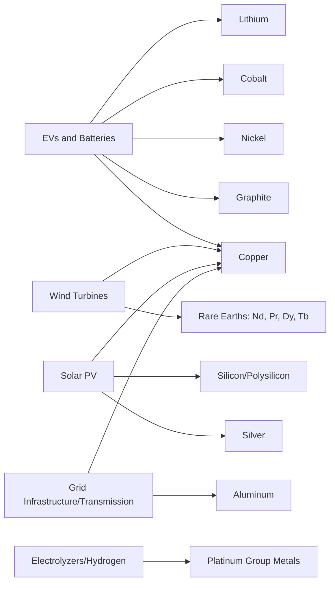

## Critical Mineral Dependencies in the Clean Energy Transition

### Overview: The Mineral Intensity of Decarbonization

The clean energy transition is fundamentally a transition in material composition, not merely an energy-source substitution. Fossil-fuel-based power systems are comparatively mineral-light per unit of energy delivered, while clean energy technologies — solar panels, wind turbines, batteries, electric vehicles, and grid infrastructure — are dramatically more mineral-intensive per unit of capacity. This chapter area synthesizes the demand-side dimension that connects the earlier topics in this course (rare earth mining/refining, allied co-investment frameworks, and the renewable technology supply chain): as clean energy deployment accelerates, aggregate demand for a specific basket of critical minerals rises sharply, and that rising demand collides with the supply-side concentration risks already documented across mining, midstream processing, and manufacturing.

**Key Points**

- [Inference] The core structural tension in this topic is a mismatch of timescales: energy and climate policy is typically set with multi-decade deployment targets, while mineral supply chains (per the midstream refining bottleneck topic) require 5-15+ years to bring new capacity online — meaning mineral availability, not technology cost or policy ambition alone, increasingly functions as a binding constraint on transition speed.
- This topic functions as the demand-side counterpart to the supply-side chapters on mining, refining, recycling, and deep sea mining — the same mineral basket (lithium, cobalt, nickel, graphite, copper, rare earths) appears on both sides of the ledger.
- Different clean energy technologies draw on overlapping but distinct mineral baskets, meaning demand growth is not uniform across minerals — some (copper, lithium) face demand growth driven by nearly every major technology simultaneously, while others (heavy rare earths, cobalt) are more concentrated in specific applications.

---

### Mineral Intensity by Technology: The Core Demand Drivers

**Key Points**

- **Copper** functions as the single most cross-cutting mineral in the transition, required in EVs, wind turbines, solar installations, and — critically — the grid transmission and distribution infrastructure needed to connect all of them to end users; an EV requires substantially more copper than a comparable internal combustion vehicle, and offshore wind in particular is copper-intensive due to subsea cabling requirements.
- **Lithium, cobalt, nickel, and graphite** are the core battery-chemistry minerals (see the renewable supply chain topic), with lithium and graphite demand growing across virtually all battery chemistries while cobalt demand is more chemistry-dependent (higher in NMC, minimal in LFP).
- **Rare earths** (particularly neodymium, praseodymium, dysprosium, and terbium) are concentrated in permanent-magnet applications — wind turbine generators and EV motors — making rare earth demand a function of electrification and wind deployment rates specifically, rather than the broader clean energy build-out as a whole.
- [Inference] This differentiated mineral-technology mapping means that policy or market interventions targeting one mineral (e.g., a lithium price collapse from oversupply) do not necessarily relieve pressure on a different mineral facing its own independent bottleneck (e.g., heavy rare earth separation capacity) — the transition faces multiple, only partially correlated mineral constraints simultaneously rather than a single unified "critical minerals shortage."

---

### The Demand-Supply Timing Mismatch

**Structural Problem:**

Mineral demand for clean energy technologies is projected by agencies such as the IEA to at least double over the next two decades, driven by accelerating deployment of EVs, renewables, and grid infrastructure. This demand trajectory is comparatively predictable, since it is driven by climate policy targets, technology cost curves, and electrification mandates that are set years in advance.

Supply response, by contrast, faces the multi-year lead times documented throughout this course: new mines typically require 7-15 years from discovery to production in OECD jurisdictions; midstream refining capacity (see the mining/midstream/refining bottleneck topic) requires additional years beyond that to reach spec-compliant, dependable output; and even recycling/urban mining capacity (see that topic) is constrained by the multi-decade lag between initial technology deployment and end-of-life material becoming available for recovery.

**Key Points**

- [Inference] This asymmetry — relatively fast-moving, policy-driven demand growth against slow-moving, capital- and permitting-constrained supply growth — is the fundamental mechanism by which critical mineral markets can experience price volatility and periodic shortages even when long-run reserves are geologically abundant; the constraint is rate-of-development, not total resource availability.
- The same "announced vs. dependable capacity" distinction found in the midstream refining topic applies to demand-side planning: energy transition scenarios that assume announced mineral supply projects will deliver on schedule and at full nameplate capacity risk systematically underestimating the true supply gap.

---

### Concentration Risk Compounds Timing Risk

Beyond the sheer scale of new demand, the geopolitical dimension of critical mineral dependency stems from *where* processing capacity sits: China's dominance spans rare earth refining (~90% of global capacity), lithium chemical processing (~60-80%), cobalt refining (~70%), synthetic graphite production (~90%), and dominant shares of cathode/anode midstream manufacturing (see the renewable supply chain topic for full detail). This means clean energy mineral dependency is not simply a matter of geological scarcity, but of *processing capacity concentration* in a single jurisdiction whose trade policy can directly affect global technology deployment timelines.

**Key Points**

- A mineral being geologically abundant and widely distributed (as with much of the world's lithium and cobalt ore) does not prevent supply concentration risk, because ore extraction and chemical refining are functionally separate industries with very different geographic distributions — the same "mining is distributed, refining is concentrated" pattern documented for rare earths recurs across the battery-mineral basket.
- Export licensing or restriction actions by a dominant processing country can function as a transition-speed lever independent of that country's mining reserves, since the leverage point is the chemical conversion step, not raw material control.
- This concentration risk is precisely what allied minerals partnerships, recycling/urban mining initiatives, and deep sea mining frontiers (all covered elsewhere in this course) are collectively attempting to address — this topic represents the demand-side rationale that motivates those supply-side diversification efforts.

---

### Technology-Specific Dependency Profiles

**Electric Vehicles and Batteries:**

EV battery packs require lithium (electrolyte and cathode/anode chemistries), graphite (anode, in both natural and synthetic form), and, depending on chemistry, nickel and cobalt (cathode). China produces roughly three-quarters of global lithium-ion battery cells and dominates midstream cathode/anode processing, meaning EV supply chains are exposed to concentration risk at the processing layer even where raw ore sourcing is more geographically diverse (Australia and Chile together supply the large majority of raw lithium concentrate).

**Wind Power:**

Wind turbine generators — particularly the permanent-magnet generators increasingly used in modern high-efficiency turbines — require neodymium-iron-boron magnets, tying wind deployment directly to rare earth separation capacity, the most severe midstream bottleneck documented in this course (China controls roughly 90% of rare earth refining, with even higher concentration for the heavy rare earths dysprosium and terbium used in high-temperature-tolerant magnet formulations).

**Solar Photovoltaics:**

While polysilicon (the dominant PV material) does not face the same acute geological scarcity concerns as battery or magnet minerals, solar manufacturing is nonetheless concentrated through processing-capacity dominance rather than raw material scarcity — China holds roughly 80-95% of polysilicon, wafer, cell, and module manufacturing capacity, a concentration pattern driven by industrial policy and cost competitiveness rather than mineral scarcity per se. [Inference] This distinguishes solar's dependency profile from batteries and wind turbines: solar's chokepoint is predominantly a manufacturing-capacity and cost-competitiveness issue, whereas battery and wind chokepoints are more directly tied to genuine chemical/metallurgical processing bottlenecks.

**Grid and Transmission Infrastructure:**

Copper and aluminum demand for grid buildout is frequently underweighted in clean-energy mineral discussions relative to battery and magnet minerals, despite being essential to actually connecting new generation and storage capacity to end users — a mismatch between technology-generation-focused mineral policy attention and the equally mineral-intensive infrastructure required to deliver that generation to consumers. [Inference]

---

### Structural Diagram: Demand-Supply Mismatch Dynamics (svg_diagram)

<svg xmlns="http://www.w3.org/2000/svg" viewBox="0 0 900 420">
<rect width="900" height="420" fill="#ffffff" />
<text x="450" y="26" font-size="16" font-weight="bold" text-anchor="middle" fill="#1a1a1a">Clean Energy Mineral Demand vs. Supply Timing (svg_diagram)</text>
<line x1="80" y1="350" x2="850" y2="350" stroke="#333" stroke-width="1.5" />
<line x1="80" y1="350" x2="80" y2="50" stroke="#333" stroke-width="1.5" />
<text x="460" y="385" font-size="11" text-anchor="middle">Time (years, policy-target horizon)</text>
<text x="35" y="200" font-size="11" text-anchor="middle" transform="rotate(-90 35 200)">Mineral Volume</text>
<path d="M 80 320 Q 300 260 500 150 Q 650 80 850 55" fill="none" stroke="#c0392b" stroke-width="3" />
<text x="700" y="70" font-size="11" fill="#c0392b" font-weight="bold">Projected Demand</text>
<text x="700" y="85" font-size="10" fill="#c0392b">(policy-driven, ~2x by 2045)</text>
<path d="M 80 340 Q 300 320 500 260 Q 650 200 850 140" fill="none" stroke="#4472c4" stroke-width="3" stroke-dasharray="6,4" />
<text x="700" y="200" font-size="11" fill="#4472c4" font-weight="bold">Announced Supply</text>
<text x="700" y="215" font-size="10" fill="#4472c4">(optimistic, project pipeline)</text>
<path d="M 80 345 Q 300 335 500 300 Q 650 260 850 220" fill="none" stroke="#548235" stroke-width="3" stroke-dasharray="2,3" />
<text x="700" y="240" font-size="11" fill="#548235" font-weight="bold">Dependable Supply</text>
<text x="700" y="255" font-size="10" fill="#548235">(spec-compliant, at-scale)</text>
<rect x="550" y="270" width="270" height="60" rx="6" fill="#fdebd0" stroke="#e67e22" stroke-width="1.5" />
<text x="685" y="292" font-size="10.5" text-anchor="middle" font-weight="bold">The Gap</text>
<text x="685" y="308" font-size="10" text-anchor="middle">Widening shortfall between demand</text>
<text x="685" y="322" font-size="10" text-anchor="middle">and dependable, not just announced, supply</text>
</svg>

---

### Policy and Market Responses

The demand-side pressure documented in this topic is the underlying rationale for essentially every supply-side response covered elsewhere in this course:

| Response Mechanism | Course Topic Reference |
| --- | --- |
| Building new non-Chinese refining/separation capacity | Mining, midstream processing, and the refining bottleneck |
| Recovering minerals from end-of-life products | Recycling and urban mining as supply diversification |
| Exploring new geological frontiers | Deep sea mining and emerging extraction frontiers |
| Coordinated allied investment and offtake | Allied minerals partnerships and co-investment frameworks |
| Diversifying manufacturing geography and battery chemistry | The renewable energy supply chain topic |

**Key Points**

- [Inference] Because no single response mechanism alone closes the demand-supply gap at the pace policy targets require, the emerging consensus across 2026 industry and policy literature (reflected across the sources synthesized in this course's related topics) is that *all* of these levers — new mining, midstream diversification, recycling, chemistry substitution, and coordinated allied financing — must scale simultaneously rather than sequentially, since even optimistic execution of any single lever would leave a substantial residual gap.
- Demand-side mitigation also plays a role not fully covered in the supply-focused topics: material efficiency improvements (reducing mineral intensity per unit of battery capacity or per turbine), technology substitution (e.g., LFP batteries requiring no cobalt, ferrite or induction-based wind generators requiring no rare earth magnets), and lifetime extension (reducing replacement-driven demand) all reduce the effective mineral demand trajectory independent of supply-side buildout — a "demand-side diversification" complement to the supply-side diversification strategies detailed elsewhere.

---

### Practical Example: Reading a Clean Energy Mineral Forecast Critically

When evaluating a claim such as "critical mineral demand will double by 2040," a rigorous reader should disaggregate the claim along the same lines developed across this course:

1. **Which minerals specifically?** An aggregate "critical minerals" demand figure often blends minerals with very different supply elasticities (e.g., copper, which is geologically abundant and widely mined, versus dysprosium, which faces both geological scarcity and severe refining concentration) — aggregation can obscure which specific bottlenecks are most binding.
2. **Demand from which technologies?** A forecast driven primarily by EV battery demand has a different risk profile (chemistry-substitutable, recyclable) than one driven primarily by wind-turbine rare earth demand (chemistry-fixed by periodic table, minimal short-term recycling feedstock available yet).
3. **Against announced or dependable supply?** As emphasized in the refining bottleneck topic, comparing demand growth against *announced* supply project pipelines overstates available future supply relative to comparing against *dependable*, spec-compliant, at-scale production — the gap between these two supply measures is often the most decision-relevant number in any mineral forecast. [Inference]

---

**Related Topics**

- Mineral efficiency and material-substitution technology roadmaps (LFP, sodium-ion, ferrite magnets)
- Life-cycle assessment methodologies for comparing mineral intensity across clean energy technologies
- Grid transmission buildout and copper/aluminum demand as an underweighted transition bottleneck
- IEA Critical Minerals Outlook methodology and demand-scenario construction
- Cross-referencing this course's mining, refining, recycling, and deep sea mining topics as the supply-side response set
- Strategic stockpiling policy as a buffer against demand-supply timing mismatches
- Defense and dual-use mineral demand as a parallel driver competing with civilian clean energy demand for the same constrained mineral basket