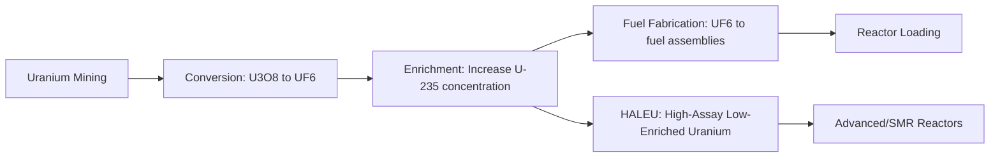

## Nuclear Fuel Supply Chains and Uranium Enrichment

### Overview: The Nuclear Fuel Cycle and Its Chokepoint

Nuclear fuel supply chains follow a distinct multi-stage industrial process — mining, conversion, enrichment, and fabrication — before uranium becomes usable reactor fuel. Unlike oil (chokepoint at maritime transit) or rare earths (chokepoint at chemical separation), the nuclear fuel chain's critical chokepoint sits specifically at **enrichment**, a highly capital-intensive, technically specialized process where a single state actor — Russia, through its state nuclear corporation Rosatom — commands a dominant share of global capacity built on Soviet-era industrial infrastructure that the West chose not to compete with for decades.

**Key Points**

- Russia's dominance stems mainly from industrial infrastructure inherited from the Soviet era: Rosatom operates four enrichment complexes with combined capacity exceeding 27 million SWU per year, built during the Cold War and kept at full capacity throughout the 2000s by supplying the West with cheap enrichment services — a pricing strategy that made developing rival Western capacity seem economically unfeasible for two decades.
- Russia commands approximately 44-46% of global uranium enrichment capacity and roughly 20% of conversion services, creating a structural chokepoint for Western utilities that closely parallels the rare earth midstream refining concentration documented elsewhere in this course, though concentrated in a different geopolitical actor (Russia rather than China).
- This dominance means that roughly 20% of US reactor fuel and 25% of EU nuclear fuel demand currently depend on Russian supplies.

---

### The Nuclear Fuel Cycle: Four-Stage Structure

**Stage 1 — Mining:**

Raw uranium ore is extracted and processed into a concentrate known as yellowcake (U₃O₈). Kazakhstan is the world's largest uranium-producing country, a geographic fact that carries its own geopolitical significance given Kazakhstan's unguarded, second-longest continuous land border in the world shared with Russia — creating potential for Russian influence over the mining stage even where enrichment capacity sits elsewhere.

**Stage 2 — Conversion:**

Yellowcake is chemically converted into uranium hexafluoride (UF₆) gas, the feedstock form required for enrichment. This stage requires specialized chemical handling equipment and extensive regulatory approvals that limit rapid capacity expansion, and Western conversion capacity represents only about 20% of global capacity — creating dependency on Russian and Chinese processors that extends supply chain vulnerability beyond mining and enrichment into this often-overlooked chemical processing step.

**Stage 3 — Enrichment:**

UF₆ gas is processed (historically via gaseous diffusion, now predominantly via gas centrifuge technology) to increase the concentration of the fissile isotope uranium-235 relative to natural uranium's ~0.7% concentration, typically to 3-5% for conventional light-water reactors. The unit of measurement for enrichment services is the **Separative Work Unit (SWU)**, the standard metric used in trading enrichment capacity and products.

**Stage 4 — Fabrication:**

Enriched UF₆ is converted into uranium dioxide (UO₂) and formed into fuel pellets, which are loaded into fuel rods and assembled into fuel assemblies specific to a given reactor design (e.g., Russian VVER-type reactors require Russian-design fuel assemblies, creating an additional lock-in beyond raw enrichment dependency for countries operating Russian-supplied reactors).

---

### Global Enrichment Capacity Concentration (2026)

| Metric | Figure |
| --- | --- |
| Global enrichment capacity | ~55.6–65 million SWU/year (estimates vary by source/year) |
| Russia's share of global enrichment capacity | ~44-46% |
| Russia + China combined share | ~54% |
| Western enrichment capacity (absolute) | ~8 million SWU/year |
| Western share of global capacity | <13% |
| Rosatom's four enrichment complexes combined capacity | >27 million SWU/year |

**Key Points**

- Western enrichment capacity operates at approximately 8 million SWU annually against global capacity of roughly 65 million SWU, representing less than 13% of worldwide processing capability — a concentration ratio comparable in severity to the rare earth refining bottleneck (China ~90%) though somewhat less extreme in absolute percentage terms.
- Current enrichment capacity utilization rates in Western facilities already approach maximum operational levels, leaving minimal surplus capacity to absorb displaced volumes if Russian supply were suddenly curtailed — meaning the West's enrichment vulnerability is not merely about having a smaller share, but about having essentially no spare capacity buffer within that smaller share.
- From 2023-2035, global markets are projected to require roughly 783 million SWU cumulatively, with US needs representing about 23% of that total — a demand baseline against which the current ~8 million SWU/year Western capacity must be measured when assessing the scale of the buildout required.

---

### The HALEU Bottleneck: A Sharper, Narrower Chokepoint

**High-Assay Low-Enriched Uranium (HALEU)** — enriched to between 5% and 20% U-235 — is required for many advanced reactor designs, including most small modular reactors (SMRs) and next-generation reactor concepts increasingly discussed in the context of rising electricity demand (including AI-driven data center electricity needs).

**Key Points**

- Russia remains the only global commercial supplier of HALEU at meaningful scale, making this an even more acute and narrower chokepoint than conventional low-enriched uranium (LEU) enrichment, where at least Western alternatives (Urenco, Orano, Centrus) exist even if capacity-constrained.
- This creates a structural deficit particularly acute for advanced reactors: new Western enrichment capacity from Urenco, Orano, and Centrus is projected to meet only about 30% of demand by 2030, leaving HALEU-dependent advanced reactor programs especially exposed. [Inference] Given that HALEU-fueled SMRs are frequently positioned as a key technology for meeting rising electricity demand (including from AI data centers) on a faster deployment timeline than conventional large reactors, this bottleneck creates a potential contradiction: the reactor technology marketed as fastest-to-deploy may in practice be constrained by the least-diversified segment of the nuclear fuel supply chain.

---

### US Policy Response: The Russian Suspension Agreement and Import Restrictions

**Historical Framework:**

Efforts to limit Russian enriched uranium supply to the US market date to the "Russian Suspension Agreement," reached between Russia and the US Department of Commerce in 1992, establishing a longstanding but imperfect quota framework.

**Quota Evolution:**

A subsequent amendment capped Russian supply at 20% of US demand (measured in SWU) in 2022 and 24% in 2023, dropping back to 20% between 2024 and 2027, and to 15% subsequently — a gradually tightening quota schedule designed to phase down dependency over time rather than through an abrupt cutoff.

**2024 Import Ban and Price Impact:**

The US ban on Russian enriched uranium in 2024 removed about a quarter of the country's reactor fuel supply, driving enrichment prices up by 56% to $252 per SWU by 2026 — a direct, measurable price consequence of the policy-driven supply reduction, illustrating how abruptly tightening a concentrated supply chain (even for legitimate security reasons) generates immediate market price effects, mirroring dynamics seen in rare earth and other critical mineral markets when concentrated suppliers are restricted.

**Section 232 Classification:**

The US government's Section 232 review classifies uranium as a critical mineral, establishing legislative authority for domestic price floors, import restrictions, and preferential procurement frameworks targeting reduced Russian-origin uranium dependency, reinforced by an accompanying domestic production executive order.

---

### European Dependency and the "Strategic Window" Concern

**Scale of EU Dependency:**

Despite representing a much smaller financial value compared to fossil fuel imports (roughly EUR 1 billion versus EUR 23 billion for fossil fuels in 2024), Europe's dependence on Russian nuclear infrastructure poses unique strategic risk given the multi-decade operational lifespan of nuclear infrastructure and reactor-specific fuel assembly lock-in, particularly for VVER-type reactors operated across Central and Eastern Europe for which Russia serves as the primary or sole fuel supplier.

**Analysts' Warning — Rosatom's "Strategic Window":**

The next five years are described as critical to whether Western allies can wean themselves off dependence on Rosatom, with analysts characterizing this period as a "strategic window" during which Rosatom may seek to lock in continued European dependence before Western alternative capacity comes fully online.

**Circumvention Patterns:**

Research has documented complex trade patterns suggesting Russia may be adapting to restrictions rather than simply losing market access — for example, reporting has documented delivery of Russian enriched uranium to Germany, through the French port of Dunkirk, for use at a French fuel assembly plant in Lingen, potentially providing an additional option for Russian enriched uranium imports no longer welcome in other markets. [Inference] This mirrors the shadow-fleet and cross-jurisdictional evasion patterns documented in the Russian energy exports topic, suggesting Russia applies similar adaptive-circumvention logic across its oil, gas, and nuclear fuel export sectors when facing Western restrictions.

**China as a Potential Circumvention Channel:**

Some analysts have suggested that should Russian uranium supplies be more comprehensively sanctioned in the West, China may seek to boost exports of Chinese-origin enriched uranium to Western countries while itself purchasing Russian material — a triangulation pattern that would preserve aggregate Russian revenue while nominally complying with country-of-origin restrictions, a circumvention structure conceptually similar to the shared shadow-fleet infrastructure servicing multiple sanctioned oil exporters interchangeably.

---

### Western Capacity Expansion Efforts

| Company | Country/Region | Expansion Plan |
| --- | --- | --- |
| Urenco | Netherlands (Almelo) + US | Plans to add 2.5 million SWU by 2030 |
| Orano | France | Announced investment to expand enrichment capacity |
| Centrus | United States | Part of the Western capacity buildout, though collectively projected to meet only ~30% of demand growth by 2030 |

**Key Points**

- Urenco possesses the technical capability to significantly expand its operations but requires long-term purchase agreements to justify the necessary investment — a bankability constraint directly analogous to the offtake-agreement financing structures documented in the allied minerals partnerships topic, where private capital requires demand certainty before committing to capital-intensive capacity buildout.
- Without new Western enrichment capacity, global enrichment needs are projected to exceed annual non-Russian supply by 6% to 20% through roughly 2038 — a persistent, multi-decade structural deficit rather than a near-term transitional gap, assuming current legislative and investment trajectories.

---

### Fiscal and Strategic Context for Russia

In comparison to oil and gas, foreign revenues for nuclear fuel services are not substantial enough to create the kind of overwhelming economic dependency Russia has on hydrocarbon exports — nuclear fuel cycle services and products accounted for a few billion dollars in recent annual figures, a figure that includes back-end fuel cycle services, providing Rosatom a useful but ultimately replaceable revenue stream that supplements its broader business rather than constituting a core fiscal pillar.

**Key Points**

- [Inference] This distinguishes uranium enrichment from oil/gas as a geopolitical lever: while the *revenue* stakes for Russia are comparatively modest, the *leverage* stakes for the West are disproportionately high, because nuclear fuel dependency is embedded in decades-long reactor operating licenses and safety-certified supply relationships that cannot be rapidly substituted the way an oil cargo can be resourced from an alternative seller — making this a case where supplier revenue dependency and buyer strategic vulnerability are structurally mismatched in magnitude.
- Russia is projected to control nearly 36% of mined uranium by 2040 in addition to its enrichment dominance, suggesting Moscow's strategy extends across the full fuel cycle (mining, conversion, and enrichment) rather than concentrating solely on the enrichment chokepoint — a vertically integrated approach to nuclear fuel supply chain influence.

---

### Structural Diagram: Nuclear Fuel Chain Chokepoint (svg_diagram)

<svg xmlns="http://www.w3.org/2000/svg" viewBox="0 0 900 400">
<rect width="900" height="400" fill="#ffffff" />
<text x="450" y="26" font-size="16" font-weight="bold" text-anchor="middle" fill="#1a1a1a">Nuclear Fuel Cycle: Russian Concentration by Stage (svg_diagram)</text>
<rect x="30" y="60" width="180" height="70" rx="8" fill="#e8f0fe" stroke="#4472c4" stroke-width="2" />
<text x="120" y="88" font-size="12" text-anchor="middle" font-weight="bold">Mining</text>
<text x="120" y="105" font-size="10" text-anchor="middle">Kazakhstan: largest</text>
<text x="120" y="118" font-size="10" text-anchor="middle">producer (Russia-adjacent)</text>
<rect x="240" y="60" width="180" height="70" rx="8" fill="#fff2cc" stroke="#d6a000" stroke-width="2" />
<text x="330" y="88" font-size="12" text-anchor="middle" font-weight="bold">Conversion</text>
<text x="330" y="105" font-size="10" text-anchor="middle">Russia/China: ~80%</text>
<text x="330" y="118" font-size="10" text-anchor="middle">West: ~20% capacity</text>
<rect x="450" y="50" width="220" height="90" rx="8" fill="#fce4e4" stroke="#c0392b" stroke-width="3" />
<text x="560" y="75" font-size="12.5" text-anchor="middle" font-weight="bold" fill="#c0392b">ENRICHMENT</text>
<text x="560" y="93" font-size="10" text-anchor="middle">Russia: ~44-46% global</text>
<text x="560" y="107" font-size="10" text-anchor="middle">West: &lt;13% (~8M SWU/yr)</text>
<text x="560" y="121" font-size="10" text-anchor="middle">HALEU: Russia sole large supplier</text>
<rect x="710" y="60" width="160" height="70" rx="8" fill="#e2f0d9" stroke="#548235" stroke-width="2" />
<text x="790" y="88" font-size="12" text-anchor="middle" font-weight="bold">Fabrication</text>
<text x="790" y="105" font-size="10" text-anchor="middle">Reactor-specific</text>
<text x="790" y="118" font-size="10" text-anchor="middle">(VVER lock-in)</text>
<line x1="210" y1="95" x2="235" y2="95" stroke="#333" stroke-width="1.5" marker-end="url(#arrowD)" />
<line x1="420" y1="95" x2="445" y2="95" stroke="#333" stroke-width="1.5" marker-end="url(#arrowD)" />
<line x1="670" y1="95" x2="705" y2="95" stroke="#333" stroke-width="1.5" marker-end="url(#arrowD)" />
<rect x="150" y="190" width="600" height="110" rx="8" fill="#fdebd0" stroke="#e67e22" stroke-width="2" />
<text x="450" y="215" font-size="12.5" text-anchor="middle" font-weight="bold">Policy Response Timeline</text>
<text x="450" y="238" font-size="10.5" text-anchor="middle">2024: US bans Russian enriched uranium imports → price +56% to $252/SWU</text>
<text x="450" y="256" font-size="10.5" text-anchor="middle">2024-2027: Suspension Agreement quota held at 20% of US demand</text>
<text x="450" y="274" font-size="10.5" text-anchor="middle">Post-2027: Quota drops to 15%; Western capacity (Urenco/Orano/Centrus)</text>
<text x="450" y="290" font-size="10.5" text-anchor="middle">projected to cover only ~30% of demand growth by 2030</text>
<rect x="130" y="320" width="640" height="50" rx="6" fill="#f2f2f2" stroke="#888" stroke-width="1" />
<text x="450" y="340" font-size="10.5" text-anchor="middle" font-weight="bold">Structural deficit projected: non-Russian supply falls 6-20% short of demand through ~2038</text>
<text x="450" y="358" font-size="10" text-anchor="middle">Europe's "strategic window" risk: next 5 years critical to reducing Rosatom lock-in</text>
</svg>

---

### Practical Example: Interpreting a Utility's Fuel Procurement Risk

A nuclear utility assessing its exposure to this chokepoint should examine four layers rather than a single "percent Russian" headline figure: (1) mining source diversity, (2) conversion service provider and jurisdiction, (3) enrichment service provider and remaining contract duration, and (4) fabrication compatibility with the utility's specific reactor design (particularly for VVER operators, where switching fuel-assembly suppliers requires safety re-certification, not just a commercial contract change). [Inference] A utility with diversified mining and conversion sourcing but a long-term enrichment contract with Rosatom remains substantially exposed at the chokepoint stage regardless of upstream diversification — precisely mirroring how diversified rare earth mining does not resolve exposure if midstream refining remains concentrated, reinforcing this course's recurring theme that the *processing* stage, not the *raw material* stage, is generally the more decisive point of geopolitical leverage across critical supply chains.

---

**Related Topics**

- Small modular reactor (SMR) deployment timelines and their dependency on HALEU availability
- Kazakhstan's uranium mining dominance and its geopolitical position between Russia and Western markets
- VVER reactor fuel-assembly lock-in and reactor-design-specific supply chain switching costs
- Section 232 critical mineral classification and its application beyond uranium
- Comparative analysis: rare earth refining concentration (China) vs. uranium enrichment concentration (Russia) as parallel midstream chokepoint case studies
- Rising electricity demand from AI data centers and its effect on nuclear fuel demand projections
- US and EU strategic uranium/enriched-material stockpile adequacy assessments