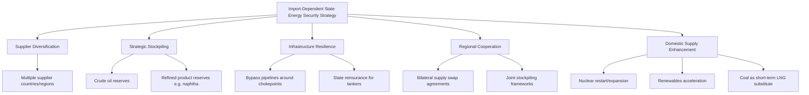

## Energy Security Strategies of Import-Dependent States

### Overview: The Structural Problem of Import Dependence

Import-dependent states — nations lacking sufficient domestic oil, gas, coal, or uranium resources to meet their own energy consumption — face a distinct category of energy security challenge that differs fundamentally from resource-rich or resource-exporting states. Net energy imports account for over 80% of consumption in Japan and South Korea, a proportion higher than most major European economies and far higher than resource-producing states like China, which retains significant domestic coal, oil, and (historically) natural gas production. This chapter area synthesizes how these states have historically responded to import dependence, and how the 2026 Strait of Hormuz crisis has served as the most severe real-world stress test of these strategies in decades.

**Key Points**

- Import-dependent states typically pursue a common strategic toolkit: **diversification** (of supplier countries and energy sources), **stockpiling** (strategic reserves to buffer short-term disruption), **infrastructure resilience** (bypass routes, alternative transport), and increasingly, **regional cooperation** (mutual assistance arrangements with similarly exposed neighbors).
- The 2026 Iran-US war and resulting Strait of Hormuz crisis (see that topic) has forced these strategies from theoretical planning into live, real-time implementation, exposing both the value and the limits of pre-crisis preparation.
- Countries with structurally similar exposure (e.g., Japan and South Korea) have historically pursued largely independent, parallel diversification strategies, but 2026 has seen a marked shift toward direct bilateral and regional cooperation as a supplementary layer of protection.

---

### Comparative Import Dependency Profiles (2026)

| Country | Import Dependency | Primary Risk Factors |
| --- | --- | --- |
| Japan | ~88% | Middle Eastern chokepoints, LNG price volatility |
| South Korea | ~82% | Similar regional risks, nuclear policy constraints |
| Taiwan | ~98%+ | Extreme vulnerability, geopolitical isolation |
| Germany | ~45%+ | Post-2022 Russian supply restructuring |

**Key Points**

- Japan's energy mix in 2026 shows LNG concentration of roughly 37-38% of total energy mix, coal reliance around 27-28% for industrial baseload requirements, and a nuclear capacity factor of only about 30.6% utilization of available reactors — reflecting the continued post-Fukushima constraint on nuclear generation even amid renewed emphasis on nuclear as a diversification tool.
- Japan's LNG supplier concentration itself carries risk: Australia provides roughly 32-34% of LNG imports and Qatar contributes roughly 28-30%, meaning that even LNG — often framed as the flexible, diversified alternative to pipeline gas (see the natural gas/LNG topic) — remains meaningfully concentrated among a small number of supplier countries for Japan specifically.
- In 2025, the Middle East supplied about 95% of Japan's crude imports and 11% of its LNG, while 70% of South Korea's imported crude came from the Middle East, along with 20% of its LNG — this extreme regional concentration in crude oil sourcing (as opposed to more diversified LNG sourcing) is the central vulnerability exposed by the 2026 Hormuz crisis.

---

### Core Strategic Toolkit

---

### Japan's 2026 Response: Comprehensive Policy Package

Japan's government unveiled a sweeping energy policy package on August 26, 2026, presented at a green transformation meeting at Prime Minister Sanae Takaichi's office in Tokyo, as conflict in the Middle East continued to strain one of the world's most critical oil shipping routes. The plan spans oil supply diversification, pipeline cooperation, naphtha stockpiling, and expanded renewable and nuclear power — a broad response to mounting pressure on a resource-poor nation heavily dependent on Middle Eastern crude.

**Core Mechanism — Levy-Funded Diversification Subsidy:**

One of the package's core mechanisms is a levy imposed on oil wholesalers and trading firms, with the proceeds funding subsidies for businesses that import crude bypassing the Strait of Hormuz — offsetting the higher costs of sourcing oil from non-Middle Eastern regions and making diversification financially workable for importers who would otherwise default to cheaper, familiar supply chains.

**Key Points**

- This levy-subsidy structure is a notable market-design solution to a well-documented diversification problem: absent intervention, individual importers face a collective-action disincentive to diversify away from the cheapest (typically most concentrated) supply source, even when national security considerations favor diversification — the levy internalizes the security externality that individual firms would not otherwise account for. [Inference]
- Pipeline infrastructure cooperation with Middle Eastern nations is being coordinated through the Japan Organization for Metals and Energy Security (JOGMEC) — the same institutional body responsible for Japan's rare earth urban mining policy (see that topic), reflecting JOGMEC's role as Japan's central resource-security institution spanning both energy and critical minerals.
- Policy moves in Japan have focused on improving the resiliency of energy supplies, including financing oil pipelines that bypass the Strait of Hormuz, increasing crude stockpiles, and providing state reinsurance for oil tankers — the state reinsurance mechanism directly addresses the war-risk insurance cost spike documented in the Strait of Hormuz topic, where private insurance became prohibitively expensive or unavailable.

---

### South Korea's Parallel but Distinct Response

While Japan has taken a more cautious and incremental approach with fossil fuels still a featured component of its future energy mix, South Korea is looking to speed up electrification and accelerate its renewables build-out — a notable strategic divergence between two countries facing structurally similar import dependency.

**Export Restriction as a Domestic Security Tool:**

South Korea, which ships more oil products and produces more petrochemicals than Japan, has imposed curbs on refined products exports and a ban on naphtha exports — using export restriction as a mechanism to preserve domestic supply availability during the crisis, a policy tool distinct from Japan's import-diversification-subsidy approach.

**Key Points**

- [Inference] This divergence reflects each country's differing position in the regional value chain: South Korea's larger refining and petrochemical export sector gives it export-restriction as a viable lever (retaining more refined product domestically), while Japan's more consumption-oriented energy profile makes upstream import diversification the more relevant lever — the same underlying import vulnerability produces different optimal policy responses depending on each country's position in the broader energy value chain.
- Both countries have turned to coal and nuclear power to limit LNG consumption in the short term while leaning on releases of strategic stockpiles to replace some lost crude imports — demonstrating the standard crisis-response sequence of substituting toward less-affected energy sources while drawing down reserves as a bridge, rather than immediately absorbing the full price and volume shock.

---

### The Shift Toward Regional Cooperation (2026)

A structurally significant development in 2026 is the move beyond purely independent, parallel diversification strategies toward direct bilateral cooperation between similarly exposed states.

**Japan-South Korea Summit Agreement (May 2026):**

Prime Minister Sanae Takaichi and South Korean President Lee Jae Myung agreed to deepen Japan-ROK coordination on energy security, supply chains, and regional deterrence, launching a new bilateral cooperation initiative focused on securing energy supply chains — including petroleum products and LNG — under the framework of the updated "Free and Open Indo-Pacific" strategy and the "POWERR Asia" initiative. The agreement includes plans to strengthen regional energy stockpiling and explore mutual crude oil, petroleum product, and LNG supply swaps between Japan and South Korea.

**Extension to Southeast Asia:**

As the prolonged Iran war destabilized East Asia's energy supply chains, South Korea and Japan moved to establish a joint defensive framework aimed at minimizing Middle East-driven disruptions, with leaders agreeing to support stockpiling-system development in Southeast Asian countries with limited petroleum reserve capacity — extending the bilateral framework into a broader regional resilience architecture, partly framed as a mechanism to counter expanding Chinese influence across Southeast Asia through energy cooperation.

**Formal Implementation (September 2026):**

On September 2, 2026, officials from South Korea and Japan held their first implementation meeting for their Supply Chain Partnership in Tokyo, marking the transition of the cooperation framework from summit-level agreement to operational implementation. The partnership introduces a layer of protection beyond traditional diversification: regional cooperation between two countries that face many of the same external risks, enabling mutual assistance (such as reserve or supply swaps) precisely when both partners' traditional supplier diversification has already been exhausted or stressed by a shared regional crisis.

**Key Points**

- [Inference] The Japan-South Korea partnership represents an evolution beyond the traditional import-dependent-state playbook of independent diversification and stockpiling: because both countries share highly correlated risk exposure (same Middle Eastern chokepoint, same shipping routes), mutual supply swaps only provide genuine additional protection if the countries' crisis timing or severity is not perfectly correlated — meaning the partnership's practical value depends on scenarios where one partner is more acutely affected than the other at a given moment, rather than both being simultaneously and equally disrupted.
- The traditional response to import-dependence vulnerability has been diversification — importers sign contracts with suppliers in multiple countries, build strategic reserves, and invest in infrastructure — with regional cooperation functioning as a supplementary, not a replacement, layer of protection on top of this traditional toolkit.

---

### Structural Analysis: Common Elements Across Import-Dependent State Strategies

**Key Points**

- **Diversification has structural limits during systemic (not just single-supplier) disruption:** Because Japan and South Korea both draw heavily on the same Middle Eastern source region, geographic diversification *within* that region provides little protection against a region-wide disruption like the Hormuz crisis — true resilience requires diversification *away from* the region entirely (e.g., toward US, African, or other Asia-Pacific sources), which is a slower, more expensive transition than diversifying among multiple Middle Eastern suppliers. [Inference]
- **Stockpiles function as a bridge, not a solution:** Strategic reserve releases documented across Japan and South Korea's 2026 crisis response provide time for other adjustment mechanisms (fuel switching, demand reduction, alternative sourcing) to activate, but are inherently finite and cannot substitute for restored supply flows if a chokepoint disruption persists for an extended period — consistent with the IEA's August 2026 warning of rapidly diminishing global oil stockpiles documented in the Strait of Hormuz topic.
- **Infrastructure bypass investment reflects a shift from reactive to anticipatory resilience:** Financing pipelines that bypass the Strait of Hormuz represents an investment in redundant infrastructure specifically designed to reduce chokepoint dependency for future crises, not merely to respond to the current one — a longer-term structural adaptation distinct from the shorter-term tools (stockpile releases, export curbs) used for immediate crisis management.
- **Domestic supply enhancement (nuclear, renewables) operates on a longer timeline than the immediate crisis:** Efforts to accelerate renewables (South Korea) or increase nuclear capacity utilization (Japan) address energy security on a structural, multi-year basis rather than providing immediate relief from an active supply shock — these measures function as long-run risk-reduction investments prompted by, but not primarily intended to resolve, any single acute crisis.

---

### Diagram: Import-Dependent State Response Layers (svg_diagram)

<svg xmlns="http://www.w3.org/2000/svg" viewBox="0 0 900 380">
<rect width="900" height="380" fill="#ffffff" />
<text x="450" y="26" font-size="16" font-weight="bold" text-anchor="middle" fill="#1a1a1a">Import-Dependent State Response Timeline (svg_diagram)</text>
<rect x="30" y="60" width="200" height="80" rx="8" fill="#fce4e4" stroke="#c0392b" stroke-width="2" />
<text x="130" y="85" font-size="12" text-anchor="middle" font-weight="bold">Immediate (Days-Weeks)</text>
<text x="130" y="103" font-size="10" text-anchor="middle">Strategic stockpile releases</text>
<text x="130" y="117" font-size="10" text-anchor="middle">Export curbs (South Korea)</text>
<text x="130" y="131" font-size="10" text-anchor="middle">Fuel switching to coal</text>
<rect x="260" y="60" width="200" height="80" rx="8" fill="#fdebd0" stroke="#e67e22" stroke-width="2" />
<text x="360" y="85" font-size="12" text-anchor="middle" font-weight="bold">Near-term (Months)</text>
<text x="360" y="103" font-size="10" text-anchor="middle">Diversification subsidies (Japan levy)</text>
<text x="360" y="117" font-size="10" text-anchor="middle">State tanker reinsurance</text>
<text x="360" y="131" font-size="10" text-anchor="middle">Bilateral supply swap activation</text>
<rect x="490" y="60" width="200" height="80" rx="8" fill="#fff2cc" stroke="#d6a000" stroke-width="2" />
<text x="590" y="85" font-size="12" text-anchor="middle" font-weight="bold">Medium-term (1-3 Years)</text>
<text x="590" y="103" font-size="10" text-anchor="middle">Bypass pipeline construction</text>
<text x="590" y="117" font-size="10" text-anchor="middle">Regional stockpiling networks</text>
<text x="590" y="131" font-size="10" text-anchor="middle">(Japan-Korea-SE Asia)</text>
<rect x="720" y="60" width="150" height="80" rx="8" fill="#e2f0d9" stroke="#548235" stroke-width="2" />
<text x="795" y="85" font-size="12" text-anchor="middle" font-weight="bold">Long-term (3+ Years)</text>
<text x="795" y="103" font-size="10" text-anchor="middle">Nuclear capacity restoration</text>
<text x="795" y="117" font-size="10" text-anchor="middle">Renewables acceleration</text>
<text x="795" y="131" font-size="10" text-anchor="middle">(South Korea electrification)</text>
<line x1="230" y1="100" x2="255" y2="100" stroke="#333" stroke-width="1.5" marker-end="url(#arrowE)" />
<line x1="460" y1="100" x2="485" y2="100" stroke="#333" stroke-width="1.5" marker-end="url(#arrowE)" />
<line x1="690" y1="100" x2="715" y2="100" stroke="#333" stroke-width="1.5" marker-end="url(#arrowE)" />
<rect x="130" y="180" width="640" height="150" rx="8" fill="#f2f2f2" stroke="#888" stroke-width="1" />
<text x="450" y="205" font-size="12" text-anchor="middle" font-weight="bold">Trigger: 2026 Strait of Hormuz Crisis</text>
<text x="450" y="228" font-size="10.5" text-anchor="middle">Middle East supplies ~95% of Japan's crude, ~70% of South Korea's crude</text>
<text x="450" y="248" font-size="10.5" text-anchor="middle">Both nations' independent diversification strategies proved insufficient</text>
<text x="450" y="268" font-size="10.5" text-anchor="middle">against a region-wide chokepoint disruption (vs. single-supplier disruption)</text>
<text x="450" y="290" font-size="10.5" text-anchor="middle" font-style="italic">→ Prompted shift toward formal bilateral/regional cooperation frameworks</text>
<text x="450" y="310" font-size="10.5" text-anchor="middle" font-style="italic">as a supplementary layer beyond traditional independent diversification</text>
</svg>

---

### Practical Example: Evaluating an Import-Dependent State's Resilience Posture

When assessing whether an import-dependent state's energy security strategy is genuinely resilient (rather than merely diversified on paper), four questions drawn from the 2026 case studies are instructive:

1. **Is diversification geographic or merely nominal?** Multiple suppliers within the same vulnerable region (e.g., several Middle Eastern sellers) provide far less protection against a regional chokepoint event than suppliers in genuinely separate regions.
2. **How deep are strategic stockpiles relative to plausible disruption duration?** A stockpile sized for a two-week disruption provides limited protection against a crisis lasting six-plus months, as the 2026 Hormuz crisis has demonstrated.
3. **Does infrastructure resilience investment predate the crisis, or is it a reactive response?** Bypass pipeline financing announced *during* an active crisis (as with Japan's August 2026 package) takes years to materially change the country's chokepoint exposure — meaning its protective value is realized only for *future* crises, not the current one.
4. **Are regional cooperation frameworks operationally tested, or merely declared?** The distinction between the May 2026 Japan-South Korea summit agreement and the September 2026 first implementation meeting illustrates that formal agreements require a subsequent operational build-out before they provide genuine crisis-response capability. [Inference]

---

**Related Topics**

- The Strait of Hormuz crisis as the triggering event for 2026 energy security policy responses
- JOGMEC's dual role in Japan's energy and critical minerals security strategy
- OPEC+ spare capacity and its interaction with import-dependent state stockpile drawdown decisions
- LNG supplier concentration risk for Asian importers (Australia, Qatar dependency)
- Comparative European energy security strategy post-2022 Russian gas disruption
- "POWERR Asia" initiative and the broader Free and Open Indo-Pacific energy security framework
- Strategic petroleum reserve adequacy standards and international coordination mechanisms (IEA reserve obligations)