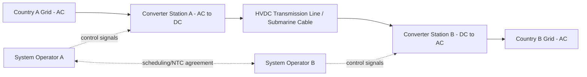

## Grid Infrastructure and Cross-Border Electricity Interconnection

### Overview

Cross-border electricity interconnection refers to the physical transmission infrastructure — high-voltage AC and DC lines, converter stations, and substations — that links national or regional power grids, enabling the exchange of electricity across political boundaries. Grid interconnection is a core instrument of energy security policy: it allows countries to pool generation capacity, balance intermittent renewable output, import cheaper power, and provide mutual emergency support during shortages or system failures. Geopolitically, interconnection creates asymmetric interdependence — the exporting country gains market access and revenue, while the importing country gains supply diversity but also exposure to external control, coercion, or infrastructure vulnerabilities.

### Core Technical Concepts

#### AC vs. HVDC Interconnection

**High-Voltage Alternating Current (HVAC)** interconnections are cheaper for short distances and allow synchronous grid integration, meaning connected systems share the same frequency (e.g., 50 Hz or 60 Hz) and phase angle. Synchronous interconnection permits seamless power flow but also means a disturbance (fault, generator trip, blackout) in one country can propagate instantly into neighboring grids.

**High-Voltage Direct Current (HVDC)** interconnections convert AC to DC at a converter station, transmit over the DC line, then convert back to AC at the receiving end. HVDC is preferred for:

- Long-distance transmission (lower line losses over distance)
- Submarine cables (AC suffers high capacitive losses underwater)
- Asynchronous interconnection — linking grids with different frequencies or unsynchronized phase, acting as an electrical "firewall" that isolates disturbances

$$P_{loss} \propto I^2 R$$

Since HVDC allows higher voltage transmission with lower reactive power losses, it is the standard choice for interconnectors exceeding roughly 600–800 km overhead or 50 km submarine.

#### Synchronous vs. Asynchronous Interconnection

- **Synchronous interconnection**: Grids operate as a single electrically coupled system (e.g., Continental European Synchronous Area covering most of the EU). Frequency deviations and faults propagate across the entire interconnected area, requiring tightly coordinated grid codes and reserve-sharing agreements.
- **Asynchronous interconnection** (via HVDC back-to-back or point-to-point links): Grids remain independently operated but exchange controlled power flows. This is the preferred architecture when political trust is limited, technical standards differ, or a country wants to retain sovereign control over its frequency regulation (e.g., the Baltic states' 2025 desynchronization from the Russia-controlled BRELL ring and synchronization with Continental Europe).

#### Interconnection Capacity Metrics

- **Net Transfer Capacity (NTC)**: Maximum power flow achievable between two bidding zones/countries while maintaining system security.
- **Available Transfer Capacity (ATC)**: NTC minus already-allocated capacity.
- **Interconnection ratio**: A commonly cited EU policy metric — the ratio of a country's cross-border transmission capacity to its installed generation capacity, with a 15% target set for 2030.

### Geopolitical Dimensions

#### Interdependence as Leverage and Vulnerability

Physical interconnection creates a structural dependency that can be exploited coercively or defensively:

- **Supply leverage**: A dominant exporter can throttle or cut flows for political ends (e.g., Russia's historical control over the Baltic grid synchronization umbilical, or threats around gas-fired electricity exports).
- **Sabotage exposure**: Undersea cables and cross-border towers are vulnerable to physical attack, sabotage, or "grey zone" incidents — e.g., the 2023 Balticconnector gas pipeline and telecom cable damage in the Baltic Sea, and subsequent scrutiny of subsea power cables like EstLink.
- **Emergency solidarity**: The EU's internal electricity market framework mandates member states offer emergency electricity assistance to neighbors during supply crises, converting interconnection into a mutual-security asset rather than pure market infrastructure.

#### Case Study: Baltic Desynchronization from BRELL

The Baltic states (Estonia, Latvia, Lithuania) were historically part of the BRELL ring (Belarus, Russia, Estonia, Latvia, Lithuania), a Soviet-era synchronous grid requiring Moscow-coordinated frequency control even after EU/NATO accession. In February 2025, the Baltics disconnected from BRELL and synchronized with the Continental European grid via Poland (the LitPol Link and new synchronous connections), eliminating a long-standing dependency that Russia could theoretically exploit to destabilize the Baltic grids. This is widely cited as a textbook case of interconnection re-architecture driven by security rather than economic logic.

#### Case Study: North Sea and European Offshore Grid

The North Seas Energy Cooperation coordinates HVDC interconnectors (e.g., NordLink between Norway and Germany, NSL/North Sea Link between Norway and the UK, Viking Link between Denmark and the UK) that combine offshore wind integration with cross-border trading capacity. These "hybrid" interconnectors serve dual purposes: exporting Norwegian hydro flexibility to balance German/UK renewables, and creating redundant supply routes that reduce any single country's exposure to domestic generation shortfalls.

#### ASEAN Power Grid and Regional Integration Ambitions

The ASEAN Power Grid initiative aims to link Southeast Asian national grids to enable multilateral power trade, notably the Lao PDR–Thailand–Malaysia–Singapore Power Integration Project (LTMS-PIP), which allows Laos (rich in hydropower) to export electricity through Thailand and Malaysia to Singapore. [Inference] Progress on full ASEAN grid integration has been slower than initially targeted, constrained by differing national regulatory frameworks, tariff-setting disputes, and uneven infrastructure investment across member states.

#### Africa: Missed Interconnection Potential

Africa has some of the world's lowest interconnection ratios despite significant complementary resource endowments (hydropower in Central/East Africa, solar in the Sahel, wind in North/Southern Africa). Regional power pools — the Southern African Power Pool (SAPP), West African Power Pool (WAPP), and Eastern Africa Power Pool (EAPP) — exist but suffer from underbuilt cross-border transmission relative to their trading ambitions, limiting the realized benefits of resource complementarity.

### Architecture of a Typical HVDC Interconnector

**Key components:**

- **Converter stations**: Use either Line-Commutated Converter (LCC) or Voltage Source Converter (VSC) technology. VSC-HVDC is increasingly preferred for its ability to independently control active and reactive power and support "black start" grid recovery.
- **Control and metering systems**: Enable real-time scheduling of power flows per bilateral or multilateral market agreements (e.g., day-ahead market coupling in the EU's Single Day-Ahead Coupling, SDAC).
- **Protection systems**: Isolate faults on either side to prevent cascading failures — critical because HVDC links, unlike synchronous AC ties, allow one side to be electrically "walled off" from a fault on the other.

### Policy and Governance Instruments

- **Grid codes and technical standards harmonization**: Interconnection requires agreement on frequency tolerances, voltage ranges, and protection coordination between transmission system operators (TSOs).
- **Capacity allocation mechanisms**: Explicit auctions, implicit allocation via market coupling, or long-term transmission rights, all of which affect how interconnection capacity translates into actual cross-border trade.
- **Regulatory bodies**: Regional coordination bodies such as ENTSO-E (Europe) and regional power pool secretariats (SAPP, WAPP) coordinate planning, though ultimate build-out decisions remain with national TSOs and governments, making political will a binding constraint independent of technical feasibility.

### Risk Factors Specific to Interconnection

| Risk category | Description |
| --- | --- |
| Sabotage/attack | Physical damage to cables, towers, or converter stations, particularly acute for undersea HVDC links |
| Coercive curtailment | Politically motivated throttling of flows by the exporting party |
| Cascading failure | Fault propagation in synchronous interconnections without adequate protection coordination |
| Asymmetric dependency | Import-heavy country with limited alternative supply sources facing negotiating leverage from the exporter |
| Underinvestment | Interconnectors requiring multilateral capital and permitting coordination often face longer lead times than domestic generation projects |

[Inference] The trend toward asynchronous (HVDC) rather than synchronous interconnection in politically sensitive corridors reflects a broader post-2022 shift in energy security thinking, prioritizing controllability and disturbance isolation over the cost efficiency of full synchronous integration.

**Related Topics:**

- Undersea cable and pipeline security in maritime chokepoints
- Regional power pools (SAPP, WAPP, EAPP, ASEAN Power Grid) governance structures
- LNG supply security and terminal diversification
- Critical mineral supply chains for grid and converter station hardware (e.g., rare earths, copper, semiconductors for power electronics)
- EU Emergency electricity solidarity mechanisms and capacity remuneration schemes
- Renewable energy intermittency and cross-border balancing markets