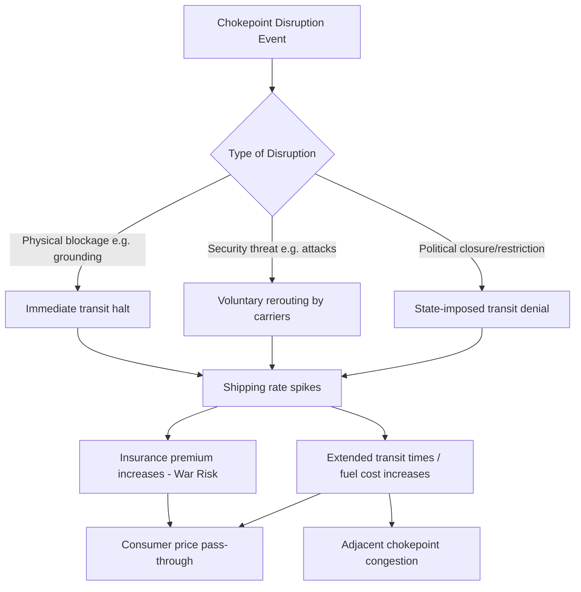

## The Eight Major Global Shipping Chokepoints

### Overview

Maritime chokepoints are narrow, high-traffic passages — straits, canals, or channels — through which a disproportionate share of global seaborne trade and energy shipments must transit due to the absence of viable alternative routes. Their strategic importance stems from three compounding factors: physical narrowness (limiting vessel size, speed, and traffic throughput), the absence of practical detours (rerouting typically adds thousands of nautical miles and days/weeks of transit time), and concentration of geopolitical risk (piracy, territorial disputes, terrorism, blockade, or state conflict along the route). Disruption at any single chokepoint can trigger global shipping rate spikes, insurance premium surges, and regional fuel or commodity shortages within days.

### The Eight Chokepoints

#### 1. Strait of Hormuz

Connects the Persian Gulf to the Gulf of Oman and the Arabian Sea, situated between Iran and Oman. It is the single most important oil chokepoint in the world, with roughly a fifth of global petroleum liquids consumption transiting it. At its narrowest point the shipping lane is approximately 33 km wide, with navigable channels only about 3 km wide in each direction. Iran has repeatedly threatened closure during periods of tension with the US and Gulf states; the US Fifth Fleet is headquartered in Bahrain specifically to secure this corridor. [Inference] A sustained closure is considered a low-probability but extremely high-impact scenario, since Iran would also lose its own oil export route through the strait.

#### 2. Strait of Malacca

Links the Indian Ocean to the South China Sea between Malaysia/Singapore and Indonesia (Sumatra), and is the primary route for oil and goods moving between the Middle East/Europe and East Asia (China, Japan, South Korea). It is the busiest strait globally by vessel count. Its narrowest point (the Phillips Channel near Singapore) is only about 2.8 km wide, creating a natural bottleneck vulnerable to congestion, piracy (historically significant in the 2000s, now reduced through coordinated patrols), and the theoretical "Malacca Dilemma" cited by Chinese strategic planners regarding China's energy import dependency on a corridor patrollable by the US Navy.

#### 3. Suez Canal

An artificial waterway connecting the Mediterranean Sea to the Red Sea via Egypt, eliminating the need to circumnavigate Africa via the Cape of Good Hope. It carries a substantial share of global containerized trade and is critical for Asia–Europe shipping. The March 2021 grounding of the *Ever Given* blocked the canal for six days, disrupting an estimated tens of billions of dollars in trade and exposing the fragility of single-channel chokepoints. Since late 2023, Houthi attacks on shipping in the adjacent Bab-el-Mandeb/Red Sea corridor have caused a significant share of container traffic to reroute around the Cape of Good Hope, demonstrating how chokepoint risk can propagate to adjacent chokepoints.

#### 4. Bab-el-Mandeb Strait

Located between Yemen (Arabian Peninsula) and Djibouti/Eritrea (Horn of Africa), connecting the Red Sea to the Gulf of Aden and Indian Ocean. It is the southern gateway to the Suez Canal route and thus functions as a linked chokepoint pair with Suez for Asia–Europe trade. Since 2023, Houthi missile and drone attacks on commercial vessels transiting this strait — framed as actions in solidarity with Gaza — have caused major shipping lines (Maersk, MSC, CMA CGM) to suspend transits and reroute via the Cape of Good Hope, adding roughly 10–14 days to Asia–Europe voyages.

#### 5. Bosphorus and Dardanelles Straits (Turkish Straits)

Connect the Black Sea to the Mediterranean Sea via the Sea of Marmara, entirely under Turkish sovereignty and governed by the 1936 Montreux Convention, which grants Turkey authority over warship transit in peacetime and wartime. This chokepoint is critical for Russian and Ukrainian grain exports and Caspian/Russian oil exports. Turkey invoked Montreux to close the straits to additional warships from all parties following Russia's full-scale invasion of Ukraine in 2022, illustrating how a single state's treaty-based control over a chokepoint can be leveraged during conflict.

#### 6. Danish Straits (including the Øresund)

Connect the Baltic Sea to the North Sea/Atlantic, controlled jointly by Denmark and Sweden. This is the primary export route for Russian and Baltic oil (including the "shadow fleet" of aging, opaquely-insured tankers used to circumvent Western oil price cap sanctions since 2022) and is a critical corridor for European trade with Scandinavia and the Baltics.

#### 7. Panama Canal

An artificial waterway across the Isthmus of Panama connecting the Atlantic (Caribbean Sea) and Pacific Oceans, avoiding circumnavigation of South America via the Drake Passage/Strait of Magellan. It is vital for US intracoastal trade, Latin American exports, and Asia–US East Coast container shipping. In 2023–2024, historic drought conditions (linked to El Niño) reduced Gatun Lake water levels, forcing the Panama Canal Authority to cut daily transit slots substantially, a rare example of a chokepoint constrained by climate/hydrological rather than geopolitical factors. [Inference] The episode has renewed policy attention on climate resilience as a distinct category of chokepoint risk alongside conflict and piracy. Additionally, 2025 saw renewed US political attention on canal "control" and Chinese port operator presence at either end, illustrating the chokepoint's re-emergence as a great-power competition flashpoint.

#### 8. Strait of Gibraltar (or, in alternate framings, the Strait of Taiwan/Luzon Strait)

Sources vary on the canonical "eight," and the Strait of Gibraltar is the most commonly cited eighth entry, connecting the Mediterranean Sea to the Atlantic Ocean between Spain and Morocco. It is essential for European trade with the Americas and Mediterranean access to the Atlantic; only about 13 km wide at its narrowest, it also serves as a major maritime border-control and migration chokepoint in addition to its shipping role. [Unverified] Some analytical lists substitute the Taiwan Strait or Lombok/Sunda Straits (Indonesia) as the eighth chokepoint depending on the source's regional focus (e.g., US EIA lists tend to emphasize oil transit chokepoints and include Lombok/Sunda as Malacca alternatives, while broader trade-security lists emphasize Gibraltar); this content treats Gibraltar as the eighth given its role in the commonly referenced US-Europe-Mediterranean framing, while noting Taiwan Strait's growing salience given China-Taiwan tensions and its centrality to semiconductor supply chain shipping.

### Comparative Summary

| Chokepoint | Connects | Controlling/Adjacent States | Primary Cargo Risk |
| --- | --- | --- | --- |
| Hormuz | Persian Gulf ↔ Gulf of Oman | Iran, Oman | Crude oil, LNG |
| Malacca | Indian Ocean ↔ South China Sea | Malaysia, Indonesia, Singapore | Oil, containerized goods |
| Suez Canal | Mediterranean ↔ Red Sea | Egypt | Containers, oil, LNG |
| Bab-el-Mandeb | Red Sea ↔ Gulf of Aden | Yemen, Djibouti, Eritrea | Containers, oil (linked to Suez) |
| Turkish Straits | Black Sea ↔ Mediterranean | Turkey (Montreux Convention) | Grain, oil |
| Danish Straits | Baltic Sea ↔ North Sea | Denmark, Sweden | Oil (incl. shadow fleet), European trade |
| Panama Canal | Atlantic ↔ Pacific | Panama | Containers, LNG, grain |
| Gibraltar | Mediterranean ↔ Atlantic | Spain, Morocco (UK: Gibraltar) | European-American trade |

### Risk Propagation Dynamics

### Analytical Frameworks for Assessing Chokepoint Risk

- **Substitutability**: Does a viable (even if costlier/slower) alternative route exist? Suez/Bab-el-Mandeb has a substitute (Cape of Good Hope); Hormuz has essentially no substitute for Gulf oil exporters, making it structurally higher-risk despite lower incident frequency.
- **Sovereign control concentration**: Single-state control (Turkish Straits, Panama, Suez) creates clearer diplomatic leverage points than multi-state shared straits (Malacca, Hormuz), though the latter carry higher risk of uncoordinated escalation.
- **Cargo criticality**: Energy chokepoints (Hormuz, Danish Straits) have more immediate macroeconomic and inflationary transmission than general containerized-goods chokepoints, though the latter affect consumer goods availability and manufacturing supply chains.

**Related Topics:**

- Strait of Hormuz closure scenarios and oil price transmission mechanisms
- Houthi Red Sea campaign and shipping rerouting economics
- Montreux Convention and Turkish control of Black Sea access
- Panama Canal drought resilience and climate-linked chokepoint risk
- "Shadow fleet" sanctions evasion and maritime insurance gaps
- Naval presence and freedom of navigation operations (FONOPs) in contested straits