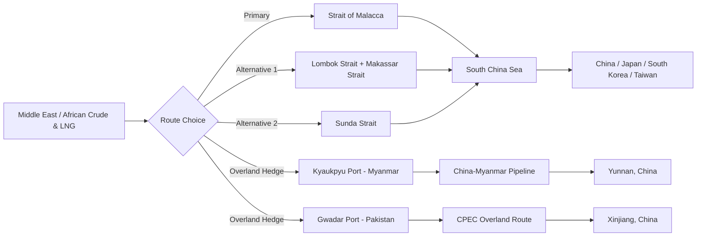

## The Strait of Malacca and Indo-Pacific Energy Flows

### Overview

The Strait of Malacca is a roughly 930 km long sea passage between the Malay Peninsula (Malaysia) and the Indonesian island of Sumatra, connecting the Indian Ocean (via the Andaman Sea) to the South China Sea and the wider Pacific. It is the shortest and most heavily used sea route between the Persian Gulf/Indian Ocean crude oil suppliers and the major energy-importing economies of Northeast and Southeast Asia — China, Japan, South Korea, and Taiwan. Its combination of extremely high traffic volume, physical narrowness, and lack of a practical short alternative makes it the central artery of Indo-Pacific energy security.

### Physical and Navigational Characteristics

- **Length**: Approximately 930 km, running between the Malaysian/Singaporean coast and Sumatra.
- **Narrowest point**: The Phillips Channel, near Singapore, narrows to roughly 2.8 km wide at its most constrained point.
- **Depth constraints**: Shallow sections restrict the maximum vessel draft, giving rise to the "Malaccamax" vessel classification — the largest ship dimensions (particularly draft, around 25 m) that can safely transit the strait fully laden. Very large crude carriers (VLCCs) and ultra-large container vessels exceeding Malaccamax specifications must partially offload cargo, transit at reduced load, or route via the alternative Lombok/Sunda Straits through Indonesia.
- **Traffic density**: One of the busiest shipping lanes globally by vessel count, carrying a large share of global seaborne oil trade alongside container and LNG traffic.

### Energy Flow Volumes and Composition

A very large share of Middle Eastern and African crude oil bound for East Asia transits the Strait of Malacca, alongside significant volumes of LNG (particularly from Qatar and, increasingly, the US and Australia) destined for Japan, South Korea, and China. [Inference] Because China, Japan, and South Korea have limited indigenous crude production and heavy reliance on Gulf and African suppliers, the strait functions as the single largest structural chokepoint in their energy security calculus, exceeding even the Strait of Hormuz in strategic salience for these importers since Hormuz risk is upstream of Malacca risk on the same voyage.

### The "Malacca Dilemma"

The term "Malacca Dilemma" (马六甲困局) was popularized in Chinese strategic discourse to describe Beijing's structural vulnerability: the overwhelming majority of China's seaborne energy imports transit a strait that is not under Chinese control and is within reach of the US Navy and allied Southeast Asian states (Singapore, Malaysia). In a conflict scenario — particularly one involving Taiwan — the US or allied navies could theoretically interdict or blockade Chinese-bound shipping at Malacca, a scenario Chinese planners have explicitly sought to hedge against. This dilemma has directly motivated several strategic responses:

- **Belt and Road Initiative (BRI) overland energy corridors**: Pipelines such as the China–Myanmar oil and gas pipeline (running from the Bay of Bengal port of Kyaukpyu to Yunnan province) allow a portion of Middle Eastern and African crude/LNG to bypass Malacca entirely by landing on the Indian Ocean coast and transiting overland.
- **China–Pakistan Economic Corridor (CPEC)**: The port of Gwadar in Pakistan is frequently cited as a potential (though not yet fully realized) alternative unloading point feeding overland routes into Xinjiang, reducing theoretical reliance on the Malacca corridor.
- **Strategic petroleum reserve buildout**: China has substantially expanded strategic crude oil reserves partly as a buffer against short-to-medium-term chokepoint disruption.
- **Naval modernization and "far seas" power projection**: Investments in a blue-water navy and overseas logistics facilities (e.g., Djibouti) are partly aimed at extending China's ability to protect its own sea lines of communication (SLOCs) rather than relying solely on others' security guarantees.

[Inference] Despite these hedges, the overland alternatives collectively handle only a small fraction of China's total crude import volume relative to the seaborne Malacca route, meaning the dilemma remains largely unresolved in practical capacity terms even two decades after the term was coined.

### Alternative Routing Options and Their Limits

- **Lombok and Sunda Straits (Indonesia)**: Deeper alternatives capable of handling Malaccamax-exceeding vessels (including fully laden VLCCs), but add substantial extra distance and transit time, and pass entirely through Indonesian territorial waters, substituting one single-state chokepoint dependency (Malaysia/Singapore/Indonesia jointly for Malacca) for another (Indonesia alone).
- **Northern Sea Route (Arctic)**: [Speculation] Occasionally raised as a long-term seasonal alternative for Russia-to-China energy flows as Arctic ice recedes, but remains commercially and technically marginal relative to Malacca volumes and is unusable for Middle East-origin cargo.

### Security Governance and Multilateral Cooperation

Unlike single-state-controlled chokepoints (Suez, Panama, the Turkish Straits), the Strait of Malacca is jointly bordered by three littoral states — Indonesia, Malaysia, and Singapore — with no single sovereign authority. Security cooperation is coordinated through:

- **Malacca Strait Patrols (MSP)**: A framework combining sea patrols (MSSP), air patrols (Eyes-in-the-Sky), and an intelligence exchange group, established by the three littoral states (later joined in intelligence-sharing by Thailand) in response to a spike in piracy incidents in the early-to-mid 2000s.
- **International Maritime Organization (IMO) cooperative mechanisms**: Facilitate burden-sharing between littoral states and major user states/beneficiaries (Japan notably contributes technical and financial support given its heavy dependence on the strait).
- **Piracy trend**: Piracy incidents fell sharply from their mid-2000s peak due to coordinated patrols, though low-level armed robbery against ships (rather than large-scale hijacking) persists at a reduced baseline level in the Singapore Strait approaches.

### Strategic Risk Scenarios

| Scenario | Mechanism | Relative Likelihood |
| --- | --- | --- |
| Piracy/armed robbery | Localized, low-intensity, mainly opportunistic theft | Ongoing, low-severity |
| Accidental blockage (grounding, collision) | High traffic density in a narrow channel raises collision/grounding risk | [Inference] Plausible given traffic volume, though no Suez-scale blockage has occurred historically |
| State-based interdiction/blockade | US or allied interdiction of China-bound shipping during a Taiwan contingency | [Speculation] Widely discussed in strategic literature as a theoretical leverage point, but actual execution would carry immense escalation risk and affect all users of the strait, not just the targeted party |
| Territorial/jurisdictional dispute among littoral states | Disagreement over patrol authority or resource rights | Low; littoral cooperation has been comparatively durable since the 2000s |

### Economic Transmission Mechanism

A disruption at Malacca does not act in isolation — it compounds with upstream chokepoint risk (Hormuz, Bab-el-Mandeb) along the same voyage for Gulf-origin cargo, meaning Indo-Pacific energy security is a function of the *combined* reliability of the entire sea lane of communication rather than any single strait. Analysts commonly model this as a "chain of chokepoints": a disruption probability at Hormuz, compounded with a separate disruption probability at Malacca, yields a combined transit risk exceeding either individual segment.

$$P_{disruption,total} = 1 - (1 - P_{Hormuz})(1 - P_{Malacca})$$

**Related Topics:**

- China's strategic petroleum reserve policy and drawdown mechanisms
- China–Myanmar and China–Pakistan overland energy corridors (BRI energy infrastructure)
- South China Sea territorial disputes and their intersection with SLOC security
- US Indo-Pacific naval posture and freedom of navigation operations
- LNG shipping routes and Qatar/Australia/US export flows to Northeast Asia
- Piracy and maritime domain awareness cooperation frameworks in Southeast Asia