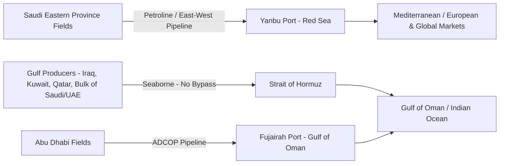

## The Strait of Hormuz and Oil Transit Risk

### Overview

The Strait of Hormuz is a narrow waterway between Iran to the north and Oman (the Musandam exclave) to the south, connecting the Persian Gulf to the Gulf of Oman and, beyond it, the Arabian Sea and Indian Ocean. It is the single most consequential energy chokepoint in the world: essentially all seaborne crude oil, condensate, and liquefied natural gas exported from Saudi Arabia, Iraq, the UAE, Kuwait, and Qatar must pass through it, as there is no comparable-capacity maritime alternative. Its risk profile is distinguished from other chokepoints by the direct control one littoral state (Iran) exercises over a shared international waterway with no ownership stake in the alternative supply routes available to importers.

### Physical and Navigational Characteristics

- **Overall width**: Approximately 33 km at its narrowest point between Iran and Oman.
- **Navigable shipping lanes**: The actual traffic-separated shipping channels are much narrower — roughly 3 km wide inbound and outbound, separated by a buffer zone, meaning the effective navigable corridor for laden tankers is a fraction of the strait's total width.
- **Territorial waters overlap**: Because the strait is narrower than twice the standard 12-nautical-mile territorial sea limit, vessels transiting the deep-water channels pass through both Iranian and Omani territorial waters, giving Iran a direct legal and physical proximity to all transiting traffic regardless of destination.
- **Traffic composition**: Dominated by crude oil and condensate tankers and LNG carriers (principally Qatari LNG, one of the world's largest LNG export streams), alongside general cargo and container traffic serving Gulf ports.

### Scale of Oil and Gas Flows

A very large share of global seaborne crude oil and total global petroleum liquids consumption transits Hormuz, making it disproportionately significant relative to its physical size. The bulk of this flow is destined for Asian markets — China, India, Japan, and South Korea are the largest cumulative recipients of Hormuz-transiting crude — while a smaller share moves toward Europe and other markets. Qatar's LNG exports, a critical supply source for Japan, South Korea, and increasingly Europe (especially post-2022 as Europe diversified from Russian pipeline gas), also transit exclusively through Hormuz, meaning any disruption carries a dual crude-and-gas market impact.

### Iran's Strategic Leverage and Closure Threats

Iran has, at various points of heightened tension with the United States and Gulf Arab states (including during the 1980s Tanker War, the 2019 tanker seizure incidents, and periodic escalations tied to nuclear negotiations and regional conflicts), threatened to close the strait or has taken actions short of full closure such as:

- **Tanker seizures and harassment**: Iranian Revolutionary Guard Corps Navy (IRGCN) fast-attack craft have conducted close-quarters harassment of commercial and naval vessels, and Iran has on occasion seized foreign-flagged tankers, often citing environmental or regulatory pretexts tied to broader political disputes.
- **Mine-laying capability**: Iran maintains a substantial inventory of naval mines and has historically demonstrated willingness to use them (notably during the 1980s Tanker War), which would represent the most plausible mechanism for actually impeding transit, since mines are asymmetric, low-cost, and hard to fully clear quickly.
- **Anti-ship missile and fast-attack-craft "swarm" tactics**: Iran has developed coastal anti-ship ballistic and cruise missile systems and IRGCN swarm-boat doctrine specifically postured against a numerically and technologically superior US naval presence, reflecting an asymmetric approach to contesting the strait rather than conventional naval dominance.

[Inference] Most security analysts assess a full, sustained closure as a low-probability event because Iran itself depends on Hormuz for its own oil exports and would suffer severe self-inflicted economic and military costs (drawing direct US and likely multinational naval retaliation); the more probable risk vector is temporary harassment, seizures, or a brief mining/interdiction episode intended to signal resolve rather than achieve indefinite closure.

### US and Allied Naval Posture

The US Navy's **Fifth Fleet**, headquartered in Manama, Bahrain, is postured specifically around Gulf and Hormuz security, tasked with ensuring freedom of navigation for commercial shipping. Allied and partner naval presence includes:

- **International Maritime Security Construct (IMSC)/Operation Sentinel**: A US-led multinational coalition formed in 2019 to escort and provide surveillance for commercial shipping transiting the Strait of Hormuz and Gulf, formed in direct response to tanker seizure incidents.
- **European Maritime Awareness in the Strait of Hormuz (EMASoH/Agenor)**: A separate European-led (French-initiated) maritime security mission providing an alternative framework for European states preferring not to operate under direct US command.
- **Gulf Cooperation Council (GCC) naval cooperation**: Saudi Arabia, UAE, and other GCC states maintain their own naval and coast guard assets focused on Gulf approaches, though force projection capability lags significantly behind US assets.

### Alternative Routing and Bypass Infrastructure

Because Hormuz has no maritime alternative, Gulf oil exporters have invested in limited overland pipeline bypass capacity to partially hedge against closure risk:

- **Saudi Arabia — East-West Pipeline (Petroline)**: Runs from the Eastern Province oil fields to the Red Sea port of Yanbu, allowing a portion of Saudi crude to reach export markets via the Red Sea/Suez route instead of the Gulf/Hormuz route.
- **UAE — Abu Dhabi Crude Oil Pipeline (Habshan–Fujairah)**: Allows a portion of Abu Dhabi's crude to be exported from the port of Fujairah, on the Gulf of Oman coast, bypassing the Strait of Hormuz entirely.

[Inference] Even with these bypass pipelines, only a modest fraction of total Gulf export volume can be rerouted overland; the pipelines lack the aggregate capacity to substitute for Hormuz at anything close to full closure scale, meaning bypass infrastructure functions as risk mitigation at the margin rather than a genuine alternative to the strait.

### Market and Price Transmission Mechanisms

Oil markets price in Hormuz risk primarily through:

- **War risk insurance premiums**: Spike rapidly during periods of heightened tension, raising shipping costs for tankers transiting the Gulf even absent an actual incident.
- **Geopolitical risk premium in crude benchmarks**: Brent and other benchmarks typically incorporate an anticipatory premium during escalation periods, independent of any actual supply reduction, reflecting market pricing of tail risk.
- **Strategic petroleum reserves (SPR) as a buffer**: The US SPR and coordinated International Energy Agency (IEA) member state reserves exist partly to dampen the price and supply shock of a short-duration Hormuz disruption by allowing emergency releases.

$$\Delta P_{oil} = f(\text{probability of disruption}, \text{expected duration}, \text{available spare capacity, SPR releases})$$

### Comparative Risk Assessment vs. Other Chokepoints

| Factor | Strait of Hormuz | Strait of Malacca | Suez Canal |
| --- | --- | --- | --- |
| Alternative route availability | Very limited (partial pipeline bypass only) | Limited (Lombok/Sunda straits, longer) | Available (Cape of Good Hope, longer) |
| Primary cargo | Crude oil, LNG | Crude oil, containers | Containers, oil, LNG |
| Controlling state structure | Iran/Oman shared, Iran dominant leverage | Multi-state (Indonesia, Malaysia, Singapore) | Single state (Egypt) |
| Historical disruption pattern | Threats, seizures, mining (1980s); no full closure | Piracy (largely historical), no state-actor closure | Accidental blockage (2021); ongoing adjacent Red Sea attacks (2023–) |

**Related Topics:**

- Iran's asymmetric naval doctrine and IRGCN capabilities
- US Strategic Petroleum Reserve and IEA coordinated emergency response mechanisms
- Gulf pipeline bypass infrastructure (Petroline, ADCOP) capacity limits
- Qatari LNG export dependency and Hormuz risk transmission to gas markets
- Tanker war risk insurance markets and premium pricing mechanisms
- US-Iran escalation dynamics and their historical linkage to oil price shocks