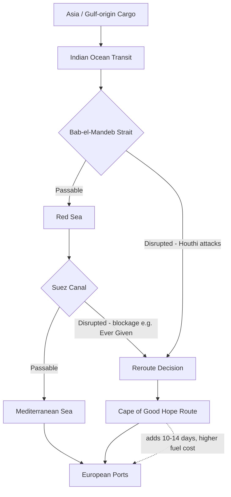

## The Suez Canal and the Bab-el-Mandeb Strait

### Overview

The Suez Canal and the Bab-el-Mandeb Strait form a linked pair of chokepoints that together constitute the primary maritime corridor connecting Asian and Middle Eastern trade with Europe and the Atlantic. The Suez Canal is an artificial waterway across the Isthmus of Egypt joining the Mediterranean and Red Seas; Bab-el-Mandeb is the natural strait at the southern mouth of the Red Sea, between Yemen and the Horn of Africa, through which all Suez-bound traffic from the Indian Ocean must pass. Because a vessel cannot reach the Suez Canal from Asia or the Gulf without first transiting Bab-el-Mandeb, a disruption at either point functionally closes the entire corridor, making them best analyzed as a single compound chokepoint rather than two independent risks.

### The Suez Canal: Technical Characteristics

- **Route**: Connects Port Said on the Mediterranean to Suez on the Red Sea, running approximately 193 km through Egyptian territory, entirely artificial (no natural strait).
- **No tidal locks**: Unlike the Panama Canal, Suez is a sea-level canal with no locks, since the Mediterranean and Red Sea are at approximately the same elevation — this removes hydrological/water-level constraints as an operating factor (unlike Panama's freshwater lock dependency) but means the canal's usable width and depth are the binding physical constraints.
- **New Suez Canal expansion (2015)**: Egypt added a parallel channel along part of the route to allow simultaneous two-way transit for a portion of the canal's length, increasing daily transit capacity and partially reducing (though not eliminating) single-channel blockage risk.
- **Governance**: Operated by the Suez Canal Authority (SCA), a fully Egyptian state entity; transit is governed internationally by the 1888 Convention of Constantinople, which guarantees free passage to vessels of all nations in peace and war, though Egypt retains sovereign operational and security control.

### The 2021 Ever Given Grounding: A Case Study in Single-Channel Risk

In March 2021, the container ship *Ever Given* ran aground diagonally across a single-channel section of the canal due to high winds and a sandstorm, completely blocking transit in both directions for six days. The incident is widely cited in supply chain and chokepoint literature because it demonstrated:

- **Physical/accidental disruption vs. geopolitical disruption**: The blockage arose from weather and navigational error, not conflict or state action, illustrating that chokepoint risk is not limited to geopolitical scenarios.
- **Cascading logistics impact**: The resulting vessel backlog took days to clear even after refloating, and disrupted sailing schedules and container availability for weeks afterward globally, showing how short physical blockages generate disproportionate, long-tailed supply chain effects.
- **Insurance and liability complexity**: The incident triggered a prolonged legal dispute between the vessel's owners/insurers and the Suez Canal Authority over compensation, illustrating the legal fragility of liability frameworks for chokepoint disruptions.

### Bab-el-Mandeb Strait: Technical Characteristics

- **Location**: Between Yemen (Arabian Peninsula) on one side and Djibouti and Eritrea (Horn of Africa) on the other, with the small Yemeni island of Perim dividing the strait into two channels.
- **Width**: The main eastern channel is approximately 25–30 km wide, narrower than Hormuz's overall width but wider than the Malacca Phillips Channel; the western channel near Perim island is much narrower.
- **Traffic**: All northbound Red Sea/Suez-bound traffic from the Indian Ocean, Gulf, and Asia passes through it, including crude oil and LNG cargoes from the Gulf destined for Europe via Suez, and Asia–Europe containerized trade.

### The 2023–Present Houthi Red Sea Campaign

Beginning in late 2023, Yemen's Houthi movement, citing solidarity with Gaza during the Israel-Hamas conflict, began launching missile, drone, and small-boat attacks against commercial vessels transiting Bab-el-Mandeb and the southern Red Sea, targeting vessels perceived as linked to Israel, the US, or the UK, though targeting has in practice affected a much broader range of shipping.

**Effects on shipping:**

- Major container lines (Maersk, MSC, CMA CGM, Hapag-Lloyd) suspended Red Sea transits and rerouted around the Cape of Good Hope, adding an estimated 10–14 days and several thousand nautical miles to Asia–Europe voyages.
- War risk insurance premiums for Red Sea transit rose sharply, and some insurers withdrew coverage for the route entirely for certain periods.
- **Operation Prosperity Guardian**: A US-led multinational naval coalition formed in December 2023 to protect commercial shipping in the Red Sea and Bab-el-Mandeb, later supplemented by the EU's separate Operation Aspides (2024), reflecting a similar bifurcated US-led/EU-led security architecture pattern seen at Hormuz.
- [Inference] The sustained rerouting around the Cape of Good Hope — rather than a return to Suez once initial strikes began — reflects shipping lines' risk-aversion given the difficulty of insuring against missile/drone strikes compared to more conventional piracy risk, and has persisted well beyond initial expectations of a short-term disruption.

### Compound Chokepoint Dynamics

Because Bab-el-Mandeb sits upstream of Suez on the same voyage, disruption at either point produces the same practical outcome for shippers — diversion to the Cape route — meaning the *effective* closure probability of the "Suez corridor" as experienced by shipping lines is higher than the closure probability of Suez alone.

$$P_{corridor\ disrupted} = 1 - (1 - P_{Suez})(1 - P_{BabelMandeb})$$

### Economic and Strategic Significance

A very substantial share of global containerized trade and a significant share of global seaborne oil trade historically transited the Suez/Bab-el-Mandeb corridor before the 2023 disruption, making it second only to Hormuz and Malacca in aggregate trade value affected. Egypt derives substantial annual revenue from canal transit fees, giving Cairo a direct fiscal stake in maintaining and expanding canal throughput and security — a dynamic that has, at times, put Egyptian economic interests in tension with the security realities imposed by Houthi attacks at the corridor's southern approach, over which Egypt has no control.

### Comparative Governance Structure

| Feature | Suez Canal | Bab-el-Mandeb |
| --- | --- | --- |
| Type | Artificial canal | Natural strait |
| Controlling authority | Single state (Egypt, via SCA) | No single controlling state; bordered by Yemen, Djibouti, Eritrea |
| Primary historical risk | Accidental blockage, past regional wars (1956, 1967-75 closure) | Piracy (Somali, historical), now missile/drone attacks (Houthi) |
| Security response model | Egyptian sovereign control, canal-based fee-funded security | Multinational naval coalitions (Prosperity Guardian, Aspides) |

**Related Topics:**

- Houthi missile and drone capabilities and their maritime targeting doctrine
- Cape of Good Hope rerouting economics and fuel/emissions cost implications
- Suez Canal Authority revenue dependency and Egyptian fiscal exposure
- War risk marine insurance markets in conflict-adjacent shipping lanes
- Historical Suez Canal closures (1956 Suez Crisis, 1967–1975 closure)
- Red Sea naval coalition architecture (Prosperity Guardian vs. EU Aspides)