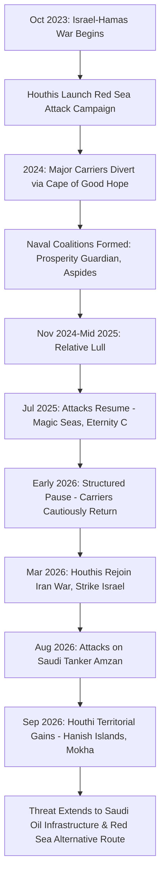

## The Red Sea Shipping Crisis and Attacks on Commercial Vessels

### Overview

The Red Sea shipping crisis refers to the sustained campaign of missile, drone, and small-boat attacks against commercial and naval vessels in the Red Sea and Bab-el-Mandeb Strait, initiated by Yemen's Houthi movement in late 2023 and continuing, with periods of pause and re-escalation, through 2026. What began as a stated act of solidarity with Gaza during the Israel-Hamas war evolved into a multi-year disruption of one of the world's most important trade corridors, drawing in multiple naval coalitions, reshaping global shipping routes, and repeatedly intersecting with the broader US-Israel-Iran regional confrontation.

### Origins and Escalation Timeline

- **October 2023**: Israel-Hamas war begins following the 7 October Hamas attack on Israel.
- **Late 2023**: The Houthis, leveraging their control of Yemen's Red Sea coastline and a substantial Iranian-supplied drone and ballistic/anti-ship missile arsenal, begin attacking vessels transiting the southern Red Sea and Bab-el-Mandeb, framing the campaign as pressure against Israel and its allies over the Gaza war.
- **January 2024**: The UN Security Council adopts Resolution 2722, condemning the attacks, later establishing a formal monthly reporting mechanism on Houthi attacks on merchant and commercial vessels. [globalsecurity](https://www.globalsecurity.org/military/library/news/2024/01/mil-240116-pdo05.htm)
- **2024**: Major container carriers (Maersk, MSC, CMA CGM, Hapag-Lloyd) suspend Red Sea transits and divert around the Cape of Good Hope; the US-led **Operation Prosperity Guardian** and the EU's **Operation Aspides** are established to protect shipping.
- **November 2024 – mid-2025**: A relative lull in direct attacks on commercial shipping, coinciding with a Gaza ceasefire process.
- **July 2025**: Attacks on civilian vessels transiting the Red Sea resume over 6–8 July 2025, prompting renewed UN condemnation. Around this period, Houthi attacks killed multiple mariners on vessels including the *Magic Seas* and the Liberian-flagged *Eternity C*, described as the first such attacks since November 2024 and a signal of a renewed campaign. [un](https://news.un.org/en/story/2025/07/1165378)
- **Early-to-mid 2026**: A further pause takes hold; container carriers begin restarting Red Sea services amid a reduction in Houthi attacks, including Maersk resuming an India-Middle East-US route, and Egypt opens a new semiautomated terminal at Sokhna Port near the southern Suez entrance to capture returning traffic. Analysts characterize this period not as genuine de-escalation but as a structured pause under tension, with Western naval forces remaining deployed. [Research — Feb 20, 2026 +2](https://www.spglobal.com/market-intelligence/en/news-insights/research/2026/02/red-sea-shipping-reopens)
- **28 March 2026**: The Houthis resume direct strikes on Israel and rejoin hostilities as part of the broader **2026 Iran war**, having paused following the 2025 Gaza ceasefire, launching ballistic missiles against Israel in coordination with Iran and Hezbollah. [Wikipedia](https://en.wikipedia.org/wiki/2026_Houthi_strikes_on_Israel)
- **Mid-2026**: The Security Council continues renewing its reporting mandate; as of July 2026, no new incidents had been reported that year, though continued Houthi threats to resume targeting Israeli-linked shipping and IRGC warnings indicated the underlying conditions remained unresolved. [Security Council Report](https://www.securitycouncilreport.org/monthly-forecast/2026-07/the-red-sea.php)
- **August 2026**: Attacks on shipping resume amid the wider US-Israel-Iran war. The Houthis claim an attack on the Saudi oil tanker "Amzan" off Yanbu, described as the latest in a series of strikes on Saudi-linked assets in support of Iran, raising fears of wider regional escalation. [Al Jazeera](https://www.aljazeera.com/news/2026/8/24/yemens-houthis-report-attack-on-saudi-ship)[Al Jazeera](https://www.aljazeera.com/news/2026/8/24/yemens-houthis-report-attack-on-saudi-ship)
- **September 2026**: The crisis escalates further as Houthi forces make territorial gains along the Yemeni coast. Houthi rebels capture the islands of Greater and Lesser Hanish in the southern Red Sea, tightening their grip on the shipping route, after previously advancing around the Bab-el-Mandeb Strait against Saudi-backed government forces. Their expanded territorial control further enables threats against Saudi crude oil shipments, which have functioned as an alternative to the Iran-threatened Strait of Hormuz, and adds pressure on global oil supplies and prices. Houthi forces also complete a takeover of the southern Red Sea port city of Mokha, and fire missiles and drones at Saudi Arabia's King Khalid Air Base, targeting hangars, radar installations, and ammunition depots, while Saudi Arabia sounds air raid sirens in border areas near Yemen. Analysts note Saudi Arabia has appeared reluctant to fully re-enter the war despite the attacks on its oil infrastructure and shipping. [Yemen's Houthi rebels seize more key islands in southern Red Sea, tighten grip on shipping routes +5](https://www.ksat.com/news/world/2026/09/14/yemens-houthi-rebels-seize-more-key-islands-in-southern-red-sea-tighten-grip-on-shipping-routes/)

### Strategic and Structural Dynamics

The 2026 escalation phase illustrates a critical structural shift from the 2023–2024 campaign: rather than solely targeting transiting commercial vessels with missiles and drones, the Houthis pursued direct territorial expansion along the Yemeni Red Sea coast, seizing islands and a port city near Bab-el-Mandeb. [Inference] Territorial control over the strait's immediate approaches represents a more durable form of leverage than episodic strikes, since it grants sustained observation and targeting capability over the corridor independent of any single attack's success, and directly threatens the Red Sea route that Gulf oil exporters (particularly Saudi Arabia) have historically used as a partial hedge against Strait of Hormuz risk — compounding pressure on global oil supply given Iran's simultaneous threats to shipping in Hormuz. [KSAT](https://www.ksat.com/news/world/2026/09/14/yemens-houthi-rebels-seize-more-key-islands-in-southern-red-sea-tighten-grip-on-shipping-routes/)

### Impact on Global Shipping and Trade

- **Rerouting economics**: Sustained diversion around the Cape of Good Hope has repeatedly added an estimated 10–14 days and thousands of nautical miles to Asia–Europe voyages during active-attack periods, with carriers alternating between Suez and Cape routing depending on the assessed threat level.
- **Freight rate volatility**: Reduced Suez transit during active attack phases increases effective fleet utilization and can push freight rates upward, while resumption of Suez transits (as seen in early 2026) frees capacity from the longer Cape of Good Hope diversion, creating downward pressure on freight rates. [spglobal](https://www.spglobal.com/market-intelligence/en/news-insights/research/2026/02/red-sea-shipping-reopens)
- **War risk insurance**: Premiums for Red Sea and Bab-el-Mandeb transit have spiked repeatedly with each escalation phase, and some insurers have periodically withdrawn or sharply restricted coverage for the route.
- **Port infrastructure investment continuing despite risk**: Egypt's 2026 investment in new Suez-adjacent terminal capacity at Sokhna Port during a lull period illustrates how regional actors continue betting on eventual normalization even amid recurring disruption cycles.

### Naval and Diplomatic Response Architecture

- **Operation Prosperity Guardian** (US-led, established December 2023): Multinational coalition protecting commercial shipping in the Red Sea and Gulf of Aden.
- **Operation Aspides** (EU-led, established 2024): A separate European naval mission with a defensive-only mandate, reflecting European states' preference for an independent command structure from the US-led coalition.
- **UN Security Council reporting mechanism**: Established under Resolution 2722 and continued through successor resolutions (including Resolution 2812), requiring periodic reporting on Houthi attacks and functioning as the primary multilateral monitoring and diplomatic pressure tool, with the Council periodically weighing whether to extend the reporting requirement and whether to pair renewal with calls for an inclusive UN-led political process in Yemen. [globalsecurity](https://www.globalsecurity.org/military/library/news/2024/01/mil-240116-pdo05.htm)[Security Council Report](https://www.securitycouncilreport.org/monthly-forecast/2026-07/the-red-sea.php)
- **Saudi-Houthi and intra-Yemeni dynamics**: The 2026 escalation has also drawn in Saudi-backed Yemeni government forces directly, who attempted to rally and fight back against Houthi advances around Bab-el-Mandeb before losing further ground, indicating the crisis is simultaneously an international shipping security issue and an active front in Yemen's internal civil conflict. [KSAT](https://www.ksat.com/news/world/2026/09/14/yemens-houthi-rebels-seize-more-key-islands-in-southern-red-sea-tighten-grip-on-shipping-routes/)

### Risk Assessment Framework

| Dimension | 2023–2024 Phase | 2025 Resumption | 2026 Escalation |
| --- | --- | --- | --- |
| Primary trigger | Israel-Hamas war (Gaza solidarity framing) | Post-ceasefire re-escalation | Houthi rejoining wider Iran-Israel-US war |
| Attack method | Missile/drone strikes on transiting vessels | Renewed missile/drone strikes, vessel sinkings | Strikes plus direct territorial seizure (islands, ports) |
| Geographic scope | Bab-el-Mandeb / southern Red Sea | Similar | Extends to Saudi mainland targets (airbases) and Saudi shipping |
| Shipping industry response | Mass diversion to Cape of Good Hope | Continued caution, partial diversion | Renewed caution after brief 2026 normalization attempt |

[Inference] The recurring pattern of partial normalization followed by renewed escalation suggests the underlying conflict drivers — the unresolved Yemeni civil war, the Houthis' alignment with Iran, and the broader Israel-Iran confrontation — function as a persistent structural risk to the corridor rather than a series of discrete, resolvable incidents, meaning shipping industry risk models increasingly treat Red Sea transit as conditionally available rather than reliably open.

**Related Topics:**

- Yemen's civil war and Houthi governance/territorial control
- UN Security Council resolutions on Red Sea shipping security (2722, 2768, 2812)
- Operation Prosperity Guardian vs. Operation Aspides command structures
- Iran-backed non-state actor "axis of resistance" maritime strategy
- Saudi Arabia's Red Sea oil export infrastructure and Hormuz-alternative routing
- Cape of Good Hope rerouting economics and global freight rate transmission