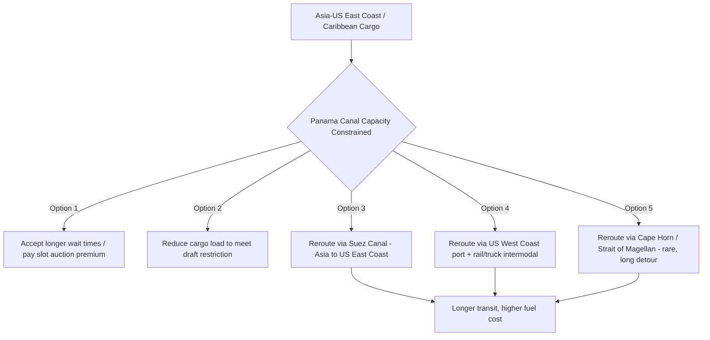

## The Panama Canal and the Impact of Drought on Transit Capacity

### Overview

The Panama Canal is an artificial, lock-based waterway across the Isthmus of Panama connecting the Atlantic Ocean (via the Caribbean Sea) and the Pacific Ocean, eliminating the need to circumnavigate South America via the Drake Passage or Strait of Magellan. Unlike the sea-level Suez Canal, Panama's operation depends entirely on freshwater lake reservoirs to fill and empty its lock chambers, making it uniquely exposed among major global chokepoints to a distinctly non-geopolitical risk category: hydrological/climate disruption. The 2023–2024 drought crisis, which forced historic transit restrictions, established water security as a first-order strategic variable for this chokepoint on par with conflict or sabotage risk at other chokepoints.

### Technical Operating Principles

- **Lock-based operation**: The canal uses a system of locks (historically the Gatun, Pedro Miguel, and Miraflores locks, joined by the larger Neopanamax/Cocoli and Agua Clara locks completed in the 2016 expansion) to raise and lower vessels approximately 26 meters between sea level and Gatun Lake, the canal's central elevated waterway.
- **Freshwater dependency**: Each lock transit consumes a substantial volume of fresh water from Gatun Lake (and the adjoining Alajuela Lake reservoir), which is released to the ocean during the lock-filling and emptying cycle rather than recirculated in the older lock systems (the newer Neopanamax locks incorporate water-saving basins that reuse a portion of the water). This water is drawn from a rainfall-dependent watershed rather than from the ocean itself, unlike Suez.
- **Dual role of Gatun Lake**: The lake serves simultaneously as the canal's operating reservoir and as Panama's primary source of municipal drinking water for Panama City and Colón, creating a direct competition between canal transit water demand and civilian water supply during drought periods.
- **Panamax and Neopanamax vessel classes**: The original lock dimensions defined the "Panamax" maximum vessel size; the 2016 expansion added larger "Neopanamax" locks accommodating substantially larger container ships and LNG carriers, but total system capacity remains bounded by available freshwater regardless of lock dimensions.

### The 2023–2024 Drought Crisis

Beginning in 2023, an unusually severe dry period — attributed to a combination of El Niño climate patterns and broader long-term precipitation trends in the region — caused Gatun Lake water levels to fall substantially below normal operating thresholds. In response, the Panama Canal Authority (Autoridad del Canal de Panamá, ACP) implemented a series of escalating restrictions:

- **Draft restrictions**: Maximum permitted vessel draft was progressively reduced, forcing some vessels to carry lighter loads (less cargo) to maintain adequate under-keel clearance in the shallower channel.
- **Daily transit slot reductions**: The ACP cut the number of daily transit slots substantially below the canal's normal operating capacity, from a typical baseline of around 36 transits per day down to roughly half that figure during the most acute restriction period.
- **Auction-based slot allocation and surcharges**: With capacity constrained, the ACP expanded auction mechanisms for priority booking slots, and shipping lines faced sharply higher effective transit costs as vessels competed for the reduced number of available slots or paid premiums to jump queues.
- **Extended wait times**: Vessels without pre-booked or auctioned slots faced extended anchorage waits, in some cases stretching to weeks, prompting some carriers to divert cargo to alternative routes.

### Alternative Routing During Restriction Periods

[Inference] The intermodal West Coast port-plus-rail alternative and Suez rerouting for Asia-US East Coast cargo were the two most commercially viable substitutes during the acute restriction period, since both offered established infrastructure, whereas Cape Horn/Magellan routing remained a marginal option given its substantially longer distance and harsher sailing conditions.

### Structural Water Management Responses

In response to the crisis, the ACP and Panamanian government pursued several structural mitigation measures:

- **Water-saving basin retrofits**: Expanded use of water-recycling basins (already present in the Neopanamax locks) to reduce the volume of fresh water discharged per transit.
- **Proposed new reservoir projects**: Panama has explored construction of additional reservoirs (such as on the Indio River) to expand the watershed's water storage capacity, though such projects face land acquisition, community displacement, and environmental approval challenges that create multi-year implementation timelines.
- **Demand management via pricing**: The shift toward auction-based and premium-priced slot allocation itself functions as a permanent demand-rationing tool, signaling that the ACP anticipates recurring water variability rather than treating 2023–2024 as a one-off anomaly.
- **Long-term climate adaptation planning**: [Inference] The severity of the 2023–2024 episode has elevated water security to a standing element of the ACP's capital planning process, likely to influence canal governance and investment priorities for years regardless of near-term rainfall recovery.

### Geopolitical Dimensions Beyond Hydrology

While the drought crisis was fundamentally a climate/infrastructure event rather than a geopolitical one, it intersected with pre-existing geopolitical dynamics around the canal:

- **US political attention on canal "control"**: The Panama Canal has historically been a subject of US strategic interest given its centrality to US intracoastal trade and naval logistics; renewed 2025–2026 US political rhetoric regarding the canal's operation and the role of foreign (including Chinese-linked) port operators at either terminus has layered a sovereignty and great-power competition dimension on top of the canal's operational vulnerabilities.
- **China's port presence**: Chinese state-linked or Hong Kong-based firms have historically operated container terminal concessions at Panama Canal ports (Balboa and Cristobal), a presence that has drawn US scrutiny as part of broader concerns about Chinese commercial footholds near strategically significant maritime infrastructure, independent of the drought issue itself.
- **Panamanian sovereignty considerations**: Panama fully assumed control of canal operations from the United States in 1999 under the Torrijos-Carter Treaties; any external pressure regarding canal governance intersects with this sovereignty history and Panamanian domestic political sensitivities.

### Comparative Chokepoint Risk Typology

| Risk category | Panama Canal (drought) | Suez Canal (Ever Given grounding) | Hormuz/Bab-el-Mandeb (conflict) |
| --- | --- | --- | --- |
| Root cause | Hydrological/climate | Navigational/weather accident | State or non-state armed conflict |
| Predictability | Seasonal/multi-year trends, some lead time via rainfall monitoring | Largely unpredictable, single-event | Escalation-linked, some early-warning indicators |
| Mitigation approach | Water management infrastructure, demand rationing | Wider channels, tug capacity, traffic management | Naval escort, convoy systems, rerouting |
| Recovery timeline | Multi-month to multi-year (watershed-dependent) | Days (as in 2021) | Highly variable, conflict-dependent |

### Broader Significance for Supply Chain Risk Modeling

The Panama Canal drought episode is frequently cited in supply chain risk literature as the clearest case demonstrating that chokepoint vulnerability analysis cannot be limited to conflict, piracy, and state coercion scenarios. [Inference] It has prompted supply chain risk and insurance modeling frameworks to more systematically incorporate climate and hydrological variables (rainfall patterns, El Niño/La Niña cycles, long-term regional precipitation trends) alongside traditional geopolitical risk factors when assessing chokepoint reliability, given that a chokepoint can become structurally capacity-constrained through environmental mechanisms entirely independent of any state or non-state actor's intent.

$$Capacity_{effective} = \min(Capacity_{lock\ infrastructure},\ Capacity_{water\ availability})$$

This equation captures the core lesson of the episode: Panama's *nominal* engineered capacity (defined by lock dimensions and the 2016 expansion) was never the binding constraint during the crisis — water availability was — meaning infrastructure investment alone cannot guarantee throughput without corresponding water resource security.

**Related Topics:**

- El Niño/La Niña climate cycles and their transmission to global trade infrastructure
- Chinese port operator presence at strategic maritime chokepoints (Panama, Djibouti, Piraeus)
- US-Panama sovereignty history and the Torrijos-Carter Treaties
- Intermodal rerouting economics (US West Coast port + rail alternatives)
- Water-saving lock basin engineering and freshwater reservoir management
- Climate risk integration into supply chain and maritime insurance modeling