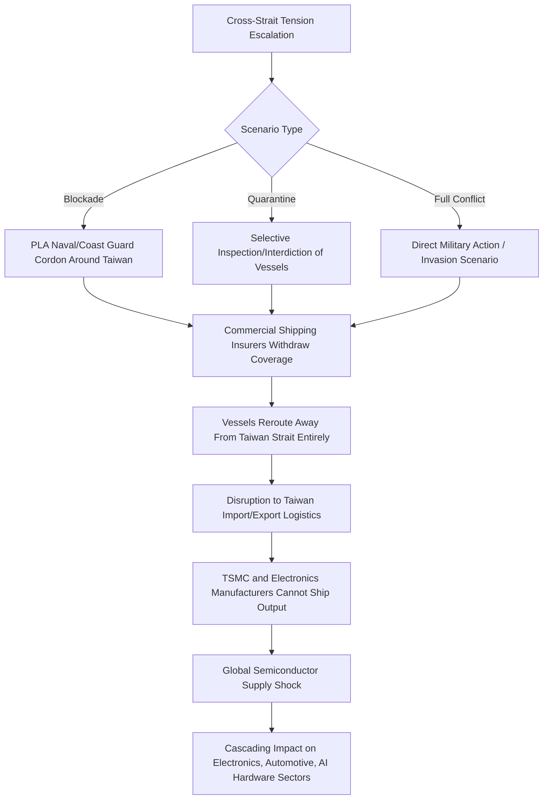

## The Taiwan Strait as a Chokepoint for Global Electronics Trade

### Overview

The Taiwan Strait is a roughly 180 km wide body of water separating mainland China from Taiwan, connecting the South China Sea to the East China Sea. Unlike traditional maritime chokepoints defined primarily by narrow physical geography (Hormuz, Malacca, Bab-el-Mandeb), the Taiwan Strait's chokepoint significance derives from a combination of shipping lane density, its proximity to the world's most concentrated advanced semiconductor manufacturing base, and acute military/political conflict risk stemming from the unresolved cross-strait sovereignty dispute between China and Taiwan. It functions simultaneously as a physical shipping chokepoint and as the geographic center of a much broader potential disruption to global electronics and semiconductor supply chains.

### Physical and Traffic Characteristics

- **Width and depth**: Approximately 180 km at its widest and around 130 km at its narrowest, considerably wider than Hormuz or Malacca, meaning it does not constrain vessel size or create the same physical bottleneck effect as narrower straits.
- **Traffic volume**: Despite its width, the strait carries an outsized share of global containerized trade because it lies directly on the primary shipping corridor between Northeast Asian manufacturing centers (China, South Korea, Japan) and Southeast Asian/global markets, with a large volume of vessels transiting or passing near it daily.
- **Nature of chokepoint risk**: Unlike Hormuz or Malacca, where the *strait itself* is the physical bottleneck, Taiwan Strait risk is primarily a *conflict exclusion zone* risk — a military conflict or blockade would not narrow the passable water but would render the area unsafe or legally closed for commercial transit, with insurers and flag states withdrawing coverage or barring transit entirely.

### The Semiconductor Concentration Factor

The Taiwan Strait's strategic salience for global electronics trade is inseparable from Taiwan's unique position in the global semiconductor supply chain:

- **TSMC and advanced node concentration**: Taiwan Semiconductor Manufacturing Company (TSMC) is the world's dominant foundry for the most advanced semiconductor process nodes, producing a very large share of the world's most advanced logic chips used in smartphones, AI accelerators, and high-performance computing.
- **Broader Taiwanese electronics ecosystem**: Beyond TSMC, Taiwan hosts a dense cluster of semiconductor packaging, testing, and electronics component manufacturers (e.g., ASE Technology, UMC, and numerous upstream materials and equipment suppliers), making the island's manufacturing base difficult to substitute quickly even for less advanced chip categories.
- **Downstream global dependency**: Because advanced semiconductors are foundational inputs to consumer electronics, automotive systems, telecommunications infrastructure, defense systems, and AI hardware, a disruption to Taiwan's export capability — whether through a blockade of the strait, damage to fabrication facilities, or workforce/logistics disruption from conflict — would propagate rapidly through global electronics and technology-dependent manufacturing supply chains far beyond the shipping delay itself.

[Inference] This dual nature — Taiwan Strait as both a shipping lane and the access corridor to an irreplaceable manufacturing base — distinguishes it from every other major chokepoint discussed in this course, since the primary risk is not merely rerouting cost (as with Suez or Bab-el-Mandeb) but the potential loss of access to a manufacturing capability with no near-term global substitute.

### Conflict Scenario Pathways

- **Blockade scenario**: China's People's Liberation Army (PLA) Navy and Coast Guard could establish a cordon around Taiwan's ports, restricting or halting commercial shipping in and out of the island, which — unlike a strait transit disruption elsewhere — would directly cut off Taiwan's own trade rather than merely inconveniencing pass-through traffic.
- **"Quarantine" or gray-zone inspection regime**: A less escalatory alternative discussed in strategic literature involves China asserting a right to inspect vessels bound for Taiwan under customs or security pretexts, creating de facto disruption without a formal blockade declaration.
- **Direct conflict scenario**: A full military conflict would almost certainly result in immediate, comprehensive commercial shipping avoidance of the strait and surrounding waters, with insurers invoking war-risk exclusions and flag states advising against transit.

### Comparative Risk Framing vs. Traditional Chokepoints

| Factor | Taiwan Strait | Strait of Hormuz | Strait of Malacca |
| --- | --- | --- | --- |
| Physical bottleneck | Minimal (wide strait) | Severe (narrow channels) | Severe (Phillips Channel) |
| Primary risk driver | Cross-strait conflict/blockade | State coercion, mining | Piracy (historical), state interdiction (theoretical) |
| Cargo at risk | General trade + irreplaceable semiconductor exports | Crude oil, LNG | Crude oil, containers |
| Substitutability of destination output | Very low (TSMC advanced nodes have no near-term substitute) | High (oil is fungible globally, though volume-constrained) | Moderate (goods reroutable, delayed) |
| Nature of disruption if triggered | Abrupt, high-severity, low-frequency | Threat/harassment more likely than full closure | Gradual, largely historical piracy risk |

### Strategic Responses and Diversification Efforts

In response to concentration risk, governments and firms have pursued several mitigation strategies, though with acknowledged limits:

- **Geographic diversification of fabrication capacity**: TSMC and other firms have announced and begun constructing fabrication facilities outside Taiwan (including in the US, Japan, and Germany), motivated explicitly by supply chain resilience concerns among other factors (subsidy incentives, market access).
- **US CHIPS Act and allied industrial policy**: The US CHIPS and Science Act, along with parallel initiatives in the EU, Japan, and South Korea, aim to expand domestic and allied semiconductor manufacturing capacity as a long-term hedge against Taiwan Strait disruption risk.
- **Stockpiling and inventory buffers**: [Inference] Some downstream electronics manufacturers reportedly maintain elevated semiconductor inventory buffers relative to historical just-in-time norms, partly as insurance against potential Taiwan-related supply disruption, though this is a costly strategy given the capital intensity of chip inventory.

[Inference] Despite this diversification push, the most advanced process nodes are expected to remain concentrated in Taiwan for a significant period, since replicating TSMC's leading-edge fabrication capability requires not just capital investment but a dense ecosystem of specialized suppliers, talent, and process know-how that cannot be quickly relocated, meaning meaningful risk reduction is a multi-year-to-decade project rather than a near-term fix.

### Naval and Diplomatic Dimensions

- **US "strategic ambiguity" and freedom of navigation operations**: The US Navy periodically conducts transits through the Taiwan Strait asserting its status as international waters, a practice China disputes, framing the strait as within its territorial jurisdiction — this recurring friction point is itself a standing feature of the chokepoint's risk landscape.
- **Regional stakeholder exposure**: Japan and South Korea, both heavily dependent on shipping lanes through or near the Taiwan Strait and on Taiwanese semiconductor inputs, have increasingly articulated direct security interest in cross-strait stability, beyond their traditional alliance commitments to the US.
- **Insurance and shipping industry contingency planning**: [Inference] Maritime insurers and major shipping lines reportedly maintain scenario-based contingency plans for Taiwan Strait transit suspension, reflecting the chokepoint's status as a recognized tail-risk event within the industry despite the absence of an active blockade as of the current period.

### Why This Chokepoint Differs From the "Traditional Eight"

Unlike Hormuz, Malacca, Suez, Bab-el-Mandeb, the Turkish Straits, the Danish Straits, Panama, and Gibraltar, the Taiwan Strait's chokepoint status is not primarily about physical geography constraining vessel movement, but about the concentration of an irreplaceable industrial capability behind a politically contested and potentially militarized passage. This distinction matters analytically: mitigating traditional chokepoint risk generally involves alternative *routes*; mitigating Taiwan Strait risk requires alternative *manufacturing capacity*, a fundamentally more expensive and slower form of resilience.

**Related Topics:**

- TSMC's global fabrication diversification (Arizona, Kumamoto, Dresden facilities)
- US CHIPS Act and allied semiconductor industrial policy
- Cross-strait military balance and PLA blockade/quarantine doctrine
- US freedom of navigation operations and "strategic ambiguity" policy
- Rare earth and critical mineral inputs to semiconductor manufacturing
- Japan and South Korea's economic security policies toward Taiwan-dependent supply chains