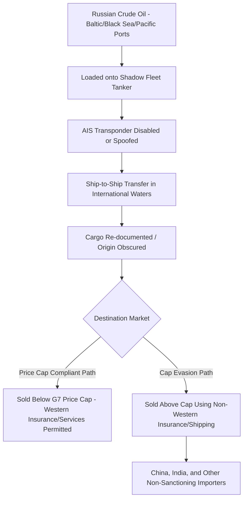

## Flag of Convenience Shipping and the Sanctioned Shadow Fleet

### Overview

Flag of convenience (FOC) shipping refers to the practice of registering a merchant vessel in a country other than that of its beneficial owner, typically to benefit from lower registration fees, reduced labor and safety regulation, lower taxation, and weaker enforcement oversight. While FOC registration has been a mainstream and largely legal feature of global shipping for decades, it has become a central enabling mechanism for the "shadow fleet" — a growing population of vessels used to circumvent international sanctions, particularly the Western price cap and export restrictions imposed on Russian oil exports following the 2022 invasion of Ukraine, and similarly used by Iran and, to a lesser extent, North Korea and Venezuela.

### Flag of Convenience: Core Mechanics

- **Open registries**: States such as Panama, Liberia, and the Marshall Islands operate "open registries" that allow foreign-owned vessels to register with minimal beneficial-ownership disclosure requirements, in exchange for registration fee revenue — a legitimate and long-standing revenue model that also, incidentally, provides an entry point for opacity-seeking actors.
- **Beneficial ownership obscuration**: FOC registration is frequently layered with shell company ownership structures, often domiciled in low-disclosure jurisdictions, making it difficult for regulators, insurers, and port authorities to identify the ultimate beneficial owner of a vessel or its cargo.
- **Flag-hopping**: Vessels engaged in sanctions evasion frequently change flag registration multiple times within short periods — sometimes registering with smaller or lesser-known open registries, or with unrecognized/quasi-state registries — to stay ahead of sanctions designations and port state control scrutiny.
- **Historical distinction from the "shadow fleet"**: FOC registration alone is not inherently illicit; the vast majority of global commercial shipping tonnage operates under open registries for ordinary commercial reasons. The shadow fleet phenomenon layers additional illicit-facilitation characteristics on top of standard FOC practice.

### The Shadow Fleet: Defining Characteristics

The "shadow fleet" (also termed "dark fleet" or "grey fleet") refers to a subset of aging tankers, largely acquired secondhand, that specifically enable the evasion of sanctions and price caps, primarily for Russian, Iranian, and Venezuelan crude oil exports. Its defining characteristics include:

- **Vessel age and condition**: Shadow fleet tankers are typically well beyond standard commercial fleet retirement age, often decades old, raising concerns about structural integrity, insufficient maintenance, and elevated spill/accident risk.
- **Opaque or inadequate insurance**: Many shadow fleet vessels lack coverage from the internationally recognized Protection and Indemnity (P&I) Club system (the mutual insurance associations that provide the vast majority of legitimate global tanker liability coverage), instead relying on newly formed, thinly capitalized, or Russian/opaque-jurisdiction insurers whose ability to pay out in a major spill or collision is questionable.
- **AIS (Automatic Identification System) manipulation**: Vessels frequently disable, spoof, or manipulate their AIS transponder signals — the satellite-tracked identification system vessels are required to broadcast — to obscure their location, particularly during ship-to-ship transfers or when approaching sanctioned ports.
- **Ship-to-ship (STS) transfers**: Cargo is frequently transferred between vessels at sea (often in international waters near jurisdictions with limited enforcement capacity) to obscure the cargo's origin before it reaches its final destination, allowing sanctioned-origin oil to be effectively "laundered" into the legitimate supply chain with falsified or ambiguous documentation.
- **Falsified documentation and "paper" trading**: Certificates of origin, cargo manifests, and other documentation are frequently falsified or structured through intermediary trading companies to disguise the true origin of sanctioned cargo.

### Mechanism: How the Shadow Fleet Circumvents the Russian Oil Price Cap

The G7-led Russian oil price cap mechanism (established December 2022) permits Western shipping, insurance, and financial services to be used for Russian oil trade only if sold at or below a specified price ceiling; the shadow fleet exists primarily to enable Russian crude to be sold *above* that cap by using non-Western-flagged, non-Western-insured vessels entirely outside the jurisdiction of Western enforcement mechanisms, thereby preserving Russian export revenue that the price cap was designed to constrain.

### Geographic Hotspots and Enforcement Response

- **Danish Straits**: A primary transit route for Russian Baltic oil exports, where Denmark and other Baltic states have raised alarm over shadow fleet vessels transiting without adequate insurance verification, given the environmental catastrophe risk of an uninsured aging tanker suffering a spill in these ecologically sensitive, heavily trafficked waters.
- **Baltic Sea security incidents**: Beyond oil transport, shadow fleet and other opaquely-owned vessels have been implicated in a series of suspected sabotage incidents involving undersea cables and pipelines in the Baltic Sea (following the 2022 Nord Stream pipeline explosions), raising the additional concern that ostensibly civilian shadow fleet vessels could be used for hybrid warfare purposes beyond pure sanctions evasion.
- **Sea of Marmara/Turkish Straits**: Turkey has periodically raised its own insurance verification requirements for tankers transiting the Bosphorus, citing environmental liability concerns given the strait's proximity to Istanbul's dense population.
- **Strait of Malacca and South China Sea**: Ship-to-ship transfers involving Iranian and, to a lesser extent, sanctioned North Korean cargo have been documented in this region, exploiting the area's high traffic density to obscure individual vessel movements.

### Policy and Enforcement Responses

- **Expanded sanctions designations**: The US, EU, and UK have progressively designated increasing numbers of individual shadow fleet vessels, their owning shell companies, and associated insurers, aiming to raise the compliance and re-flagging costs of continued operation.
- **Port state control and insurance verification requirements**: Some littoral states (Denmark, Estonia) have proposed or implemented enhanced verification of valid P&I Club insurance before permitting transit through their waters or territorial straits, testing the legal boundaries of a coastal state's authority to impose conditions on vessels exercising rights of innocent passage or transit passage under UNCLOS (the UN Convention on the Law of the Sea).
- **Classification society and flag state accountability pressure**: Efforts to pressure ship classification societies (which certify vessel seaworthiness) and flag registries to deregister or refuse certification to identified shadow fleet vessels, aiming to squeeze the fleet's ability to operate through the formal international maritime regulatory architecture rather than solely through direct sanctions.
- **Intelligence and satellite tracking initiatives**: Governments and independent research organizations increasingly use satellite imagery and AIS-gap analysis to identify and track shadow fleet vessels despite transponder manipulation, building a public evidence base for enforcement and insurance industry risk assessment.

### Legal and Governance Tensions

[Inference] The shadow fleet phenomenon exposes a structural tension in the international law of the sea: UNCLOS generally guarantees vessels rights of innocent passage and transit passage through straits regardless of flag or cargo, meaning coastal states attempting to impose insurance-verification conditions on shadow fleet vessels operate in a legally contested space, balancing environmental and security interests against established freedom-of-navigation norms that the same states rely upon for their own commercial and naval shipping elsewhere.

### Risk Typology Summary

| Risk dimension | Description |
| --- | --- |
| Environmental | Aging, poorly maintained, inadequately insured vessels pose elevated oil spill risk in ecologically sensitive chokepoints |
| Sanctions evasion | Core function — enables Russia, Iran, and other sanctioned exporters to preserve export revenue above imposed price/volume restrictions |
| Hybrid warfare exposure | Suspected use of shadow fleet-adjacent vessels in Baltic Sea cable/pipeline sabotage incidents |
| Insurance market integrity | Proliferation of thinly capitalized, non-P&I Club insurers undermines the reliability of the broader marine insurance liability system |
| Enforcement jurisdiction | Legal ambiguity over coastal state authority to impose conditions on transit-passage vessels under UNCLOS |

**Related Topics:**

- G7 Russian oil price cap mechanism and enforcement gaps
- Nord Stream pipeline sabotage and Baltic Sea hybrid warfare incidents
- UNCLOS transit passage and innocent passage legal frameworks
- P&I Club marine insurance system and liability coverage standards
- AIS spoofing and satellite-based maritime domain awareness technology
- Iranian and North Korean sanctions evasion shipping networks