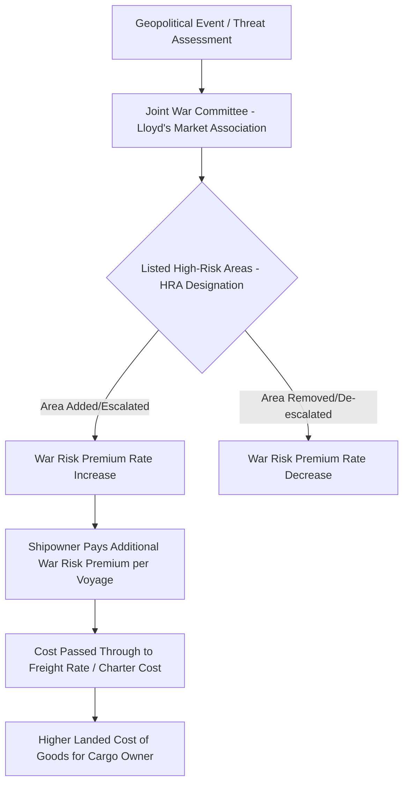

## War Risk Insurance and the Cost of Maritime Security

### Overview

War risk insurance is a specialized category of marine insurance covering losses arising from war, armed conflict, terrorism, piracy, and related political violence perils that are explicitly excluded from standard hull and cargo insurance policies. It functions as the primary market-based mechanism through which geopolitical chokepoint risk is priced, transmitted, and ultimately passed through to global trade costs. Understanding war risk insurance is essential to supply chain geopolitics because it converts diffuse, hard-to-quantify security risk (the probability of an attack, blockade, or mining incident) into a concrete, observable price signal that shipping lines, cargo owners, and ultimately consumers bear.

### Structure of Marine Insurance and the War Risk Carve-Out

Standard marine insurance is typically divided into several coverage lines, with war risk explicitly separated from ordinary marine perils:

- **Hull and Machinery (H&M) insurance**: Covers physical damage to the vessel itself from ordinary marine perils (storms, grounding, collision, fire) but standard policies contain a "war exclusion clause" removing coverage for war-related damage.
- **Protection and Indemnity (P&I) Club coverage**: Provided by mutual, non-profit P&I Clubs (organized under the International Group of P&I Clubs), covering third-party liability risks — crew injury, pollution, cargo damage liability, collision liability — again generally excluding war-related liability under standard terms.
- **Cargo insurance**: Covers loss or damage to the cargo itself, similarly excluding war perils under standard terms.
- **War Risk insurance (hull and cargo)**: A separate, specifically purchased policy layer that reinstates coverage for war, terrorism, piracy, and related perils, typically written by specialized war risk underwriters (often through Lloyd's of London syndicates) or dedicated War Risk mutual associations.

This structural separation exists because war and political violence risk is fundamentally different from ordinary marine peril risk in its correlation characteristics — war risk events can affect many vessels simultaneously in a geographically concentrated area (unlike, say, engine failure, which is largely vessel-specific and uncorrelated across a fleet), making it unsuitable for the same actuarial pooling models used for standard hull coverage.

### Pricing Mechanics

- **Joint War Committee (JWC)**: A market body operating under the Lloyd's Market Association that periodically reviews and publishes a list of "Listed Areas" — geographic zones designated as elevated war risk — based on ongoing assessment of conflict, piracy, and terrorism threat levels. Additions or expansions of Listed Areas (such as the Red Sea/Gulf of Aden following the 2023 Houthi campaign, or the Black Sea following Russia's 2022 invasion of Ukraine) trigger immediate market-wide premium increases for vessels transiting those zones.
- **Voyage-based vs. annual premiums**: War risk premiums are typically charged per voyage or per transit through a Listed Area, rather than as a flat annual premium, meaning costs scale directly and immediately with the frequency of transits through high-risk zones — a shipowner routing through the Red Sea repeatedly during an active threat period pays the premium on each transit.
- **Premium rate volatility**: Rates can spike by an order of magnitude within days of a significant escalatory event (a missile strike, a vessel seizure, a declared blockade) and can remain elevated for extended periods even absent further incidents, reflecting insurers' forward-looking assessment of continued risk rather than only realized losses.
- **Vessel-specific risk factors**: Premiums also vary by vessel type, flag state, ownership transparency, and — increasingly relevant given the shadow fleet phenomenon — the credibility and capitalization of the vessel's existing insurer, since reinsurers and war risk underwriters price in counterparty risk alongside geographic risk.

### Transmission to Broader Trade Costs

War risk insurance is one of several cost channels through which chokepoint disruption propagates into the broader economy, alongside rerouting distance/fuel costs and cargo delay costs. Its distinguishing feature is that it represents a cost increase that occurs even for vessels that continue transiting the affected route without any actual incident — it prices the probability and severity of a future event, not a realized loss, meaning it can raise trade costs immediately upon threat escalation, before any attack has actually occurred.

$$Cost_{voyage} = Cost_{fuel} + Cost_{time} + Premium_{war\ risk} + Premium_{standard\ marine}$$

During the 2023–2024 Red Sea crisis, this dynamic played out directly: shipping lines faced a choice between (a) continuing Suez/Bab-el-Mandeb transit while absorbing sharply elevated war risk premiums, or (b) diverting via the Cape of Good Hope, absorbing substantially higher fuel and time costs but avoiding the war risk premium entirely — illustrating how war risk insurance pricing functions as a direct input into the rerouting decision calculus, not merely a passive cost recorded after the fact.

### Case Studies in War Risk Premium Dynamics

- **Black Sea/Ukraine grain corridor**: Following Russia's 2022 invasion, war risk premiums for vessels serving Ukrainian Black Sea ports rose to levels that initially made grain export shipping commercially unviable without additional government-backed guarantee mechanisms, prompting the UN/Turkey-brokered Black Sea Grain Initiative (2022–2023) to include insurance facilitation provisions, and later Ukraine's own unilateral "humanitarian corridor" with reduced but still-elevated premiums.
- **Gulf of Guinea piracy**: West African waters, particularly off Nigeria, have carried elevated war risk/piracy premiums for extended periods due to sustained kidnap-for-ransom piracy activity, illustrating that war risk designation is not limited to state conflict but also captures organized criminal maritime violence.
- **Red Sea/Gulf of Aden (2023–present)**: As detailed in the Houthi campaign case study, premiums for this corridor have fluctuated sharply across multiple escalation and de-escalation cycles through 2024–2026, with some underwriters periodically withdrawing capacity entirely during acute escalation phases rather than merely raising price, reflecting a distinction between price-based risk transfer and outright unwillingness to underwrite certain risk levels at any price.

### Government and Multilateral Backstop Mechanisms

Because private war risk insurance capacity can become scarce or prohibitively expensive during acute crises, governments and multilateral bodies have periodically stepped in to backstop coverage:

- **State-backed war risk insurance schemes**: Some governments (historically the UK, and various national mechanisms during wartime periods) have operated state reinsurance or guarantee schemes to ensure continued availability of coverage for strategically important trade when private capacity contracts.
- **UN and multilateral facilitation**: The Black Sea Grain Initiative included insurance and inspection facilitation mechanisms specifically because standard commercial war risk markets initially struggled to price the conflict-zone risk at commercially viable rates.
- **Naval escort as a de facto insurance substitute**: [Inference] Multinational naval coalition escort operations (such as Operation Prosperity Guardian or historical Gulf tanker escort operations during the 1980s Tanker War) function partly as a mechanism to reduce the realized risk sufficiently that commercial war risk insurance remains available and affordable, meaning naval security posture and insurance market functioning are causally linked rather than independent variables.

### Strategic and Analytical Significance

War risk insurance premiums serve as a real-time, market-derived proxy for geopolitical risk assessment — since insurers and reinsurers have direct financial incentive to accurately price emerging threats, premium movements can function as a leading indicator of perceived escalation risk, often responding faster than formal diplomatic or intelligence assessments become public. [Inference] For supply chain risk analysts, tracking Joint War Committee Listed Area designations and reported premium rate changes provides a more empirically grounded signal of market-assessed chokepoint risk than qualitative geopolitical commentary alone, since premiums represent actual capital being committed against a specific probability-weighted loss assessment.

### Comparative Cost Transmission Summary

| Disruption type | Primary cost channel | War risk insurance role |
| --- | --- | --- |
| Piracy (Gulf of Guinea, historical Somali) | Elevated premiums, security personnel/hardening costs | Central — ongoing premium loading |
| State conflict/attack (Red Sea, Black Sea) | Premium spikes plus rerouting | Central — often triggers rerouting decision |
| Accidental blockage (Suez 2021, Panama drought) | Delay and rerouting costs | Marginal — not primarily a war-risk-priced event |
| Sanctions evasion (shadow fleet) | Circumvention of legitimate insurance entirely | Inverse — actors specifically avoid the standard war risk/P&I system |

**Related Topics:**

- Joint War Committee Listed Area designation process and criteria
- Black Sea Grain Initiative insurance and inspection mechanisms
- P&I Club system and the International Group reinsurance structure
- Naval escort operations as risk-reduction inputs to insurance markets
- Gulf of Guinea piracy and West African maritime security cooperation
- Reinsurance market capacity constraints during simultaneous multi-region crises