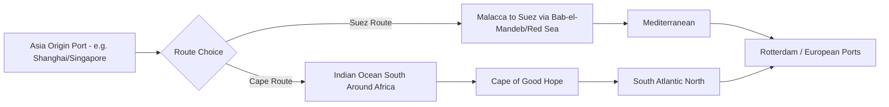

## Rerouting Economics and the Cape of Good Hope Alternative

### Overview

Rerouting economics refers to the cost-benefit analysis shipping lines undertake when deciding whether to continue transiting a disrupted chokepoint (absorbing elevated war risk premiums, delay, or physical risk) or divert to a longer alternative route. The Cape of Good Hope route around the southern tip of Africa is the primary practical alternative to the Suez Canal/Bab-el-Mandeb corridor for Asia-Europe and Asia-US East Coast trade, and its use during the 2023–2026 Red Sea crisis provides the clearest real-world case study of rerouting economics in action at global scale.

### The Core Rerouting Decision Framework

When a chokepoint becomes disrupted, a shipping line faces a discrete choice modeled as a comparison between the total cost of continuing through the affected route versus diverting:

$$Cost_{original\ route} = Cost_{fuel} + Cost_{time} + Premium_{war\ risk} + Risk_{loss/damage}$$

$$Cost_{alternative\ route} = Cost_{fuel,longer} + Cost_{time,longer} + Premium_{standard} + Cost_{schedule\ disruption}$$

A rational operator reroutes when $Cost_{alternative\ route} < Cost_{original\ route}$, but in practice this calculation is complicated by non-cost factors: crew safety obligations, charter party contract terms (which may specify permitted routing or allocate war risk costs between owner and charterer), cargo owner preferences (some cargo owners contractually require or prohibit certain routings), and reputational/liability exposure if a vessel is attacked while knowingly transiting a high-risk zone against industry consensus.

### Physical and Operational Cost Differential

- **Distance and duration**: The Cape of Good Hope route typically adds approximately 3,000–6,000 additional nautical miles and roughly 10–14 additional days of transit time compared to the Suez route, depending on the specific origin and destination ports.
- **Fuel consumption**: The additional distance directly increases fuel (bunker) consumption proportionally, a major cost driver given that bunker fuel represents a substantial share of a vessel's total voyage operating cost.
- **Emissions implications**: The longer route also increases total voyage emissions per unit of cargo delivered, creating tension with decarbonization targets and, in the EU context, additional exposure under the EU Emissions Trading System (ETS) as it extends to maritime shipping, since ETS liability is calculated based on actual voyage emissions.
- **Vessel/crew utilization**: Longer voyages reduce the number of round trips a given vessel can complete annually, effectively reducing fleet capacity even though no ships have left service — a longer average voyage length absorbs shipping capacity industry-wide, which can tighten vessel availability and support freight rates even without demand growth.

### Freight Market and Capacity Effects

- **Effective capacity absorption**: Because rerouted vessels take longer per round trip, sustained mass diversion to the Cape route absorbs global container and tanker capacity, which — all else equal — tightens available capacity relative to cargo demand and supports higher freight rates, similar in mechanism to a reduction in fleet size even though the physical fleet is unchanged.
- **Freight rate volatility**: Container spot freight rates on Asia-Europe routes rose sharply during the initial 2023–2024 diversion phase as capacity tightened; subsequent partial normalization (as seen in early 2026 when some carriers cautiously resumed Suez transits) tends to ease rates as capacity is freed, illustrated by the Suez route resumption easing pressure on freight rates during that window.
- **Schedule reliability degradation**: Longer, less predictable voyages (compounded by port congestion as vessels bunch up around alternative routing) tend to reduce overall liner schedule reliability, creating downstream effects for just-in-time manufacturing and retail inventory planning that depend on predictable transit windows.
- **Bunker fuel demand and pricing**: Sustained large-scale rerouting increases aggregate global bunker fuel demand, which can itself exert modest upward pressure on marine fuel prices during periods of sustained mass diversion.

### Port and Regional Winners and Losers

Rerouting via the Cape of Good Hope reshapes regional port traffic patterns, creating distinct beneficiaries and losers:

- **African transshipment hub beneficiaries**: Ports along the Cape route, particularly in South Africa (Durban, Cape Town) and other regional transshipment points, can see increased bunkering, resupply, and transshipment activity as vessels reroute past their coastlines.
- **Suez-dependent economy losers**: Egypt experiences a direct and substantial reduction in canal transit fee revenue during periods of sustained diversion, since the Suez Canal Authority's revenue model depends on toll volume, creating a direct fiscal cost to Egypt from a crisis (Houthi attacks) entirely outside its control.
- **European port congestion effects**: Bunching of delayed vessels arriving via the longer Cape route can create temporary congestion spikes at destination European ports as arrival patterns become less evenly distributed.

### Decision Variability Across Carrier and Cargo Types

Not all shipping segments respond identically to the same disruption:

| Cargo/vessel type | Typical rerouting response | Rationale |
| --- | --- | --- |
| Major container liners (Maersk, MSC, CMA CGM) | Rapid, near-universal diversion during active attack phases | High-value cargo, crew safety liability, reputational exposure, contractual customer expectations |
| Crude oil tankers | More variable; some continue transit depending on cargo owner risk tolerance and war risk premium relative to detour cost | Bulk commodity cargo with different insurance/liability dynamics than containerized general cargo |
| LNG carriers | Generally high caution, given catastrophic consequence severity of an LNG vessel incident | Extreme loss severity even at low probability shifts the expected-cost calculation toward avoidance |
| Bulk/dry cargo (grain, ore) | Cost-sensitivity often drives continued Suez transit when war risk premiums remain below the fuel/time cost differential | Lower per-unit cargo value makes the added Cape route cost proportionally more significant |

[Inference] This variation suggests that "the shipping industry reroutes" is an oversimplification — the aggregate rerouting pattern observed during the Red Sea crisis reflects the composition of vessel types and cargo owner risk tolerances transiting the corridor at a given time, not a uniform industry-wide threshold response, meaning partial Suez usage alongside partial Cape diversion (as seen intermittently through 2025–2026) is the more typical real-world pattern than a binary all-or-nothing shift.

### Historical Precedent: The 1967–1975 Suez Closure

The Cape of Good Hope route's economics were also tested during the historical 1967–1975 closure of the Suez Canal (following the Six-Day War), during which the canal remained closed for eight years. This episode is frequently cited in maritime economics literature because it drove a lasting structural shift toward larger vessel sizes (very large crude carriers, VLCCs) since the economics of the longer Cape route favored achieving economies of scale through larger cargo volumes per voyage to offset the added distance cost — a structural industry change that persisted even after the canal reopened in 1975.

### Strategic Lessons for Supply Chain Planning

- **Route flexibility as resilience**: [Inference] Firms and carriers with vessel and contract flexibility to shift routing without severe penalty are better positioned to manage chokepoint disruption than those locked into fixed-route charter agreements, suggesting contractual routing flexibility itself has emerged as a resilience-relevant design feature in shipping contracts.
- **Buffer inventory as a complementary strategy**: Given the multi-week lead-time increase from rerouting, downstream manufacturers and retailers dependent on Suez-transiting cargo have incentive to hold larger safety stock buffers during periods of sustained chokepoint disruption risk, trading inventory carrying cost against stockout risk.
- **Dual-sourcing and nearshoring as longer-term hedges**: [Speculation] Some analysts argue that repeated Red Sea disruption episodes have modestly accelerated corporate interest in nearshoring or diversifying supplier geography away from a single long, chokepoint-dependent supply route, though the extent to which this reflects lasting structural change versus temporary crisis response remains debated.

**Related Topics:**

- 1967–1975 Suez Canal closure and its lasting effect on vessel size economics (VLCC development)
- EU Emissions Trading System extension to maritime shipping and rerouting emissions implications
- Container freight rate index mechanics (e.g., Shanghai Containerized Freight Index)
- Charter party contract risk allocation clauses (war risk, deviation clauses)
- African transshipment port development (Durban, Tangier Med) amid shifting traffic patterns
- Just-in-time manufacturing exposure to shipping lead-time volatility