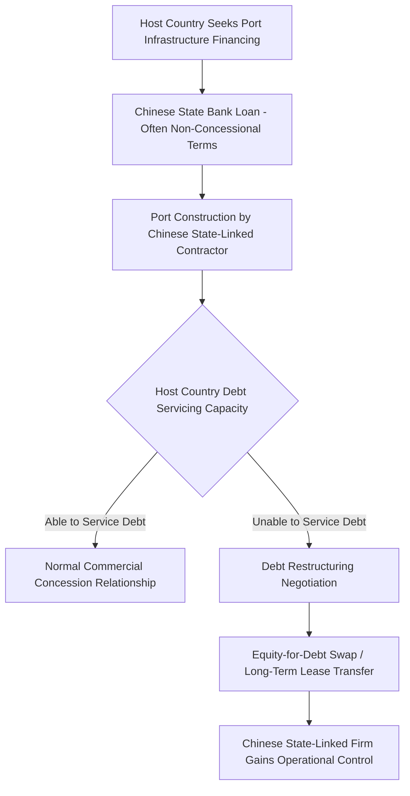

## Port Ownership, Control, and Strategic Port Investment

### Overview

Port ownership and control has emerged as a central instrument of geoeconomic competition, distinct from traditional chokepoint analysis because it concerns fixed terminal infrastructure and long-term concession rights rather than transit corridors. States and state-linked commercial entities increasingly pursue overseas port investment not purely for commercial return but to secure logistics access, project influence, and in some cases establish dual-use infrastructure with latent military utility. This dynamic has become especially salient in the context of China's Belt and Road Initiative (BRI), Gulf state sovereign wealth diversification, and Western "friend-shoring" and infrastructure alternatives such as the G7's Partnership for Global Infrastructure and Investment (PGII).

### Structural Models of Port Ownership

- **Full state ownership and operation**: The port authority is a direct government entity that both owns the infrastructure and operates terminal services, historically common but increasingly rare for major container terminals in liberalized economies.
- **Landlord port model**: A government or port authority owns the underlying land and basic infrastructure (breakwaters, channels, rail/road connections) but leases terminal operation rights to private or state-linked operating companies via long-term concession agreements — this is the dominant model for major global container terminals today.
- **Build-Operate-Transfer (BOT) and Build-Operate-Own (BOO) concessions**: A private or foreign entity finances and constructs port infrastructure, operates it for a defined concession period (often 25–99 years) to recoup investment and generate returns, and in BOT arrangements eventually transfers ownership back to the host government.
- **Full private/foreign ownership**: In some jurisdictions, particularly smaller developing economies with limited domestic capital, foreign firms may acquire outright or near-outright ownership stakes in strategic port assets, raising the most acute sovereignty and control concerns among host governments and their allies.

### China's Overseas Port Portfolio and the BRI Framework

Chinese state-linked firms — principally COSCO Shipping Ports and China Merchants Port Holdings — have acquired equity stakes, long-term concessions, or full ownership in a substantial number of port terminals across Asia, Africa, Europe, and Latin America since the mid-2000s, accelerating significantly under the Belt and Road Initiative launched in 2013.

**Illustrative cases frequently cited in strategic analysis:**

- **Piraeus, Greece**: COSCO acquired a majority stake in the Piraeus Port Authority, transforming it into one of the largest container ports in the Mediterranean and a key node in China's "Maritime Silk Road" access into Southern/Eastern Europe.
- **Hambantota, Sri Lanka**: Following Sri Lanka's inability to service the debt incurred building the port (financed substantially through Chinese loans), the Sri Lankan government granted China Merchants Port Holdings a 99-year lease in 2017, becoming the most frequently cited case study in the "debt-trap diplomacy" debate.
- **Gwadar, Pakistan**: Operated under a long-term concession by China Overseas Port Holding Company as the maritime terminus of the China-Pakistan Economic Corridor (CPEC), intended to provide China an Indian Ocean access point that could, in principle, reduce reliance on the Strait of Malacca corridor.
- **Djibouti**: Home to China's first overseas military base (established 2017), located adjacent to commercial port facilities in which Chinese firms hold stakes, representing the clearest example of the commercial-military dual-use concern that animates broader anxiety about Chinese port investment patterns.

### The "Debt-Trap Diplomacy" Debate

The "debt-trap diplomacy" thesis holds that Chinese lending for port infrastructure is structured, whether by design or as a predictable outcome, to result in asset seizure or long-term control transfer when recipient countries cannot service the debt, using Hambantota as the primary evidentiary case. [Inference] This thesis remains genuinely contested among researchers: critics of the strong version of the thesis point out that Sri Lanka's debt distress stemmed from a broader accumulation of borrowing across multiple creditors (not China-specific), that the port lease was negotiated as part of a broader debt-relief package rather than a pre-planned seizure, and that most Chinese-financed ports globally have not resulted in equity transfer, suggesting Hambantota may be an outlier rather than a representative template. Both the "debt trap" framing and its rebuttal are actively used in policy debate, and analysts should treat the underlying empirical question as unsettled rather than assume either framing is definitively correct.

### Dual-Use Infrastructure Concerns

A recurring theme in Western security assessments is that commercial port facilities developed or operated by Chinese state-linked firms could, in a conflict scenario, provide logistics, resupply, or intelligence-gathering support to Chinese naval forces, even where no formal military basing agreement exists. This concern has specifically informed:

- **US legislative and executive scrutiny**: Heightened review of Chinese-linked port operator contracts at strategically sensitive locations, including renewed 2025–2026 US political attention to Chinese-linked terminal operator presence at the Panama Canal's Balboa and Cristobal ports.
- **Allied port security vetting frameworks**: Some Western-aligned states have introduced or strengthened foreign investment screening mechanisms specifically targeting critical port infrastructure acquisitions, treating ports as critical national infrastructure comparable to telecommunications or energy grids.
- **Alliance-level infrastructure diplomacy responses**: The G7's Partnership for Global Infrastructure and Investment (PGII) and the EU's Global Gateway initiative represent explicit attempts to offer alternative financing for port and broader infrastructure projects in developing economies, aiming to reduce recipient countries' reliance on Chinese financing and the associated leverage concerns.

### Gulf State and Other Non-Western Port Investment Strategies

Beyond China, Gulf sovereign wealth funds — notably DP World (UAE) and Qatar-linked entities — have built substantial global port terminal portfolios as part of broader economic diversification strategies away from hydrocarbon dependency. DP World in particular operates terminals across multiple continents, representing a commercially-driven (rather than primarily geopolitically-driven) model of port internationalization, though Gulf state port investments are not entirely free of strategic calculation given the broader geopolitical hedging strategies (balancing US, Chinese, and regional relationships) that characterize contemporary Gulf foreign policy.

### Analytical Framework: Distinguishing Commercial from Strategic Port Investment

| Indicator | Suggests primarily commercial motivation | Suggests primarily strategic motivation |
| --- | --- | --- |
| Investor type | Diversified multinational terminal operator (DP World, Hutchison, PSA) | State-owned entity closely tied to national strategic planning |
| Financing terms | Market-rate, transparent terms | Concessional or opaque terms tied to broader bilateral agreements |
| Location relative to chokepoints/military value | Driven by cargo volume/trade route economics | Proximity to strategic chokepoints, naval basing potential, rival power's supply lines |
| Concurrent military/security agreements | None | Parallel military cooperation, basing rights, or security assistance agreements |
| Host country debt relationship to investor's state | Independent commercial relationship | Investor's home state also a major creditor/lender to host country |

[Inference] In practice, most large-scale international port investments contain elements of both commercial and strategic logic simultaneously, and analysts should be cautious about applying a purely binary "commercial vs. strategic" classification; the more useful analytical question is typically the degree and nature of strategic optionality a given investment creates for the investor state, rather than whether strategic motivation exists at all.

### Host Country Policy Responses and Sovereignty Considerations

- **Renegotiation and buy-back efforts**: Some host governments have sought to renegotiate long-term concession terms or explore buy-back options for previously granted strategic port leases, though the fiscal cost of buy-back can be prohibitive.
- **Concession term and equity cap limitations**: Some jurisdictions have introduced policy limits on maximum concession duration or foreign equity share specifically for ports designated as critical infrastructure.
- **Balancing infrastructure need against sovereignty risk**: [Inference] Many developing economies face a genuine structural dilemma in this space — needed port infrastructure investment capital is often most readily available from state-linked foreign lenders offering favorable financing terms unavailable from domestic capital markets or Western commercial lenders, meaning sovereignty risk concerns must be weighed against real and pressing infrastructure development needs rather than treated as a straightforward policy choice.

**Related Topics:**

- China's Belt and Road Initiative financing structures and debt sustainability frameworks
- Djibouti as a case study in commercial-military dual-use port infrastructure
- G7 Partnership for Global Infrastructure and Investment (PGII) and EU Global Gateway
- DP World and Gulf sovereign wealth fund global infrastructure diversification
- Foreign investment screening mechanisms for critical port infrastructure
- Panama Canal terminal operator scrutiny and US-China port competition