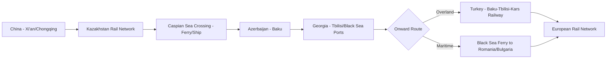

## Rail Freight Corridors and Eurasian Land Bridges

### Overview

Eurasian land bridges are continuous or near-continuous rail freight corridors connecting East Asia (primarily China) with Europe overland, bypassing the traditional maritime route through the Strait of Malacca, Indian Ocean, and Suez Canal. These corridors serve as a strategic alternative and complement to maritime shipping, offering shorter transit times than sea freight (though at higher per-unit cost than most ocean shipping) and providing a hedge against maritime chokepoint disruption, sanctions-driven trade rerouting, and the broader geopolitical vulnerability of sea lane dependency. Rail corridors also carry independent strategic significance as instruments of regional economic integration and, in some routings, sanctions evasion.

### Core Corridor Geography

#### The New Eurasian Land Bridge (China–Europe Railway / China Railway Express)

The primary modern land bridge, formalized commercially as the **China Railway Express (Zhongguo Tielu Ban, often marketed as "China-Europe freight trains")**, runs from major Chinese industrial hubs (Chongqing, Chengdu, Xi'an, Yiwu, Zhengzhou) westward through Kazakhstan, Russia, and Belarus, entering the EU via Poland (the Małaszewicze rail hub is a key gauge-change and customs point), before distributing to destinations across Western and Central Europe.

- **Gauge break challenge**: The former Soviet space, including Kazakhstan, Russia, and Belarus, uses the wider 1,520 mm "Russian gauge" track, while China and the EU use the 1,435 mm "standard gauge." This creates two mandatory gauge-change points along the route — at the China-Kazakhstan border (Khorgos/Alashankou) and at the Belarus-Poland (or Belarus-Lithuania) border — requiring either bogie changes, container transloading between different-gauge trains, or specialized variable-gauge rolling stock, each adding time and cost to the through-journey.
- **Transit time advantage**: A China-Europe rail journey typically takes approximately 12–18 days, substantially faster than the roughly 30–45 day maritime route via the Suez Canal, though considerably more expensive per container/ton than ocean freight.
- **Cargo composition**: Historically dominated by higher-value, time-sensitive goods (electronics, automotive parts, machinery) where the time savings justify the cost premium over sea freight, alongside a growing volume of e-commerce parcel traffic.

#### Middle Corridor / Trans-Caspian International Transport Route (TITR)

The "Middle Corridor" runs from China through Kazakhstan, across the Caspian Sea (requiring a ferry/ship crossing since no land route around the Caspian avoids either Russia or Iran), through Azerbaijan and Georgia, and onward either via Turkey or across the Black Sea to Europe.

- **Strategic rationale for growth**: The Middle Corridor's prominence increased substantially after Russia's 2022 invasion of Ukraine, as Western sanctions and reputational/compliance risk made the traditional Russia-transiting New Eurasian Land Bridge route increasingly commercially and politically undesirable for European shippers, driving interest in a route that avoids Russian territory entirely.
- **Infrastructure limitations**: The Middle Corridor suffers from lower capacity relative to the Russia-transiting route, primarily due to the Caspian Sea ferry bottleneck (limited vessel capacity and port handling infrastructure at Baku and Aktau), inconsistent rail gauge and signaling standards across the multiple countries traversed, and less-developed cross-border customs harmonization compared to the more established northern route.
- **Baku-Tbilisi-Kars (BTK) railway**: A key infrastructure link connecting Azerbaijan, Georgia, and Turkey, completed in 2017, intended to provide a direct rail connection avoiding both Russia and Armenia (with which Azerbaijan and Turkey have unresolved political tensions), illustrating how regional political disputes directly shape corridor routing decisions independent of pure engineering optimization.

#### Trans-Siberian Route

Russia's Trans-Siberian Railway has historically served as an alternative or complementary route for China-Europe rail freight, running through Russian territory further north than the Kazakhstan-transiting routes. [Inference] Its relative usage for China-Europe commercial freight has likely declined since 2022 given the same sanctions and reputational risk factors driving Middle Corridor growth, though it continues to serve Russia's own domestic and Russia-linked trade flows, including an increasing role in Russia-China bilateral trade as Russia's Western trade relationships have been curtailed by sanctions.

### Geopolitical Drivers and Strategic Motivations

- **China's Belt and Road Initiative (BRI) framing**: The China Railway Express network is explicitly promoted under the BRI as physical infrastructure embodying the "Silk Road Economic Belt" concept, with Chinese state subsidies historically playing a significant role in making rail freight commercially competitive against cheaper maritime alternatives, particularly during the network's early growth phase.
- **Maritime chokepoint hedging**: As discussed in relation to the "Malacca Dilemma," overland rail corridors represent one of several Chinese strategic hedges against reliance on sea lanes passing through potentially contestable straits, though rail capacity remains a small fraction of total China-Europe trade volume compared to maritime shipping, limiting its practical substitution capacity in the near-to-medium term.
- **Kazakhstan's transit-state positioning**: Kazakhstan has actively positioned itself as an indispensable transit hub for both the New Eurasian Land Bridge and Middle Corridor routes, deriving transit fee revenue and geopolitical leverage from its unique geographic position bridging China and the Caspian/Caucasus region.
- **EU connectivity strategy**: The EU's own Global Gateway initiative includes support for Middle Corridor infrastructure development, reflecting European interest in an alternative to both Chinese-financed routes and Russia-transiting routes, aligning economic connectivity policy with broader de-risking strategic objectives.

### Sanctions and Compliance Complications

Rail freight corridors transiting Russia and Belarus have faced significant sanctions-related compliance complications since 2022:

- **Dual-use goods restrictions**: Western export control regimes restrict the transit of goods with potential military applications through Russian and Belarusian territory, requiring shippers to navigate complex compliance screening even for ostensibly civilian cargo moving via the New Eurasian Land Bridge.
- **Reputational and banking risk**: European and other Western shippers have faced reputational pressure and, in some cases, banking/insurance access complications associated with using routes transiting sanctioned Russian and Belarusian rail infrastructure and state rail operators, independent of whether the specific cargo itself is sanctioned.
- **Rerouting cost absorption**: The shift toward the Middle Corridor as a sanctions-avoidance measure has generally increased costs and reduced capacity relative to the previously dominant Russia-transiting route, illustrating that geopolitically-driven infrastructure rerouting carries real economic costs analogous to maritime chokepoint rerouting, even without a physical blockage forcing the change.

### Comparative Analysis: Rail vs. Maritime for China-Europe Trade

| Factor | Maritime (Suez route) | New Eurasian Land Bridge (Russia-transiting) | Middle Corridor (Trans-Caspian) |
| --- | --- | --- | --- |
| Typical transit time | ~30-45 days | ~12-18 days | ~15-20 days (longer due to Caspian ferry) |
| Relative cost per unit | Lowest | Higher than maritime | Higher than New Eurasian Land Bridge |
| Capacity/volume | Very high | Moderate | Lower (Caspian ferry bottleneck) |
| Geopolitical exposure | Maritime chokepoint risk (Malacca, Suez, Red Sea) | Russia/Belarus sanctions exposure | Caspian infrastructure gaps, multi-country customs coordination |
| Gauge break points | None (containerized ocean shipping) | Two (China-Kazakhstan, Belarus-EU border) | Two, plus Caspian Sea crossing |

### Infrastructure Development Priorities and Bottlenecks

[Inference] The most significant near-to-medium-term constraint on Eurasian land bridge capacity growth is not rail line construction itself but the ancillary infrastructure required for efficient multimodal transfer — gauge-change facilities, Caspian Sea port and ferry capacity, customs harmonization agreements across the multiple sovereign jurisdictions each route traverses, and digital documentation standardization — since these "soft infrastructure" and interface bottlenecks often constrain effective throughput more than the physical rail track capacity itself.

**Related Topics:**

- China's Belt and Road Initiative infrastructure financing model
- Baku-Tbilisi-Kars railway and South Caucasus regional connectivity
- EU Global Gateway initiative and Middle Corridor infrastructure investment
- Russia-China bilateral trade rerouting following Western sanctions
- Rail gauge standardization challenges in Eurasian multimodal transport
- Kazakhstan's transit-state economic diversification strategy