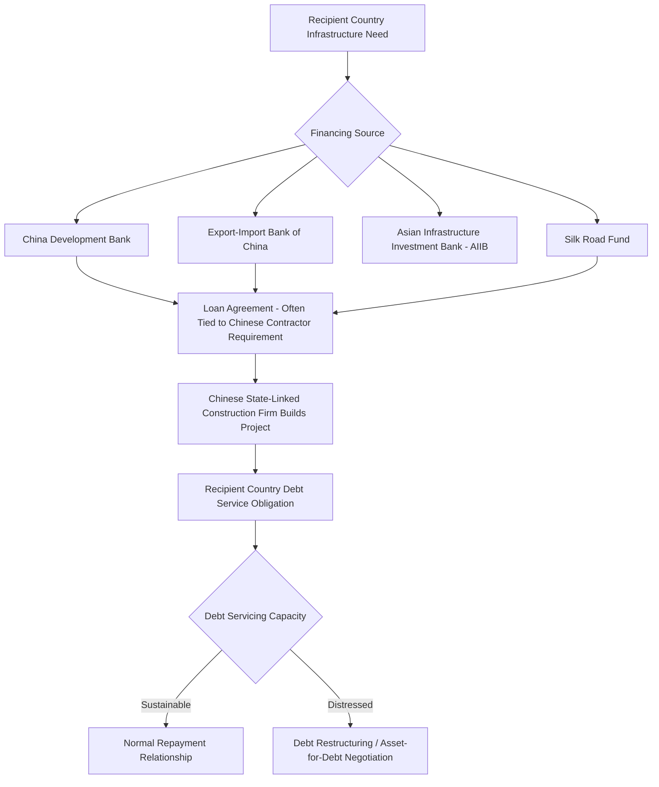

## China's Belt and Road Initiative and Infrastructure Diplomacy

### Overview

The Belt and Road Initiative (BRI), launched by Chinese President Xi Jinping in 2013, is a global infrastructure development and investment strategy encompassing transportation corridors, ports, energy infrastructure, telecommunications, and industrial parks across Asia, Africa, Europe, Latin America, and Oceania. Officially framed by Beijing as a mutually beneficial connectivity and development program reviving the historical "Silk Road" trade concept, the BRI has become the dominant global framework through which China projects economic influence, secures resource and market access, and — according to many Western and some recipient-country analysts — extends geopolitical leverage over participating states. It is best understood as the organizing umbrella under which many of the port, rail, and pipeline projects discussed elsewhere in this course actually operate.

### Structural Components of the BRI

- **Silk Road Economic Belt**: The overland component, encompassing rail and road corridors connecting China to Central Asia, Russia, the Middle East, and Europe — including the Eurasian land bridge rail corridors and the China-Pakistan Economic Corridor (CPEC).
- **21st Century Maritime Silk Road**: The maritime component, encompassing port investments and shipping infrastructure connecting China to Southeast Asia, South Asia, the Middle East, East Africa, and the Mediterranean — including the Piraeus, Gwadar, Hambantota, and Djibouti port investments discussed in the ports module.
- **Digital Silk Road**: A less formally defined but increasingly emphasized component covering telecommunications infrastructure, undersea data cables, 5G network equipment (notably Huawei and ZTE deployments), satellite systems, and e-commerce platform expansion in partner countries.
- **Health Silk Road**: A framing emphasized particularly during and after the COVID-19 pandemic, covering medical infrastructure, vaccine diplomacy, and public health cooperation initiatives.
- **Polar Silk Road**: China's stated interest in Arctic shipping route development and infrastructure as Arctic ice recedes, connecting to broader Arctic governance and resource access questions.

### Financing Architecture

- **Primary lending institutions**: The China Development Bank (CDB) and the Export-Import Bank of China (China Eximbank) have historically provided the bulk of BRI project financing, generally on non-concessional or semi-concessional terms compared to traditional Western development finance institutions or the World Bank.
- **Multilateral vehicles**: The Asian Infrastructure Investment Bank (AIIB), launched in 2016 with broad international membership (including many Western-aligned states despite the institution's Chinese leadership), and the dedicated Silk Road Fund provide additional, more multilaterally-structured financing channels, lending the initiative a degree of international institutional legitimacy beyond purely bilateral Chinese lending.
- **"Tied aid" contractor requirements**: A recurring feature of BRI financing arrangements is the requirement, explicit or de facto, that financed projects be constructed by Chinese state-linked engineering and construction firms, meaning the financing simultaneously generates returns for Chinese lenders and export demand for Chinese construction and materials industries — a dynamic critics describe as primarily benefiting Chinese commercial interests, while defenders note this is a common feature of many bilateral development finance arrangements globally, not unique to China.
- **Debt transparency concerns**: Independent research organizations have documented that a substantial share of Chinese BRI lending involves non-disclosure clauses and collateral arrangements not typically reported to international debt transparency databases, complicating recipient countries' and other creditors' ability to fully assess aggregate sovereign debt exposure.

### Motivations Behind the BRI

Analysts generally identify several overlapping (not mutually exclusive) motivations behind Chinese BRI strategy:

- **Domestic overcapacity absorption**: China's construction, steel, cement, and heavy engineering sectors developed substantial excess domestic capacity following China's own infrastructure-led growth model; BRI projects provide overseas demand outlets for this capacity.
- **Resource and energy security**: Many BRI projects, particularly pipeline and port infrastructure in Central Asia, the Middle East, and Africa, directly support China's energy import diversification and resource access strategy, including hedges against maritime chokepoint dependency discussed in relation to the "Malacca Dilemma."
- **Market access and export promotion**: Infrastructure connectivity lowers the cost and time of Chinese goods reaching new and existing export markets, supporting China's broader trade-led growth model.
- **Geopolitical influence and alignment-building**: Recipient countries' economic dependency on Chinese financing and infrastructure can translate into diplomatic alignment, including at multilateral forums such as the UN, where BRI-linked states have shown patterns of voting alignment with Chinese positions on sensitive issues (Taiwan, Xinjiang, South China Sea), though the causal direction and strength of this relationship remains debated among researchers.
- **Renminbi internationalization**: Some BRI-linked financing and trade settlement arrangements incorporate renminbi-denominated components, contributing to a broader, gradual Chinese strategy of reducing reliance on the US dollar in specific bilateral trade and financing relationships.

### Case Study Patterns Across Regions

- **Central Asia**: Rail, road, and pipeline connectivity (including the Central Asia-China gas pipeline network) reinforces China's position as an increasingly dominant economic partner for former Soviet Central Asian states, layering onto and in some respects supplanting traditional Russian regional economic influence.
- **Sub-Saharan Africa**: BRI financing has supported substantial port, rail, and power generation infrastructure across the continent, with Kenya's Standard Gauge Railway and various African port investments among the most frequently cited examples; African debt sustainability concerns linked to Chinese lending have featured prominently in G20 debt relief discussions, including the Common Framework for Debt Treatment.
- **South Asia**: The China-Pakistan Economic Corridor (CPEC) represents one of the largest single-country BRI commitments, combining energy, transport, and the Gwadar port investment, and is explicitly linked in Pakistani and Chinese official framing to broader China-Pakistan strategic alignment vis-à-vis India.
- **Southeast Asia**: Rail projects (such as the China-Laos Railway and China-Thailand Railway) and port investments intersect directly with the ASEAN Power Grid and broader regional connectivity ambitions discussed elsewhere in this course, though implementation timelines have frequently lagged initial announcements.
- **Europe**: Piraeus port investment and periodic Chinese infrastructure interest in Central and Eastern European "17+1" framework countries have drawn EU scrutiny regarding foreign investment screening and the risk of BRI-linked initiatives fragmenting unified EU external economic policy.

### Western and Multilateral Counter-Initiatives

In response to the BRI's scale and perceived strategic implications, Western-aligned states and institutions have developed alternative infrastructure financing frameworks:

- **G7 Partnership for Global Infrastructure and Investment (PGII)**: Launched to mobilize public and private capital for infrastructure investment in developing economies, explicitly positioned as an alternative financing source to reduce recipient country dependence on Chinese lending.
- **EU Global Gateway**: The EU's parallel infrastructure investment strategy, encompassing digital, energy, transport, and health infrastructure financing, with an emphasis on transparency, labor, and environmental standards intended to differentiate it from BRI financing terms.
- **Blue Dot Network**: A US-Japan-Australia-led initiative aimed at establishing a certification framework for infrastructure projects meeting high-quality, transparent, and sustainable development standards, intended to provide recipient countries and investors a quality signal distinguishing certified projects from the broader universe of infrastructure investment.
- **Quad infrastructure cooperation**: The US-Japan-India-Australia Quadrilateral Security Dialogue has incorporated infrastructure and connectivity cooperation as a component of its broader Indo-Pacific strategic agenda, partly framed as a response to BRI influence in the region.

[Inference] These counter-initiatives have faced persistent challenges achieving financing scale comparable to Chinese state bank lending capacity, given the greater reliance of Western-aligned initiatives on mobilizing private capital and multiple democratic governments' budgetary and legislative approval processes, compared to the more centralized and rapid deployment capability of Chinese state financial institutions.

### Evaluating BRI Outcomes: Contested Assessments

| Assessment dimension | Favorable BRI framing | Critical BRI framing |
| --- | --- | --- |
| Infrastructure gap impact | Fills genuine, long-unmet developing country infrastructure financing gaps | Creates unsustainable debt burdens exceeding genuine absorptive capacity |
| Project quality/standards | Delivers infrastructure faster than alternative financing sources | Environmental, labor, and construction quality standards frequently criticized as substandard |
| Debt sustainability | Most BRI loans are serviced normally without crisis | A meaningful subset of recipient countries have faced genuine debt distress linked partly to BRI borrowing |
| Strategic intent | Primarily commercially and developmentally motivated | Deliberately designed to extend Chinese geopolitical leverage |

[Inference] As with the narrower port-specific "debt-trap diplomacy" debate, the broader BRI assessment is genuinely contested in the academic and policy literature, and a rigorous treatment should present both framings with their respective evidentiary bases rather than adopting either uncritically; the most defensible synthesis position among researchers is that BRI outcomes vary substantially by country and project, defying a single unified characterization as either purely beneficial development financing or purely a geopolitical debt-leverage strategy.

### BRI's Evolving Trajectory

[Inference] Following a period of very rapid BRI lending growth through the late 2010s, Chinese overseas lending volumes appear to have moderated in subsequent years, reflecting a combination of domestic Chinese economic slowdown pressures, recipient country debt distress reducing appetite for further large-scale borrowing, and a reported Chinese policy shift toward smaller, more selectively vetted "small and beautiful" projects rather than the large-scale flagship infrastructure lending characteristic of the initiative's first decade.

**Related Topics:**

- Debt-trap diplomacy debate and the Hambantota port case study
- China-Pakistan Economic Corridor (CPEC) and Gwadar port development
- G7 Partnership for Global Infrastructure and Investment (PGII) and EU Global Gateway
- Renminbi internationalization and de-dollarization trends in bilateral trade
- African sovereign debt sustainability and the G20 Common Framework
- Digital Silk Road and Chinese telecommunications infrastructure exports (Huawei, ZTE)