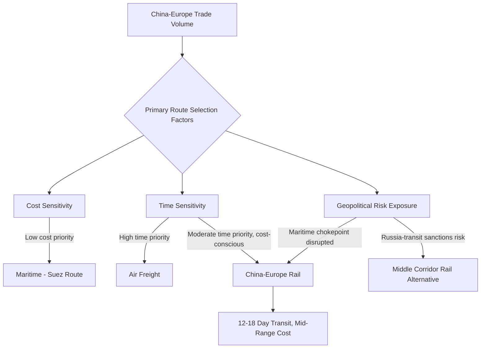

## The China-Europe Rail Network as an Alternative Trade Route

### Overview

The China-Europe rail network, commercially branded and operated primarily under the China Railway Express (中欧班列, Zhongou Banlie) system, is a state-supported freight rail network connecting Chinese industrial and logistics hubs directly to European destinations via overland corridors through Central Asia, Russia or the Caucasus, and Eastern Europe. While covered in this course's broader treatment of Eurasian land bridges as physical infrastructure, this entry focuses specifically on the network's function and evolution as a *strategic trade-route alternative* — how it competes with, complements, and is periodically substituted for maritime shipping and other overland corridors depending on shifting geopolitical and commercial conditions.

### Historical Development and Scale Growth

The China Railway Express began as a limited pilot service (the first regularly scheduled Chongqing-Duisburg, Germany route launched in 2011) and expanded rapidly under explicit Belt and Road Initiative promotion after 2013, growing from a small number of annual trips to a network handling a substantial and steadily increasing volume of TEU (twenty-foot equivalent unit) container traffic annually, connecting dozens of Chinese cities to dozens of European destinations across multiple corridor routings by the early-to-mid 2020s.

**Key growth drivers:**

- **Chinese central and provincial government subsidies**: Local Chinese governments competing to host China Railway Express departure hubs have historically provided substantial per-container subsidies to shippers, artificially lowering the effective cost relative to unsubsidized market rates and accelerating volume growth beyond what pure commercial economics would have produced.
- **COVID-19 pandemic disruption of maritime and air freight (2020–2022)**: Severe port congestion, container shortages, and air cargo capacity constraints during the pandemic period made rail's more predictable (though still occasionally disrupted) transit times comparatively more attractive, driving a temporary surge in rail freight demand and volume.
- **E-commerce parcel growth**: Rising China-Europe e-commerce trade volumes have increasingly utilized rail capacity for parcel and small-package consolidation shipments, a growing segment distinct from the network's original heavy industrial/machinery cargo base.

### Function as a Strategic Alternative Trade Route

The network functions as a middle option in the classic cost-time-risk trilemma of international freight: substantially faster than maritime shipping (12–18 days versus 30–45 days via Suez) at a substantially lower cost than air freight, while also offering a distinct risk profile from both — exposed to different geopolitical vulnerabilities (Russian/Belarusian transit and sanctions exposure, Central Asian political stability, multiple border customs regimes) rather than maritime chokepoint risk (piracy, strait closure, canal blockage).

[Inference] This differentiated risk exposure is a key reason the network has attracted sustained strategic interest beyond its purely commercial cost-time positioning: for cargo owners and Chinese state planners concerned about maritime chokepoint vulnerability (the "Malacca Dilemma" and broader sea lane dependency), rail capacity — even at a fraction of total trade volume — represents a genuinely uncorrelated alternative pathway, since a Strait of Hormuz or Red Sea disruption event does not directly affect rail corridor availability.

### Impact of the 2022 Russia-Ukraine War

The war fundamentally altered the network's risk and routing calculus, given that the historically dominant China Railway Express routing passed directly through Russia and Belarus before entering the EU via Poland:

- **Sanctions compliance burden**: European shippers using Russia/Belarus-transiting rail routes faced increased due diligence requirements to ensure compliance with evolving EU and allied sanctions regimes, particularly regarding dual-use goods and any cargo touching sanctioned Russian or Belarusian rail operators or related entities.
- **Reputational risk for Western shippers**: Continued use of Russia-transiting rail infrastructure carried reputational exposure for Western companies amid broader public and governmental pressure to disengage economically from Russia, independent of whether specific shipments were technically sanctions-compliant.
- **Insurance and financing complications**: Some Western insurers and banks became more reluctant to provide coverage or trade finance for shipments transiting Russian territory, adding friction and cost even where legally permissible.
- **Volume and mode-share effects**: [Inference] These combined pressures likely contributed to a shift in relative growth toward the Middle Corridor (Trans-Caspian) routing avoiding Russian territory, even though that route carries its own capacity limitations (the Caspian Sea ferry bottleneck), suggesting European shippers were willing to accept the Middle Corridor's higher cost and lower capacity in exchange for reduced sanctions and reputational exposure.

### Comparative Positioning Against Maritime Rerouting Alternatives

An important analytical connection exists between the China-Europe rail network and the maritime rerouting dynamics discussed in relation to the Red Sea crisis: during periods of Suez/Bab-el-Mandeb disruption and Cape of Good Hope diversion (which further lengthens already-long maritime transit times), the relative time advantage of rail freight increases, potentially making rail a more attractive substitute for time-sensitive cargo that would otherwise have used the (now-disrupted) direct maritime route.

| Route | Typical transit time | Relative cost | Primary geopolitical exposure |
| --- | --- | --- | --- |
| Maritime via Suez (undisrupted) | ~30-45 days | Lowest | Suez/Bab-el-Mandeb/Hormuz chokepoint risk |
| Maritime via Cape of Good Hope (diverted) | ~40-55 days | Moderate (higher fuel, no war risk premium) | Reduced Middle East exposure, retains general maritime risk |
| China-Europe Rail (Russia-transiting) | ~12-18 days | Higher than maritime | Russia/Belarus sanctions and reputational exposure |
| China-Europe Rail (Middle Corridor) | ~15-20 days | Higher than Russia-transit rail | Caspian infrastructure/capacity constraints |
| Air freight | 1-3 days | Highest | Limited geopolitical chokepoint exposure, but airspace closure risk (e.g., Russian airspace restrictions since 2022) |

[Inference] Despite these comparative advantages during specific disruption windows, rail's total capacity remains a small fraction of total China-Europe trade volume relative to maritime shipping, meaning it functions as a marginal, high-value-cargo substitution channel during disruption events rather than a capacity-equivalent replacement for containerized maritime trade at scale.

### Subsidy Rationalization and Commercial Sustainability Questions

A recurring point of analytical scrutiny concerns the long-term commercial sustainability of the network absent continued Chinese government subsidy support. Reports have periodically indicated Chinese central authorities seeking to rationalize or reduce the scale of local government subsidies that fueled much of the network's early rapid growth, raising questions about whether reported freight volumes reflect underlying organic commercial demand or subsidy-driven volume that could prove less durable if support is withdrawn. [Speculation] The extent to which subsidy withdrawal would materially reduce sustained freight volume, versus the network having reached a scale where genuine commercial demand (independent of subsidy) now supports much of current traffic, remains a genuinely uncertain and actively debated question without clear public data resolution.

### Infrastructure and Capacity Constraints

- **Gauge-break bottlenecks**: As detailed in the broader Eurasian land bridge treatment, the mandatory gauge changes at the China-Kazakhstan and Belarus-EU (or Belarus-Lithuania) borders impose a hard capacity ceiling independent of demand growth, requiring specialized transloading or bogie-change infrastructure investment to expand throughput.
- **Border crossing congestion**: The Małaszewicze hub in Poland, the primary EU-side gauge-change and customs point for the dominant northern routing, has periodically experienced significant congestion during peak demand periods, illustrating that a single chokepoint-like node can constrain an entire overland network's effective capacity much as a maritime strait constrains sea lane throughput.
- **Return-load imbalance**: Historically, westbound (China-to-Europe) rail freight volume has significantly exceeded eastbound (Europe-to-China) volume, creating an empty-container repositioning inefficiency that affects the network's overall unit economics, a structural imbalance requiring ongoing commercial management rather than one likely to be fully resolved through infrastructure investment alone.

**Related Topics:**

- Eurasian land bridge corridor infrastructure and gauge-break engineering challenges
- Middle Corridor (Trans-Caspian) growth following the Russia-Ukraine war
- China's Belt and Road Initiative subsidy and financing structures
- Russian airspace closure impact on Asia-Europe air freight and passenger routing
- Container freight rate volatility and multimodal route substitution economics
- Poland's Małaszewicze rail hub as a critical Eurasian logistics chokepoint