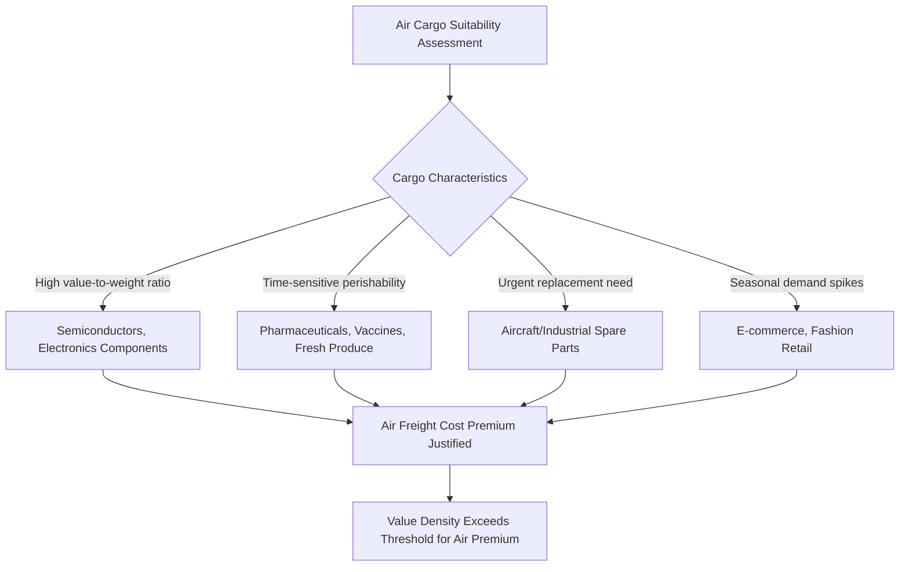

## Air Cargo Networks and High-Value Supply Chains

### Overview

Air cargo represents the fastest but most expensive mode of international freight transport, occupying a distinct niche within global supply chains: time-critical, high-value-density, or perishable goods for which the cost premium over ocean or rail freight is justified by speed, reliability, and reduced inventory carrying costs. While air cargo carries only a small fraction of global trade by weight or volume, it carries a disproportionately large share of global trade by value, making it strategically significant for specific supply chain categories — semiconductors, pharmaceuticals, perishables, e-commerce, and emergency/humanitarian logistics — even though it is largely absent from bulk commodity and heavy industrial goods trade.

### Structural Characteristics of Air Cargo Capacity

- **Belly cargo vs. dedicated freighters**: Air cargo capacity is split between "belly cargo" carried in the lower holds of passenger aircraft and dedicated all-cargo freighter aircraft operated by integrators (FedEx, UPS, DHL) and cargo airlines. Belly cargo capacity is directly tied to passenger flight scheduling and network structure, meaning disruptions to passenger aviation (such as those experienced during the COVID-19 pandemic) directly reduce available air cargo capacity independent of freight demand.
- **Integrator express networks**: FedEx, UPS, and DHL operate dedicated hub-and-spoke freighter networks optimized for time-definite express delivery, distinct from traditional cargo airline models that often operate less frequent, less time-guaranteed scheduled freighter services between major cargo gateway airports.
- **Major cargo hub airports**: A relatively small number of airports handle a disproportionate share of global air cargo volume, including Hong Kong, Memphis (FedEx's primary hub), Shanghai Pudong, Incheon (South Korea), Anchorage (a critical transpacific refueling and transshipment hub), and Louisville (UPS's primary hub) — reflecting the network's concentration around integrator hub infrastructure and major Asian manufacturing/export gateways.

### High-Value and Time-Critical Cargo Categories

- **Semiconductors and electronics components**: Given semiconductors' extremely high value-to-weight ratio and the time-sensitivity of just-in-time electronics manufacturing schedules, air freight plays an outsized role in this sector relative to its overall trade volume share, directly connecting to the Taiwan Strait chokepoint discussion — a Taiwan Strait disruption would affect air cargo capacity serving Taiwan's semiconductor exports in addition to maritime shipping.
- **Pharmaceuticals and cold chain logistics**: Vaccines, biologics, and temperature-sensitive medical products rely heavily on specialized air cargo cold chain infrastructure, a dependency starkly illustrated during the COVID-19 vaccine distribution effort, which required purpose-built ultra-cold air freight logistics networks operating at global scale under significant time pressure.
- **Perishable agricultural goods**: Fresh flowers, seafood, and certain fruits with short shelf lives depend on air freight to reach distant markets while still viable for sale, creating durable trade relationships (such as Kenya-Netherlands flower exports) structurally dependent on continued air cargo route availability.
- **E-commerce and express parcel growth**: The rapid growth of cross-border e-commerce, particularly from Chinese platforms, has substantially increased demand for express air freight capacity for individually addressed parcels, a structurally different cargo profile from traditional bulk air freight.

### Geopolitical Disruption Vectors Specific to Air Cargo

Air cargo networks face distinct disruption mechanisms not directly shared with maritime or rail freight:

- **Airspace closure and overflight restrictions**: Following Russia's 2022 invasion of Ukraine, Russia closed its airspace to most Western carriers in retaliation for reciprocal Western closures, forcing Asia-Europe cargo (and passenger) flights to reroute around Russian airspace via longer southern routings, adding flight time, fuel cost, and in some cases payload restrictions due to the need for additional fuel on the longer route.
- **Bilateral air services agreements and diplomatic disputes**: Unlike maritime shipping, which operates under broadly permissive international freedom-of-navigation norms, international air cargo operations require bilateral air services agreements between states, meaning diplomatic disputes can directly restrict or eliminate specific air cargo route access in ways with no direct maritime equivalent.
- **Export control and dual-use screening**: Air cargo shipments of sensitive technology components (particularly semiconductors and semiconductor manufacturing equipment) face increasingly stringent export control screening under US and allied technology restriction regimes targeting China, adding compliance friction and potential delay distinct from broader tariff or customs considerations.
- **Fuel price sensitivity**: Air cargo operating costs are more heavily weighted toward fuel expense (jet fuel) relative to ocean or rail freight, making air cargo pricing and route economics more directly and immediately sensitive to oil price volatility, including the energy geopolitics dynamics covered elsewhere in this course (Hormuz disruption, OPEC+ production decisions).

### Case Study: Russian Airspace Closure and Route Restructuring

$$Flight\ Time_{rerouted} = Flight\ Time_{direct} + \Delta t_{detour} + \Delta t_{additional\ fuel\ stops}$$

Following the 2022 airspace closures, Asia-Europe air cargo and passenger routes that previously transited Russian airspace (a significant time-saving routing, particularly for flights between Europe and Northeast Asia) were forced onto substantially longer southern routings via Central Asia, the Middle East, or polar-adjacent alternative paths, adding several hours to affected flight times. [Inference] This increased both direct fuel costs and, for cargo-sensitive routes, potentially constrained payload capacity on longer sectors due to the fuel-weight trade-off inherent in aircraft performance limits, representing a durable structural cost increase for the affected air cargo lanes rather than a temporary disruption, since the underlying airspace closure has persisted for an extended period with no clear resolution timeline.

### Comparative Modal Positioning

| Factor | Air Cargo | Maritime | Rail (China-Europe) |
| --- | --- | --- | --- |
| Typical transit time (long-haul) | Hours to 1-2 days | 30-45 days | 12-20 days |
| Relative cost per unit weight | Highest | Lowest | Moderate-high |
| Primary suitable cargo | High-value, time-critical, perishable | Bulk commodities, containerized general cargo | Mid-value, moderately time-sensitive goods |
| Governing legal framework | Bilateral air services agreements | UNCLOS freedom of navigation/transit passage | Multiple bilateral rail/customs agreements per border |
| Primary chokepoint-equivalent risk | Airspace closure, hub airport disruption | Strait/canal chokepoints | Gauge-break and border-crossing bottlenecks |

### Strategic Significance for Supply Chain Resilience Planning

[Inference] Air cargo's role in supply chain geopolitics is best understood not as a general-purpose alternative to maritime or rail freight — its cost structure precludes that for the vast majority of global trade volume — but as a specialized resilience and speed mechanism reserved for the specific subset of goods where value density or time sensitivity justifies the premium. This means air cargo capacity and route availability function as a critical dependency specifically for technology supply chains (semiconductors), public health response capability (pharmaceutical/vaccine logistics), and emergency/humanitarian response, even though it remains marginal to bulk commodity and heavy industrial trade flows that dominate overall global trade tonnage.

### Emerging Considerations

- **E-commerce policy scrutiny**: Rapid growth in low-value e-commerce parcel air shipments (particularly from Chinese platforms) has prompted policy scrutiny in the US and EU regarding de minimis customs exemption thresholds, with several jurisdictions moving to tighten or eliminate low-value duty-free thresholds specifically in response to this air-cargo-enabled trade growth pattern.
- **Cargo drone and urban air mobility development**: [Speculation] Longer-term technological developments in autonomous cargo drone systems could eventually affect last-mile and potentially some regional air freight logistics, though this remains an early-stage and largely unproven capability at meaningful commercial scale for international freight as of the current period.

**Related Topics:**

- Russian airspace closure and its impact on Asia-Europe passenger and cargo aviation
- Semiconductor export controls and dual-use technology screening for air shipments
- COVID-19 vaccine cold chain logistics as a case study in emergency air freight mobilization
- E-commerce de minimis threshold policy debates (US, EU)
- Integrator hub-and-spoke network design (FedEx Memphis, UPS Louisville)
- Taiwan Strait disruption scenarios and their impact on semiconductor air freight logistics