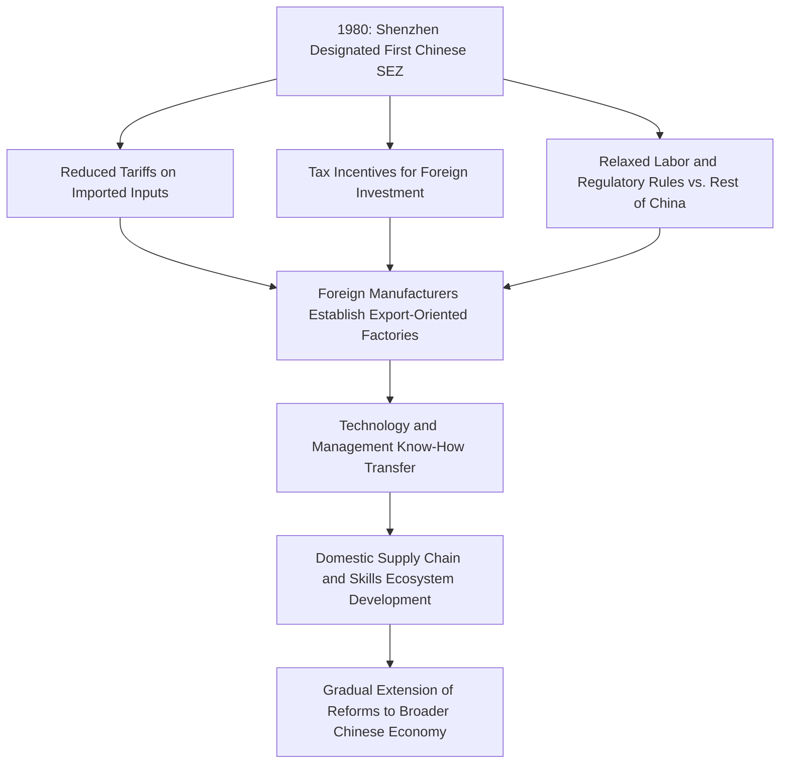

## Special Economic Zones and Free Trade Ports

### Overview

Special Economic Zones (SEZs) and free trade ports are geographically delineated areas within a country's territory where distinct economic regulations — typically reduced tariffs, simplified customs procedures, tax incentives, and relaxed regulatory or labor requirements — apply, differing from the rules governing the wider national economy. They function as deliberate policy instruments to attract foreign direct investment, promote export manufacturing, and integrate a country into global supply chains, while allowing the host government to experiment with liberalized economic policy in a contained area without extending those changes nationwide. Within supply chain geopolitics, SEZs and free ports intersect with chokepoint and infrastructure geography, industrial policy competition, and increasingly with sanctions and export control circumvention concerns.

### Core Types and Structural Variants

- **Export Processing Zones (EPZs)**: Focused specifically on manufacturing for export, typically offering duty-free import of raw materials and components on the condition that finished goods are re-exported rather than sold domestically — a model widely used across East and Southeast Asia, Central America, and parts of Africa.
- **Free Trade Zones/Ports**: Broader zones, often centered on a port or airport, allowing goods to be imported, stored, processed, or re-exported without incurring standard customs duties unless and until the goods enter the host country's domestic market — Dubai's Jebel Ali Free Zone and Hong Kong's status as a free port are frequently cited examples.
- **Comprehensive SEZs (China model)**: Larger-scale zones combining manufacturing incentives with broader regulatory experimentation, financial sector liberalization, and foreign investment rules distinct from the national baseline — China's original 1980s SEZs (Shenzhen, Zhuhai, Shantou, Xiamen) pioneered this model as the leading edge of China's post-1978 economic reform and opening-up strategy.
- **Bonded warehouse and logistics zones**: Narrower in scope, allowing goods to be stored or lightly processed under customs bond status without duty payment until release into the domestic market, common at major ports and airports globally as a standard trade facilitation tool rather than a distinct development strategy.

### The Shenzhen Model and China's SEZ-Led Development Strategy

Shenzhen's transformation from a small fishing town in 1980 to a major global manufacturing and technology hub is the most frequently cited SEZ success case, illustrating how a geographically bounded policy experiment can serve as a controlled testing ground before nationwide extension, and how SEZ status can catalyze durable industrial ecosystem development well beyond the original tariff/tax incentive structure — Shenzhen today hosts a dense electronics manufacturing and technology supply chain cluster whose competitive advantages extend far beyond its original zone-based fiscal incentives. [Inference] Analysts generally attribute Shenzhen's success not solely to the SEZ policy framework itself but to its combination with proximity to Hong Kong (providing capital, trade finance, and logistics access), sustained infrastructure investment, and a broader national reform trajectory, suggesting SEZ designation alone is a necessary but insufficient condition for comparable outcomes elsewhere.

### Strategic Rationale for Host Governments

- **Attracting foreign direct investment without full national liberalization**: SEZs allow governments to offer internationally competitive investment conditions in a contained area while maintaining more restrictive or protective policies for the broader domestic economy, useful for governments facing domestic political constraints on full economic liberalization.
- **Export-led industrialization strategy**: By concentrating export manufacturing incentives geographically, SEZs allow governments to build initial industrial capacity and integrate into global supply chains, often as a first stage before broader industrial upgrading — a pattern followed with variation across South Korea, Taiwan, and later mainland China, Vietnam, and Bangladesh.
- **Employment generation and regional development**: SEZs are frequently sited to promote economic development in specific regions, sometimes explicitly to address regional inequality or provide employment alternatives in areas with limited existing industrial activity.
- **Supply chain positioning amid "friend-shoring" and diversification trends**: In the current period of supply chain diversification away from single-country (particularly China) concentration, SEZs in Vietnam, India, Mexico, and other alternative manufacturing locations have become key vehicles for capturing relocating manufacturing investment, often explicitly marketed with reference to reduced geopolitical risk exposure relative to China-based production.

### Free Ports and Trade Facilitation Infrastructure

- **Dubai's Jebel Ali Free Zone (JAFZA)**: One of the world's largest free zones, combining port infrastructure with manufacturing, logistics, and re-export functions, illustrating the UAE's broader strategy of positioning itself as a regional and global trade, logistics, and re-export hub leveraging its central location between European, African, and Asian markets.
- **Hong Kong's historical free port status**: Hong Kong's long-standing status as a free port with minimal tariffs and simplified customs procedures underpinned its historical role as mainland China's primary re-export and entrepôt trade gateway, a role that has evolved but remains significant even as mainland Chinese ports have grown substantially in direct handling capacity.
- **Singapore's free trade zone system**: Singapore operates multiple free trade zones integrated with its port and airport infrastructure, reinforcing its position as Southeast Asia's dominant transshipment and logistics hub, closely tied to its strategic position adjacent to the Strait of Malacca.

### Sanctions Evasion and Illicit Trade Concerns

Free ports and SEZs, precisely because of their reduced customs scrutiny and re-export-oriented design, have drawn scrutiny as potential vectors for sanctions evasion, transshipment fraud, and illicit trade:

- **Transshipment-based origin laundering**: Goods subject to sanctions, tariffs, or export controls can potentially be routed through free zones, relabeled or minimally processed, and re-exported with altered documentation obscuring true origin — a concern raised regarding certain Chinese-origin goods facing US tariffs being routed through third-country free zones before final export to the US market.
- **Dual-use and export control circumvention**: Free zones with limited scrutiny have been identified in some cases as transit points for sanctioned or export-controlled goods (including certain electronics and dual-use components) destined for Russia, Iran, or North Korea, exploiting the reduced customs documentation rigor characteristic of free zone trade facilitation.
- **Financial opacity in some free port models**: Certain "free port" facilities specializing in high-value goods storage (art, precious metals) rather than manufacturing trade have drawn separate scrutiny regarding their potential use for money laundering or tax evasion given minimal ownership transparency requirements in some jurisdictions — a distinct concern from the manufacturing/logistics SEZ model but sharing the underlying reduced-scrutiny structural feature.

### Comparative SEZ/Free Port Models

| Model | Primary example | Core function | Distinct risk/scrutiny factor |
| --- | --- | --- | --- |
| Comprehensive SEZ | Shenzhen, China | Export manufacturing plus broader regulatory experimentation | Scale of tax incentives and subsidy competition concerns |
| Free trade port | Jebel Ali, Dubai | Logistics, re-export, light manufacturing | Transshipment/origin-laundering potential |
| Historical entrepôt free port | Hong Kong | Trade facilitation and re-export gateway | Historical role now evolving amid mainland China integration |
| Bonded logistics zone | Various port/airport bonded facilities globally | Duty deferral for storage/processing | Lower strategic significance, primarily operational trade facilitation |

### Contemporary Relevance to Supply Chain Diversification

[Inference] As firms pursue "China plus one" or broader diversification strategies in response to US-China trade tensions and geopolitical risk concerns, SEZs in alternative manufacturing locations (Vietnam's numerous industrial zones, India's SEZ system, Mexico's maquiladora-adjacent zones benefiting from USMCA nearshoring dynamics) have become increasingly important policy tools for host governments competing to capture this relocating investment, effectively creating a competitive market among developing economies for SEZ-based manufacturing FDI that mirrors, at a smaller scale, the original China SEZ competitive positioning strategy of the 1980s-1990s.

**Related Topics:**

- China's original 1980s SEZ program and Shenzhen's development trajectory
- Vietnam and Mexico as "China plus one" nearshoring/friend-shoring destinations
- Transshipment fraud and tariff circumvention through third-country free zones
- Dubai and Singapore as global logistics and re-export hub strategies
- USMCA rules of origin and Mexican maquiladora manufacturing zones
- Free port financial opacity and money laundering regulatory scrutiny