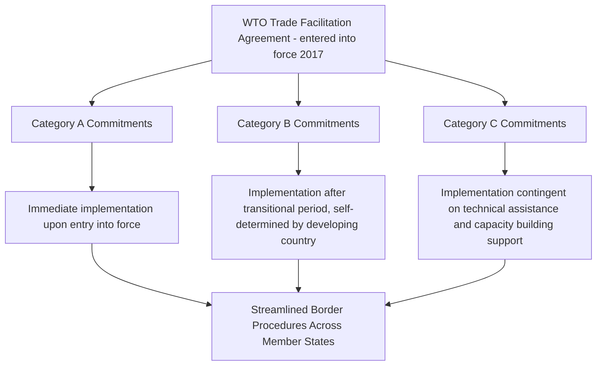

## Customs Modernization and Digital Trade Facilitation

### Overview

Customs modernization refers to the transition of border trade administration from paper-based, manual inspection processes toward digitized, risk-based, and interoperable systems designed to accelerate legitimate trade while maintaining or improving security and compliance screening. Digital trade facilitation is closely linked, encompassing electronic documentation exchange, automated risk assessment, and interoperability standards that allow customs authorities, shippers, carriers, and financial institutions to exchange trade data efficiently across borders. In supply chain geopolitics, customs modernization matters because processing efficiency directly affects effective chokepoint and border capacity — a technically unconstrained port or land border can still function as a practical bottleneck if customs processing is slow, unpredictable, or vulnerable to manipulation.

### Core Technical Components

- **Single Window systems**: A unified electronic platform allowing traders to submit all required import/export documentation (customs declarations, permits, certificates, licenses) to a single point of entry, which then routes information to all relevant government agencies, replacing the traditional model of separately submitting documentation to multiple agencies (customs, agriculture, health, standards bodies) through disconnected processes.
- **Automated risk management systems**: Software-driven risk-scoring engines that assess incoming shipments against historical data, trader compliance history, and intelligence indicators to determine inspection priority, allowing customs authorities to concentrate physical inspection resources on higher-risk shipments while enabling low-risk, established trader shipments to clear with minimal friction.
- **Authorized Economic Operator (AEO) programs**: Certification schemes (paralleling the US Customs-Trade Partnership Against Terrorism, C-TPAT) that grant expedited processing and reduced inspection rates to companies meeting defined supply chain security and compliance standards, creating a tiered trust system rather than uniform scrutiny for all shippers.
- **Electronic data interchange (EDI) and standardized messaging formats**: Standardized digital formats (such as UN/EDIFACT messaging standards) enabling automated data exchange between customs systems, shipping lines, freight forwarders, and financial institutions without manual re-entry at each handoff point.
- **Blockchain and distributed ledger pilot applications**: Various customs authorities and private consortia have piloted blockchain-based systems for trade documentation (bills of lading, certificates of origin) aiming to reduce fraud and improve traceability, though widespread production deployment remains more limited than pilot-stage experimentation as of the current period.

### The WTO Trade Facilitation Agreement Framework

The WTO Trade Facilitation Agreement (TFA), which entered into force in 2017, represents the primary multilateral framework governing customs modernization commitments, notable for its differentiated implementation structure allowing developing and least-developed countries to sequence commitments according to their own capacity constraints, paired with a formal mechanism linking implementation of more demanding commitments to the provision of technical assistance and capacity-building support from developed member states and international organizations. [Inference] This differentiated structure reflects a recognition that customs modernization requires not just political commitment but substantial technical infrastructure investment and institutional capacity that varies significantly across WTO membership, and the TFA's graduated approach was specifically designed to secure broader participation than a uniform, immediate-implementation standard would likely have achieved.

### Strategic and Security Dimensions

- **Supply chain security post-9/11**: Much of the modern AEO/trusted trader framework architecture traces to post-2001 US and international initiatives (C-TPAT, the World Customs Organization's SAFE Framework of Standards) developed specifically to address container security and terrorism risk concerns following the September 11 attacks, illustrating how security policy objectives and trade facilitation objectives became structurally intertwined in customs modernization design from an early stage.
- **Dual-use and export control enforcement**: Digitized customs systems increasingly incorporate automated screening against export control lists and sanctioned-entity databases, directly supporting enforcement of the technology export restriction and sanctions regimes discussed elsewhere in this course (semiconductor export controls, Russia/Iran sanctions enforcement) — modernized systems can flag prohibited destination-cargo combinations far more systematically than manual paper-based review.
- **De minimis threshold policy and e-commerce enforcement pressure**: The rapid growth of low-value e-commerce parcel imports (discussed in relation to air cargo networks) has placed significant strain on customs systems designed around traditional container/bulk shipment volumes, prompting the US, EU, and other jurisdictions to reassess de minimis duty-free thresholds and invest in automated processing capacity specifically to handle vastly increased parcel volume without proportionally increasing processing staff.
- **Data sovereignty and cross-border data flow tensions**: Digital trade facilitation inherently requires cross-border exchange of commercial and shipment data, intersecting with broader debates about data localization requirements and data sovereignty policy that some governments pursue for unrelated strategic or privacy reasons, creating friction where data localization rules conflict with the interoperability assumptions underlying modern single window and EDI systems.

### Case Study: Container Security Initiative and Post-9/11 Trusted Trader Frameworks

The US Container Security Initiative (CSI) and C-TPAT program, developed in the early 2000s, established the template subsequently adopted in modified form by many other jurisdictions: shippers and carriers meeting defined security and documentation standards receive expedited processing, while non-participating or higher-risk shippers face standard or enhanced scrutiny. [Inference] This tiered-trust architecture has become the dominant global paradigm for balancing trade facilitation against security and compliance objectives, effectively formalizing a risk-based resource allocation approach that would be operationally infeasible under a uniform inspection standard given the sheer volume of contemporary global container trade.

### Interoperability Challenges Across Jurisdictions

- **Divergent national data standards**: Despite international standardization efforts (UN/EDIFACT, WCO Data Model), significant variation persists in the specific data fields, formats, and documentation requirements across national customs systems, requiring traders and logistics providers to maintain compliance capability across multiple divergent systems rather than a single harmonized standard.
- **Regional harmonization initiatives**: The EU's Union Customs Code represents one of the more advanced regional harmonization efforts, establishing common customs procedures and electronic systems across all EU member states, while comparable harmonization remains less developed in other regional trade blocs (ASEAN, African Continental Free Trade Area) despite stated aspirations toward similar integration.
- **Legacy system persistence in developing economies**: [Inference] Many developing countries continue to operate customs systems combining partial digitization with substantial residual manual/paper processes, reflecting the capital investment, technical training, and institutional reform required for full modernization — a gap the WTO TFA's technical assistance mechanism is specifically designed to help close, though implementation pacing varies substantially by country.

### Customs Modernization as a Chokepoint-Adjacent Factor

| Factor | Physical chokepoint parallel | Customs/administrative equivalent |
| --- | --- | --- |
| Bottleneck mechanism | Narrow strait limiting vessel throughput | Slow manual processing limiting cargo release rate |
| Capacity expansion approach | Widen channel, add parallel infrastructure | Digitize processes, implement risk-based triage |
| Disruption risk | Physical blockage, conflict, sabotage | System outage, cyberattack, policy/documentation change |
| Resilience strategy | Alternative routing | Backup manual procedures, redundant system architecture |

[Inference] This parallel is not merely metaphorical: a major customs system outage or a sudden change in documentation requirements at a critical border or port can produce cargo backlog effects functionally similar to a physical chokepoint disruption, meaning supply chain risk assessment frameworks increasingly need to incorporate administrative/digital infrastructure reliability alongside traditional physical infrastructure and geopolitical risk factors.

### Cybersecurity Considerations for Digitized Customs Systems

As customs and port systems increasingly digitize, they also become potential targets for cyberattack, whether for criminal (ransomware, data theft) or state-sponsored disruption purposes. [Inference] The 2017 NotPetya malware attack, which significantly disrupted Maersk's global container shipping IT systems (though not a customs system specifically), is frequently cited in supply chain resilience literature as a demonstration of how a single cyber incident affecting critical logistics IT infrastructure can produce disruption effects comparable in scale to a physical chokepoint event, reinforcing the case for treating digital infrastructure resilience as a first-order supply chain security consideration rather than a secondary IT operations concern.

**Related Topics:**

- WTO Trade Facilitation Agreement implementation and technical assistance mechanisms
- Authorized Economic Operator (AEO) and C-TPAT trusted trader program design
- E-commerce de minimis threshold policy reform (US, EU)
- EU Union Customs Code and regional customs harmonization models
- Cybersecurity risk in maritime and logistics IT infrastructure (NotPetya case study)
- Export control automated screening and sanctions compliance technology