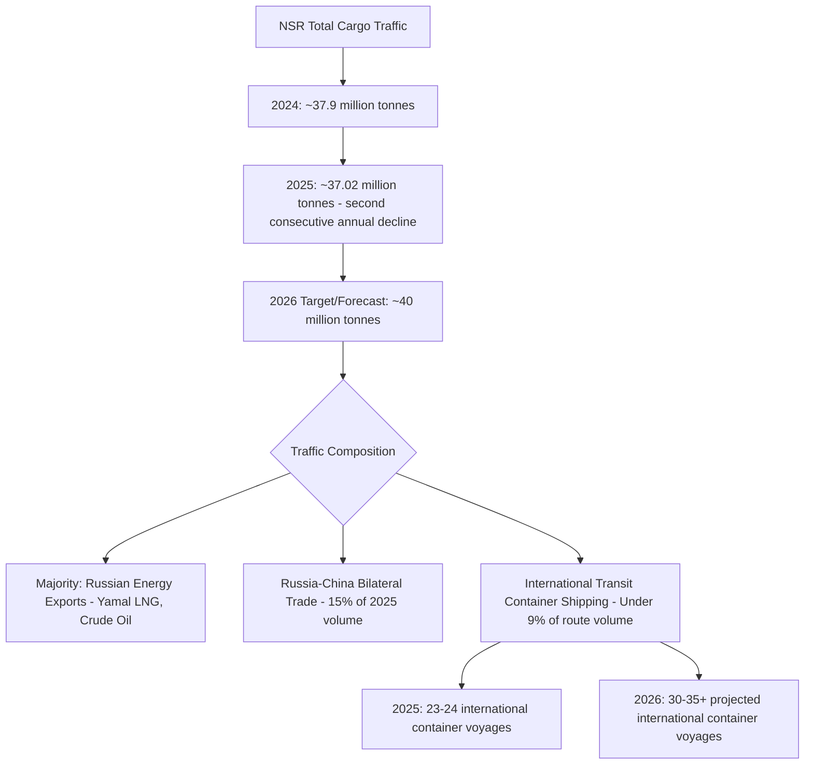

## Arctic Shipping Routes and the Impact of Ice Melt on Trade Geography

### Overview

Arctic shipping routes — primarily Russia's Northern Sea Route (NSR) along the Siberian coast and, to a lesser extent, the Northwest Passage through the Canadian Arctic Archipelago — offer substantially shorter maritime distances between Northeast Asia and Europe than traditional routes via the Suez Canal or Cape of Good Hope. Diminishing Arctic sea ice, driven by climate change, has extended seasonal navigability windows and generated periodic commercial and strategic interest in Arctic shipping as a genuine alternative trade corridor. As of 2026, available evidence indicates the NSR remains predominantly a Russian resource-export corridor with an emerging but still marginal international transit shipping component, rather than a wholesale restructuring of global East-West trade geography.

### Physical and Navigational Characteristics

- **Northern Sea Route (NSR)**: Runs along Russia's Arctic coastline from Novaya Zemlya in the west to the Bering Strait in the east, under Russian jurisdictional control and requiring transit permits issued by Rosatom, Russia's state nuclear corporation, which also operates the icebreaker fleet required for safe passage through ice-covered sections.
- **Distance and time savings**: The NSR can reduce transit distance by up to approximately 30% compared to the Suez Canal route for Asia-Europe voyages, translating to an estimated 10–15 day reduction in transit time depending on specific origin/destination ports and ice conditions.
- **Seasonal navigability**: Transit windows have extended to approximately 6–7 months of the year in recent seasons as ice retreats, though the route remains ice-affected for a substantial portion of the year, requiring ice-class vessels or icebreaker escort for at least part of any given voyage, and full ice-free year-round transit for standard commercial vessel classes (VLCC, ULCC, Capesize) remains constrained by residual ice in the route's northern sections even amid overall retreat.
- **Northwest Passage**: The Canadian Arctic alternative route remains considerably less developed for commercial shipping than the NSR, facing more complex ice conditions, sparser infrastructure, and unresolved jurisdictional disputes between Canada (which claims the passage as internal waters) and other states (including the US) that regard it as an international strait.

### 2025–2026 Traffic Data and Trends

Overall NSR cargo tonnage was 15% higher in the first half of 2026 than in the same period the previous year, according to Russia's state-owned nuclear shipping company Atomflot, with total 2026 freight traffic expected to reach around 40 million metric tons, according to Russia's Far East and Arctic Development Minister Alexey Chekunkov. However, this headline growth followed total Northern Sea Route traffic of 37.02 million tonnes in 2025, down from 37.9 million tonnes in 2024 — a second consecutive year of decline in overall tonnage, indicating the route's growth trajectory has not been linear. [Russia’s Northern Sea Route cargo set to surpass 40 million tonnes as China expands container shipping +2](https://en.highnorthnews.com/business/russias-northern-sea-route-cargo-to-surpass-40m-tonnes-as-china-south-korea-dispatch-containerships/1116787)

The international container shipping component, while growing, remains a small fraction of total route activity: more than 35 international container voyages were expected on the NSR in 2026, up from 24 the year before, according to Chekunkov, and Rosatom's CEO Alexey Likhachev separately projected 2026 cargo traffic would rise 14% as Chinese shipping companies increased their presence and launched a scheduled service, with 23 container voyages recorded between Russian and Chinese ports in 2025 and Chinese carriers planning more than 30 by year-end 2026. [Inference] The modest discrepancy between different Russian officials' cited figures for prior-year voyage counts likely reflects differing definitions of "international" versus "Russia-China" container traffic categories rather than a substantive data conflict. [TASS](https://tass.com/economy/2180981)[RCI](https://www.rcinet.ca/eye-on-the-arctic/2026/09/04/northern-sea-route-cargo-traffic-to-rise-14-per-cent-as-chinese-shipping-expands-says-rosatom/)

### The Strait of Hormuz Connection: A Direct Case of Chokepoint-Driven Arctic Diversification

A particularly notable 2026 development directly links Arctic shipping to this course's broader chokepoint risk framework: Sea Legend Shipping, a Chinese shipowner, launched the first weekly container service through the Arctic on an express route to Europe, branded the China-Europe Arctic Express (CAX), running 8 fixed weekly sailings from 15 August to 3 October 2026 using 7 vessels, with Rosatom issuing transit permits for the vessels. Critically, Rosatom's head Alexey Likhachev tied the launch directly to conditions in the Persian Gulf, where the Strait of Hormuz was officially closed to commercial traffic four times in the two months leading up to mid-August 2026. [Gettransport](https://blog.gettransport.com/trends-in-logistic/northern-sea-route-arctic-container-service-2026/)[Gettransport](https://blog.gettransport.com/trends-in-logistic/northern-sea-route-arctic-container-service-2026/)

This is a directly documented, real-world instance of the theoretical "alternative routing" dynamic discussed throughout this course's chokepoint modules: acute Hormuz disruption risk generated immediate commercial interest in an entirely different chokepoint-avoidance strategy (Arctic transit) rather than only the more conventional alternatives (Cape of Good Hope diversion, pipeline bypass). However, the scale context is essential: one weekly CAX sailing represents under 0.5% of normal Asia-to-North-Europe container flow, and the entire 8-sailing programme amounts to less than 0.1% of annual volume on that trade route — characterized as a hedge against a specific chokepoint, not a structural shift in Asia-Europe shipping capacity. [Gettransport](https://blog.gettransport.com/trends-in-logistic/northern-sea-route-arctic-container-service-2026/)

### Structural Constraints Limiting Arctic Shipping's Scale

- **Insurance cost premium**: War risk and specialized insurance premiums for Arctic transits run five to ten times higher than for comparable voyages on conventional routes, substantially eroding the time-savings-based economic case for the route. [Gettransport](https://blog.gettransport.com/trends-in-logistic/northern-sea-route-arctic-container-service-2026/)
- **Western carrier absence**: Western shipping lines have stayed out of mainstream Arctic container operations, reflecting a combination of sanctions exposure, reputational risk, elevated insurance cost, and regulatory uncertainty — given the NSR's operation under direct Russian state jurisdiction and permitting authority amid ongoing Western sanctions on Russia. [Gettransport](https://blog.gettransport.com/trends-in-logistic/northern-sea-route-arctic-container-service-2026/)
- **Vessel safety and quality concerns**: Monitoring groups have documented Arctic-transiting cargo ships with no ice classification at all and hulls over 15 years old operating under flag-of-convenience registration, echoing the shadow fleet vessel-quality concerns discussed elsewhere in this course, and raising analogous environmental and safety risk questions specific to the ecologically sensitive Arctic environment. [Gettransport](https://blog.gettransport.com/trends-in-logistic/northern-sea-route-arctic-container-service-2026/)
- **Limited emergency response infrastructure**: The Arctic's sparse search-and-rescue, icebreaker backup, and salvage infrastructure means a vessel breakdown or incident carries substantially higher operational and safety risk than a comparable incident on conventional shipping lanes with dense port and emergency response coverage.
- **Underlying commodity composition**: Even amid record tonnage growth, the route's traffic remains overwhelmingly a domestic Russian energy-export corridor (Yamal LNG, crude oil shuttle transport) with an international container service attached at its margins, rather than a broad-based competitor to Suez/Malacca-routed general cargo trade. [Gettransport](https://blog.gettransport.com/trends-in-logistic/northern-sea-route-arctic-container-service-2026/)

### China's "Polar Silk Road" Strategic Framing

China has explicitly incorporated Arctic shipping development into its Belt and Road Initiative framework under the "Polar Silk Road" concept, reflecting Beijing's interest in Arctic route access as an additional maritime chokepoint diversification hedge alongside the overland Eurasian corridors and port investment strategies discussed elsewhere in this course. [Inference] The growing Chinese commercial presence in NSR container shipping — including the CAX service explicitly linked to Hormuz disruption — suggests Chinese shipping interests are treating Arctic transit as one option within a broader portfolio of route diversification responses to Middle East chokepoint volatility, rather than pursuing Arctic shipping as an independent strategic priority disconnected from other chokepoint risk considerations.

### Geopolitical and Governance Dimensions

- **Russian sovereignty and NATO friction**: Russian Deputy Foreign Minister Alexander Grushko has stated that Moscow is observing continued NATO infrastructure expansion northward and factoring these developments into its defense planning, reflecting the Arctic's dual status as both an emerging commercial corridor and an active military/security competition space between Russia and NATO members. [TASS](https://tass.com/economy/2180981)
- **Sanctions and Western engagement dilemma**: Continued Chinese and Russian expansion of NSR shipping proceeds largely outside Western commercial participation, creating a bifurcated Arctic shipping ecosystem where growth is concentrated among sanctions-unconstrained actors (Russia, China, and to a lesser extent South Korea) while Western carriers remain structurally excluded by their own sanctions compliance and risk management postures.
- **Indigenous and environmental governance concerns**: Arctic shipping expansion raises distinct governance considerations largely absent from other chokepoints discussed in this course, including impacts on Indigenous Arctic communities' subsistence practices and cultural relationship to affected waters, and heightened environmental risk given the Arctic's ecological sensitivity and the region's limited spill-response capacity.

### Comparative Assessment: "Golden Waterway" vs. "Niche Route" Framings

| Assessment dimension | "Golden Waterway" (transformative) framing | "Niche Route" (limited) framing |
| --- | --- | --- |
| Tonnage trend | Record highs targeted for 2026 (~40 million tonnes) | Two consecutive years of decline (2024-2025) before 2026 rebound |
| International container growth | Voyage count rising ~50% year-on-year | Still under 9% of total route volume; single-digit percentage of relevant Asia-Europe trade |
| Strategic driver | Genuine structural cost/time advantage | Largely a targeted hedge against specific chokepoint disruptions (Hormuz) rather than routine commercial preference |
| Participant base | Expanding Chinese and Korean involvement | Continued near-total Western carrier absence |
| Insurance economics | Improving as traffic normalizes | Remains 5-10x conventional route premiums, a persistent structural cost barrier |

[Inference] The evidence as of 2026 favors a synthesis position between these two framings: the NSR is neither a transformative replacement for Suez-routed Asia-Europe trade nor a purely symbolic non-factor, but rather a genuinely growing, chokepoint-diversification-driven niche corridor whose expansion is closely tied to episodic disruption elsewhere (particularly Hormuz) rather than representing an independent, self-sustaining commercial trade route shift.

**Related Topics:**

- Strait of Hormuz disruption and its direct linkage to 2026 Arctic route diversification
- China's Polar Silk Road strategy within the broader Belt and Road Initiative framework
- Russian Arctic sovereignty claims and NATO northern flank military posture
- Shadow fleet vessel-quality parallels in Arctic-transiting tanker and container operations
- Yamal LNG project and Sovcomflot's ice-class tanker fleet operations
- Indigenous Arctic community rights and environmental governance in shipping lane planning