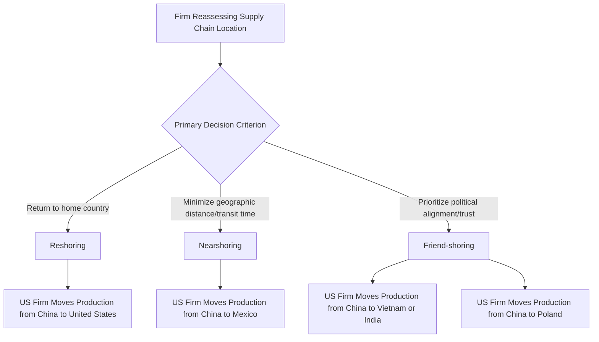

## Defining Reshoring, Nearshoring, and Friend-Shoring

### Overview

Reshoring, nearshoring, and friend-shoring are three related but analytically distinct supply chain relocation strategies that firms and governments have increasingly pursued since the mid-2010s and accelerated after the COVID-19 pandemic and Russia's 2022 invasion of Ukraine exposed the vulnerabilities of highly concentrated, geographically distant, and geopolitically exposed supply chains. While often used loosely or interchangeably in popular discourse, each term describes a different geographic and strategic logic for relocating production, and precise usage matters for accurately analyzing corporate and government supply chain policy.

### Core Definitions

- **Reshoring**: The relocation of manufacturing or production activity back to the firm's home country, reversing a prior offshoring decision. Reshoring is defined purely by the destination being the firm's own domestic market/jurisdiction, regardless of the geopolitical relationship with the country being exited.
- **Nearshoring**: The relocation of production to a country geographically proximate to the home market or end-consumer market, even if not the home country itself — for US firms, this typically means Mexico, Central America, or the Caribbean; for EU firms, this typically means Central/Eastern Europe, Turkey, or North Africa. Nearshoring is defined by geographic proximity, which typically (though not always) also implies reduced transit time and logistics cost relative to more distant sourcing locations.
- **Friend-shoring** (also termed "ally-shoring"): The relocation or diversification of production toward countries considered politically aligned or trusted partners, regardless of geographic proximity — a US firm friend-shoring to Vietnam, India, or Poland is prioritizing political alignment and reduced geopolitical risk exposure over pure geographic distance minimization. The term gained prominence following explicit US Treasury and other government usage around 2022 in the context of reducing supply chain dependence on geopolitical rivals.

### Distinguishing the Three Strategies

The three strategies are not mutually exclusive, and a single relocation decision can satisfy more than one category simultaneously — production moved from China to Mexico by a US firm is simultaneously nearshoring (geographic proximity) and, depending on the specific political framing, could also be characterized as friend-shoring given the US-Mexico-Canada Agreement (USMCA) trade relationship, illustrating that these categories represent overlapping analytical lenses rather than strictly partitioned strategic options.

### Comparative Framework

| Dimension | Reshoring | Nearshoring | Friend-shoring |
| --- | --- | --- | --- |
| Primary criterion | Return to home country | Geographic proximity | Political/security alignment |
| Typical destination examples (for US firms) | United States | Mexico, Central America | Vietnam, India, Poland, Mexico |
| Logistics/transit time benefit | Maximized (eliminates international shipping) | Significant (short transit, time zone alignment) | Variable (depends on specific country chosen) |
| Labor cost implication | Typically highest cost increase | Moderate cost increase | Highly variable by destination |
| Primary risk addressed | Full elimination of offshore supply chain exposure | Reduced logistics/chokepoint exposure, faster response to demand shifts | Reduced exposure to sanctions, export controls, and political rupture with rival states |
| Government policy tool most associated | Domestic industrial subsidies (e.g., CHIPS Act) | Regional trade agreements (USMCA) | Alliance-based trade/investment coordination (PGII, Quad) |

### Underlying Strategic Drivers

Several overlapping factors have driven corporate and government interest in all three strategies since approximately 2018–2022:

- **US-China trade war tariffs (2018–present)**: Section 301 tariffs on Chinese imports directly raised the cost of China-based manufacturing for goods destined for the US market, creating an immediate financial incentive to relocate production regardless of which of the three relocation strategies a firm ultimately chose.
- **COVID-19 pandemic supply chain disruption**: Extended factory shutdowns in China during 2020–2022, combined with severe port congestion and shipping capacity constraints globally, exposed the operational fragility of long, single-source supply chains and highlighted the value of geographic diversification and shorter logistics chains.
- **Russia's 2022 invasion of Ukraine and Western sanctions response**: Demonstrated how quickly geopolitical rupture can render an entire national supply base unusable or legally prohibited, directly informing the friend-shoring concept's emphasis on political alignment as a risk factor independent of and additional to pure logistics considerations.
- **Technology export control tightening**: US and allied restrictions on semiconductor and advanced technology exports to China have created a distinct category of friend-shoring driver specific to technology supply chains, where the relevant risk is not general trade disruption but the potential loss of access to defined restricted-country markets or suppliers.
- **Rising Chinese labor costs**: Independent of geopolitical considerations, China's rising wage levels relative to Southeast Asian and South Asian alternatives have made cost-driven relocation commercially attractive for lower-margin, labor-intensive manufacturing regardless of the political dimension.

### Government Policy Instruments Supporting Each Strategy

- **Reshoring**: Domestic industrial policy and subsidy programs, most prominently the US CHIPS and Science Act (semiconductor manufacturing) and Inflation Reduction Act (clean energy manufacturing), which provide direct financial incentives for domestic production location decisions.
- **Nearshoring**: Regional trade agreement frameworks, particularly USMCA's rules of origin requirements, which create preferential tariff treatment for goods meeting defined North American content thresholds, directly incentivizing Mexican and Canadian production for the US market as discussed in relation to special economic zones and maquiladora manufacturing.
- **Friend-shoring**: Alliance-coordinated investment and infrastructure initiatives, including the G7's Partnership for Global Infrastructure and Investment (PGII) and Quad-aligned supply chain resilience initiatives, aimed at building manufacturing capacity in politically aligned developing economies as an explicit alternative to China-concentrated production.

### Common Analytical Pitfalls

[Inference] A frequent imprecision in both media commentary and some corporate communications is treating all three terms as synonymous with "moving out of China," when in practice they describe genuinely different strategic logics with different risk-reduction profiles: reshoring eliminates offshore supply chain risk entirely but typically at the highest cost; nearshoring reduces logistics and chokepoint-transit risk specifically but may not reduce exposure to the destination country's own political relationship with the home country; and friend-shoring specifically targets geopolitical and sanctions-related risk but may not meaningfully reduce logistics costs or transit time if the "friendly" country is geographically distant. Analysts and policymakers should therefore specify which risk category a given relocation decision is actually intended to address rather than treating the three terms as interchangeable shorthand for general supply chain diversification.

### Measurement and Data Challenges

[Inference] Empirically measuring the scale of reshoring, nearshoring, and friend-shoring trends is complicated by the absence of a single authoritative data source directly tracking firm-level relocation decisions by category; researchers typically rely on proxy indicators such as bilateral trade flow shifts, foreign direct investment announcement tracking (which may not reflect actually realized investment), and corporate earnings call/annual report disclosures, each of which carries known limitations in fully capturing the scale and durability of the underlying relocation trend, meaning claims about the pace or scale of "de-risking from China" should be treated with appropriate caution regarding their evidentiary basis.

**Related Topics:**

- USMCA rules of origin and Mexican maquiladora/nearshoring manufacturing zones
- US CHIPS Act and Inflation Reduction Act as reshoring policy instruments
- G7 Partnership for Global Infrastructure and Investment (PGII) as friend-shoring infrastructure
- Section 301 tariffs and the US-China trade war's supply chain relocation effects
- Vietnam and India as friend-shoring destination case studies
- Foreign direct investment tracking methodologies and data limitations in measuring supply chain shifts