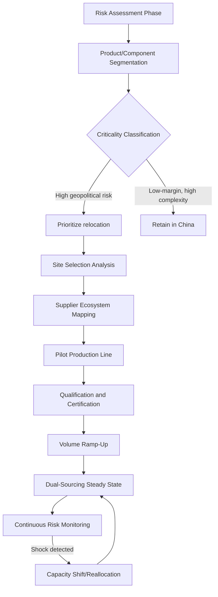

## The China Plus One Diversification Strategy

### Definition and Conceptual Framework

The China Plus One (C+1) strategy refers to a corporate supply chain diversification approach in which multinational enterprises (MNEs) retain manufacturing and sourcing operations in China while deliberately establishing parallel or supplementary production capacity in one or more additional countries. The strategy does not mandate full withdrawal from China; rather, it treats China as one node in a multi-country production network rather than the sole or dominant node.

The term is a strategic risk-management framework, not a formal trade-policy designation. It sits conceptually between two poles:

- **Full China concentration** — single-country dependency, maximizing scale economies and supplier ecosystem depth
- **Full decoupling** — complete exit from Chinese production, maximizing geopolitical insulation

C+1 occupies the middle ground: partial redundancy sufficient to absorb shocks without sacrificing the cost, scale, and infrastructure advantages that made China the "world's factory" in the first place.

### Historical Origins and Evolution

**Key Points**

- The term originated in the mid-2000s, initially describing Japanese manufacturers diversifying into Vietnam and Thailand to hedge against rising Chinese labor costs and localized supply disruptions.
- Early drivers (2005–2015) were primarily *economic*: rising wages in China's coastal manufacturing hubs, currency appreciation (RMB), and labor shortages in the Pearl River Delta.
- The strategy's meaning shifted after 2018, when the US–China trade war introduced tariff-driven cost calculus, and accelerated further after 2020, when COVID-19 border closures and factory shutdowns exposed the fragility of single-country sourcing.
- Post-2022, geopolitical risk (Taiwan Strait tensions, export controls on semiconductors, sanctions regimes) became a dominant driver alongside cost and resilience considerations.

This periodization matters because it explains why C+1 is often discussed alongside — but is distinct from — reshoring and friend-shoring. C+1 is fundamentally *diversification*, not *relocation of origin country by geopolitical alignment* (friend-shoring) or *return to home country* (reshoring).

### Distinguishing C+1 from Adjacent Strategies

| Strategy | Core Logic | China's Role | Primary Driver |
| --- | --- | --- | --- |
| China Plus One | Add parallel capacity elsewhere; retain China | Retained, supplemented | Risk diversification, cost hedging |
| Reshoring | Return production to home country | Exited | National security, labor policy, tariffs |
| Nearshoring | Relocate to geographically proximate country | Reduced or exited | Logistics cost, lead time |
| Friend-shoring | Relocate to politically aligned countries | Reduced or exited | Geopolitical alignment, sanctions risk |
| Decoupling | Systemic separation of two economies | Eliminated | State-level strategic competition |

[Inference] In practice, corporate strategies increasingly blend these categories — for example, a firm may pursue C+1 with Vietnam (proximate, non-aligned) while simultaneously reshoring critical defense-related components to the US (friend-shoring/reshoring hybrid). Pure-form C+1 without any friend-shoring logic is becoming less common in strategically sensitive sectors.

### Strategic Drivers

#### Economic Drivers

- **Rising Chinese labor costs**: Manufacturing wages in China's coastal provinces increased substantially from the mid-2000s onward, eroding the low-cost advantage relative to Southeast Asian alternatives.
- **RMB appreciation**: A stronger yuan against the dollar over parts of the 2000s–2010s raised the dollar-denominated cost of Chinese-made goods.
- **Tariff exposure**: Section 301 tariffs (US, imposed 2018–2019) on hundreds of billions of dollars in Chinese imports directly incentivized firms to relocate final-assembly stages to tariff-exempt jurisdictions.

#### Risk and Resilience Drivers

- **Single-point-of-failure exposure**: COVID-19 lockdowns (notably Shanghai's 2022 lockdown) demonstrated that concentrated production creates systemic vulnerability to localized shocks.
- **Geopolitical tail risk**: Escalation scenarios around Taiwan, export-control regimes (e.g., US restrictions on advanced semiconductor equipment), and potential sanctions create catastrophic-loss scenarios that risk managers must hedge against even at low probability.
- **Logistics fragility**: Port congestion, shipping cost volatility (as seen in 2021 container rate spikes), and single-corridor dependency (e.g., over-reliance on trans-Pacific shipping lanes) amplify disruption impact.

#### Policy Drivers

- **Industrial policy incentives**: Host-country subsidies (e.g., India's Production-Linked Incentive scheme, Vietnam's tax holidays for foreign direct investment) actively pull manufacturing toward alternative locations.
- **Export-control compliance**: Firms in sensitive sectors (semiconductors, advanced materials, dual-use technologies) diversify to maintain access to US and allied technology ecosystems, which may restrict trade with China-based entities.

### Common Destination Countries and Their Specializations

**Vietnam**

- Dominant destination for electronics assembly, textiles, and footwear.
- Benefits from proximity to Chinese supply chains (many Vietnamese factories still import Chinese intermediate components), a young labor force, and multiple free trade agreements (CPTPP, EU-Vietnam FTA).
- [Unverified] Port and logistics infrastructure remains less developed than China's, and skilled-labor depth for complex electronics is comparatively limited — actual bottleneck severity varies by sub-sector and firm.

**India**

- Targeted primarily for smartphone assembly (notably iPhone final assembly under Apple's supplier network) and pharmaceutical intermediates.
- Large domestic market provides an additional rationale beyond pure export diversification.
- Structural challenges include land acquisition complexity, labor law rigidity across states, and power/logistics infrastructure gaps.

**Mexico**

- Serves the nearshoring/friend-shoring overlap for the US market, given USMCA preferential access and geographic proximity.
- Strong in automotive components, appliances, and electronics for North American final assembly.

**Indonesia, Thailand, Malaysia**

- Increasingly used for electronics, semiconductors back-end packaging (Malaysia has a long-established semiconductor assembly/test industry), and automotive components.

**Bangladesh**

- Concentrated almost exclusively in textiles and garments, building on an already-established apparel export base.

### Implementation Architecture

Firms pursuing C+1 typically follow a phased implementation pattern:

#### Phase Detail

**1. Risk Assessment and Product Segmentation**

Firms classify their bill-of-materials (BOM) and product lines by risk exposure and diversification feasibility. Typical segmentation criteria:

- Tariff exposure under current and probable future trade policy
- Availability of alternative-country supplier ecosystems
- Technical complexity (mature, standardized processes migrate more easily than cutting-edge processes requiring specialized tooling)
- Volume and margin structure (low-margin, high-volume goods are more sensitive to relocation cost premiums)

**2. Site Selection Analysis**

Multi-criteria evaluation typically weighs:

- Labor cost and availability
- Existing supplier ecosystem depth (component availability, sub-tier suppliers)
- Trade agreement coverage and tariff treatment
- Political stability and regulatory predictability
- Infrastructure (port access, power reliability, logistics corridors)
- Free trade zone / special economic zone incentives

**3. Supplier Ecosystem Mapping**

A critical bottleneck: China's advantage is not merely low labor cost but decades of accumulated **supplier ecosystem density** — tens of thousands of specialized component makers, tooling shops, and sub-assemblers clustered within short logistics distances. Replicating this density elsewhere requires either:

- Importing Chinese intermediate components into the new location (partial diversification — final assembly only), or
- Multi-year ecosystem-building investment to develop local Tier 2/3 suppliers

[Inference] This is why many "diversified" supply chains remain functionally dependent on China for upstream components even after final assembly relocates — a pattern sometimes termed "China Plus One, Minus the Supply Chain."

**4. Dual Qualification and Redundancy Design**

Mature C+1 programs maintain qualified production lines in both locations simultaneously, enabling dynamic volume shifting in response to disruption (tariff changes, natural disasters, political events) without requalification lag.

### Sector-Specific Patterns

**Electronics and Consumer Technology**

- Final assembly increasingly split between China and India/Vietnam.
- Upstream semiconductor fabrication remains heavily concentrated (Taiwan, South Korea, China) due to extreme capital intensity and technical barriers — C+1 is largely inapplicable at the wafer-fabrication tier in the near term.

**Apparel and Textiles**

- Among the most successfully diversified sectors, given relatively low capital barriers and technical complexity.
- Bangladesh, Vietnam, and Cambodia have absorbed significant volume shifts.

**Automotive**

- Component sourcing diversification is constrained by long qualification cycles (safety-critical parts require extensive testing) and just-in-time production models that favor geographic proximity to final assembly plants.

**Pharmaceuticals and Active Pharmaceutical Ingredients (APIs)**

- China (and India, which itself depends on Chinese API intermediates) dominates global API production.
- [Unverified] Diversification in this sector is particularly slow due to regulatory approval requirements (FDA/EMA facility inspections) that impose multi-year timelines on qualifying new manufacturing sites.

### Cost-Benefit Analysis Framework

Firms typically evaluate C+1 transitions using a modified total cost of ownership (TCO) model that extends beyond unit production cost:

$$TCO_{total} = C_{production} + C_{logistics} + C_{tariff} + C_{qualification} + C_{risk-adjusted}$$

Where $C_{risk-adjusted}$ represents the expected value of disruption cost, calculated as:

$$C_{risk-adjusted} = \sum_{i} P_i \times L_i$$

with $P_i$ the probability of disruption scenario $i$ and $L_i$ the associated loss (lost sales, expedited freight, contractual penalties).

**Example**

A consumer electronics firm evaluating whether to dual-source a component:

- China-only production cost: $4.20/unit
- Vietnam-diversified cost: $4.85/unit (a $0.65/unit premium, roughly 15%)
- Estimated annual probability of a disruption event causing >30-day production halt: 8%
- Estimated loss from such an event (lost sales + expedite freight + customer penalty clauses): $12M on a 2M-unit annual line, or $6.00/unit equivalent

Expected annual risk-adjusted cost of remaining China-only: $0.08 \times \$6.00 = \$0.48$/unit

Since the diversification premium ($0.65/unit) exceeds the raw risk-adjusted expected loss ($0.48/unit) in this simplified example, a purely expected-value calculation might favor staying concentrated — but firms typically apply a risk premium above expected value for tail-risk (catastrophic, low-probability) scenarios, which shifts the decision toward diversification. [Speculation] The magnitude of this risk premium varies significantly by firm risk tolerance, industry regulatory pressure, and board-level geopolitical risk appetite, and is not standardized across firms.

### Challenges and Limitations

**Key Points**

- **Ecosystem replication lag**: Alternative locations often lack the multi-tier supplier density built up in China over decades; new ecosystems can take 5–10+ years to mature.
- **Infrastructure gaps**: Port capacity, power grid reliability, and inland logistics in destination countries frequently lag China's world-class industrial infrastructure.
- **Hidden China dependency**: Many "diversified" facilities still import Chinese components or machinery, meaning geopolitical risk is only partially mitigated — sometimes termed "shallow diversification."
- **Cost premium**: Diversified production frequently carries a cost premium relative to China-concentrated production, which must be absorbed by margins or passed to consumers.
- **Qualification and certification lag**: Regulated industries (automotive, aerospace, pharmaceuticals, medical devices) face multi-year requalification timelines that slow the pace of diversification regardless of strategic intent.
- **Talent and management capacity**: Operating dual or multiple production geographies requires expanded management bandwidth, local expertise, and cross-cultural operational coordination.

### Government and Policy Interactions

C+1 corporate strategy interacts with state-level industrial policy in several ways:

- **Host-country incentive competition**: Countries like India, Vietnam, and Mexico actively compete for relocating manufacturing through tax incentives, land grants, and streamlined regulatory approval (e.g., India's PLI scheme offering production-linked cash incentives across electronics, pharmaceuticals, and other sectors).
- **Home-country pressure**: US and EU policy (e.g., tariff structures, export controls, "de-risking" rhetoric distinct from "decoupling") creates regulatory incentives that push corporate C+1 decisions toward friend-shoring-aligned destinations.
- **Chinese policy response**: China has itself responded to C+1 trends through domestic industrial upgrading policies (e.g., "Made in China 2025") aimed at moving up the value chain into higher-margin, higher-technology segments — partially offsetting the loss of lower-value manufacturing to C+1 destinations.

### Illustrative Diagram: C+1 Network Topology

<svg xmlns="http://www.w3.org/2000/svg" viewBox="0 0 800 480">
<text x="400" y="30" font-family="sans-serif" font-size="18" font-weight="bold" text-anchor="middle" fill="#1a1a1a">China Plus One — Network Topology (svg_diagram)</text>

<circle cx="150" cy="230" r="70" fill="#c0392b" opacity="0.85" />
<text x="150" y="225" font-family="sans-serif" font-size="16" font-weight="bold" text-anchor="middle" fill="#ffffff">China</text>
<text x="150" y="245" font-family="sans-serif" font-size="12" text-anchor="middle" fill="#ffffff">Primary Base</text>

<circle cx="420" cy="100" r="45" fill="#2980b9" opacity="0.85" />
<text x="420" y="98" font-family="sans-serif" font-size="13" font-weight="bold" text-anchor="middle" fill="#ffffff">Vietnam</text>
<text x="420" y="114" font-family="sans-serif" font-size="10" text-anchor="middle" fill="#ffffff">Electronics/Textiles</text>
<circle cx="600" cy="230" r="45" fill="#27ae60" opacity="0.85" />
<text x="600" y="228" font-family="sans-serif" font-size="13" font-weight="bold" text-anchor="middle" fill="#ffffff">India</text>
<text x="600" y="244" font-family="sans-serif" font-size="10" text-anchor="middle" fill="#ffffff">Smartphones/APIs</text>
<circle cx="420" cy="360" r="45" fill="#8e44ad" opacity="0.85" />
<text x="420" y="358" font-family="sans-serif" font-size="13" font-weight="bold" text-anchor="middle" fill="#ffffff">Mexico</text>
<text x="420" y="374" font-family="sans-serif" font-size="10" text-anchor="middle" fill="#ffffff">Automotive/NA Access</text>
<circle cx="230" cy="420" r="40" fill="#d35400" opacity="0.85" />
<text x="230" y="418" font-family="sans-serif" font-size="12" font-weight="bold" text-anchor="middle" fill="#ffffff">Bangladesh</text>
<text x="230" y="432" font-family="sans-serif" font-size="10" text-anchor="middle" fill="#ffffff">Apparel</text>

<line x1="195" y1="200" x2="380" y2="120" stroke="#7f8c8d" stroke-width="2" stroke-dasharray="6,4" />
<line x1="210" y1="240" x2="555" y2="232" stroke="#7f8c8d" stroke-width="2" stroke-dasharray="6,4" />
<line x1="195" y1="265" x2="380" y2="340" stroke="#7f8c8d" stroke-width="2" stroke-dasharray="6,4" />
<line x1="180" y1="285" x2="250" y2="385" stroke="#7f8c8d" stroke-width="2" stroke-dasharray="6,4" />

<line x1="465" y1="95" x2="700" y2="70" stroke="#2c3e50" stroke-width="2" />
<line x1="645" y1="220" x2="740" y2="200" stroke="#2c3e50" stroke-width="2" />
<line x1="465" y1="355" x2="700" y2="380" stroke="#2c3e50" stroke-width="2" />

<text x="700" y="60" font-family="sans-serif" font-size="11" fill="`#1a1a1a`">US/EU Markets</text>

<text x="700" y="195" font-family="sans-serif" font-size="11" fill="`#1a1a1a`">Domestic + Export</text>

<text x="700" y="395" font-family="sans-serif" font-size="11" fill="`#1a1a1a`">USMCA Market</text>

<line x1="60" y1="460" x2="100" y2="460" stroke="#7f8c8d" stroke-width="2" stroke-dasharray="6,4" />
<text x="105" y="464" font-family="sans-serif" font-size="10" fill="#1a1a1a">Residual component dependency on China</text>
<line x1="450" y1="460" x2="490" y2="460" stroke="#2c3e50" stroke-width="2" />
<text x="495" y="464" font-family="sans-serif" font-size="10" fill="#1a1a1a">Final goods flow to end markets</text>
</svg>

### Measuring Diversification Effectiveness

Firms and analysts assess C+1 progress using several metrics:

- **Revenue/volume concentration ratio**: Percentage of total production or sourcing value still attributable to China (e.g., a shift from 90% to 60% China-concentration over a defined period).
- **Herfindahl-Hirschman Index (HHI) applied to sourcing**: Adapted from market-concentration analysis, calculated as $HHI = \sum_{i=1}^{n} s_i^2$, where $s_i$ is the share of sourcing value from country $i$. A declining HHI indicates successful geographic diversification.
- **Time-to-recovery**: Measured resilience improvement — how quickly production can be restored or shifted following a disruption event, compared to pre-diversification baselines.
- **Depth-of-diversification audits**: Assessing not just final-assembly location but upstream component origin, to detect "shallow" diversification that retains hidden China dependency.

### Case Pattern Example

**Example**

A hypothetical (composite, illustrative) consumer electronics OEM's phased C+1 rollout for a mid-range smartphone product line:

1. **Year 1**: Final assembly for units destined for the Indian domestic market shifted to a contract manufacturer in India (tariff and market-access driven); China retains assembly for all other markets.
2. **Year 2**: Camera module and display sub-assembly qualification begins in Vietnam, targeting a 20% volume shift for non-Indian export markets.
3. **Year 3**: Dual-sourcing steady state achieved — 55% China, 30% India, 15% Vietnam — with contractual flexibility clauses allowing volume reallocation within 90 days in response to tariff or disruption events.
4. **Ongoing**: Semiconductor components (SoC, memory) remain sourced from Taiwan/South Korea regardless of assembly location, illustrating that C+1 at the assembly tier does not eliminate concentration risk at the component-fabrication tier.

[Inference] This layered pattern — diversifying at the assembly stage while retaining concentration at the deep-tier component stage — reflects the general industry tendency to diversify where technical barriers are lowest first, leaving the most capital-intensive and technically complex tiers (semiconductor fabrication, specialty chemicals) concentrated for longer.

### Conclusion

The China Plus One strategy represents a pragmatic middle path between full China dependency and complete decoupling, driven by an evolving mix of cost, resilience, and geopolitical considerations. Its effectiveness is bounded by the difficulty of replicating China's deep, multi-tier supplier ecosystems, meaning genuine risk reduction often lags behind headline announcements of "diversified" production. Firms evaluating C+1 must weigh direct cost premiums against risk-adjusted disruption costs, while accounting for the reality that assembly-stage diversification frequently leaves upstream component dependency intact. The strategy continues to evolve in response to shifting trade policy, export-control regimes, and host-country industrial incentives, and increasingly overlaps with — rather than substitutes for — friend-shoring and nearshoring approaches.

**Related Topics**

- Friend-shoring and geopolitical alignment in supply chain design
- Export control regimes and their effect on semiconductor supply chains
- Supplier ecosystem density and industrial cluster theory
- Tariff engineering and rules-of-origin compliance strategies
- Just-in-time vs. just-in-case inventory models under geopolitical risk
- India's Production-Linked Incentive (PLI) scheme
- Vietnam's role in the "China Plus One" electronics supply chain
- Taiwan Strait risk scenarios and semiconductor supply chain concentration
- Total cost of ownership (TCO) modeling in sourcing decisions
- Herfindahl-Hirschman Index applications in supply chain risk analysis