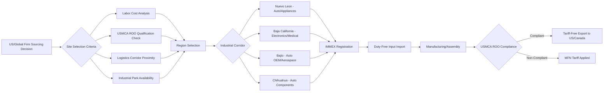

## Mexico and the USMCA Nearshoring Boom

### Definition and Scope

The "USMCA nearshoring boom" refers to the accelerated relocation of manufacturing, assembly, and sourcing operations to Mexico by multinational firms — particularly those serving the US market — beginning roughly in 2021–2022 and continuing through the mid-2020s. The phenomenon is driven by the intersection of geographic proximity (nearshoring) and preferential trade treatment under the United States-Mexico-Canada Agreement (USMCA), which entered into force July 1, 2020, replacing the North American Free Trade Agreement (NAFTA).

Unlike the broader China Plus One strategy, which is diversification-driven and geography-agnostic, the Mexico nearshoring boom is specifically anchored in:

- **Physical proximity** to the US consumer and industrial market, reducing transit time and freight cost
- **Preferential tariff treatment** under USMCA rules of origin
- **Labor cost arbitrage** relative to the US, while remaining logistically superior to trans-Pacific sourcing
- **Time-zone alignment**, enabling closer supply chain coordination and just-in-time production models

### The USMCA Framework: Structural Foundation

#### Key Legal and Structural Features

- **Entry into force**: July 1, 2020, replacing NAFTA (in effect since 1994).
- **Review mechanism**: USMCA includes a mandatory **joint review** every six years (first review due 2026), with a 16-year sunset clause unless renewed — a structural feature distinct from NAFTA's indefinite term. This periodic review creates a recurring point of regulatory uncertainty that firms must factor into long-horizon investment decisions.
- **Rules of Origin (ROO)**: USMCA tightened regional value content (RVC) requirements relative to NAFTA, most notably in automotive manufacturing.

#### Automotive Rules of Origin (Illustrative Core Mechanism)

- Passenger vehicles must have a **regional value content of at least 75%** (phased in from NAFTA's 62.5%) to qualify for tariff-free treatment.
- **Labor Value Content (LVC) requirement**: A minimum percentage of vehicle value (generally 40% for passenger vehicles, 45% for light trucks) must originate from production paid at or above a wage threshold (US$16/hour), effectively requiring content from higher-wage US/Canadian labor markets rather than solely low-wage Mexican labor.
- **Steel and aluminum requirements**: A specified percentage of steel and aluminum purchases must originate from North America.

[Unverified] Precise percentage thresholds and phase-in schedules vary by product category and have been subject to ongoing interpretive guidance from USTR and Mexican trade authorities; firms should verify current thresholds against official USMCA text and implementing regulations rather than relying solely on general summaries, as these figures are subject to periodic clarification and potential renegotiation.

### Drivers of the Nearshoring Surge

**Key Points**

- **Logistics cost and lead-time advantage**: Trans-Pacific ocean freight (China–US West Coast) typically requires 20–35 days transit plus port handling, versus 1–3 days truck transit from Mexican industrial hubs to major US markets — a decisive advantage for just-in-time and fast-fashion-style production models.
- **US–China trade tensions**: Section 301 tariffs on Chinese goods (imposed 2018–2019, largely retained and in some cases expanded under subsequent administrations) created a direct cost incentive to relocate final production to USMCA-covered territory.
- **COVID-19 supply chain disruption**: Extended lead times, port congestion (notably 2021 West Coast port backlogs), and shipping cost spikes (container rates rose several-fold in 2021) exposed the fragility of extended trans-Pacific supply chains.
- **Labor cost differential**: Mexican manufacturing wages remain substantially below US levels while offering a more developed industrial base than many alternative nearshoring destinations.
- **Peso-dollar dynamics and investment climate**: Periods of relative peso stability and Mexican government investment promotion (e.g., state-level industrial park development) reinforced investment attractiveness. [Unverified] Currency dynamics are volatile and investment climate assessments shift with each Mexican political cycle — figures should be checked against current data before use in investment decisions.
- **US industrial policy alignment**: US federal incentives (e.g., CHIPS Act, Inflation Reduction Act supply chain provisions) indirectly favor North American-integrated production for firms seeking to qualify for US-side incentives that require North American content thresholds.

### Geographic Concentration: Industrial Corridors

Nearshoring investment in Mexico has concentrated in several identifiable industrial corridors, each with distinct sectoral specialization:

| Region | Primary Industries | Notes |
| --- | --- | --- |
| Nuevo León (Monterrey) | Automotive, appliances, electronics, logistics/distribution | Historically Mexico's most industrialized state; Tesla announced (later paused) a gigafactory project here |
| Baja California (Tijuana, Mexicali) | Electronics, medical devices, aerospace components | Proximity to San Diego/Southern California enables tight cross-border logistics integration |
| Chihuahua (Ciudad Juárez) | Automotive components, electronics assembly | Long-established maquiladora base dating to 1960s Border Industrialization Program |
| Bajío region (Querétaro, Guanajuato, San Luis Potosí, Aguascalientes) | Automotive OEM and Tier 1 suppliers, aerospace | Major auto assembly plants (multiple global OEMs) anchor dense supplier clusters |
| Coahuila | Automotive, appliances | Adjacent to Texas border crossings |

[Inference] The Bajío and northern border corridors' advantage stems from decades of accumulated supplier-ecosystem density built up under NAFTA-era maquiladora expansion — meaning Mexico's nearshoring capacity is not purely a recent phenomenon but a scaling-up of pre-existing industrial infrastructure, which is why Mexico has been able to absorb investment faster than newer diversification destinations such as Vietnam or India.

### The Maquiladora / IMMEX Program

**Key Points**

- **IMMEX** (Industria Manufacturera, Maquiladora y de Servicios de Exportación) is the Mexican government program governing duty-free temporary import of inputs for export-oriented manufacturing — the legal successor framework to the original 1960s maquiladora program.
- Under IMMEX, firms can import raw materials, components, and machinery into Mexico without paying Mexican import duties, provided the resulting finished goods are exported (predominantly to the US).
- This program is structurally distinct from USMCA tariff preferences: IMMEX governs **Mexican-side import duty deferral**, while USMCA rules of origin govern **US-side (or Canada-side) tariff-free treatment on export**. Both mechanisms typically operate together in a nearshored supply chain.

### Sectoral Patterns

#### Automotive

- Mexico is among the world's largest vehicle exporters, with production heavily oriented toward the US market.
- Nearshoring has intensified Tier 1 and Tier 2 supplier relocation (wiring harnesses, seating systems, electronic control units) to remain proximate to OEM assembly plants, given just-in-time and just-in-sequence delivery requirements in automotive manufacturing.

#" Electronics

- Concentrated in Baja California and Chihuahua, focused on consumer electronics assembly, medical device electronics, and increasingly semiconductor back-end packaging and testing.

#### Appliances (White Goods)

- Monterrey/Nuevo León region hosts significant major-appliance manufacturing capacity serving the US market.

#### Aerospace

- Querétaro has developed into a notable aerospace manufacturing cluster (engine components, airframe structures), benefiting from both nearshoring dynamics and specialized workforce development initiatives.

#### Medical Devices

- Baja California, particularly Tijuana, has an established medical device manufacturing base that has expanded under nearshoring dynamics, serving FDA-regulated US supply chains.

### Infrastructure and Logistics Constraints

Despite investment momentum, Mexico's nearshoring capacity faces structural bottlenecks:

- **Industrial real estate scarcity**: Vacancy rates in key industrial corridors (Monterrey, Bajío, border cities) declined sharply during the boom period, driving up lease costs and construction timelines for new facilities. [Unverified] Specific vacancy percentages and lease rate figures fluctuate significantly by submarket and reporting period; consult current commercial real estate industry reports (e.g., CBRE, JLL Mexico market reports) for up-to-date figures.
- **Electrical grid capacity**: Several industrial corridors, particularly in northern Mexico, have experienced power capacity constraints, with new industrial connections facing multi-year interconnection queues in some regions.
- **Water availability**: Northern Mexico's arid climate creates water-stress constraints for water-intensive manufacturing processes (notably semiconductor and certain chemical processes), an increasingly cited siting constraint.
- **Border crossing congestion**: Major commercial crossings (Laredo/Nuevo Laredo, El Paso/Ciudad Juárez, Otay Mesa/Tijuana) experience recurring congestion, and border wait times directly affect the just-in-time logistics advantage that nearshoring is meant to capture.
- **Security considerations**: Regional security conditions in parts of Mexico affect logistics routing, insurance costs, and workforce recruitment in certain corridors — a factor site-selection processes typically weight alongside pure economic criteria.
- **Skilled labor availability**: Rapid demand growth in engineering and skilled-technician roles has, in some regions, outpaced local labor market supply, creating wage inflation pressure in competitive sub-sectors.

### Nearshoring Investment Flow Architecture

### Rules of Origin Compliance Mechanics

For a finished good to qualify for USMCA preferential tariff treatment, it must satisfy one of several origin-determination tests depending on the product's tariff classification:

- **Wholly obtained or produced**: Goods entirely originating within USMCA territory (raw materials, agricultural products).
- **Tariff shift (tariff classification change) rule**: Non-originating inputs must undergo a specified change in Harmonized System (HS) classification during production in USMCA territory, demonstrating substantial transformation.
- **Regional Value Content (RVC) rule**: A minimum percentage of the good's value must originate within the USMCA region, calculated under either the transaction value method or net cost method:

$$RVC_{TV} = \frac{TV - VNM}{TV} \times 100$$

Where $TV$ is the transaction value of the good and $VNM$ is the value of non-originating materials.

$$RVC_{NC} = \frac{NC - VNM}{NC} \times 100$$

Where $NC$ is the net cost of the good.

**Example**

A Tier 1 automotive parts supplier in Chihuahua assembles wiring harnesses using copper wire imported from a non-USMCA country (China) and connectors sourced domestically from Mexico. If the transaction value of the finished harness is $50 per unit and the value of non-originating materials (Chinese copper wire) is $18 per unit:

$$RVC_{TV} = \frac{50 - 18}{50} \times 100 = 64\%$$

If the applicable product-specific RVC threshold for wiring harnesses under USMCA is, for example, 60%, this unit would qualify for preferential treatment under the transaction value method. [Unverified] Actual RVC thresholds vary by specific HS tariff line and should be verified against the USMCA Uniform Regulations and product-specific rules annex rather than assumed from illustrative examples.

### Comparison: Mexico Nearshoring vs. Alternative Diversification Destinations

| Factor | Mexico (USMCA) | Vietnam | India |
| --- | --- | --- | --- |
| Transit time to US | 1–3 days (truck) | 20–30 days (ocean) | 20–30 days (ocean) |
| Tariff treatment | Preferential (USMCA, subject to ROO) | MFN (subject to Section 301 where applicable) | MFN |
| Labor cost | Moderate (above Vietnam, below US) | Lower | Lower |
| Supplier ecosystem depth (auto/electronics) | Deep (multi-decade maquiladora base) | Developing | Developing, strong in smartphones |
| Time zone alignment with US | Same/near-same | 12+ hour offset | 10.5+ hour offset |
| Regulatory/political risk | USMCA review cycle (2026), security conditions | Political stability moderate | Federal/state regulatory complexity |

[Inference] This comparison suggests Mexico's advantage is structurally strongest for products where transit time and just-in-time coordination materially affect production economics (automotive, appliances) and structurally weaker for products where pure labor-cost minimization dominates the sourcing decision (low-margin textiles, commodity electronics), which likely explains the sectoral concentration pattern observed in actual investment flows.

### Risks and Limitations

**Key Points**

- **"Front-loading" without full compliance**: Some firms have relocated final assembly to Mexico while continuing to import a high proportion of non-originating (often Chinese) components, raising questions about genuine USMCA rules-of-origin compliance versus superficial "screwdriver plant" assembly designed primarily to obtain a Mexican country-of-origin label. [Unverified] The prevalence of this pattern and its treatment under enhanced customs enforcement is an evolving regulatory and enforcement matter; US Customs and Border Protection and Mexican customs authorities have signaled increased origin-verification scrutiny, but current enforcement intensity should be checked against recent official guidance.
- **2026 USMCA joint review uncertainty**: The mandatory six-year review creates a defined point of policy risk; renegotiation of rules of origin, labor value content thresholds, or dispute mechanisms could materially alter the investment calculus for firms that have already committed capital.
- **Infrastructure lag relative to investment pace**: As noted above, power, water, and industrial real estate constraints in leading corridors may cap the pace at which announced investment converts into operating capacity.
- **Chinese firms nearshoring through Mexico**: A notable and geopolitically sensitive sub-pattern involves Chinese-owned or Chinese-invested firms establishing Mexican manufacturing operations specifically to obtain USMCA-origin status for exports to the US — a practice that has drawn US policy scrutiny and could become a focal point of the 2026 review or separate targeted trade measures. [Inference] This dynamic partially undermines the geopolitical rationale (reducing China exposure) that motivates some firms' nearshoring decisions, since it can reintroduce Chinese industrial presence into the supply chain under a Mexican origin label rather than eliminating it.

### Illustrative Diagram: Logistics Corridor Comparison

<svg xmlns="http://www.w3.org/2000/svg" viewBox="0 0 800 360">
<text x="400" y="28" font-family="sans-serif" font-size="17" font-weight="bold" text-anchor="middle" fill="#1a1a1a">Transit Time Comparison to US Market (svg_diagram)</text>

<line x1="150" y1="300" x2="750" y2="300" stroke="#333" stroke-width="2" />
<line x1="150" y1="60" x2="150" y2="300" stroke="#333" stroke-width="2" />
<text x="450" y="335" font-family="sans-serif" font-size="12" text-anchor="middle" fill="#1a1a1a">Transit Days (approximate range)</text>

<rect x="160" y="270" width="30" height="30" fill="#27ae60" />
<text x="200" y="290" font-family="sans-serif" font-size="12" fill="#1a1a1a">Mexico (truck, 1-3 days)</text>

<rect x="160" y="180" width="280" height="30" fill="#2980b9" />
<text x="450" y="200" font-family="sans-serif" font-size="12" fill="#1a1a1a">Vietnam (ocean, 20-30 days)</text>

<rect x="160" y="120" width="300" height="30" fill="#8e44ad" />
<text x="470" y="140" font-family="sans-serif" font-size="12" fill="#1a1a1a">India (ocean, 22-32 days)</text>

<rect x="160" y="70" width="270" height="30" fill="#c0392b" />
<text x="440" y="90" font-family="sans-serif" font-size="12" fill="#1a1a1a">China (ocean, 18-28 days)</text>

<text x="150" y="315" font-family="sans-serif" font-size="10" fill="#555">0</text>

<text x="450" y="315" font-family="sans-serif" font-size="10" fill="#555">~15</text>

<text x="740" y="315" font-family="sans-serif" font-size="10" fill="#555">~30</text>

</svg>

### Measuring the Boom: Indicators Commonly Tracked

Analysts and government bodies typically monitor the following indicators to assess nearshoring momentum:

- **Foreign direct investment (FDI) inflows to Mexico**, disaggregated by sector and originating country, published by Mexico's Ministry of Economy
- **Industrial real estate absorption and vacancy rates** in leading corridors (Monterrey, Bajío, border cities)
- **US import share by origin country**, tracking whether Mexico's share of US imports in key categories (automotive, electronics, appliances) is rising relative to China's
- **Mexican manufacturing employment and wage data** in export-oriented sectors
- **Announced vs. realized investment**: A persistent analytical caveat is that announced investment commitments (frequently reported in press coverage) substantially exceed capital actually deployed and operational within a given period, requiring analysts to distinguish pipeline announcements from realized investment.

### Conclusion

The Mexico–USMCA nearshoring boom represents the geographically and legally anchored subset of the broader supply chain diversification trend, distinguished from generic China Plus One strategies by its dependence on a specific preferential trade agreement, physical proximity to the US market, and a multi-decade pre-existing industrial base inherited from the maquiladora era. Its durability depends on several unresolved variables: the outcome of the 2026 USMCA joint review, the pace of infrastructure investment relative to capital inflows, and the evolving regulatory response to rules-of-origin circumvention, particularly involving Chinese-invested firms using Mexican assembly to access US preferential tariff treatment. The phenomenon illustrates how nearshoring and friend-shoring logics can reinforce each other when a trade agreement's origin rules are explicitly structured to reward regional value content, but also how those same rules create a persistent compliance and enforcement frontier.

**Related Topics**

- USMCA rules of origin: product-specific requirements by HS classification
- Labor Value Content requirements in automotive manufacturing
- The 2026 USMCA joint review process and potential renegotiation scenarios
- Chinese investment in Mexican manufacturing and "origin-washing" concerns
- IMMEX program mechanics and customs compliance
- Industrial real estate and infrastructure financing in northern Mexico
- Comparative nearshoring: Mexico vs. Central America (CAFTA-DR) vs. Caribbean Basin Initiative
- US CHIPS Act and Inflation Reduction Act North American content requirements
- Border infrastructure investment and cross-border logistics optimization
- Regional value content calculation methodologies (transaction value vs. net cost)