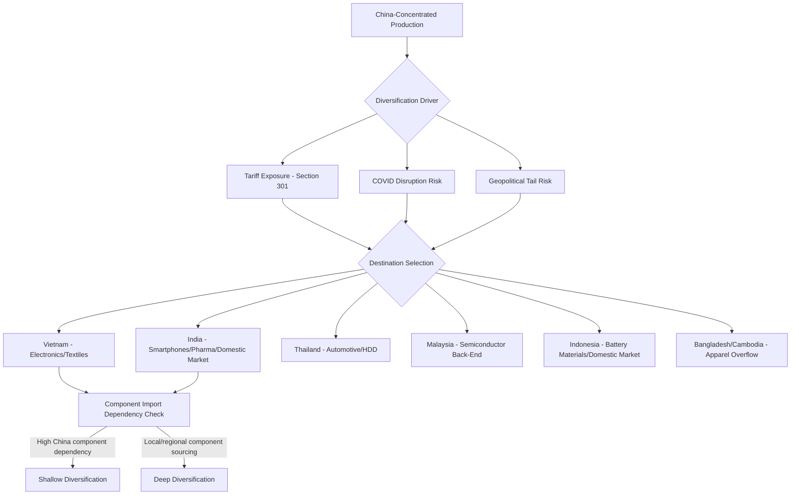

## Vietnam, India, and the Migration of Southeast Asian Manufacturing

### Scope and Framing

This topic covers the redirection of manufacturing capacity, particularly electronics, textiles, and light assembly, toward Vietnam, India, and other Southeast/South Asian economies as part of the broader China Plus One and friend-shoring trends. Unlike the Mexico–USMCA case, this migration is not anchored to a single preferential trade agreement or unified geographic corridor; it is a multi-country, multi-driver phenomenon spanning distinct national industrial policies, trade agreement architectures, and infrastructure trajectories. The analysis below treats Vietnam and India as the two dominant destinations while situating them within the wider Southeast/South Asian manufacturing migration (Thailand, Indonesia, Malaysia, Cambodia, Bangladesh).

### Historical Trajectory

**Key Points**

- **Pre-2018 baseline**: Vietnam's manufacturing base expanded steadily from the 1990s–2010s, driven by textile and footwear FDI (Nike, Adidas supply chains) and early electronics assembly (Samsung's major Vietnam investment began around 2008–2009, eventually making Vietnam a primary global hub for Samsung smartphone production).
- **2018–2019 (US–China trade war)**: Section 301 tariffs on Chinese goods triggered the first major wave of tariff-driven relocation, with Vietnam as the principal beneficiary given its proximity to Chinese supply chains and existing electronics manufacturing base.
- **2020–2022 (COVID-19 disruption)**: Extended factory shutdowns in China (particularly the 2022 Shanghai lockdown) and logistics disruption accelerated diversification planning across multiple sectors.
- **2022–present (geopolitical and structural phase)**: Apple's publicized diversification of iPhone final assembly to India (via Foxconn, Pegatron, and Wistron/Tata Electronics facilities) marked a symbolically significant shift, signaling that even the most complex, highest-value consumer electronics assembly could migrate beyond China. India's Production-Linked Incentive (PLI) scheme, launched 2020, provided direct financial incentive for this shift.

### Vietnam: Structural Profile

#### Trade Agreement Architecture

- **CPTPP (Comprehensive and Progressive Agreement for Trans-Pacific Partnership)**: Vietnam is a founding member, providing preferential access to Japan, Canada, Australia, and other member markets.
- **EU–Vietnam Free Trade Agreement (EVFTA)**: In force since 2020, phasing out the large majority of tariffs on EU–Vietnam trade over a multi-year schedule.
- **RCEP (Regional Comprehensive Economic Partnership)**: Vietnam's participation integrates it into the world's largest regional trade bloc by GDP, alongside China, Japan, South Korea, and ASEAN partners — notably, RCEP membership does not exclude continued economic integration with China, illustrating that Vietnam's diversification role coexists with deepened regional ties to China rather than full separation from it.
- Vietnam does **not** have a comprehensive free trade agreement with the United States comparable to USMCA; US–Vietnam trade instead operates primarily under standard MFN (most-favored-nation) tariff treatment, with periodic bilateral trade and tariff negotiations addressing specific concerns.

#### Industrial Specialization

- **Electronics**: Samsung's Vietnam operations (Bac Ninh, Thai Nguyen provinces) represent one of the largest single-country manufacturing footprints for smartphones globally; extended to other electronics categories including consumer appliances and components.
- **Textiles and footwear**: Long-established base serving major global apparel and athletic footwear brands.
- **Furniture and wood products**: Significant export sector, particularly to the US market.
- **Emerging: semiconductor back-end and assembly**: Growing but less mature than Malaysia's long-established position in this sub-sector.

#### Structural Constraints

- **Labor force scale**: Vietnam's population (~100 million) is substantially smaller than China's or India's, creating an eventual ceiling on how much manufacturing volume it can absorb without significant wage inflation.
- **Infrastructure**: Port capacity (Cai Mep, Haiphong) and inland logistics have expanded but [Unverified] remain generally regarded as less developed than China's world-class logistics infrastructure — the magnitude of this gap and its practical effect on lead times varies by corridor and should be checked against current infrastructure assessments.
- **Upstream component dependency**: A substantial share of components used in Vietnamese electronics assembly are imported from China, meaning final-assembly relocation to Vietnam does not fully eliminate exposure to China-origin supply chain risk — a pattern consistent with the "shallow diversification" dynamic observed in China Plus One more broadly.
- **Skilled labor and management depth**: Rapid FDI-driven growth has, in some periods, outpaced the development of mid-level engineering and management talent locally, requiring continued reliance on expatriate management in certain operations.

### India: Structural Profile

#### Policy Architecture

- **Production-Linked Incentive (PLI) scheme**: Launched 2020, offering direct financial incentives (calculated as a percentage of incremental sales) to manufacturers across multiple sectors including electronics, pharmaceuticals, telecom equipment, automotive components, and textiles, contingent on meeting investment and production targets.
- **Special Economic Zones (SEZs) and state-level industrial policy**: Individual Indian states (Tamil Nadu, Karnataka, Uttar Pradesh, Maharashtra) compete for manufacturing investment through state-specific incentive packages, land allocation, and infrastructure commitments, creating significant intra-country variation in ease of establishing operations.
- **India does not have comprehensive FTAs with the US, EU, or China** comparable to USMCA or CPTPP, though bilateral and limited-scope trade discussions (e.g., US–India trade negotiations) have been ongoing; India's manufacturing attractiveness for export therefore rests more heavily on domestic policy incentives and labor cost than on preferential tariff architecture.

#### Industrial Specialization

- **Smartphone assembly**: Apple's shift of a growing share of iPhone final assembly to India (via Foxconn's Tamil Nadu operations, Tata Electronics' acquisition of the former Wistron facility, and Pegatron's operations) represents the most closely watched indicator of India's electronics manufacturing ascent.
- **Pharmaceutical intermediates and generics**: India has a long-established position as a major global generic drug producer, though it remains partially dependent on Chinese-sourced active pharmaceutical ingredient (API) intermediates for a portion of its own production — a supply chain dependency layered beneath India's own role as a diversification destination.
- **Automotive components**: Growing Tier 1/Tier 2 supplier base, though largely oriented toward India's substantial domestic vehicle market rather than pure export manufacturing.
- **Textiles**: Long-established sector, complemented by newer PLI-driven investment in technical textiles.

#### Structural Constraints

- **Land acquisition complexity**: India's land ownership and acquisition legal framework varies by state and has historically posed delays for large greenfield manufacturing projects.
- **Labor law fragmentation**: Labor regulation varies significantly across India's states, though recent federal labor code consolidation efforts have aimed at simplification. [Unverified] The practical implementation status and effect of these labor code reforms varies by state and reporting period; current status should be verified against recent Indian government and labor policy sources.
- **Power and logistics infrastructure**: Although substantially improved over the past two decades, power reliability and inland logistics (port-to-factory transit) in some regions remain a cited constraint relative to China's integrated industrial infrastructure.
- **Supplier ecosystem immaturity for advanced electronics**: While final assembly has scaled rapidly, the depth of component-level supplier ecosystems (for example, high-precision mechanical and optical components) remains less developed than China's, requiring continued import of certain intermediate components.

### Comparative Structural Analysis

| Dimension | Vietnam | India |
| --- | --- | --- |
| Population/labor pool scale | ~100 million (moderate) | ~1.4 billion (very large) |
| Key trade agreements | CPTPP, EVFTA, RCEP | Limited comprehensive FTAs; domestic policy-driven |
| Primary sector strength | Electronics assembly, textiles, footwear | Smartphone assembly, pharmaceuticals, domestic-oriented auto |
| Domestic market size | Moderate | Very large — dual export/domestic rationale |
| China proximity/component dependency | High (land border, deep logistics integration) | Lower geographic proximity, still materially import-dependent for electronics components |
| Primary constraint | Labor pool ceiling, infrastructure scale | Land acquisition, labor law complexity, infrastructure heterogeneity across states |
| US trade relationship | MFN, periodic bilateral negotiation | MFN, periodic bilateral negotiation |

[Inference] India's enormous domestic market gives it a diversification rationale that Vietnam structurally lacks: firms investing in India often cite dual access to both export capacity and one of the world's largest consumer markets, whereas Vietnam's investment case rests almost entirely on export-oriented cost and trade-agreement logic. This likely explains why India has attracted disproportionate investment in categories (smartphones, automobiles) where domestic demand is substantial, while Vietnam's growth concentrates in categories (footwear, low-to-mid electronics assembly) that are almost purely export-driven.

### Broader Southeast/South Asian Migration Pattern

#### Thailand

- Established automotive manufacturing hub (sometimes termed the "Detroit of Asia" in industry commentary) with deep Japanese automotive OEM investment history.
- Growing electronics and hard-disk-drive manufacturing base.

#### Indonesia

- Large domestic market (world's fourth-most-populous country) creating dual export/domestic investment rationale similar to India, though at an earlier stage of manufacturing FDI development.
- Significant nickel processing and battery supply chain investment tied to electric vehicle battery materials, reflecting a distinct resource-processing dimension of the broader migration not present in Vietnam's or India's profiles.

#### Malaysia

- Long-established semiconductor back-end assembly, packaging, and testing hub (dating to the 1970s–1980s), giving it a specialized niche distinct from Vietnam's and India's front-end assembly focus.

#### Cambodia

- Smaller-scale textile and footwear manufacturing growth, often characterized as a "next tier" destination absorbing overflow investment from increasingly capacity-constrained Vietnam.

#### Bangladesh

- Concentrated overwhelmingly in apparel/garment manufacturing, building on an already dominant global position in this category independent of the broader electronics-driven migration pattern.

### Migration Flow Architecture

### Component-Level Dependency: The "Shallow Diversification" Problem

**Key Points**

A recurring analytical finding across Vietnam, India, and other Southeast/South Asian destinations is that final-assembly relocation frequently does not correspond to equivalent upstream diversification:

- Electronics assembled in Vietnam or India often incorporate semiconductor components, printed circuit board assemblies, and precision mechanical parts still sourced from China.
- This creates a layered supply chain structure where the *declared country of origin* (based on substantial transformation rules) shifts to the new assembly location, while *economic and logistical dependency* on China persists at the component tier.
- [Inference] This pattern means that headline statistics on manufacturing migration (e.g., "X% of iPhone production now assembled in India") can overstate the degree of genuine supply chain risk reduction, since a disruption to Chinese component exports could still materially affect production in the new assembly location even after relocation.

### Apple's India Shift as an Illustrative Case

**Example**

Apple's phased shift of iPhone final assembly to India illustrates the broader migration pattern's mechanics:

1. **Initial phase**: Assembly of older/lower-end iPhone models in India, primarily for the domestic Indian market, minimizing risk on complex, high-volume flagship production.
2. **Expansion phase**: Extension to newer flagship models and increased export volume from Indian facilities to global markets, supported by PLI incentives and supplier co-location (Apple encouraged key suppliers to establish or expand Indian operations alongside final assembly).
3. **Supplier ecosystem building**: Component suppliers (camera modules, enclosures, batteries) have progressively established or expanded Indian operations, partially — though not completely — addressing the shallow-diversification concern over a multi-year horizon.
4. **Persistent dependency**: [Unverified] The precise current share of component value still imported from China-based suppliers into Indian iPhone assembly operations is not consistently disclosed and estimates vary across industry analyses; specific percentage claims should be verified against current supply chain research rather than assumed from general commentary.

### Risk and Limitation Factors

**Key Points**

- **Ecosystem maturation timeline**: [Inference] Based on general industrial cluster development patterns, replicating China's multi-decade, multi-tier supplier density in Vietnam or India is likely to require a sustained multi-year to multi-decade horizon rather than being achievable through final-assembly relocation alone.
- **Labor pool ceiling in Vietnam**: Vietnam's smaller population relative to China or India constrains the ultimate scale of manufacturing employment it can absorb without significant wage inflation, potentially limiting its role to a partial rather than full substitute for Chinese capacity.
- **Infrastructure investment pacing**: In both Vietnam and India, the pace of port, power, and logistics infrastructure investment is a frequently cited constraint on how quickly announced manufacturing investment converts into operational capacity.
- **Policy and political risk**: India's federal-state policy fragmentation and Vietnam's periodic bilateral trade tension with the US (including scrutiny of Vietnam as a potential transshipment point for Chinese goods seeking to circumvent tariffs) both represent ongoing risk factors firms must monitor.
- **Transshipment and origin-washing scrutiny**: Similar to the Mexico case, Vietnam in particular has faced US trade-policy scrutiny regarding whether some "Vietnamese" exports represent genuine substantial transformation versus minimal-processing transshipment of Chinese-origin goods — an enforcement and compliance risk area for firms operating in the region.

### Illustrative Diagram: Manufacturing Migration Destination Comparison

<svg xmlns="http://www.w3.org/2000/svg" viewBox="0 0 800 420">
<text x="400" y="28" font-family="sans-serif" font-size="17" font-weight="bold" text-anchor="middle" fill="#1a1a1a">Southeast/South Asia Manufacturing Migration Profile (svg_diagram)</text>

<line x1="120" y1="360" x2="720" y2="360" stroke="#333" stroke-width="2" />
<line x1="120" y1="60" x2="120" y2="360" stroke="#333" stroke-width="2" />
<text x="420" y="395" font-family="sans-serif" font-size="12" text-anchor="middle" fill="#1a1a1a">Domestic Market Size (relative)</text>
<text x="40" y="210" font-family="sans-serif" font-size="12" text-anchor="middle" fill="#1a1a1a" transform="rotate(-90 40 210)">Manufacturing Ecosystem Maturity</text>

<circle cx="230" cy="140" r="14" fill="#27ae60" />
<text x="230" y="120" font-family="sans-serif" font-size="12" text-anchor="middle" fill="#1a1a1a">Vietnam</text>

<circle cx="600" cy="220" r="18" fill="#8e44ad" />
<text x="600" y="195" font-family="sans-serif" font-size="12" text-anchor="middle" fill="#1a1a1a">India</text>

<circle cx="260" cy="180" r="12" fill="#2980b9" />
<text x="260" y="162" font-family="sans-serif" font-size="11" text-anchor="middle" fill="#1a1a1a">Thailand</text>

<circle cx="200" cy="120" r="11" fill="#d35400" />
<text x="200" y="102" font-family="sans-serif" font-size="11" text-anchor="middle" fill="#1a1a1a">Malaysia</text>

<circle cx="480" cy="290" r="15" fill="#c0392b" />
<text x="480" y="270" font-family="sans-serif" font-size="11" text-anchor="middle" fill="#1a1a1a">Indonesia</text>

<circle cx="180" cy="310" r="10" fill="#7f8c8d" />
<text x="180" y="330" font-family="sans-serif" font-size="11" text-anchor="middle" fill="#1a1a1a">Bangladesh</text>
</svg>

### Conclusion

The migration of manufacturing toward Vietnam, India, and the broader Southeast/South Asian region represents a multi-country, multi-driver process distinct from — though overlapping with — the Mexico–USMCA nearshoring boom. Vietnam's advantage rests on established electronics and textile ecosystems, proximity to Chinese supply chains, and multiple regional trade agreements, but faces a structural ceiling from its smaller labor pool. India's advantage rests on massive domestic market scale and aggressive policy incentives (PLI), but faces friction from land, labor law, and infrastructure heterogeneity across its federal system. Across the region, a persistent analytical concern is that final-assembly relocation frequently masks continued upstream dependency on Chinese-sourced components, meaning genuine supply chain risk reduction significantly lags the headline narrative of manufacturing migration away from China. The durability and depth of this migration will depend substantially on the pace of local supplier ecosystem development, infrastructure investment, and continued policy support in each destination country.

**Related Topics**

- India's Production-Linked Incentive (PLI) scheme: sector-by-sector design and outcomes
- Vietnam's role in global electronics supply chains and transshipment scrutiny
- Semiconductor back-end assembly and testing hubs (Malaysia, Taiwan comparative analysis)
- Substantial transformation rules and country-of-origin determination
- Indonesia's nickel processing and EV battery supply chain strategy
- Apple's global supply chain diversification strategy as a case study
- Comparative industrial policy: PLI (India) vs. tax holiday models (Vietnam) vs. maquiladora/IMMEX (Mexico)
- Labor law reform and its effect on Indian manufacturing FDI
- RCEP and its implications for China-ASEAN economic integration alongside diversification trends
- Supplier ecosystem density and industrial cluster theory (cross-reference: China Plus One)