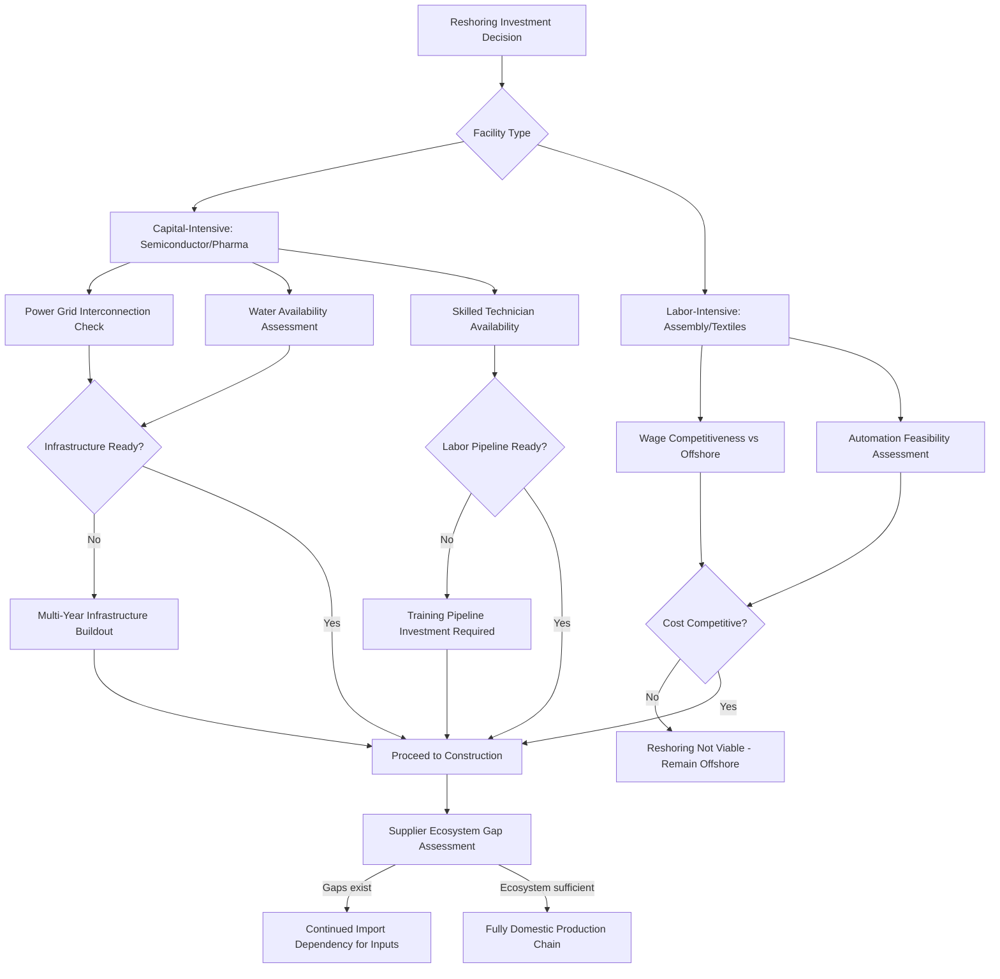

## Labor, Infrastructure, and Skills Constraints on Reshoring

### Scope and Framing

This topic addresses the structural constraints that limit the pace, scale, and feasibility of reshoring — the return of manufacturing production to a firm's home country, most commonly discussed in the context of US manufacturing repatriation from China and other offshore locations. Unlike nearshoring (which relocates production to a proximate third country) or China Plus One (which diversifies across multiple offshore locations), reshoring's constraints are qualitatively distinct because they involve rebuilding domestic manufacturing capacity in economies — chiefly the US and Western Europe — where industrial labor markets, supplier ecosystems, and vocational training infrastructure have atrophied over several decades of offshoring.

### The Deindustrialization Baseline

**Key Points**

- Manufacturing employment as a share of total US employment declined substantially from its mid-20th-century peak through the early 2000s, with a particularly sharp acceleration in job losses following China's 2001 accession to the World Trade Organization (WTO) — a period sometimes referenced in economic literature as the "China shock."
- This multi-decade decline was accompanied by parallel erosion of vocational and technical training infrastructure, as educational and career-guidance systems increasingly emphasized four-year university pathways over trades and manufacturing-technician training.
- The compounding effect: reshoring efforts now face not only a shortage of available *workers* but a shortage of the *training pipelines, apprenticeship systems, and technical educators* needed to produce those workers at scale — a structural deficit that cannot be resolved simply by raising wages or building new facilities.

[Inference] This distinguishes reshoring's labor constraint from nearshoring's: Vietnam or Mexico inherited or built manufacturing labor pools and vocational systems without first having to reverse a multi-decade domestic deindustrialization process, whereas reshoring economies must simultaneously rebuild physical capacity and the human-capital pipeline that supports it.

### Labor Supply Constraints

#### Skilled Trades and Technician Shortage

- Reshored manufacturing, particularly in advanced sectors (semiconductors, precision machining, industrial automation maintenance), requires skilled technicians, machinists, and electricians whose training pipelines (community college technical programs, registered apprenticeships) have contracted significantly relative to historical capacity.
- [Unverified] Specific numerical shortage estimates (e.g., "X million unfilled manufacturing jobs by year Y") are frequently cited in industry and policy commentary but vary substantially by source methodology and forecasting assumptions; current figures should be verified against primary sources such as the National Association of Manufacturers, Bureau of Labor Statistics projections, or Deloitte/Manufacturing Institute skills-gap studies rather than treated as fixed facts.

#### Demographic Headwinds

- Aging of the existing skilled manufacturing workforce (a substantial share of experienced machinists, tool-and-die makers, and industrial technicians in the US are within a decade or less of retirement age in many reporting periods) creates a looming replacement-demand problem independent of reshoring-driven expansion demand.
- Declining domestic birth rates and slower population growth in many reshoring economies constrain the raw size of the future labor pool available to fill both replacement and expansion positions.

#### Wage Competitiveness and Structural Cost Gap

- Even accounting for automation and productivity gains, reshored production in labor-intensive categories frequently carries a structural wage cost disadvantage relative to offshore alternatives, meaning reshoring is generally most viable for capital-intensive, automation-heavy production rather than labor-intensive assembly.
- This dynamic pushes reshoring toward specific sub-sectors — semiconductor fabrication, pharmaceuticals, specialty chemicals, defense-critical components — where labor cost is a smaller share of total production cost, rather than broad-based reshoring across all manufacturing categories.

#### Immigration Policy Interaction

- [Inference] Given the scale of domestic skilled-labor shortfalls in some reshoring-intensive sectors, immigration policy (both high-skilled visa pathways for engineers and technical specialists, and broader labor migration policy) functions as an indirect but material constraint on reshoring pace, since domestic training pipeline expansion alone typically operates on a multi-year lag relative to facility construction timelines.

### Infrastructure Constraints

#### Electrical Grid Capacity

- Large-scale manufacturing reshoring, particularly semiconductor fabrication (which is exceptionally power-intensive) and battery/EV component manufacturing, has in numerous documented cases encountered multi-year grid interconnection queues and required substantial utility-side infrastructure investment before new facilities could receive adequate power supply.
- [Unverified] Specific interconnection queue timelines vary significantly by US region, utility service territory, and project size; current wait times should be checked against regional grid operator (e.g., PJM, ERCOT, MISO) interconnection queue data rather than assumed uniform across the country.

#### Water Availability

- Water-intensive manufacturing processes (semiconductor fabrication is particularly water-intensive due to ultra-pure water requirements in wafer processing) face siting constraints in water-stressed regions, requiring either location selection favoring water-abundant regions or substantial capital investment in water recycling and treatment infrastructure.

#### Industrial Real Estate and Site Readiness

- "Shovel-ready" industrial sites with adequate power, water, rail/highway access, and environmental permitting already in place are a limited and unevenly distributed resource; large manufacturing projects (particularly semiconductor fabs) frequently require multi-year site preparation before construction can begin.
- Permitting timelines (environmental review, local zoning, utility interconnection approval) represent a frequently cited bottleneck, with permitting and pre-construction phases in some large projects extending several years before groundbreaking.

#### Supplier Ecosystem Gaps

- Reshored final-assembly or fabrication facilities often depend on a domestic supplier ecosystem (specialty chemicals, precision tooling, component manufacturers) that has itself been offshored over the preceding decades, creating a "hollowed-out middle" problem: even where final-stage manufacturing capacity is rebuilt, the Tier 2/Tier 3 supplier base supporting it may not yet exist domestically, requiring continued import dependency for inputs even in a nominally "reshored" facility.
- [Inference] This mirrors the "shallow diversification" pattern observed in China Plus One and nearshoring cases (assembly-stage relocation without full upstream ecosystem migration), suggesting it is a general structural feature of supply chain geography changes rather than a phenomenon unique to any single relocation strategy.

### Skills and Training Pipeline Constraints

#### Vocational Education Capacity

- Community college and technical school manufacturing-technology program capacity (enrollment slots, qualified instructors, updated equipment) in many reshoring economies has not scaled proportionally to reshoring-driven demand growth, creating a training bottleneck independent of student interest or wage incentives.
- Instructor shortages are a compounding factor: experienced industry practitioners capable of teaching modern manufacturing technology (CNC programming, industrial robotics maintenance, semiconductor cleanroom protocols) are themselves in high demand from industry, creating competition between teaching and private-sector employment for the same limited pool of qualified individuals.

#### Apprenticeship System Scale

- Registered apprenticeship programs (combining paid on-the-job training with classroom instruction) remain comparatively underdeveloped in scale in the US relative to countries with strong dual vocational education traditions (commonly cited comparison: Germany's apprenticeship system), representing a structural gap in the training pipeline architecture available to support rapid reshoring-driven labor force expansion.
- [Unverified] Comparative scale figures (e.g., apprenticeship participation rates as a percentage of workforce) vary by data source and year; specific comparative statistics should be verified against current government labor statistics rather than general commentary.

#### Advanced Manufacturing Skill Requirements

- Modern reshored manufacturing, particularly in semiconductor and advanced electronics sectors, requires skill sets (cleanroom protocol adherence, statistical process control, advanced quality management systems, automation/robotics maintenance) that differ substantially from the labor-intensive assembly-line skills associated with earlier generations of domestic manufacturing, meaning the relevant comparison is not simply "restoring" prior-generation manufacturing jobs but building an effectively new skill base.

### Constraint Interaction Architecture

### Policy Response Mechanisms

**Key Points**

- **Direct subsidy and incentive programs**: Legislative measures such as the US CHIPS and Science Act (2022) provide direct manufacturing incentives and workforce development funding specifically targeting semiconductor reshoring, including provisions for workforce training program funding alongside capital investment incentives.
- **Community college partnership models**: A commonly cited policy response involves direct partnership arrangements between reshoring manufacturers and regional community colleges to design curriculum specifically matched to a facility's technical requirements, sometimes with employer co-funding of equipment and instructor costs.
- **Immigration pathway adjustments**: Policy discussions around expanding high-skilled visa availability for engineers and technical specialists in reshoring-priority sectors (semiconductors, advanced manufacturing) represent a proposed but politically contested mechanism for addressing near-term skill gaps that domestic training pipelines cannot fill on reshoring project timelines.
- **Regional workforce development boards**: State and local government coordination bodies increasingly focus specifically on manufacturing workforce pipeline development in regions targeted for reshoring investment, though [Unverified] the effectiveness and funding scale of these bodies varies significantly by state and should not be assumed uniform.

### Sector-Specific Constraint Severity

| Sector | Labor Constraint Severity | Infrastructure Constraint Severity | Primary Bottleneck |
| --- | --- | --- | --- |
| Semiconductor fabrication | Very high (specialized cleanroom/process engineering skills) | Very high (power, water, ultra-pure input chemicals) | Combined — multi-year skill and infrastructure buildout |
| Pharmaceutical/API manufacturing | High (regulatory/quality specialists) | Moderate | Regulatory approval timelines compound labor/infrastructure gaps |
| Automotive components | Moderate | Moderate | Supplier ecosystem depth (Tier 2/3) |
| Textiles/apparel | Low-Moderate | Low | Wage cost competitiveness (structurally difficult to reshore profitably) |
| Consumer electronics assembly | High | Moderate | Labor cost and skilled assembly technician availability |

[Inference] This pattern suggests reshoring is inherently sector-selective rather than a broad-based reversal of offshoring trends: sectors where labor cost is a small fraction of total value (semiconductors, pharmaceuticals) are structurally more reshoring-viable than labor-cost-sensitive sectors (textiles, low-end electronics assembly), meaning aggregate reshoring announcements likely understate the degree to which broad-based manufacturing employment reversal remains economically constrained even where high-profile individual projects succeed.

### Automation as a Partial Mitigant — and a Limitation

**Key Points**

- Advanced automation and robotics can reduce the labor-cost disadvantage of reshored production relative to offshore alternatives, partially addressing the wage-competitiveness constraint.
- However, automation itself requires a different but still scarce skill set: robotics maintenance technicians, automation programmers, and systems integrators — meaning automation substitutes one labor constraint (assembly-line workers) for another (automation/robotics technicians) rather than eliminating the skills constraint entirely.
- [Inference] This implies that automation-driven reshoring shifts the nature of the labor bottleneck rather than resolving it outright, which is consistent with the persistent emphasis on technician and engineering-level training gaps across reshoring policy discussions rather than general assembly-labor shortages alone.

### Illustrative Timeline Example

**Example**

A hypothetical (illustrative, composite) semiconductor reshoring project timeline, reflecting commonly cited sequencing in industry and policy discussion of major US fab projects:

1. **Site selection and incentive negotiation**: 6–12 months, factoring in state/federal incentive package negotiation (e.g., CHIPS Act funding applications) alongside site technical evaluation.
2. **Permitting and environmental review**: 1–3 years, varying significantly by jurisdiction and site complexity.
3. **Grid interconnection and utility infrastructure buildout**: Often runs in parallel with permitting but can independently extend timelines if substantial new transmission capacity is required.
4. **Construction**: 2–4 years for a large-scale fabrication facility, given the specialized cleanroom and process-tooling requirements involved.
5. **Workforce recruitment and training**: Begins in parallel with construction but frequently extends beyond facility completion, as specialized process-engineering and technician roles require both formal training and substantial on-the-job qualification time before reaching full production competency.
6. **Ramp to full production yield**: An additional period following initial operation, as process yields typically require iterative optimization before reaching target output levels.

[Unverified] These timeline ranges are illustrative and based on general patterns commonly discussed in industry and policy commentary regarding large-scale semiconductor reshoring projects; actual timelines for specific projects vary considerably and should be verified against project-specific public disclosures rather than treated as a fixed template.

### Conclusion

Reshoring's core constraint set differs fundamentally from nearshoring's or China Plus One's because it requires simultaneously rebuilding physical manufacturing infrastructure and the human-capital training pipeline in economies where both have undergone multi-decade erosion. Labor constraints manifest as skilled-technician shortages, demographic headwinds, and structural wage-competitiveness gaps that push reshoring toward capital-intensive rather than labor-intensive sectors. Infrastructure constraints — power grid capacity, water availability, site readiness, and domestic supplier ecosystem depth — frequently impose multi-year buildout timelines that lag the pace of policy-driven investment announcements. Skills and training pipeline constraints compound both, since vocational education capacity and apprenticeship system scale have not kept pace with reshoring-driven demand. Collectively, these constraints suggest reshoring functions best as a sector-selective strategy concentrated in capital-intensive, strategically critical categories (semiconductors, pharmaceuticals, defense-related manufacturing) rather than as a broad-based reversal of decades of manufacturing offshoring, with policy interventions (subsidies, training partnerships, immigration pathway adjustments) functioning as necessary but only partial mitigants to these structural limitations.

**Related Topics**

- US CHIPS and Science Act: provisions, funding mechanisms, and workforce development components
- Germany's dual vocational education system as a comparative apprenticeship model
- Semiconductor fabrication site selection: power, water, and cleanroom infrastructure requirements
- The "China shock" literature and long-run domestic labor market effects of manufacturing offshoring
- Automation and robotics adoption as a reshoring cost-competitiveness strategy
- Regional grid interconnection queues and industrial electrification policy
- Supplier ecosystem "hollowing out" and Tier 2/3 domestic manufacturing base erosion
- Immigration policy and high-skilled STEM visa pathways for advanced manufacturing
- Comparative reshoring case studies: semiconductor vs. pharmaceutical vs. textile sector viability
- Community college and employer-partnership workforce training models