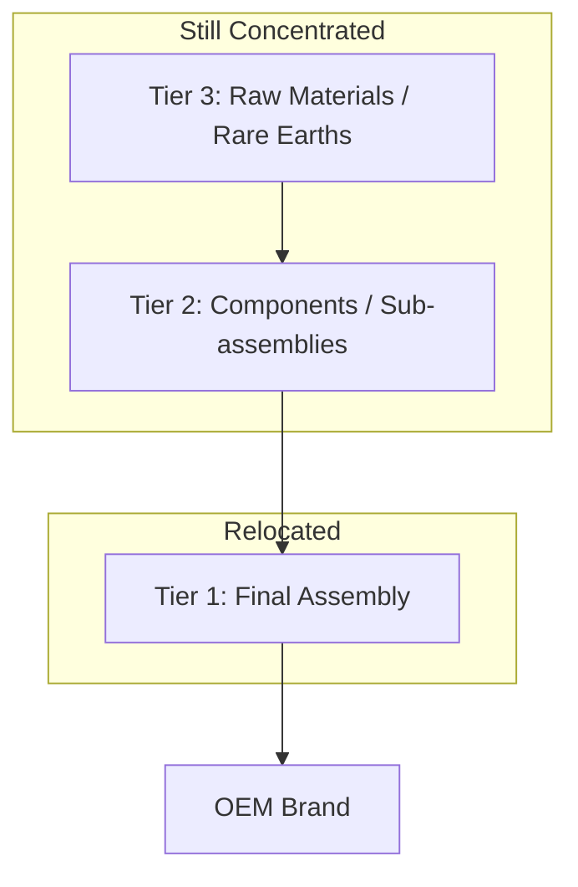

## The Limits of Full Supply Chain Relocation

### Overview

While reshoring, nearshoring, and friend-shoring have gained political and corporate momentum since roughly 2018, complete relocation of complex supply chains faces structural, economic, and technical constraints that limit how far and how fast diversification can proceed. Understanding these limits is essential to distinguishing rhetoric from realistic policy and corporate outcomes.

### Structural Constraints

#### Tiered Supply Chain Depth

- Modern manufacturing supply chains typically extend across **Tier 1 (direct suppliers), Tier 2, Tier 3, and beyond** (raw material and sub-component suppliers).
- A firm can relocate final assembly (Tier 1) while remaining fully dependent on upstream Tier 2/3 inputs still concentrated in the original country.
- Example: an electronics assembler relocating to Vietnam may still source semiconductors, rare-earth magnets, or specialty chemicals from China, meaning geographic relocation of the visible node doesn't eliminate underlying dependency.

This illustrates why headline "reshoring" of final assembly often masks continued upstream concentration.

#### Industrial Ecosystem Effects (Agglomeration)

- Certain regions developed dense **industrial clusters** combining specialized labor pools, supplier networks, logistics infrastructure, and tacit manufacturing knowledge accumulated over decades (e.g., Shenzhen's electronics ecosystem, the Pearl River Delta).
- [Inference] Replicating this density elsewhere typically requires many years and sustained capital investment, since agglomeration benefits (rapid prototyping cycles, supplier co-location, skilled technician availability) are not easily transplanted through capital investment alone.
- This is frequently cited in economic geography literature as a primary reason why electronics assembly, in particular, has been slow to relocate despite tariff and political pressure.

### Economic Constraints

#### Cost Differentials

- Labor cost arbitrage remains significant for labor-intensive manufacturing; relocating to higher-wage economies (reshoring to the US/EU) raises unit labor costs substantially.
- Nearshoring/friend-shoring partially mitigates this (e.g., Mexico, Vietnam, India offer lower wages than reshoring destinations) but rarely matches original least-cost locations exactly.
- Capital expenditure for new facilities (especially capital-intensive sectors like semiconductors) is substantial:

$$TCO=C_{capex}+\sum_{t=1}^{n}\frac{C_{opex,t}}{(1+r)^t}$$

Where $TCO$ is total cost of ownership, $C_{capex}$ is upfront capital expenditure, $C_{opex,t}$ is annual operating cost in year $t$, and $r$ is the discount rate. Relocation decisions weigh this against continued reliance on existing (often subsidized) facilities abroad.

#### Economies of Scale

- Global supply chains achieve **scale economies** by serving multiple markets from centralized production hubs.
- Fragmenting production into multiple smaller regional facilities (to serve reshoring/friend-shoring goals) can raise per-unit costs due to lost scale, duplicated fixed costs (tooling, quality certification, regulatory compliance per region), and lower plant utilization rates.

### Technical and Skills Constraints

#### Specialized Labor Availability

- Advanced manufacturing (semiconductor fabrication, precision optics, battery cell production) requires specialized technical labor pools that take years to train.
- [Unverified] Specific claims about semiconductor technician shortages vary by source and change with policy responses (e.g., CHIPS Act workforce programs), so figures should be checked against current government or industry labor reports.

#### Equipment and Toolmaking Dependencies

- Precision manufacturing equipment (e.g., photolithography tools, injection molding tooling) often originates from a concentrated set of global suppliers (e.g., Netherlands' ASML for EUV lithography), meaning relocating a factory doesn't necessarily relocate control over the critical capital equipment supply chain itself.
- This creates a secondary dependency layer that geographic relocation of assembly does not resolve.

### Political Economy and Time Constraints

#### Capital Lock-in and Sunk Costs

- Existing facilities represent substantial sunk investment; firms weigh **switching costs** against relocation benefits, often resulting in partial rather than full relocation ("China+1" diversification rather than "China+0" exit).

#### Multi-Year Timelines

- Facility siting, permitting, construction, equipment installation, workforce training, and supply qualification cycles for complex manufacturing (semiconductors, pharmaceuticals, autos) typically span **3-7 years** from announcement to full production, meaning near-term diversification claims frequently outpace actual realized capacity shifts. Behavior may vary substantially by sector and jurisdiction.

#### Partial and Selective Relocation Patterns

- Empirically, firms tend to pursue **"friend-shoring" or "China+1" diversification** rather than complete decoupling — maintaining a presence in the original location for cost-competitive production while adding redundant capacity elsewhere for risk mitigation.
- This reflects a risk-management logic (avoiding concentration risk) rather than a full strategic exit, since complete relocation would forgo the cost and scale advantages of the original location entirely.

### Illustrative Diagram: Layered Barriers to Full Relocation

<svg xmlns="http://www.w3.org/2000/svg" viewBox="0 0 700 420">
<text x="350" y="30" font-size="18" font-weight="bold" text-anchor="middle" fill="#1a1a1a">Layered Barriers to Full Supply Chain Relocation (svg_diagram)</text>
<rect x="100" y="60" width="500" height="60" rx="8" fill="#dbeafe" stroke="#2563eb" stroke-width="1.5" />
<text x="350" y="95" font-size="14" text-anchor="middle" fill="#1e3a8a">Political / Policy Layer: tariffs, subsidies, export controls</text>
<rect x="100" y="135" width="500" height="60" rx="8" fill="#dcfce7" stroke="#16a34a" stroke-width="1.5" />
<text x="350" y="170" font-size="14" text-anchor="middle" fill="#14532d">Economic Layer: labor cost, scale economies, capex</text>
<rect x="100" y="210" width="500" height="60" rx="8" fill="#fef3c7" stroke="#d97706" stroke-width="1.5" />
<text x="350" y="245" font-size="14" text-anchor="middle" fill="#78350f">Technical Layer: skilled labor, equipment dependency</text>
<rect x="100" y="285" width="500" height="60" rx="8" fill="#fee2e2" stroke="#dc2626" stroke-width="1.5" />
<text x="350" y="320" font-size="14" text-anchor="middle" fill="#7f1d1d">Structural Layer: tiered suppliers, agglomeration effects</text>

<text x="350" y="400" font-size="12" text-anchor="middle" fill="`#4b5563`">Full relocation requires clearing all four layers simultaneously</text>

</svg>

### Key Points

- Relocating final assembly does not eliminate upstream (Tier 2/3) dependency on the original supply base
- Agglomeration economies and industrial ecosystems take years to replicate elsewhere
- Cost, scale, and capital lock-in incentivize partial diversification ("China+1") over full exit
- Specialized equipment supply chains (e.g., lithography tools) create dependencies independent of factory location
- Multi-year construction and qualification timelines mean announced relocation lags realized capacity by years

### Conclusion

Full supply chain relocation is rare in practice; most observed activity is better characterized as **selective diversification and redundancy-building** rather than wholesale geographic transplantation. Policymakers and analysts should treat "reshoring" announcements as directional signals rather than evidence of complete decoupling, given the structural, economic, and technical layers that constrain how quickly and completely production networks can shift.

### Related Topics

- China+1 strategies and partial diversification patterns
- Agglomeration economics and industrial cluster theory
- Semiconductor equipment supply chain concentration (ASML, lithography chokepoints)
- Total cost of ownership (TCO) modeling for facility relocation decisions
- Workforce development programs tied to reshoring policy (e.g., CHIPS Act workforce provisions)
- Export control regimes and their interaction with relocation incentives