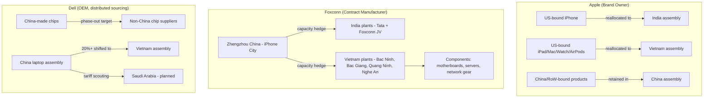

## Corporate diversification case studies: Apple, Foxconn, and Dell

### Purpose and Framing

This case study set examines how three interlinked firms — a brand owner (Apple), its principal contract manufacturer (Foxconn/Hon Hai), and a vertically distinct competitor (Dell) — have responded to the same geopolitical pressure (US–China strategic competition, tariff risk, and China's COVID-era production shocks) with different diversification strategies shaped by their position in the value chain. Apple owns design and brand but outsources assembly; Foxconn owns manufacturing capacity but not the product; Dell owns both product design and a more distributed, tiered sourcing model. Comparing them illustrates that "diversification" is not a single strategy but a family of strategies constrained by each firm's control points in the supply chain.

### Case 1: Apple — Brand-Owner-Led Geographic Diversification

**Background and Trigger Events**

Apple's China exposure is structural: for over a decade, the vast majority of iPhone final assembly occurred in China, concentrated in a small number of mega-factories, most notably Foxconn's Zhengzhou complex — sometimes called "iPhone City" — which at peak periods employed around 300,000 workers and was responsible for about 80% of Apple's global iPhone output. Two shocks accelerated diversification planning that had existed informally since around 2019: [Substack](https://kbssidhu.substack.com/p/foxconns-strategic-investments-and)

- **COVID-19 zero-COVID disruptions (2022):** Worker unrest, lockdowns, and an exodus of staff at Zhengzhou reduced manufacturing capacity to as low as 20% in November 2022, recovering to only 30–40% in December, directly delaying iPhone 14 Pro shipments during peak holiday demand. [phonearena](https://www.phonearena.com/news/foxconn-invests-in-india-vietnam_id144207)
- **US–China trade and technology tensions:** Export controls on semiconductor equipment, tariff escalation risk, and general geopolitical uncertainty made single-country concentration a board-level risk rather than a purely operational one.

**Diversification Strategy: "China+1" via India and Vietnam**

Apple's approach has been to preserve China's role for products sold in China and the rest of the world while shifting production destined for the **US market** to alternate hubs — primarily India for iPhones and Vietnam for other product lines.

- **India (iPhones):** Apple's supplier count in India jumped from just 14 in 2023 to more than 40 by 2026, for the first time overtaking Vietnam's roughly 35 suppliers. By early 2026, roughly 25% of iPhones were being assembled in India. India's manufacturing footprint is not solely Foxconn-run: Apple's operational footprint in India includes five major assembly facilities, three operated by Tata Group and two by Foxconn, supported by an ecosystem of roughly 45 component suppliers — indicating Apple is deliberately diversifying assembly partners, not just geography. [Apple Expands India Supply Chain, Cuts China Ties +2](https://journalofsupplychain.com/News/apples-india-supply-chain-surge-how-india-is-outpacing-vietnam-and-cutting-china-ties)
- **Vietnam (iPad, Mac, Watch, AirPods):** Tim Cook stated the company's intent plainly on an earnings call: "For June 2025, we expect the majority of iPhones sold in the US will have India as their origin, and Vietnam for almost all iPad, Mac, Apple Watch, and AirPods." [Supply Chain Digital](https://supplychaindigital.com/procurement/apple-pivots-to-india-with-expected-us-22bn-output)
- **Reverse component flows:** A notable second-order effect of India's maturing ecosystem is that India has begun **exporting** components back into the traditional hubs: Indian suppliers including Tata Electronics, Motherson Group, Aequs, and Jabil now manufacture and export critical electronic components — including for AirPods and MacBooks — to Vietnam and China for further assembly, reversing India's historical status as a net importer of electronic components. [Convergence Now](https://www.convergence-now.com/electronics/india-exports-apple-components-to-vietnam-china-a-new-chapter-in-supply-chain-diversification-119153/)

**Strategic Rationale in Apple's Own Words**

Apple has framed diversification explicitly as risk management rather than cost arbitrage. As Tim Cook put it: "What we learned some time ago was that having everything in one location had too much risk with it and so we have, over time, with certain parts of the supply chain, opened up new sources of supply." At the same time, Apple has been careful to signal it is not abandoning China: "China would continue to be the country of origin for the vast majority of total product sales outside the US." [Procurement Magazine](https://procurementmag.com/technology-and-ai/apple-pivots-to-india-with-expected-us-22bn-output)[Procurement Magazine](https://procurementmag.com/technology-and-ai/apple-pivots-to-india-with-expected-us-22bn-output)

**Quality Consistency Claims**

A recurring theme in Apple's public messaging is that diversification does not compromise build quality: Apple asserts "it is virtually impossible to tell an iPhone made in China from one made in India or Vietnam." [Unverified] — this is a corporate quality claim rather than an independently benchmarked result, and analysts note that replicating this quality consistency for new, more intricate product designs remains a genuine engineering and process-transfer challenge. [Technology Magazine](https://technologymagazine.com/it-procurement/apple-pivots-to-india-with-expected-us-22bn-output)[Technology Magazine](https://technologymagazine.com/it-procurement/apple-pivots-to-india-with-expected-us-22bn-output)

**Structural Limits to Apple's Diversification**

Independent analysis cautions against overstating the shift. The American Enterprise Institute's review of supplier-location data found that most of Apple's manufacturing supply chain remains in China, with only limited increases in Southeast Asia and India, and that China's role has actually grown in depth over the past decade — from final assembly only, to also sourcing many components — even as some assembly has diversified. The report also notes an important nuance: even components made in China are frequently produced in factories owned by Japanese, Taiwanese, or US firms rather than Chinese-owned firms, complicating any simple "China exposure" metric. Apple also discloses very limited data: the company reports only the number of factories per country and their owning company, not dollar value or component-level origin, meaning most public "percentage shifted" claims are analyst estimates, not verified Apple disclosures. [Inference] [Apple’s Supply Chain: Economic and Geopolitical Implications | American Enterprise Institute - AEI +3](https://www.aei.org/research-products/report/apples-supply-chain-economic-and-geopolitical-implications/)

### Case 2: Foxconn (Hon Hai Precision Industry) — Manufacturer-Led Capacity Diversification

**Background**

Foxconn's diversification is a mirror image of Apple's: rather than choosing where to buy from, Foxconn must choose where to **build capacity** to remain Apple's (and other OEMs') preferred assembly partner as demand shifts geographically. Foxconn's exposure to China is exceptionally concentrated at the plant level: Foxconn alone contributed over 80% of Zhengzhou's export volume and over half of Henan province's total trade — meaning Foxconn's capacity decisions have macroeconomic consequences for entire Chinese provinces, not just for Apple's balance sheet. [New Kerala](https://www.newkerala.com/news/o/foxconns-china-exit-due-erratic-policies-signals-mncs-shift-541)

**India Expansion**

- Foxconn moved early and decisively into India following the 2022 Zhengzhou disruptions: Foxconn injected US$500 million into its Indian subsidiary (Foxconn Hon Hai Technology India Mega Development Private Limited) via its Singapore unit, purchasing over 4 billion shares, explicitly framed as diversification following pandemic-related disruption at Zhengzhou. [South China Morning Post](https://www.scmp.com/tech/big-tech/article/3202691/apple-supplier-foxconn-invest-us500-million-india-supply-chain-diversification-china)
- By the mid-2020s, Foxconn had become the dominant iPhone assembler in India: Foxconn manages approximately 75–80% of iPhone production capacity in India, alongside Tata's growing share. [Substack](https://kbssidhu.substack.com/p/foxconns-strategic-investments-and)

**Vietnam Expansion**

Foxconn's Vietnam investment has been the most sustained and multi-phased of the three companies studied:

- In August 2022, Foxconn signed an MOU for over 50.5 hectares of land and committed roughly $300 million and an expected 30,000 workers to move Apple Watch and MacBook assembly out of China for the first time, with a further $62.5 million expansion announced by early 2023. [The Register](https://www.theregister.com/2023/02/16/foxconn_expands_vietnam/)[The Register](https://www.theregister.com/2023/02/16/foxconn_expands_vietnam/)
- In 2024, Foxconn committed a further $551 million to two new Vietnam ventures, and announced a $246 million facility in Quang Ninh's Song Khoai Industrial Park, expected to begin production in 2026. [HulkApps](https://www.hulkapps.com/blogs/ecommerce-hub/foxconn-to-invest-551-million-in-vietnam-diversifying-beyond-china)[Lotusventure](https://lotusventure.co/2025/09/foxconn-vietnam-profile-2025/)
- By early-to-mid 2026, cumulative scale reached a new tier: Foxconn's total investment in Vietnam surpassed $4 billion, and the company inaugurated a dedicated Vietnam headquarters office in Hanoi in April 2026, with its Bac Ninh province investment alone reaching $4 billion and creating 130,000 jobs. Foxconn's Vietnam footprint spans four key localities — Bac Ninh, Hanoi, Quang Ninh, and Nghe An — with Bac Ninh serving as the central hub hosting around 20 manufacturing projects. [Foxconn invests an additional $39 mln in Vietnam - VnEconomy +3](https://en.vneconomy.vn/foxconn-invests-an-additional-39-mln-in-vietnam.htm)
- Product scope in Vietnam has broadened beyond consumer electronics assembly into components: Fulian Precision Technology Component, a key Foxconn subsidiary in Bac Ninh, manufactures motherboards, computers and peripherals, servers and server chassis, telecom equipment, network cards, switches, set-top boxes, graphics cards, and memory units. [VnEconomy](https://en.vneconomy.vn/foxconn-invests-an-additional-39-mln-in-vietnam.htm)

**Interpreting Foxconn's Strategy**

Foxconn's pattern of behavior — parallel, large, and recurring capital injections into both India and Vietnam rather than a single "winner" location — reflects a hedging logic distinct from Apple's product-line allocation approach. [Inference] Where Apple assigns specific product categories to specific countries (iPhone→India, other hardware→Vietnam), Foxconn appears to be building redundant capacity in both, positioning itself to serve whichever allocation Apple (and other clients such as component/server customers) ultimately choose. The scale of Foxconn's departure from China is visible in the resulting damage to Chinese regional trade statistics: when Foxconn scaled back and moved capacity abroad, Henan province's phone exports plunged 60% in Q1 2024, dragging total provincial trade down 23% — a concrete, quantifiable illustration of reshoring/friend-shoring's regional economic impact on the origin country. [New Kerala](https://www.newkerala.com/news/o/foxconns-china-exit-due-erratic-policies-signals-mncs-shift-541)

### Case 3: Dell — Component-Level and Assembly Diversification in the PC Industry

**Background**

Dell's diversification differs from Apple's in scope: rather than being primarily about final-assembly geography, Dell's publicly reported strategy has centered heavily on **eliminating China-made semiconductor content** from its products, in addition to shifting notebook assembly.

**Chip Sourcing Diversification**

- Dell told suppliers to significantly reduce the volume of China-sourced components in its products, including components made in China by non-Chinese manufacturers, with a target of eliminating all China-manufactured chips by the end of 2024. [theregister](https://www.theregister.com/2023/01/05/dell/)
- This effort extended beyond Dell's own factories to its supplier tier: many of the components that make up Dell machines were, at the time, still manufactured in China, along with a significant proportion of assembly, and Dell was actively pressuring its supplier base to diversify alongside it. [techradar](https://www.techradar.com/news/dell-founder-says-customers-are-demanding-less-reliance-on-china)
- Dell's public statement on the matter was notably cautious and non-committal in tone, avoiding explicit confirmation of hard targets: "China is an important market where we have team members and customers to serve. We continuously explore supply chain diversification across the globe..." [theregister](https://www.theregister.com/2023/01/05/dell/)
- Taiwanese financial newspaper Commercial Times reported Dell was separately planning to move 50% of its total production out of China by 2025 [Unverified — sourced to a secondary financial press report, not confirmed directly by Dell]. [acm](https://cacmb4.acm.org/news/268481-dell-to-stop-using-chips-made-in-china-before-the-end-of-2024/fulltext)

**Assembly Diversification: Vietnam**

- Dell launched its diversification plan earlier than rival HP, committing to making at least 20% of all its laptops in Vietnam during the mid-2020s ramp-up period. [Swarajya](https://swarajyamag.com/business/after-apple-and-dell-hp-is-now-moving-production-away-from-china)
- Dell's shift was driven in part by direct customer pressure rather than only internal risk calculus: Michael Dell told the Financial Times that the company had become "intently focused" on sourcing components from countries other than China because customers themselves were urging diversification amid growing global tension. [techradar](https://www.techradar.com/news/dell-founder-says-customers-are-demanding-less-reliance-on-china)

**Competitive Context and Second-Order Effects**

Dell's early move helped catalyze a broader PC-industry exodus:

- HP followed with plans to shift millions of consumer and commercial laptops to Thailand and Mexico, and later to Vietnam, explicitly benchmarking against Dell's head start. [Swarajya](https://swarajyamag.com/business/after-apple-and-dell-hp-is-now-moving-production-away-from-china)
- HP, Dell, and Microsoft together were reported exploring reallocating up to 30% of notebook production out of China as early as the initial wave of PC-industry diversification, with HP and Dell together commanding around 40% of the global PC market at that time — meaning their combined decisions materially reshape Southeast Asia's electronics manufacturing base. [Axios](https://link.axios.com/click/17434522.50340/aHR0cHM6Ly9hc2lhLm5pa2tlaS5jb20vRWNvbm9teS9UcmFkZS13YXIvSFAtRGVsbC1hbmQtTWljcm9zb2Z0LWpvaW4tZWxlY3Ryb25pY3MtZXhvZHVzLWZyb20tQ2hpbmE_dXRtX3NvdXJjZT1uZXdzbGV0dGVyJnV0bV9tZWRpdW09ZW1haWwmdXRtX2NhbXBhaWduPW5ld3NsZXR0ZXJfYXhpb3NmdXR1cmVvZndvcmsmc3RyZWFtPWZ1dHVyZQ/598cdd4c8cc2b200398b463bBafdbae06)[Axios](https://link.axios.com/click/17434522.50340/aHR0cHM6Ly9hc2lhLm5pa2tlaS5jb20vRWNvbm9teS9UcmFkZS13YXIvSFAtRGVsbC1hbmQtTWljcm9zb2Z0LWpvaW4tZWxlY3Ryb25pY3MtZXhvZHVzLWZyb20tQ2hpbmE_dXRtX3NvdXJjZT1uZXdzbGV0dGVyJnV0bV9tZWRpdW09ZW1haWwmdXRtX2NhbXBhaWduPW5ld3NsZXR0ZXJfYXhpb3NmdXR1cmVvZndvcmsmc3RyZWFtPWZ1dHVyZQ/598cdd4c8cc2b200398b463bBafdbae06)
- The diversification trend has since extended to tariff-driven relocation beyond Vietnam: Dell, along with HP and Lenovo, has sent teams to scout manufacturing sites in Saudi Arabia, drawn by a 10% reciprocal tariff rate versus rates as high as 245% on Chinese-made goods, with Lenovo furthest along, having announced a Riyadh assembly plant backed by $2 billion from a Saudi Public Investment Fund subsidiary, targeting 2026 production start. [techradar](https://www.techradar.com/pro/pc-makers-are-planning-plants-in-saudi-arabia-to-try-and-avoid-us-tariffs)[techradar](https://www.techradar.com/pro/pc-makers-are-planning-plants-in-saudi-arabia-to-try-and-avoid-us-tariffs)

### Comparative Analysis

| Dimension | Apple | Foxconn | Dell |
| --- | --- | --- | --- |
| Value-chain role | Brand owner / OEM | Contract manufacturer (EMS) | Brand owner / OEM (more vertically distributed sourcing than Apple) |
| Primary diversification lever | Reallocating final-assembly *destination* by product line | Building parallel manufacturing capacity in multiple countries | Eliminating *chip-level* China content plus shifting laptop assembly |
| Lead diversification geography | India (iPhone), Vietnam (other hardware) | India and Vietnam (parallel, large-scale) | Vietnam (assembly), broad supplier base (components) |
| Primary trigger | 2022 Zhengzhou COVID disruption + tariff/geopolitical risk | Direct exposure to Apple's reallocation decisions + regional COVID shocks | US–China chip export controls + customer pressure |
| Stated posture toward China | Reduce US-bound concentration; retain China for China/RoW sales | Reduce single-site concentration (Zhengzhou); expand elsewhere | Actively reduce China-origin chip content; diversify supplier tier |
| Independent skepticism | AEI: most of the supply chain remains in China; shift is real but limited | N/A (capacity data corroborates the shift) | Commercial Times "50% by 2025" claim unconfirmed by Dell directly |

**Key Points**

- Diversification strategy is shaped by position in the value chain: Apple diversifies *where products are assembled*, Foxconn diversifies *where it holds capacity*, and Dell diversifies *what components are used* in addition to assembly location.
- India and Vietnam are the dominant beneficiary geographies across all three firms, but with different product-category specialization (India: complex final assembly, notably iPhones; Vietnam: broader hardware and components).
- Public statements from all three companies consistently frame diversification as **risk management** (single-point-of-failure mitigation, tariff exposure, export-control exposure) rather than primarily a labor-cost play, though cost and tariff arbitrage remain real secondary motives. [Inference]
- Diversification is asymmetric and incomplete: even the most aggressive shifts (Apple's India ramp, Dell's chip-sourcing purge) coexist with continued, and in some dimensions *deepening*, reliance on China, particularly for components and for products sold outside the US market.
- The shift has measurable second-order effects on the origin country: Foxconn's capacity relocation is directly linked to a 60% drop in Henan province's phone exports in Q1 2024, illustrating how firm-level diversification aggregates into subnational economic disruption.

### Illustrative Diagram: Diversification Flow Comparison

### Diagram: Shared Diversification Drivers (svg_diagram)

<svg xmlns="http://www.w3.org/2000/svg" viewBox="0 0 760 360">
<text x="380" y="28" text-anchor="middle" font-size="18" font-weight="bold" fill="#1a1a2e">Shared Diversification Drivers (svg_diagram)</text>
<rect x="20" y="60" width="200" height="90" rx="8" fill="#e8f0fe" stroke="#3b5bdb" stroke-width="1.5" />
<text x="120" y="90" text-anchor="middle" font-size="13" font-weight="bold" fill="#1a1a2e">COVID-19 Shocks</text>
<text x="120" y="110" text-anchor="middle" font-size="11" fill="#333">Zhengzhou 2022</text>
<text x="120" y="126" text-anchor="middle" font-size="11" fill="#333">worker exodus, lockdowns</text>
<rect x="280" y="60" width="200" height="90" rx="8" fill="#fef3e8" stroke="#e67700" stroke-width="1.5" />
<text x="380" y="90" text-anchor="middle" font-size="13" font-weight="bold" fill="#1a1a2e">US Export Controls</text>
<text x="380" y="110" text-anchor="middle" font-size="11" fill="#333">Semiconductor equipment,</text>
<text x="380" y="126" text-anchor="middle" font-size="11" fill="#333">advanced chip restrictions</text>
<rect x="540" y="60" width="200" height="90" rx="8" fill="#eaf7ea" stroke="#2b8a3e" stroke-width="1.5" />
<text x="640" y="90" text-anchor="middle" font-size="13" font-weight="bold" fill="#1a1a2e">Tariff Risk</text>
<text x="640" y="110" text-anchor="middle" font-size="11" fill="#333">Up to 245% reciprocal</text>
<text x="640" y="126" text-anchor="middle" font-size="11" fill="#333">tariffs on China-origin goods</text>
<line x1="120" y1="150" x2="380" y2="200" stroke="#666" stroke-width="1.5" />
<line x1="380" y1="150" x2="380" y2="200" stroke="#666" stroke-width="1.5" />
<line x1="640" y1="150" x2="380" y2="200" stroke="#666" stroke-width="1.5" />
<rect x="260" y="200" width="240" height="50" rx="8" fill="#1a1a2e" />
<text x="380" y="230" text-anchor="middle" font-size="13" font-weight="bold" fill="#ffffff">Diversification Response</text>
<line x1="380" y1="250" x2="150" y2="290" stroke="#666" stroke-width="1.5" />
<line x1="380" y1="250" x2="380" y2="290" stroke="#666" stroke-width="1.5" />
<line x1="380" y1="250" x2="610" y2="290" stroke="#666" stroke-width="1.5" />
<rect x="40" y="290" width="220" height="50" rx="8" fill="#e8f0fe" stroke="#3b5bdb" stroke-width="1.5" />
<text x="150" y="320" text-anchor="middle" font-size="12" font-weight="bold" fill="#1a1a2e">Apple: product→country map</text>
<rect x="270" y="290" width="220" height="50" rx="8" fill="#fef3e8" stroke="#e67700" stroke-width="1.5" />
<text x="380" y="320" text-anchor="middle" font-size="12" font-weight="bold" fill="#1a1a2e">Foxconn: parallel capacity</text>
<rect x="500" y="290" width="220" height="50" rx="8" fill="#eaf7ea" stroke="#2b8a3e" stroke-width="1.5" />
<text x="610" y="320" text-anchor="middle" font-size="12" font-weight="bold" fill="#1a1a2e">Dell: chip + assembly split</text>
</svg>

### Formulaic Framing: Quantifying Concentration Risk

A simplified Herfindahl-style concentration measure can express why single-site dependence (e.g., Zhengzhou) is treated as high risk. For $n$ production sites each with output share $s_i$:

$$HHI = \sum_{i=1}^{n} s_i^2$$

When one site (Zhengzhou) historically accounted for $s_1 \approx 0.80$ of Apple's global iPhone output, $HHI \approx 0.64$, near the theoretical single-source maximum of $1.0$. [Inference] Diversifying to, for example, four sites with shares of 0.40, 0.30, 0.20, and 0.10 reduces $HHI$ to $0.16 + 0.09 + 0.04 + 0.01 = 0.30$, a directional illustration — not a claim about Apple's actual current site-level split, which Apple does not disclose. [Speculation]

**Related Topics**

- Tariff arbitrage vs. genuine reshoring: distinguishing cost-driven relocation from resilience-driven relocation
- The "China+1" strategy across other sectors (textiles, solar, automotive)
- India's PLI (Production Linked Incentive) scheme and its role in attracting electronics FDI
- Vietnam's industrial park ecosystem (Bac Ninh, Bac Giang) as a case study in agglomeration economics
- Friend-shoring to the Gulf states: Saudi Arabia and UAE as emerging non-aligned manufacturing hubs
- Taiwanese EMS firms' (Foxconn, Pegatron, Wistron) parallel diversification strategies
- Chokepoint analysis: semiconductor export controls and their propagation through OEM supply chains
- Subnational economic impact of reshoring: the Zhengzhou/Henan trade contraction as a case study
- Component-level vs. assembly-level diversification as distinct resilience strategies