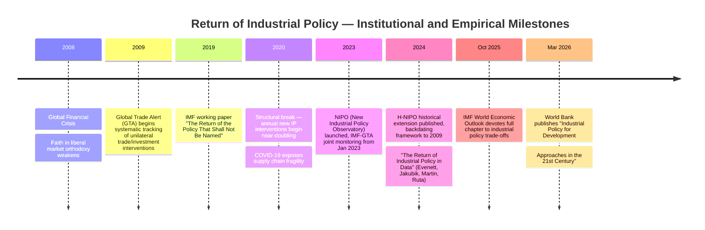

## The return of industrial policy after decades of trade liberalism

### Definition and Scope

Industrial policy refers to deliberate state action aimed at reshaping the structure of a domestic economy — favoring particular sectors, technologies, or firms over what an unmanaged market would otherwise allocate. Industrial policy (IP) is defined in current IMF research as state action directed at changing the structure of the domestic economy, following a text-based measurement approach. Instruments include subsidies, tariffs, local-content requirements, export restrictions, state investment vehicles, preferential financing, tax credits, and public procurement preferences. This topic traces the historical arc from the post-1980s "Washington Consensus" era of trade liberalism — when industrial policy was treated as a discredited, distortionary relic — to its full rehabilitation as mainstream statecraft by the mid-2020s.

### The Liberal Consensus Era (Roughly 1980s–2008)

For roughly three decades, the dominant policy paradigm among advanced economies and international financial institutions held that:

- Comparative advantage should be left to market signals and free trade, not state direction
- Government "picking winners" was assumed to be inefficient, rent-seeking-prone, and distortionary
- The GATT/WTO system was built around progressively removing tariffs, subsidies, and trade barriers
- The IMF and World Bank conditioned lending on liberalization, privatization, and deregulation (structural adjustment)

Under this framework, industrial policy was — in the IMF's own later, self-deprecating phrase from a landmark 2019 working paper — "the policy that shall not be named," reflecting how thoroughly the concept had been stigmatized within mainstream economic institutions.

### The Turning Point: Post-2008 and Accelerating After 2020

Quantitative tracking research identifies a clear structural break rather than a gradual drift. Analysis using the New Industrial Policy Observatory (NIPO) — a joint initiative of the IMF and Global Trade Alert covering more than 34,000 policy interventions across 75 economies since 2009 — found that since 2020, amid pandemic shocks, supply chain disruptions, and rising geopolitical tension, the annual number of new industrial policy interventions has nearly doubled, led by the United States, the European Union, China, Japan, and Korea. A parallel historical extension of the same dataset (H-NIPO, covering 2009 onward) confirms that 2020 marks a structural shift toward enhanced resort to selective policy intervention, and — critically — the trend did not recede as countries exited the pandemic, indicating a durable regime change rather than a temporary crisis response.

**Chronology of Motive Shifts**

Research using large-language-model-based classification of policy justifications identifies a distinct two-phase pattern in *why* governments cite industrial policy:

1. **Post-Global Financial Crisis phase:** Strategic competitiveness and climate change mitigation were the predominant motives, consistent with "green recovery" and "green jobs" agendas pursued by the United States and Europe, with China, the US, and EU leading in green subsidies specifically.
2. **Post-2020 phase:** National security, geopolitical concerns, and supply chain resilience motives have come to the fore, only picking up steam in the post-pandemic period, layering atop (not replacing) the earlier climate/competitiveness rationale.

### Institutional Rehabilitation: The IMF and World Bank Reversal

The most striking evidence of industrial policy's return to respectability is the reversal by the very institutions that spent decades discouraging it. The sequence is documented as follows:

- **2019:** IMF publishes the working paper "The Return of the Policy That Shall Not Be Named" — an early, still-cautious internal acknowledgment.
- **October 2025:** The IMF's World Economic Outlook includes a full chapter titled "Industrial Policy: Managing Trade-Offs to Promote Growth and Resilience," explicitly modeling the trade-offs between subsidies, tariffs, learning-rate effects, and foreign cost advantages in a formal economic framework.
- **March 2026:** The World Bank publishes *Industrial Policy for Development: Approaches in the 21st Century*, co-authored by Ana Margarida Fernandes and Tristan Reed — marking a comparable institutional shift at the Bank.

Commentary on this reversal frames it starkly: industrial policy, once a taboo in mainstream economics, is being mainstreamed by the very institutions that spent four decades stigmatizing it, explicitly linking the IMF's 2019 and 2025 publications and the World Bank's 2026 volume as evidence of a genuine institutional "volte face" rather than a rhetorical footnote. [Inference — the framing of this reversal's ultimate significance for austerity/liberalization orthodoxy broadly remains a contested interpretive claim, not a settled fact.]

### Empirical Patterns: Subsidy Competition and Spillovers

Beyond documenting the *volume* of industrial policy, recent research quantifies its *interactive, competitive* dynamics — i.e., why the phenomenon is increasingly described as a "subsidy race":

- **Contagion effect:** When a major economy implements a subsidy measure on a given product, there is an average 74% likelihood that another major economy follows with a similar intervention, indicating strong policy interdependence rather than independent national decision-making.
- **Trade effects of subsidies:** Product-level analysis shows subsidy interventions are associated with measurable changes in imports and exports of targeted products, consistent with "business-stealing" effects, where subsidies to one country's industry visibly divert trade share from competitors.
- **Export performance:** Exports of subsidized products increase approximately 2% more than non-subsidized products following a subsidy's implementation, providing a concrete, if modest, efficacy metric for the trade-distorting intent behind these policies.
- **Firm-level adjustment:** Firm-level evidence suggests that foreign industrial policies induce adjustment through offshoring, reallocation along value chains, and changes in sourcing strategies, meaning industrial policy in one country reshapes corporate supply-chain decisions globally, not just domestic production.
- **Policy sequencing speed:** Recent work documents increasingly rapid policy sequencing across jurisdictions, meaning the lag between one country's intervention and a rival's response is compressing over time. [Inference — the precise magnitude of this compression is an active research finding rather than a fixed, universally agreed figure.]

### Measurement Infrastructure

The empirical rehabilitation of industrial policy as a respectable subject of study has been enabled by new joint data infrastructure:

- **NIPO (New Industrial Policy Observatory):** An IMF–Global Trade Alert monitoring initiative recording "new industrial policy" measures from January 1, 2023 onward, updated monthly with broad country coverage.
- **H-NIPO:** A historical extension of the same conceptual framework back to 2009, enabling consistent longitudinal comparison of industrial policy activity across China, the EU, and the US over a fifteen-year horizon.
- **Joint Subsidy Platform:** A collaborative data effort among the IMF, OECD, World Bank, and WTO aimed at improving cross-country subsidy data availability and transparency, reflecting recognition that no single institution previously tracked this activity comprehensively.
- **Sectoral focus of tracked measures:** The NIPO dataset's analysis of interventions concentrates on clean energy, semiconductors, digital infrastructure, and upstream sectors such as critical minerals — the same sectors that dominate contemporary "subsidy race" and "friend-shoring" discourse.

### Why the Reversal Happened: Structural Drivers

Synthesizing the sourced material, the return of industrial policy after decades of trade liberalism can be attributed to a convergence of distinct but reinforcing shocks:

1. **2008 Global Financial Crisis:** Undermined faith in unregulated markets generally and opened political space for state intervention, initially channeled into climate/green-recovery spending.
2. **COVID-19 pandemic (2020–2022):** Exposed acute fragility in globally concentrated supply chains (e.g., semiconductors, PPE, pharmaceuticals), making "resilience" a politically salient goal independent of cost efficiency.
3. **US–China strategic competition:** Elevated national security and technology-denial concerns (export controls, chip restrictions) as first-order policy drivers, not secondary considerations.
4. **Climate transition financing:** Large-scale green subsidy programs (in the US, EU, and China) normalized large state capital allocation to specific sectors under a legitimizing "green jobs" and decarbonization frame, which later broadened into general strategic-sector support. [Inference — this is a synthesized causal narrative connecting the sourced motive-shift data, not a single directly-cited claim.]

### Contested Interpretations

Not all commentary treats the IMF/World Bank rehabilitation of industrial policy as an unambiguous policy victory for state intervention. Some critical political-economy commentary argues the institutional "turn" is bound by structural constraints that mainstream new-Bretton-Woods literature largely avoids confronting, including concerns about how industrial policy interacts with existing patterns of Global South economic dependency ("rentierisation") and the risk of great-power retaliation dynamics. [Speculation — this represents one critical school of interpretation within a broader, actively contested academic debate, and should not be read as a consensus view.]

### Illustrative Diagram: Timeline of the Industrial Policy Reversal

### Diagram: Motive Evolution Over Time (svg_diagram)

<svg xmlns="http://www.w3.org/2000/svg" viewBox="0 0 760 340">
<text x="380" y="28" text-anchor="middle" font-size="18" font-weight="bold" fill="#1a1a2e">Motive Evolution Over Time (svg_diagram)</text>
<line x1="60" y1="290" x2="720" y2="290" stroke="#333" stroke-width="2" />
<text x="60" y="310" font-size="11" fill="#333">2008</text>
<text x="390" y="310" font-size="11" fill="#333">2020</text>
<text x="690" y="310" font-size="11" fill="#333">2026</text>
<rect x="60" y="60" width="320" height="80" rx="8" fill="#eaf7ea" stroke="#2b8a3e" stroke-width="1.5" />
<text x="220" y="85" text-anchor="middle" font-size="13" font-weight="bold" fill="#1a1a2e">Post-GFC Phase (2008-2020)</text>
<text x="220" y="105" text-anchor="middle" font-size="11" fill="#333">Strategic competitiveness</text>
<text x="220" y="122" text-anchor="middle" font-size="11" fill="#333">Climate / green recovery</text>
<rect x="400" y="60" width="320" height="80" rx="8" fill="#fef3e8" stroke="#e67700" stroke-width="1.5" />
<text x="560" y="85" text-anchor="middle" font-size="13" font-weight="bold" fill="#1a1a2e">Post-2020 Phase</text>
<text x="560" y="105" text-anchor="middle" font-size="11" fill="#333">National security</text>
<text x="560" y="122" text-anchor="middle" font-size="11" fill="#333">Supply chain resilience, geopolitics</text>
<line x1="220" y1="140" x2="220" y2="285" stroke="#2b8a3e" stroke-width="1.5" stroke-dasharray="4" />
<line x1="560" y1="140" x2="560" y2="285" stroke="#e67700" stroke-width="1.5" stroke-dasharray="4" />
<rect x="60" y="180" width="660" height="40" rx="6" fill="#e8f0fe" stroke="#3b5bdb" stroke-width="1.5" />
<text x="390" y="205" text-anchor="middle" font-size="12" fill="#1a1a2e">Interventions nearly double annually starting 2020 (34,000+ tracked since 2009, 75 economies)</text>
</svg>

### Key Points

- Industrial policy's post-2020 resurgence is a **measured, structural break** in the data — not a subjective media narrative — documented across more than 34,000 tracked interventions in 75 economies since 2009.
- The motive for state intervention shifted from **competitiveness/climate** (post-2008) to **security/resilience/geopolitics** (post-2020), with the earlier motive persisting rather than disappearing.
- The IMF and World Bank's institutional reversal — from actively discouraging industrial policy for decades to publishing dedicated frameworks for managing it (2025–2026) — is itself a major, quantifiable indicator of the paradigm shift.
- Empirical research shows industrial policy is inherently **interactive**: one major economy's subsidy carries a 74% average likelihood of triggering a comparable response elsewhere, which is the mechanistic basis of "subsidy race" dynamics addressed in this chapter.
- The debate over whether this rehabilitation represents a genuine break from market fundamentalism, or a narrower/managed adjustment within it, remains actively and legitimately contested among economists and political economists.

**Related Topics**

- The New Industrial Policy Observatory (NIPO) and Global Trade Alert methodology
- CHIPS and Science Act, EU Green Deal Industrial Plan, and China's Made in China 2025 as flagship case studies
- Subsidy race dynamics and the 74% contagion effect: game-theoretic modeling of strategic competitiveness policy
- WTO subsidy disciplines and their erosion under the new industrial policy wave
- Critical minerals industrial policy as a distinct sub-case within resilience-driven intervention
- The IMF's trade-off framework: subsidies, tariffs, learning rates, and foreign cost advantage modeling
- Rentierisation critiques of Global South industrial policy space under IMF/World Bank frameworks
- Comparing liberal-era (1980s–2008) versus post-2020 industrial policy instrument design