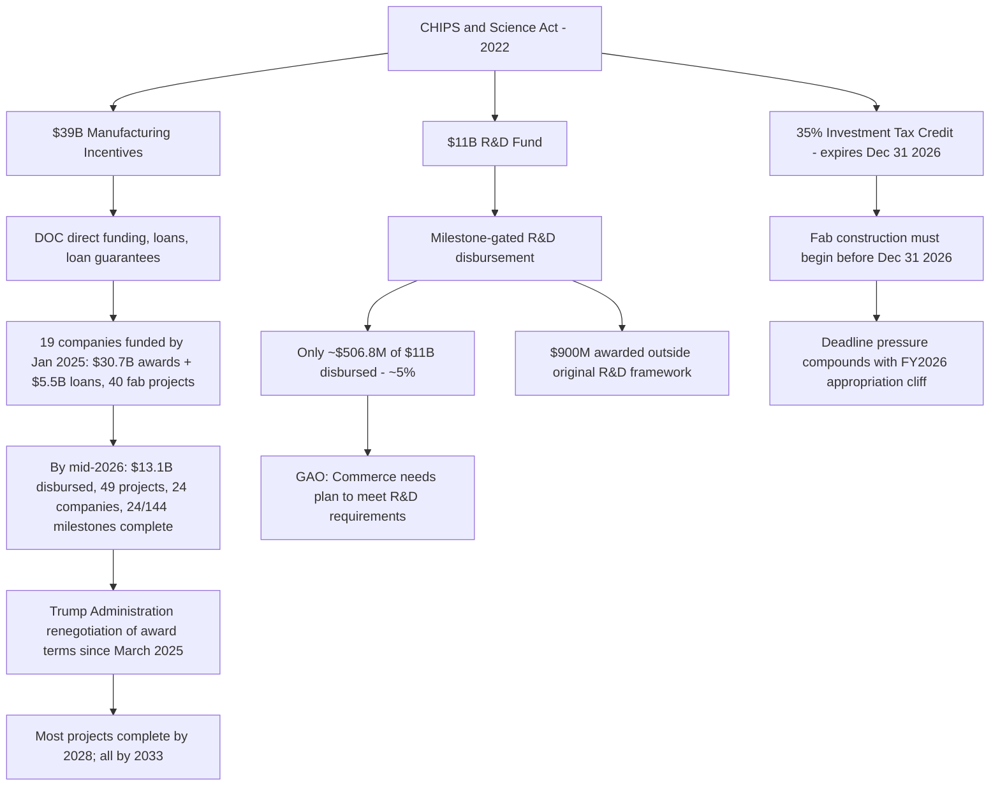

## The US CHIPS and Science Act

### Legislative Overview

The CHIPS and Science Act is a US federal law enacted in 2022 designed to rebuild domestic semiconductor manufacturing capacity and fund related scientific research, framed explicitly as a national security and supply-chain-resilience measure amid concerns about US dependence on Taiwan and other foreign chip production. The law's structure divides its incentives into two major pillars:

- **Manufacturing incentives:** A $39 billion funding bucket for semiconductor manufacturing projects, administered through direct funding, loans, and loan guarantees.
- **R&D funding:** An $11 billion research and development fund, intended to support upstream innovation (materials science, advanced packaging, workforce development) separate from fab construction.
- **Investment tax credit:** A 35% investment tax credit for capital expenses related to semiconductor production and manufacturing equipment, available only to projects that begin fab construction before December 31, 2026.

The program is administered by the US Department of Commerce (DOC), with the CHIPS Program Office overseeing award negotiation, and the National Institute of Standards and Technology (NIST), part of DOC, managing preliminary agreements before final award issuance.

### Funding Status: Manufacturing Track

The manufacturing incentive program has disbursed substantially more capital than the R&D track, though disbursement accelerated notably through 2026:

- **January 2025 baseline:** DOC had funded 19 semiconductor companies with $30.7 billion in awards and $5.5 billion in loans across 40 commercial semiconductor fab projects, with an additional 12 companies holding preliminary NIST agreements for 18 further projects pending final due-diligence review.
- **As of June 2026:** Public records do not indicate whether those 12 companies with preliminary agreements had received final awards, reflecting a slowdown in converting preliminary commitments into finalized funding.
- **As of roughly mid-2026:** Despite R&D-track cancellations (see below), Commerce had disbursed $13.1 billion in CHIPS Act awards for 49 manufacturing projects across 24 companies — indicating manufacturing-track disbursement continued at meaningful scale even as the R&D track stalled.
- **Milestone completion:** As of April 2026, 24 of 144 milestones across 49 projects had been completed, with associated funding disbursed accordingly — illustrating that the program operates on a milestone-based disbursement model rather than lump-sum grants.
- **Project timeline:** According to GAO reporting, a majority of CHIPS Act manufacturing projects will be complete by 2028, with all expected to finish by 2033 — signaling the program's real-world buildout horizon extends roughly a decade past the law's 2022 passage.

### Funding Status: R&D Track (Stalled)

In sharp contrast to the manufacturing track, the R&D pillar has seen minimal disbursement:

- The Department of Commerce has disbursed only about $506.8 million of the $11 billion appropriated for R&D — roughly 5% of the total allocated research fund.
- Commerce has separately made new awards totaling $900 million outside the original CHIPS Act R&D framework, suggesting some research funding has been redirected through alternate mechanisms rather than the statute's original R&D structure. [Inference — the sourced reporting does not fully specify the legal or programmatic basis for these outside-framework awards.]
- One notable R&D-adjacent award involves SandboxAQ, which received CHIPS-linked funding to accelerate an AI-driven materials discovery platform addressing semiconductor materials bottlenecks and supply chain risks, including PFAS chemical alternatives, advanced catalysts, rare-earth-free magnets, and novel battery chemistries for semiconductor facility backup power.

### Trump Administration Renegotiation

A defining feature of the CHIPS Act's implementation since early 2025 has been active federal renegotiation of award terms:

- **March 4, 2025:** President Trump publicly criticized the CHIPS Act, stating that companies receiving awards "don't spend" the funds to construct and expand semiconductor fabs, and separately stated his intention to renegotiate award agreements with funding recipients.
- **Renegotiation scope:** Reuters reporting (citing multiple sources familiar with the matter) confirmed the White House sought to renegotiate CHIPS Act awards and signaled delays to upcoming semiconductor disbursements, with the CHIPS Program Office reviewing "certain conditions that do not align with President Trump's executive orders and policies" across all CHIPS Direct Funding Agreements, per a GlobalWafers spokesperson statement.
- **DEI-related friction:** The renegotiation effort is connected to the administration's broader series of executive orders aimed at dismantling diversity, equity, and inclusion (DEI) programs across the federal government and private sector, with the White House reportedly frustrated by compliance-related terms embedded in original award agreements. [Unverified — the full scope of DEI-related contract terms and their exact renegotiation outcomes were not fully detailed in available reporting.]
- **Intel's distinct case:** Intel provided the US government with equity in exchange for its direct funding award — a structurally different arrangement (equity stake rather than pure grant) compared to most other recipients.
- **Industry sentiment — mixed:** Contrasting perspectives emerge from industry sources. GlobalWafers' senior VP of government affairs noted that "everybody in industry got perhaps a little anxious when President Trump, at the beginning of the administration, said he didn't like the direct grant program," but reported that the administration's changes had, if anything, made the company's work run more smoothly, and that GlobalWafers completed phase one of its Texas facility and received a promised $200 million shortly afterward with no problems receiving milestone-based incentives.

### Critical 2026 Deadline Pressure

The program faces a structurally important deadline convergence in fiscal year 2026:

- **FY2026 marks the final year** for which the Department of Commerce is to receive CHIPS Act funding for incentivizing domestic semiconductor production under the original appropriation structure.
- **The 35% investment tax credit** is available only to projects that begin fab construction before December 31, 2026 — creating a hard deadline that incentivizes recipients to break ground quickly regardless of renegotiation uncertainty.
- This dual-timeline pressure — expiring appropriations combined with an expiring tax credit window, layered atop active federal renegotiation of award terms — creates significant implementation uncertainty for recipients during what is simultaneously the program's most consequential funding year. [Inference — the compounding effect of these three pressures operating simultaneously is a reasonable synthesis of the sourced facts, though no single source explicitly models their combined impact.]

### Recent Complicating Developments (2026)

- **New tariffs:** The administration announced new tariffs on solar panels and semiconductor components (August 6, 2026), which industry analysts warned could complicate domestic manufacturing goals — an apparent tension between tariff policy and CHIPS Act's stated onshoring objective. [Inference — sourced industry commentary characterizes this as a complication; the precise economic mechanism was not detailed in available reporting.]
- **Critical minerals linkage:** The administration announced $3 billion in new funding to boost domestic mining, reflecting a broader critical minerals strategy that intersects with semiconductor supply chain resilience goals, though this funding sits outside the CHIPS Act's original statutory framework.
- **GAO oversight finding:** A GAO report (GAO-26-109121) specifically found that Commerce needs a plan to meet CHIPS for America R&D requirements, formalizing the R&D-track disbursement shortfall as a documented federal oversight concern rather than only a journalistic observation.

### Policy Considerations for Congress

The Congressional Research Service identifies several open implementation issues as of mid-2026, framed as considerations for future congressional action:

- Award requirements and whether they should be revised in light of renegotiation friction
- Workforce development adequacy relative to fab construction timelines
- The production of mature-node chips (as distinct from leading-edge nodes), which some analysts argue has received insufficient policy attention relative to cutting-edge semiconductor manufacturing
- Whether to extend financial support for the domestic semiconductor industry beyond the FY2026 funding cliff and the December 2026 tax credit deadline

### Illustrative Diagram: CHIPS Act Fund Flow and Bottlenecks

### Diagram: Manufacturing vs. R&D Disbursement Gap (svg_diagram)

<svg viewBox="0 0 760 320" xmlns="http://www.w3.org/2000/svg">
<text x="380" y="28" text-anchor="middle" font-size="18" font-weight="bold" fill="#1a1a2e">Manufacturing vs. R&amp;D Disbursement Gap (svg_diagram)</text>

<text x="140" y="60" text-anchor="middle" font-size="13" font-weight="bold" fill="`#1a1a2e`">Manufacturing Track</text>

<rect x="60" y="80" width="160" height="180" fill="`#e8f0fe`" stroke="`#3b5bdb`" stroke-width="1.5"/>

<rect x="60" y="100" width="160" height="160" fill="`#3b5bdb`"/>

<text x="140" y="95" text-anchor="middle" font-size="11" fill="#333">$39B allocated</text>

<text x="140" y="185" text-anchor="middle" font-size="12" font-weight="bold" fill="`#ffffff`">$13.1B</text>

<text x="140" y="200" text-anchor="middle" font-size="11" fill="`#ffffff`">disbursed</text>

<text x="140" y="280" text-anchor="middle" font-size="11" fill="#333">~34% of allocation</text>

<text x="560" y="60" text-anchor="middle" font-size="13" font-weight="bold" fill="`#1a1a2e`">R&D Track</text>

<rect x="480" y="80" width="160" height="180" fill="`#fef3e8`" stroke="`#e67700`" stroke-width="1.5"/>

<rect x="480" y="248" width="160" height="12" fill="`#e67700`"/>

<text x="560" y="95" text-anchor="middle" font-size="11" fill="#333">$11B allocated</text>

<text x="560" y="238" text-anchor="middle" font-size="11" font-weight="bold" fill="`#1a1a2e`">$506.8M</text>

<text x="560" y="280" text-anchor="middle" font-size="11" fill="#333">~5% of allocation</text>

</svg>

### Key Points

- CHIPS Act disbursement is **highly asymmetric**: the manufacturing track has released roughly a third of its $39 billion allocation ($13.1B by mid-2026), while the R&D track has released only about 5% of its $11 billion allocation ($506.8M).
- The Trump administration has actively pursued **renegotiation** of award terms since March 2025, with mixed but generally not severely disruptive effects reported by at least one major recipient (GlobalWafers).
- **2026 is a structurally decisive year**: it is simultaneously the final year of original CHIPS appropriations and the final year fabs can begin construction and still qualify for the 35% investment tax credit.
- GAO oversight has formally flagged the R&D disbursement shortfall, recommending Commerce develop a plan to meet CHIPS for America R&D requirements.
- New 2026 tariffs on semiconductor components create a potential policy tension with the CHIPS Act's onshoring objective, according to industry analyst commentary. [Inference]

**Related Topics**

- The EU Chips Act as a comparative case study in trans-Atlantic semiconductor industrial policy
- TSMC Arizona and Intel Ohio: flagship CHIPS-funded fab projects and their construction timelines
- Milestone-based subsidy disbursement design as a policy instrument (compared to lump-sum grants)
- Export controls on semiconductor manufacturing equipment as a complementary (non-subsidy) industrial policy tool
- Mature-node vs. leading-edge chip production: the policy gap identified by CRS
- DEI-related compliance terms in federal subsidy agreements and their renegotiation under changing administrations
- Critical minerals and rare-earth magnet supply chains as an adjacent semiconductor resilience dependency