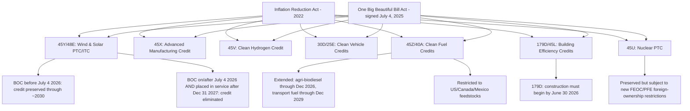

## The Inflation Reduction Act and clean energy incentives

### Legislative Overview

The Inflation Reduction Act of 2022 (IRA) was a US federal law that enacted and modified a broad suite of clean energy tax credits and incentives, representing the largest US climate-related industrial policy intervention to date at the time of passage. As originally structured, many of its cornerstone credits were designed to remain in place through at least 2032, embedding long-duration policy certainty intended to drive multi-year private investment decisions in renewable generation, storage, clean fuels, electric vehicles, and energy-efficient buildings.

**Core IRA Credits (as originally enacted)**

- **Clean Electricity Production Tax Credit (45Y):** Calculated on electricity produced from renewable sources at qualified facilities placed in service after December 31, 2024, originally set to expire after December 31, 2032.
- **Clean Electricity Investment Credit (48E):** The investment-credit counterpart to 45Y, covering capital expenditure on qualifying clean electricity facilities.
- **Clean Vehicle Tax Credit (30D):** $4,000–$7,500 for the purchase of clean vehicles placed in service before 2033.
- **Previously-Owned Clean Vehicle Tax Credit (25E):** Up to $4,000 or 30% of vehicle price (whichever is less), originally set to terminate for vehicles acquired after 2032.
- **Energy Efficient Commercial Buildings Deduction (179D):** Originally set to expire at the end of 2026.
- **New Energy Efficient Home Tax Credit (45L):** $500–$5,000 for constructing qualified energy-efficient homes, originally set to terminate December 31, 2032.
- **Zero-Emission Nuclear Power Production Tax Credit (45U):** Based on the amount of energy produced and sold to an unrelated entity.
- **Clean Hydrogen Production Tax Credit (45V):** Calculated using qualified clean hydrogen produced at a qualified facility.
- **Advanced Manufacturing Production Credit (45X):** Supports domestic manufacturing of clean energy components.
- **Clean Fuel Production Credit (45Z):** Supports transportation fuel producers using qualifying feedstocks.

**Policy Design Feature: Transferability and Direct Pay**

A structurally significant IRA innovation was allowing credits to be sold (transferability) or claimed via direct payment (elective pay) rather than requiring the claimant to have sufficient tax liability to use them directly — a mechanism designed to broaden access to project developers, including tax-exempt organizations, that previously could not monetize credits efficiently. [Inference — the strategic rationale is a standard, well-documented feature of the IRA's design rather than a claim requiring hedging, though its framing as "structurally significant" is an analytical characterization.]

### The One Big Beautiful Bill Act: Partial Rollback (2025)

The IRA's incentive structure was substantially altered — though not wholly repealed — by subsequent legislation:

- **Enactment:** The One Big Beautiful Bill Act (OBBBA), P.L. 119-21, was signed into law by President Trump on July 4, 2025, following congressional approval on July 3, 2025.
- **Characterization:** The OBBBA is widely characterized as a *partial repeal* rather than a wholesale elimination of IRA provisions — the final legislation landed between a full "sledgehammer" repeal (which Trump had expressed strong interest in during his campaign) and a narrow "scalpel" adjustment that many pundits had predicted, with the final law showing a preference for technologies that provide continuous power (nuclear, geothermal) over intermittent power technologies (wind, solar). [Inference — this "sledgehammer vs. scalpel" framing is a direct paraphrase of legal-analysis commentary, not a formal legislative classification.]

### Wind and Solar: The Most Significantly Curtailed Technologies

Wind and solar credits under Sections 45Y and 48E received the most aggressive rollback treatment in the OBBBA:

- Wind and solar projects must be placed in service by December 31, 2027, to remain eligible for the production or investment tax credit.
- The OBBBA eliminates the ability to claim 45Y and 48E credits for a wind or solar project where **beginning of construction (BOC)** occurs on or after July 4, 2026 (the one-year anniversary of the bill's enactment) **and** the project is placed in service after December 31, 2027.
- **Practical safe harbor:** A solar or wind project where beginning of construction occurs *before* July 4, 2026, remains eligible for the credits even if placed in service after December 31, 2027, with standard "continuity" requirements expected to allow placed-in-service dates extending into 2028–2030.
- **Compressed net effect:** Developers face a compressed timeline in which projects must either be completed by the end of 2027 or begin construction within roughly 12 months of the bill's enactment, likely forcing many developers to accelerate project schedules or risk losing critical tax credits.

### Technologies That Fared Comparatively Well

Not all clean energy categories were treated equally under the OBBBA:

- **Clean fuels (45Z, 40A):** Received a "much-needed extension" — small agri-biodiesel producers can claim credits for sales through December 31, 2026, and transportation fuel producers through December 31, 2029, though credits are limited to fuels produced from feedstocks derived in the US, Canada, and Mexico.
- **Battery storage and carbon capture:** The OBBBA largely preserves tax credits into the next decade for these newer clean energy technologies, in contrast to the sharply compressed wind/solar timeline.
- **Nuclear and geothermal:** Benefit from the law's general preference for continuous (dispatchable) power sources, though the 45U nuclear production tax credit becomes subject to new foreign ownership restrictions (see below).

### New Foreign Entity Restrictions

A major structural addition in the OBBBA is a set of restrictions targeting foreign ownership and influence over clean energy projects:

- The law takes a strong stance against ownership, control, and influence of clean energy projects by North Korea, China, Russia, and Iran, prohibiting tax credits for "specified foreign entities" (SFEs) and "foreign-influenced entities" (FIEs).
- **SFE definition** draws on Section 9901(6) of the FY2021 National Defense Authorization Act, and includes entities designated as foreign terrorist organizations by the Secretary of State under the Immigration and Nationality Act.
- **Prohibited Foreign Entity (PFE) determination timing:** Generally made as of the last day of the taxable year, except for the first taxable year after enactment, where determination is made as of the first day of that year (i.e., January 1, 2026) for certain discrete criteria.
- These restrictions extend to potential *buyers* of transferable credits as well as project owners, though the transferability mechanism itself remains viable until underlying credits are fully phased out.

### Other Sunsetting Provisions and Dates

Multiple additional credits terminate on a rolling basis between September 30, 2025, and June 30, 2026, with dates and mechanics varying by credit:

- **30D** (clean vehicle credit)
- **45W** (qualified commercial vehicles credit)
- **30C** (EV charging station credit)
- **25D** (residential clean energy credit)
- **179D** (energy efficient commercial buildings deduction): now only available for property where construction begins by June 30, 2026
- **45V** (clean hydrogen production credit): eligibility narrowed to facilities meeting a revised construction-start deadline

Separately, bonus depreciation — enacted originally under the 2017 Tax Cuts and Jobs Act and set to phase out after 2026 for most property — was also addressed in the same legislative package, with taxpayers able to elect out entirely or elect into a 40% (or 60% for longer-production-period property) bonus depreciation rate. [Inference — while directly sourced, this provision is adjacent to but not itself an IRA clean energy credit; included here because it affects the same capital investment calculus for clean energy project developers.]

### Continuity with the Broader "Subsidy Race" Framework

The IRA-to-OBBBA trajectory is a useful within-country illustration of the volatility that characterizes the broader industrial policy and subsidy race environment covered elsewhere in this chapter: a major green industrial policy program enacted in 2022 with credits nominally guaranteed through 2032 was substantially curtailed within three years by a change in political administration, despite continued global subsidy competition in the same sectors (batteries, solar, clean fuels) from the EU and China. [Inference — this connective framing synthesizes the IRA case as an instance of the "policy sequencing" and reversal risk discussed generally in industrial policy literature; it is analytical framing rather than a directly sourced claim.] This creates a distinct policy-stability risk that is less prominent in the CHIPS Act case (which has faced renegotiation of terms but not comparable statutory rollback of credit categories).

### Illustrative Diagram: IRA Credit Lifecycle Under OBBBA

### Diagram: Credit Survival Comparison by Technology (svg_diagram)

<svg xmlns="http://www.w3.org/2000/svg" viewBox="0 0 760 340">
<text x="380" y="28" text-anchor="middle" font-size="18" font-weight="bold" fill="#1a1a2e">Credit Survival Comparison by Technology (svg_diagram)</text>
<line x1="60" y1="290" x2="720" y2="290" stroke="#333" stroke-width="1.5" />
<text x="30" y="295" font-size="10" fill="#333">0</text>
<text x="30" y="70" font-size="10" fill="#333">Long</text>
<rect x="90" y="220" width="70" height="70" fill="#c92a2a" />
<text x="125" y="310" text-anchor="middle" font-size="11" fill="#333">Wind/Solar</text>
<text x="125" y="210" text-anchor="middle" font-size="10" fill="#333">to 2027</text>
<rect x="200" y="180" width="70" height="110" fill="#e67700" />
<text x="235" y="310" text-anchor="middle" font-size="11" fill="#333">Hydrogen</text>
<text x="235" y="170" text-anchor="middle" font-size="10" fill="#333">narrowed</text>
<rect x="310" y="150" width="70" height="140" fill="#e67700" />
<text x="345" y="310" text-anchor="middle" font-size="11" fill="#333">EV Credits</text>
<text x="345" y="140" text-anchor="middle" font-size="10" fill="#333">rolling sunset</text>
<rect x="420" y="100" width="70" height="190" fill="#2b8a3e" />
<text x="455" y="310" text-anchor="middle" font-size="11" fill="#333">Clean Fuels</text>
<text x="455" y="90" text-anchor="middle" font-size="10" fill="#333">to 2029</text>
<rect x="530" y="70" width="70" height="220" fill="#2b8a3e" />
<text x="565" y="310" text-anchor="middle" font-size="11" fill="#333">Storage/CCS</text>
<text x="565" y="60" text-anchor="middle" font-size="10" fill="#333">preserved to 2030s</text>
<rect x="640" y="90" width="70" height="200" fill="#2b8a3e" stroke="#1a1a2e" stroke-dasharray="4" />
<text x="675" y="310" text-anchor="middle" font-size="11" fill="#333">Nuclear</text>
<text x="675" y="80" text-anchor="middle" font-size="10" fill="#333">preserved + FEOC rules</text>
</svg>

### Key Points

- The OBBBA (signed July 4, 2025) is a **partial rollback**, not a full repeal, of IRA clean energy credits — the outcome landed between a full repeal and a narrow adjustment.
- **Wind and solar (45Y/48E) bore the most severe cuts**: projects must begin construction before July 4, 2026, and be placed in service by December 31, 2027, to preserve credit eligibility under standard continuity rules.
- **Battery storage and carbon capture were comparatively protected**, preserved into the next decade even as wind/solar timelines compressed sharply.
- **New foreign-entity restrictions** (targeting China, Russia, Iran, North Korea-linked ownership) apply across nearly all surviving credit categories, with determination dates effective as early as January 1, 2026.
- **Transferability and direct pay survive** as monetization mechanisms, though subject to the same phase-out and foreign-entity restriction timelines as the underlying credits.
- The IRA-to-OBBBA trajectory illustrates political reversal risk as a distinct category of subsidy-race volatility, alongside the international contagion/escalation dynamics discussed generally in this chapter. [Inference]

**Related Topics**

- The EU Green Deal Industrial Plan as a comparative clean energy subsidy framework
- China's dominance in solar, battery, and EV manufacturing as the backdrop to US onshoring incentives
- Foreign Entity of Concern (FEOC) rules across CHIPS Act and IRA programs as a converging policy tool
- Transferability and direct pay as innovations in subsidy delivery mechanism design
- Section 45X advanced manufacturing credit and its overlap with critical minerals policy
- Policy reversal risk as a category of investment uncertainty in long-horizon industrial policy programs
- State-level clean energy incentive programs as a partial backstop to federal rollback