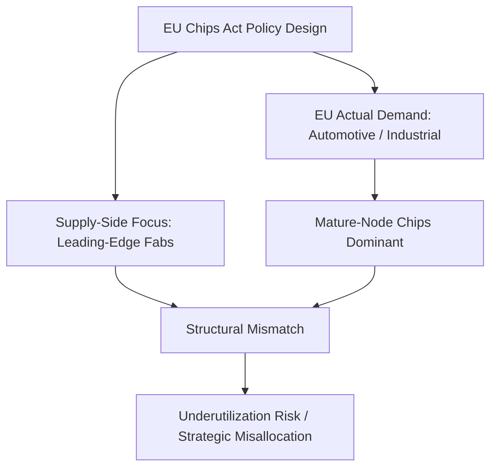

## The European Chips Act and EU Industrial Strategy

### Overview

The European Chips Act (Regulation (EU) 2023/1781) is the EU's flagship industrial policy instrument aimed at doubling Europe's global semiconductor market share to 20% by 2030 and reducing strategic dependency on foreign chip production. It is funded by the EU budget and helps build up the EU's semiconductor ecosystem to strengthen research and technological leadership in the design, manufacturing, and packaging of advanced chips. As of 2026, the original Act is being superseded by a proposed "Chips Act 2.0," reflecting widespread assessment that the first iteration underdelivered relative to its ambitions. [European Commission](https://commission.europa.eu/strategy-and-policy/eu-budget/motion/focus/eu-budget-bolsters-europes-technological-leadership-european-chips-act_en)

### Original Chips Act: Structure and Funding

The 2023 Act was built around three pillars:

#### Pillar I: Chips for Europe Initiative

This initiative is supported by €3.3 billion of EU funds, expected to be matched by Member State funding, supporting activities such as advanced pilot production lines, a cloud-based design platform, competence centres, quantum chip development, and a Chips Fund for debt and equity financing. [Cyber Risk GmbH](https://www.european-chips-act.com/)

The design platform is a cloud-based virtual environment made available across the Union, integrating design facilities from IP libraries to EDA tools. This pan-European platform, coordinated by imec, is intended to give SMEs, start-ups, and fabless firms access to commercial EDA tools, IP libraries and a route to pilot lines, with onboarding of first companies occurring 2026–2028. [European Commission](https://digital-strategy.ec.europa.eu/en/factpages/european-chips-act-chips-europe-initiative)[EUACC](https://www.euacc.ai/programmes/chips-ju)

A network of national Chips Competence Centres has been established across all 27 EU member states plus Norway, giving local industry, SMEs, and researchers a single access point to skills, design support, and pilot-line access. All Member States and Norway have now established these competence centres, providing training and access to large infrastructure facilities. [EUACC](https://www.euacc.ai/programmes/chips-ju)[European Commission](https://digital-strategy.ec.europa.eu/en/policies/european-chips-act)

#### Pillar II: State Aid Framework for First-of-a-Kind Facilities

This pillar permits Member States to approve state aid for pioneering semiconductor manufacturing facilities, subject to European Commission approval. The Commission has approved 18 State aid decisions on first-of-a-kind semiconductor facilities representing a total public and private investment of over €32 billion. Recent examples include a €659 million German State aid approval for four new semiconductor facilities and a €76 million German State aid approval for a first-of-a-kind semiconductor testing equipment facility. [European Commission](https://digital-strategy.ec.europa.eu/en/policies/european-chips-act)[European Commission](https://digital-strategy.ec.europa.eu/en/policies/european-chips-act)

#### Pillar III: Coordination Mechanism

A monitoring and crisis-response mechanism intended to anticipate supply shortages and enable coordinated EU response during semiconductor supply disruptions (a direct policy response to the 2020–2022 chip shortage that disrupted European automotive production).

### Funding Reality vs. Headline Figures

There is a significant gap between headline investment figures and directly controlled EU funding — a distinction critical to accurate analysis:

- More than €43 billion of policy-driven investment is cited as supporting the Chips Act until 2030, expected to be broadly matched by long-term private investment. [European Commission](https://commission.europa.eu/strategy-and-policy/eu-budget/motion/focus/eu-budget-bolsters-europes-technological-leadership-european-chips-act_en)
- However, the European Court of Auditors found the Commission directly managed only about €4.5 billion of the expected €86 billion funding envelope associated with the first Chips Act. [eeNews Europe](https://www.eenewseurope.com/en/chips-act-2-europe-second-semiconductor-push/)
- As of the most recent assessment, only €13.75 billion in state aid has actually been approved, despite the Act's aim to stimulate a comparable amount of public support to the US CHIPS Act. [Bruegel](https://www.bruegel.org/analysis/revamping-europes-chips-strategy-indispensability-not-self-sufficiency)
- For comparison, the US CHIPS Act had awarded $33.7 billion in grants and $5.5 billion in loans for state aid as of January 2025. [Bruegel](https://www.bruegel.org/analysis/revamping-europes-chips-strategy-indispensability-not-self-sufficiency)

[Unverified] The precise reconciliation between the "€43 billion," "€52 billion mobilised," and "€86 billion envelope" figures cited across sources reflects different accounting scopes (direct EU budget vs. total mobilized public/private investment vs. total policy-linked figures) rather than contradictory facts, but analysts should treat headline totals cautiously and check the underlying methodology before citing a single number.

### Structural Critique: Demand-Supply Mismatch

A key critique from EU economic policy analysis is that the Chips Act relies heavily on ambitious supply-side measures that do not always correspond to the structure of European demand. Semiconductor demand in Europe comes primarily from the automotive sector and industrial applications, which do not rely on cutting-edge chips. This creates a strategic mismatch: EU subsidies have disproportionately targeted leading-edge fabrication (competing directly with US/Taiwanese leading-edge strategy) when Europe's actual industrial base consumes predominantly mature-node chips (automotive, industrial control, power electronics). [Bruegel](https://www.bruegel.org/analysis/revamping-europes-chips-strategy-indispensability-not-self-sufficiency)[Bruegel](https://www.bruegel.org/analysis/revamping-europes-chips-strategy-indispensability-not-self-sufficiency)

### Chips Act 2.0: Proposed Successor

The European Commission adopted proposal COM(2026) 504 on 3 June 2026 as part of its wider Technological Sovereignty Package, covering semiconductors, artificial intelligence, cloud infrastructure, and open-source technology. The proposal is proceeding through the ordinary legislative procedure as file 2026/0139(COD), with the European Parliament still listing it in the preparatory phase. [eeNews Europe](https://www.eenewseurope.com/en/chips-act-2-europe-second-semiconductor-push/)[eeNews Europe](https://www.eenewseurope.com/en/chips-act-2-europe-second-semiconductor-push/)

**Timeline**: EU institutions have set Q2 2027 as a target for completing negotiations, though the legislation can still change before adoption. A Joint Roadmap commits the European Parliament, Council, and Commission to achieving "One Europe, One Market" through decisive progress in 2026 and by the end of 2027 at the latest. [eeNews Europe](https://www.eenewseurope.com/en/chips-act-2-europe-second-semiconductor-push/)[Cyber Risk GmbH](https://www.european-chips-act.com/)

**Structure**: The proposal is structured around four main objectives: investment conditions and competitiveness (strengthening research, innovation, and skills; authorizations within a maximum of 12 months; "Grand Challenges" on strategic chips including AI chips; and international partnerships), and demand and industrial uptake ("Demand Accelerators," public procurement, and synergies with data centres, cloud, and AI Gigafactories). [european economics](https://www.europeaneconomics.com/en/european-chips-act/)

**Funding status**: The published documents do not set a dedicated budgetary envelope for the Chips Act 2.0 — the amount remains to be confirmed, as implementation is tied to the next multiannual financial framework (MFF) and entrusted principally to the Chips Joint Undertaking. Industry organizations, including SEMI, are recommending that European funding be quadrupled, and several institutional reports warn of the risk of falling short of the "20% by 2030" target without accelerated deployment. [european economics](https://www.europeaneconomics.com/en/european-chips-act/)[european economics](https://www.europeaneconomics.com/en/european-chips-act/)

**Policy shift in framing**: Notably, EU officials have begun reframing the strategic goal away from full "self-sufficiency" toward "indispensability" — positioning the EU to hold critical, hard-to-replace niches in the global semiconductor value chain (e.g., lithography via ASML, certain specialty materials) rather than attempting to replicate a full end-to-end domestic semiconductor supply chain. This reframing implicitly acknowledges the structural limits on full relocation/self-sufficiency discussed in supply chain relocation literature more broadly.

### Institutional and Financing Mechanisms

- **Chips Joint Undertaking (Chips JU)**: Runs annual collaborative calls in Electronic Components and Systems, funding consortia across the technology-readiness spectrum via Research and Innovation Actions (RIA) and Innovation Actions (IA), with a "Global" strand open to international cooperation; EU money is matched by participating-state co-funding. [EUACC](https://www.euacc.ai/programmes/chips-ju)
- **Competitive dynamics**: Success rates are not officially published but are competitive, estimated in the single digits to around 20% depending on the call, with roughly 1 in 5 applications funded; two-stage calls gate hard, with only proposals passing the Project Outline stage permitted to submit a Full Project Proposal. [EUACC](https://www.euacc.ai/programmes/chips-ju)
- **European Investment Bank**: The EIB has financed semiconductor projects with €1.9 billion from 2018–2022, mobilizing €5.8 billion of total investment, supplementing direct Chips Act instruments. [European Commission](https://commission.europa.eu/strategy-and-policy/eu-budget/motion/focus/eu-budget-bolsters-europes-technological-leadership-european-chips-act_en)
- **Semiconductor Coalition**: Nine EU Member States (Austria, Belgium, Finland, France, Germany, Italy, Poland, Spain, and the Netherlands) launched a Semiconductor Coalition in March 2025 to reinforce cooperation on competitiveness and strategic autonomy in chips. [Cyber Risk GmbH](https://www.european-chips-act.com/)

### Key Points

- The original Chips Act's headline "€43-86 billion" figures substantially overstate directly EU-controlled funding (~€4.5 billion per the Court of Auditors)
- Actual state aid approved (~€13.75 billion) lags significantly behind the US CHIPS Act's disbursed grants and loans
- A core structural critique is the mismatch between supply-side leading-edge fab subsidies and Europe's actual demand profile (automotive/industrial, mature-node)
- Chips Act 2.0 (proposed June 2026) shifts framing from "self-sufficiency" to "indispensability" and adds AI/demand-side provisions, but lacks a confirmed dedicated budget as of this writing
- Implementation is fragmented across EU-level Chips JU calls, Member State state aid, and EIB financing, complicating unified strategic coordination

### Related Topics

- Comparative analysis: US CHIPS and Science Act vs. EU Chips Act disbursement rates
- "Indispensability" vs. "self-sufficiency" as competing EU strategic sovereignty frameworks
- Mature-node vs. leading-edge semiconductor demand structure in European industry
- State aid rules and EU competition law constraints on industrial subsidies
- Multiannual Financial Framework (MFF) negotiations and their effect on industrial policy funding
- ASML and EU lithography equipment as a chokepoint asset in global semiconductor geopolitics