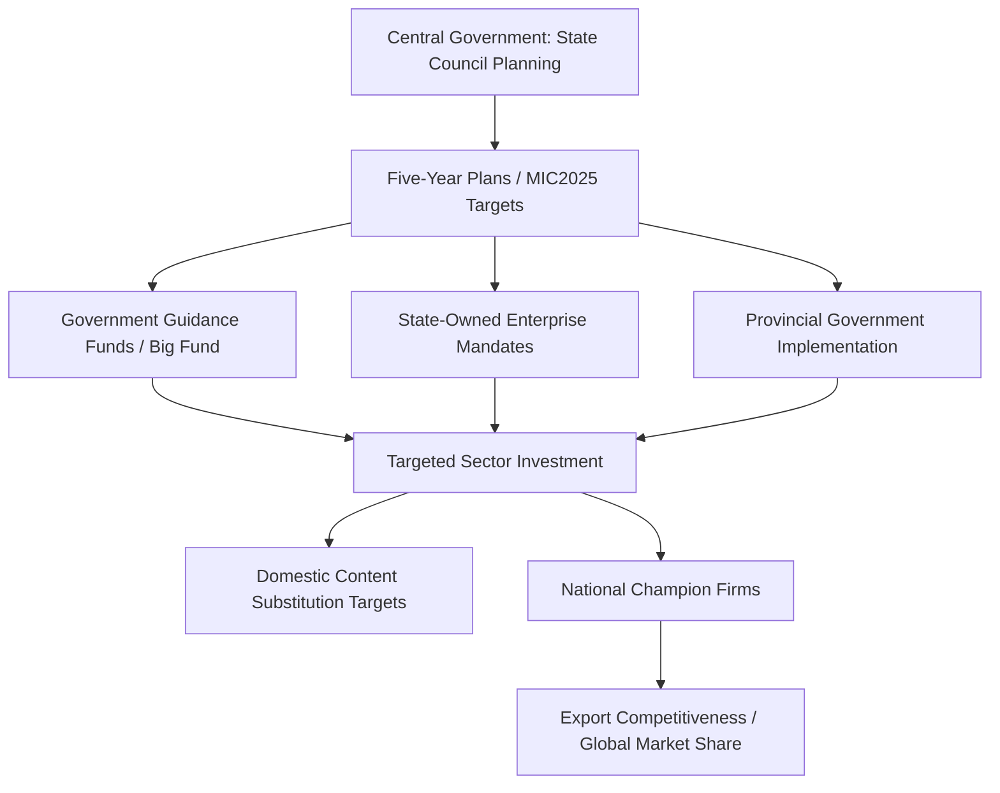

## China's Made in China 2025 and State-Directed Development

### Overview

Made in China 2025 (中国制造2025, MIC2025) is a state industrial policy initiative launched by China's State Council in May 2015, designed to upgrade China's manufacturing base from low-cost, labor-intensive production toward high-value, technologically advanced and self-sufficient manufacturing across ten designated strategic sectors. It represents one of the most comprehensive examples of state-directed industrial development in the contemporary global economy, and its ambitions catalyzed significant policy responses from the US, EU, and allied economies regarding technology competition and supply chain security.

### Strategic Origins and Objectives

MIC2025 was modeled partly on Germany's "Industrie 4.0" framework but embedded within China's broader five-year planning system and state-capitalist institutional architecture. Its stated goals included:

- Increasing domestic content of core components and materials to **40% by 2020** and **70% by 2025** (targets varied by sector)
- Transitioning China from "manufacturing giant" to "manufacturing power" (制造强国)
- Achieving technological parity or leadership in select frontier sectors by the centennial of the People's Republic (2049), structured as a three-step roadmap (2025, 2035, 2049)

### Ten Priority Sectors

1. Next-generation information technology (semiconductors, 5G)
2. High-end numerical control machinery and robotics
3. Aerospace and aeronautical equipment
4. Maritime engineering equipment and high-tech ships
5. Advanced rail transportation equipment
6. Energy-saving and new-energy vehicles (NEVs/EVs)
7. Electrical power equipment
8. Agricultural machinery and equipment
9. New materials
10. Biomedicine and high-performance medical devices

### Policy Instruments and Mechanisms

#### State-Directed Financing

- **Government Guidance Funds** (政府引导基金): state-backed investment vehicles that channel capital into targeted sectors, often blending central and provincial government capital with private co-investment.
- **National Integrated Circuit Industry Investment Fund** ("Big Fund"): a flagship vehicle specifically targeting semiconductor self-sufficiency, raising capital across multiple phases from state entities, banks, and state-owned enterprises (SOEs).
- Subsidized lending through state-owned policy banks (China Development Bank, Export-Import Bank of China) at below-market rates for designated strategic sectors.

#### Regulatory and Market-Access Tools

- **Technology transfer requirements**: historically, foreign firms seeking market access (particularly through joint ventures) faced pressure to transfer technology to domestic partners — a practice central to WTO and bilateral trade disputes.
- **Government procurement preferences**: domestic content requirements in public procurement favoring MIC2025-designated sectors.
- **Standard-setting influence**: active Chinese participation and agenda-setting in international standards bodies (e.g., 5G/6G standards at ITU, 3GPP) to embed domestic technology into global technical standards.

#### Talent and Innovation Programs

- Talent recruitment programs (e.g., the Thousand Talents Plan) aimed at attracting overseas-trained scientists and engineers, including ethnic Chinese researchers abroad, to accelerate domestic capability transfer.
- Expansion of domestic STEM education and university-industry research partnerships targeted at MIC2025 sectors.

### International Response and Geopolitical Friction

#### US Policy Response

MIC2025 became a central justification cited in the US Section 301 investigation (2017–2018) into Chinese trade practices, which found evidence of forced technology transfer, discriminatory licensing practices, and state-directed acquisition of US technology assets. This investigation underpinned the subsequent tariff escalations of the 2018–2019 US-China trade conflict.

Export control expansions targeting semiconductor manufacturing equipment, advanced AI chips, and related technologies (via the US Commerce Department's Entity List and Foreign Direct Product Rule) were substantially motivated by concerns that MIC2025-style state direction could not be countered through conventional trade remedies alone, since subsidized, non-market-based competition falls outside standard WTO anti-dumping/countervailing duty frameworks.

#### Rhetorical De-emphasis

[Inference] Following the intensity of the international backlash, Chinese officials notably reduced public/official references to "Made in China 2025" branding after approximately 2018, even as the underlying policy substance and sectoral funding mechanisms are widely assessed to have continued under different or less publicized programmatic names. This is a pattern often cited in policy analysis, though the precise degree of programmatic continuity versus rebranding is difficult to verify with full transparency given the opacity of Chinese industrial policy budgeting.

#### EU and Allied Concerns

EU policy responses included the establishment of an EU-wide foreign investment screening mechanism (2019) partly motivated by concerns over state-subsidized Chinese acquisition of strategic European technology firms, along with parallel industrial policy responses (e.g., the EU Chips Act) explicitly framed around reducing dependency on both US and Chinese semiconductor supply chains.

### Assessed Outcomes by Sector (Illustrative)

| Sector | Assessed Progress | Notes |
| --- | --- | --- |
| New-energy vehicles (EVs) | High | China achieved global leadership in EV production volume and battery supply chains (e.g., CATL, BYD) |
| High-speed rail | High | Extensive domestic and export success predates but was reinforced by MIC2025-era investment |
| Robotics/automation | Moderate | Significant domestic capacity growth, but continued reliance on imported precision components in some segments |
| Semiconductors (leading-edge) | Limited | [Unverified] Despite the "Big Fund" and substantial investment, China's leading-edge (sub-10nm) domestic fabrication capability remains constrained relative to targets, particularly post-2022 US export controls on lithography and advanced chip-design tools; specific yield and node figures are contested and change frequently |
| Aerospace (commercial aircraft) | Limited | COMAC's C919 program achieved certification and commercial deployment but with continued reliance on foreign (US/European) engines and avionics for key variants |

### Structural Critique: State-Directed Development Model

#### Advantages Cited by Proponents

- Ability to mobilize capital at scale toward long-horizon, high-capital-intensity sectors (e.g., semiconductors, EVs) where private capital alone may underinvest due to long payback periods.
- Coordination advantages in achieving rapid infrastructure buildout supporting industrial scale-up (e.g., EV charging networks, grid integration).

#### Critiques and Limitations

- **Overcapacity risk**: state-directed capital allocation, particularly through provincial-level guidance funds competing to attract MIC2025-designated projects, has been associated with overcapacity in sectors such as solar panels, EVs, and steel — with downstream effects on global trade friction (anti-dumping/countervailing duty cases from the EU, US, and other trading partners).
- **Misallocation risk**: subsidy-driven investment decisions can decouple from market signals, leading to capital misallocation, "zombie" firms sustained by state support, and reduced overall capital efficiency relative to market-driven allocation.
- **WTO compatibility concerns**: many MIC2025-associated practices (domestic content targets, technology transfer pressure, non-market subsidies) sit in tension with WTO national treatment and subsidy disciplines, though enforcement has proven difficult given evidentiary and jurisdictional challenges in state-capitalist systems.

### Comparative Framing: State-Directed vs. Market-Led Industrial Policy

$$Efficiency_{gap}=\left|ROIC_{market}-ROIC_{subsidized}\right|$$

[Inference] This is a simplified conceptual framing rather than an official metric: comparative political economy research generally argues that state-directed capital allocation, absent market discipline mechanisms, tends to produce a measurable gap between subsidized-sector returns on invested capital and market-rate benchmarks, though rigorous cross-country empirical quantification of this gap for MIC2025 specifically is limited by data opacity.

### Key Points

- MIC2025 is a comprehensive, ten-sector state industrial policy targeting technological self-sufficiency and manufacturing upgrading, launched in 2015
- Financing operates through state guidance funds (notably the semiconductor "Big Fund"), policy bank lending, and SOE-directed investment
- The policy directly catalyzed major US and EU trade and export-control policy responses, including the 2018 Section 301 tariffs and subsequent semiconductor export controls
- Outcomes are highly sector-dependent: strong results in EVs/batteries and rail, more limited results in leading-edge semiconductors and commercial aerospace
- Official MIC2025 branding was de-emphasized after 2018, though underlying policy substance is widely assessed to persist under other programmatic frameworks

### Related Topics

- The "Big Fund" (National IC Industry Investment Fund) and Chinese semiconductor self-sufficiency drive
- US Section 301 tariffs and the 2018–2019 US-China trade conflict
- US export controls, the Entity List, and the Foreign Direct Product Rule
- Global overcapacity disputes: solar panels, EVs, and steel anti-dumping cases
- EU foreign investment screening mechanism and strategic-asset acquisition concerns
- Comparative industrial policy: US CHIPS Act and EU Chips Act as Western state-directed responses