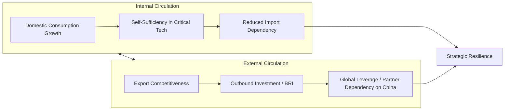

## China's Dual Circulation Strategy

### Overview

The Dual Circulation Strategy (双循环, shuāng xúnhuán) is a macroeconomic and industrial policy framework formally introduced by China's leadership in May 2020 and enshrined in the 14th Five-Year Plan (2021–2025). It reorients China's development model around two interacting economic circuits: a **domestic "internal circulation"** built on self-sufficiency and consumption-driven growth, and an **international "external circulation"** in which China remains engaged with global trade and investment, but from a position of reduced dependency and increased leverage. The framework represents a strategic response to rising external trade friction (particularly with the US), pandemic-era supply chain disruption, and long-standing internal concerns about China's growth model.

### Conceptual Structure

#### Internal Circulation (内循环)

- Prioritizes expansion of **domestic consumption** as a growth driver, addressing China's historically high savings rate and relatively underdeveloped domestic demand relative to its export capacity.
- Emphasizes **self-reliance in critical technologies** (semiconductors, advanced materials, industrial software) to reduce vulnerability to foreign export controls or supply disruption — a policy emphasis reinforced by the impact of US semiconductor export controls beginning in 2018–2019.
- Involves urbanization policy, social safety net expansion, and income redistribution measures intended to unlock consumer spending capacity (particularly in lower-tier cities and rural areas).

#### External Circulation (外循环)

- Maintains China's role as a manufacturing and export hub, but with a strategic shift toward higher-value-added exports and reduced reliance on any single trading partner or supplier.
- Supports continued outbound investment (including Belt and Road Initiative projects) to secure resource access, market access, and strategic infrastructure influence abroad.
- Frames continued engagement with global markets as leverage-generating rather than dependency-generating — i.e., structuring external relationships so that trading partners become reliant on China (for critical minerals processing, manufactured inputs, or green technology components) rather than the reverse.

### Policy Drivers and Historical Context

#### Trade War and Technology Restriction Pressure

The 2018–2019 US-China trade conflict and subsequent semiconductor export controls exposed China's vulnerability to disruption in critical technology imports, directly informing the internal-circulation emphasis on self-reliance, particularly in semiconductors, industrial software, and precision equipment.

#### Pandemic-Era Supply Chain Disruption

COVID-19-related disruptions to global logistics and cross-border supply chains (2020–2022) reinforced the strategic logic of reducing exposure to external shocks by strengthening domestic production and consumption capacity as a buffer.

#### Long-Standing Structural Rebalancing Goals

Dual circulation builds on pre-existing Chinese economic policy debates (dating to at least the 2008 financial crisis) about overreliance on export-led and investment-led growth, and the need to rebalance toward consumption — debates that had produced limited structural change prior to 2020.

### Relationship to Made in China 2025 and Industrial Policy Continuity

[Inference] Dual circulation is widely assessed by policy analysts as a broader macroeconomic reframing that subsumes and extends the sectoral self-sufficiency logic of Made in China 2025, rather than a replacement for it — the semiconductor "Big Fund" and sectoral guidance-fund mechanisms associated with MIC2025 continue to operate under the dual circulation framing, with self-sufficiency in critical technologies presented as central to "internal circulation." Precise institutional lineage between the two frameworks is not always explicitly delineated in Chinese policy documents, so this connection should be treated as an analytical interpretation rather than an officially stated one-to-one mapping.

### Key Policy Instruments

- **"New Infrastructure" (新基建) investment**: state-directed capital toward 5G networks, data centers, EV charging infrastructure, and industrial internet platforms, supporting both internal consumption capacity and technological self-sufficiency goals.
- **Common Prosperity (共同富裕) initiatives**: income redistribution and regulatory measures (e.g., 2021 regulatory actions against private tutoring, real estate speculation, and large tech platforms) partly framed as supporting more sustainable, consumption-oriented growth by addressing inequality that suppresses aggregate consumption.
- **Dual-use standard-setting and domestic substitution mandates**: continued government procurement and SOE guidance favoring domestic suppliers in critical sectors (semiconductors, operating systems, industrial software) to build "internal circulation" resilience.
- **Belt and Road Initiative (BRI) recalibration**: a shift (observed post-2020) toward smaller-scale, higher-return BRI projects and increased emphasis on critical mineral supply chains (e.g., lithium, cobalt, rare earths) supporting China's downstream manufacturing advantages in EVs, batteries, and renewable energy equipment.

### International Interpretation and Concerns

#### Trading Partner Perspective

Foreign governments and analysts have expressed concern that "external circulation" strategy, in practice, seeks to preserve China's export market access and its position in global supply chains while simultaneously reducing China's own import dependencies — an asymmetric arrangement that trading partners characterize as strategically disadvantageous over the long term, since it could increase partner-country dependency on Chinese inputs (e.g., rare earth processing, battery materials, solar components) without a reciprocal reduction in dependency on the Chinese side.

#### Relationship to "De-risking" and "China+1" Responses

Dual circulation's dependency-asymmetry logic is frequently cited by US, EU, and allied policymakers as a rationale underpinning "de-risking" strategies (distinct from full "decoupling") — efforts to reduce Western economies' exposure to concentrated dependency on China in critical sectors, while maintaining broader trade engagement. This connects directly to friend-shoring and China+1 diversification strategies covered elsewhere in this curriculum.

### Assessed Progress and Structural Tensions

| Dimension | Assessed Status | Notes |
| --- | --- | --- |
| Domestic consumption share of GDP | Limited structural shift | [Unverified] Despite dual circulation's stated goals, China's consumption share of GDP has remained comparatively low relative to policy targets and to other major economies; precise recent figures should be checked against current National Bureau of Statistics data given the pace of change and methodological revisions |
| Semiconductor self-sufficiency | Partial, contested | Mature-node capacity has expanded substantially; leading-edge capability remains constrained by export controls (see Made in China 2025 discussion) |
| Critical mineral supply chain leverage | High | China maintains dominant global market share in rare earth processing and battery material refining, reinforcing external-circulation leverage strategy |
| Real estate and local government debt drag | Significant headwind | [Inference] Property sector deleveraging since 2021 and local government financing vehicle (LGFV) debt pressures are widely viewed by economists as constraining the consumption-led rebalancing that internal circulation depends on, though the precise magnitude of this drag is debated across institutional forecasts |

### Structural Critique

#### Consumption Rebalancing Constraints

Structural features of China's political economy — including a relatively underdeveloped social safety net (driving precautionary household savings), an investment-heavy local government fiscal model reliant on land sales, and continued preferential credit allocation toward SOEs and favored industrial sectors over households — create persistent headwinds to the consumption-led rebalancing that "internal circulation" envisions.

#### Circularity/Coherence Tension

Some analysts note an internal tension in the dual circulation framework: simultaneously pursuing import substitution (reducing external dependency) while preserving export-oriented industrial capacity built for global markets can create domestic overcapacity if domestic consumption growth does not keep pace with continued production-side investment — a dynamic connected to the overcapacity critiques also raised regarding Made in China 2025-linked sectors (EVs, solar, batteries).

### Key Points

- Dual circulation (2020, formalized in the 14th Five-Year Plan) reframes Chinese growth strategy around interacting domestic self-sufficiency and international market engagement circuits
- It responds directly to US trade/export-control pressure and pandemic-era supply chain shocks, while extending pre-existing rebalancing debates
- "External circulation" leverage strategy — reducing China's import dependency while maintaining/expanding trading partners' dependency on China — is a central concern driving Western "de-risking" policy
- Consumption-led rebalancing faces structural headwinds from savings behavior, local government fiscal models, and property-sector deleveraging
- The framework is widely interpreted as extending rather than replacing Made in China 2025-era sectoral self-sufficiency goals

### Related Topics

- Made in China 2025 and sector-specific state-directed development
- Critical mineral supply chains and Chinese rare earth processing dominance
- "De-risking" vs. "decoupling" as competing Western strategic frameworks
- China's Belt and Road Initiative: recalibration toward critical minerals and smaller-scale projects
- Chinese local government financing vehicles (LGFVs) and property-sector deleveraging
- Comparative consumption-to-GDP ratios across major economies as a structural indicator