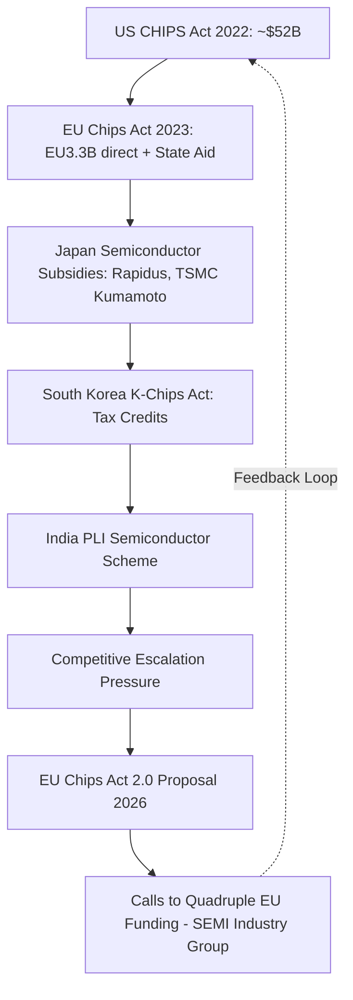

## Subsidy Competition and the Risk of a Global Subsidy Race

### Overview

As industrial policy has re-emerged as a central tool of geopolitical and economic strategy — evidenced by the US CHIPS Act, the EU Chips Act, Made in China 2025/dual circulation, Japan's semiconductor subsidies, South Korea's K-Chips Act, and India's Production-Linked Incentive (PLI) schemes — a growing body of analysis examines whether these parallel, largely uncoordinated national responses constitute a "subsidy race": a competitive dynamic in which governments escalate incentives to attract the same finite pool of strategic investment (semiconductors, EV batteries, critical minerals processing), with potential negative-sum outcomes at the global level even as individual national programs pursue rational self-interest.

### Theoretical Framework: Why Subsidy Races Emerge

#### Game-Theoretic Structure

Subsidy competition for mobile capital investment (a semiconductor fab, a battery gigafactory) can be modeled as a variant of a **prisoner's dilemma** or **race-to-the-bottom** game among jurisdictions:

- Each government's dominant strategy is to offer subsidies at least as generous as competing jurisdictions, since failing to match rivals risks losing the investment entirely.
- If all jurisdictions escalate subsidies simultaneously, the *relative* competitive positioning between them may be largely unchanged (the firm still locates in whichever jurisdiction offered the best package), but the *absolute* fiscal cost to all participating governments rises.
- This produces a collectively suboptimal equilibrium: total public expenditure rises without a proportional increase in aggregate strategic benefit, since some of the subsidy simply transfers economic rent from taxpayers to the firm receiving the investment.

$$NetBenefit_i=B_i-S_i$$

Where $B_i$ is the strategic/economic benefit to jurisdiction $i$ from securing the investment and $S_i$ is the subsidy cost. [Inference] In a competitive bidding equilibrium among multiple credible jurisdictions, the subsidy offered tends to be bid up toward the level where $S_i$ approaches $B_i$, compressing net public benefit toward zero — this is a standard result in economic geography/public finance literature on inter-jurisdictional investment competition (e.g., studies of US state-level incentive competition for manufacturing plants), though it is a theoretical tendency rather than a universally observed empirical outcome, since jurisdictions vary in bargaining leverage and information.

#### Distinction from Classical Trade "Race to the Bottom"

This dynamic differs from the classical "race to the bottom" concept (competitive deregulation of labor/environmental standards to attract investment) in that subsidy competition operates through direct fiscal transfers rather than regulatory relaxation, though both share the core inter-jurisdictional competitive-bidding structure.

### Empirical Evidence of Escalation

Industry organizations, including SEMI, have publicly called for European semiconductor funding to be quadrupled specifically in response to the scale of the US CHIPS Act and competing Asian subsidy programs — a direct, observable instance of the escalatory dynamic the subsidy-race framework predicts.

#### Sector-Specific Examples

- **Semiconductors**: US CHIPS and Science Act (2022), EU Chips Act (2023) and proposed Chips Act 2.0 (2026), Japan's multi-billion-dollar support for Rapidus and TSMC's Kumamoto fabs, South Korea's K-Chips Act tax incentives, and India's semiconductor PLI scheme collectively represent a multi-continental subsidy escalation over a roughly five-year window.
- **EV batteries and critical minerals**: the US Inflation Reduction Act's EV and battery production tax credits (Section 45X) prompted EU concern over investment diversion to the US, contributing to EU-level responses (e.g., the Net-Zero Industry Act) and bilateral friction over compliance/localization requirements.
- **Green hydrogen and clean energy manufacturing**: similar competitive subsidy dynamics have emerged around solar panel manufacturing, wind turbine components, and hydrogen electrolyzer production across the US, EU, and China.

### Fiscal and Economic Risks

#### Public Finance Strain

Sustained subsidy escalation across multiple strategic sectors simultaneously (semiconductors, EVs, batteries, critical minerals, pharmaceuticals) creates cumulative fiscal exposure that competes with other public spending priorities, raising sustainability concerns particularly for jurisdictions with existing fiscal constraints (a consideration more acute for EU Member States operating under fiscal rules than for the US or China).

#### Overcapacity Risk

When multiple jurisdictions simultaneously subsidize capacity expansion in the same sector (e.g., semiconductor fabs, EV battery gigafactories, solar panel production), aggregate global capacity can outpace demand growth, leading to price collapses, capacity underutilization, and potential future consolidation or write-downs — a dynamic already observed in the global solar panel industry and, per some industry analysts, an emerging risk in EV battery manufacturing. [Unverified] Whether semiconductor fab capacity is approaching a similar overcapacity risk is contested and depends heavily on node-specific demand forecasts (particularly AI-driven demand for advanced logic and high-bandwidth memory), which have shifted rapidly and are difficult to forecast reliably.

#### Distortion of Comparative Advantage

Heavy, sustained subsidization can override underlying comparative-advantage-based location decisions, resulting in facilities sited in higher-cost jurisdictions than would otherwise be efficient — a cost borne by taxpayers in the subsidizing jurisdiction and, in aggregate across competing jurisdictions, a potential net efficiency loss for the global economy even if individual national programs achieve their stated onshoring goals.

### International Coordination Challenges

#### WTO Subsidy Disciplines and Their Limits

The WTO's Agreement on Subsidies and Countervailing Measures (SCM Agreement) provides a framework for challenging trade-distorting subsidies, but:

- Many strategic-sector subsidies (semiconductor fabs, green technology manufacturing) are structured to qualify for exemptions or are difficult to challenge given classification ambiguities between permissible R&D/regional development support and prohibited export subsidies.
- Enforcement mechanisms have been substantially weakened by the prolonged non-functioning of the WTO Appellate Body (effectively paralyzed since 2019 due to the US blocking appointments), reducing the practical deterrent effect of WTO subsidy disputes.
- National-security framing of semiconductor and critical-technology subsidies (invoked by the US, EU, and China alike) further complicates WTO applicability, since national security exceptions (GATT Article XXI) are broadly self-judging in practice.

#### Absence of a Coordinating Institution

Unlike trade liberalization (coordinated historically through GATT/WTO rounds) or, to a degree, international tax competition (partially addressed through the OECD's global minimum tax framework), there is no equivalent multilateral institution actively coordinating industrial subsidy levels among major economies, leaving the dynamic largely to unilateral escalation and occasional bilateral consultation (e.g., US-EU Trade and Technology Council discussions touching on subsidy coordination, without binding constraints).

### Potential Mitigating Factors

#### Differentiated Strategic Value

[Inference] Not all subsidy competition is necessarily negative-sum: where subsidies target genuine market failures (e.g., underinvestment in long-horizon, high-fixed-cost R&D with diffuse public benefits, such as foundational semiconductor research), the competitive dynamic can still produce net positive innovation spillovers even if individual national programs partially compete for the same investment — this is a genuinely debated point in economic literature rather than a settled conclusion, and depends heavily on whether the specific subsidy targets genuine externalities versus simple investment attraction.

#### Alliance-Based Coordination

Some subsidy competition is being partially channeled through allied coordination mechanisms (e.g., the US-Japan-Netherlands-South Korea informal coordination on semiconductor export controls, or "friend-shoring" framing that implicitly allocates strategic sectors across allied jurisdictions rather than pure competitive bidding) — though this coordination remains informal and does not eliminate underlying competitive subsidy dynamics between allied jurisdictions themselves (e.g., US-EU competition for the same fab investment despite being security allies).

### Key Points

- Subsidy competition for mobile strategic investment can be modeled as a prisoner's-dilemma-style dynamic producing collectively suboptimal fiscal outcomes despite individually rational national strategies
- Observable escalation is evident across semiconductors (US CHIPS Act → EU response → Asian programs → EU Chips Act 2.0 calls for quadrupled funding) and EV/battery manufacturing
- WTO subsidy disciplines are substantially weakened by Appellate Body paralysis and national-security exception framing, limiting institutional constraints on escalation
- Key risks include fiscal strain, sector-specific overcapacity, and distortion away from comparative-advantage-based investment location
- No multilateral institution currently coordinates industrial subsidy levels comparable to trade or tax-competition coordination frameworks

### Related Topics

- WTO Subsidies and Countervailing Measures (SCM) Agreement and Appellate Body paralysis
- US Inflation Reduction Act Section 45X and EU competitive response (Net-Zero Industry Act)
- Global solar panel and EV battery overcapacity as precedent case studies
- OECD global minimum tax as a comparative model for addressing competitive races (tax vs. subsidy competition)
- US-EU Trade and Technology Council and informal allied industrial policy coordination
- Economic geography literature on US state-level incentive competition for manufacturing investment