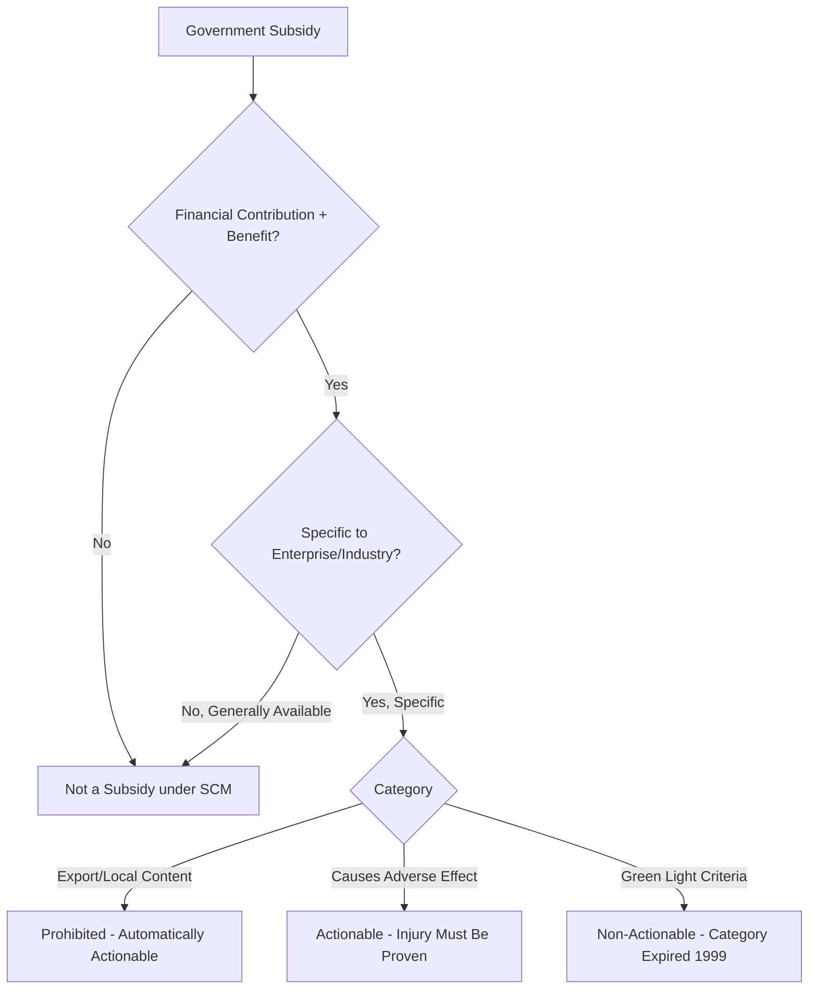
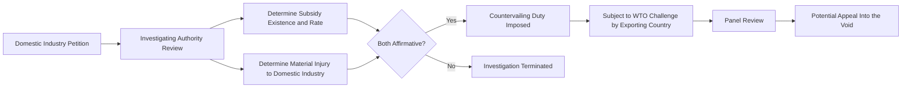

## WTO Subsidy Rules and the Challenge of Enforcement

### Overview

The World Trade Organization's framework for disciplining government subsidies rests primarily on the Agreement on Subsidies and Countervailing Measures (SCM Agreement), supplemented by the Agreement on Agriculture for farm subsidies. This framework was designed for a trade environment centered on goods trade distortions between market economies, and has come under significant strain from the resurgence of large-scale strategic industrial subsidies, state-capitalist economic models, and the effective paralysis of the WTO's binding dispute settlement mechanism since 2019.

### The SCM Agreement: Core Structure

#### Definition of a Subsidy

Under Article 1 of the SCM Agreement, a subsidy exists where there is a **financial contribution** by a government or public body (direct fund transfers, loan guarantees, revenue foregone such as tax credits, provision of goods/services below market rates, or income/price support) that confers a **benefit** to the recipient.

#### The Traffic-Light Classification System

The SCM Agreement historically classified subsidies into three categories:

- **Prohibited (red light) subsidies**: export subsidies and local-content subsidies (Article 3) — automatically actionable without needing to prove trade-distorting effect, since these are deemed inherently trade-distorting.
- **Actionable (yellow light) subsidies**: subsidies causing "adverse effects" to another member's interests (material injury to domestic industry, nullification of trade benefits, or "serious prejudice") — require the complaining member to demonstrate actual adverse trade effects.
- **Non-actionable (green light) subsidies**: originally included certain R&D, regional development, and environmental adaptation subsidies meeting specific criteria (Article 8) — this category **expired in 1999** and was never renewed, meaning no formal safe-harbor category currently exists, though a de facto tolerance persists for policy reasons.

#### Specificity Requirement

Critically, only subsidies that are **specific** to an enterprise, industry, or group thereof (rather than generally available across the economy) fall under SCM disciplines. This creates interpretive latitude: broadly available tax credits or infrastructure investment may escape classification as "specific" subsidies even when they disproportionately benefit strategic sectors in practice.

### Remedies Available Under the Framework

#### Multilateral Dispute Settlement

A WTO member believing another member's subsidy violates SCM obligations can bring a case through the WTO dispute settlement process: consultation, panel review, and (historically) Appellate Body review, potentially resulting in authorized retaliatory measures if the losing party fails to comply.

#### Unilateral Countervailing Duties (CVDs)

Separately, WTO members may unilaterally impose countervailing duties on subsidized imports found to cause material injury to a domestic industry, following a domestic investigation process (e.g., conducted by the US Department of Commerce and International Trade Commission, or the EU's DG Trade). This is the more frequently used remedy in practice, since it does not require winning a multilateral dispute.

### The Enforcement Crisis: Appellate Body Paralysis

#### Mechanism of Paralysis

The WTO Appellate Body, the standing tribunal that hears appeals of dispute panel rulings, has been unable to function since December 2019 because the United States has blocked the appointment of new Appellate Body members, reducing its membership below the minimum required quorum (three members needed to hear an appeal).

#### Practical Consequences

- Any WTO member can effectively block enforcement of an adverse panel ruling by filing an appeal "into the void" — since no functioning Appellate Body exists to hear it, the panel ruling never becomes legally binding.
- This has substantially weakened the practical deterrent effect of multilateral SCM disputes, since a losing party facing an unfavorable panel ruling on subsidies can indefinitely delay compliance through this procedural gap.
- A subset of WTO members (including the EU and China) established the **Multi-Party Interim Appeal Arbitration Arrangement (MPIA)** in 2020 as a voluntary workaround, allowing participating members to use binding arbitration in place of the paralyzed Appellate Body — but this only binds members who have opted in, and does not restore universal enforcement.

### Structural Gaps: Why the Framework Struggles With Contemporary Industrial Policy

#### State Capitalism and Attribution Difficulty

The SCM Agreement's financial-contribution test was designed with market economies in mind, where the boundary between government and private economic activity is relatively clear. In state-capitalist systems with extensive state-owned enterprise networks, policy-directed bank lending, and government guidance funds, establishing that a specific financial contribution occurred — and tracing it to a specific benefit and specific product — is evidentiarily far more difficult, particularly given limited transparency into non-market economies' financial and industrial policy systems.

#### National Security Exception Ambiguity

GATT Article XXI (the general security exception, incorporated by reference into WTO agreements including the SCM Agreement's applicability context) permits members to take measures they consider "necessary for the protection of essential security interests." Because this language is widely interpreted as largely self-judging, subsidies and trade restrictions framed around semiconductor, critical mineral, or advanced technology "national security" concerns face reduced practical exposure to WTO challenge, even where their economic effects resemble ordinary industrial subsidies.

#### Non-Actionable Category Expiration

As noted, the expiration of the Article 8 "green light" category in 1999 (originally covering certain R&D, regional, and environmental subsidies) means there is no current formal WTO safe harbor for legitimate public-interest subsidies — creating a gap where members either restrain otherwise-justifiable subsidies to avoid legal exposure, or proceed with subsidies accepting latent legal risk, without a clear compliant pathway for large-scale R&D-oriented industrial policy (e.g., CHIPS Act-style research consortia funding).

#### Emerging Sectors Outpacing Rule Design

Rules calibrated primarily around goods manufacturing subsidies are not well adapted to contemporary strategic competition in digital services, AI infrastructure, and dual-use/national-security-adjacent technology, where financial contribution forms (e.g., government cloud-computing credits, data-access preferences, AI model export controls paired with domestic compute subsidies) do not map cleanly onto SCM's traditional categories.

### Illustrative Case Pattern: Countervailing Duty Investigations

Countervailing duty investigations remain the most active enforcement channel in practice, following a structured domestic process:

This pattern illustrates the enforcement asymmetry: unilateral CVD imposition is relatively swift and effective for the importing country, while the exporting country's recourse to challenge an allegedly WTO-inconsistent CVD measure is substantially weakened by Appellate Body paralysis.

### Policy Responses and Reform Proposals

#### Institutional Reform Efforts

WTO members have engaged in ongoing (as of this writing, unresolved) discussions on Appellate Body reform, including US-proposed changes regarding precedent-setting authority, procedural timelines, and the scope of appellate review — but no consensus reform has been adopted, and the US position under multiple administrations has maintained that structural concerns about Appellate Body overreach must be addressed before appointments resume.

#### Plurilateral and Bilateral Workarounds

Given multilateral gridlock, subsidy-related friction has increasingly been addressed through bilateral consultation mechanisms (e.g., US-EU Trade and Technology Council discussions on non-market policies) and plurilateral coordination among like-minded economies, rather than through binding multilateral WTO adjudication — reflecting a broader trend of institutional fragmentation in global trade governance during this period.

#### Proposals for SCM Agreement Modernization

Various trade policy analysts and some WTO members have proposed updating SCM disciplines to better address state-capitalist financial contributions (e.g., clarifying treatment of state-owned enterprise lending and government guidance funds) and to reinstate some form of non-actionable category for legitimate strategic R&D subsidies, though no such reform has been adopted as of this writing, and prospects remain uncertain given the broader gridlock in WTO negotiating functions.

### Key Points

- The SCM Agreement's prohibited/actionable subsidy framework, and its specificity requirement, were designed around a market-economy paradigm that struggles to capture state-capitalist financial contributions
- The non-actionable "green light" subsidy category expired in 1999 and has never been renewed, leaving no formal safe harbor for legitimate strategic R&D subsidies
- Appellate Body paralysis since December 2019 has substantially weakened multilateral enforcement, allowing "appeals into the void" that block binding resolution
- Countervailing duty investigations remain the most functionally active enforcement channel, but the exporting country's ability to challenge them via WTO dispute settlement is correspondingly weakened
- National security exception framing under GATT Article XXI provides a largely self-judging avenue for members to shield strategic-sector subsidies from effective challenge

### Related Topics

- Multi-Party Interim Appeal Arbitration Arrangement (MPIA) as a partial enforcement workaround
- GATT Article XXI national security exception and its use in trade and technology policy
- Countervailing duty methodology and calculation (US Department of Commerce, EU DG Trade practice)
- State-owned enterprise financial contribution attribution challenges in WTO jurisprudence
- US-EU Trade and Technology Council as a bilateral alternative to multilateral subsidy coordination
- Historical case studies: US-China solar panel and steel countervailing duty disputes